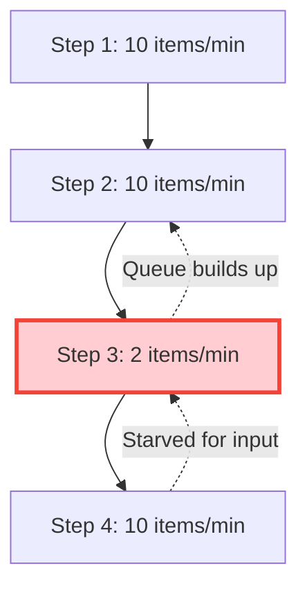
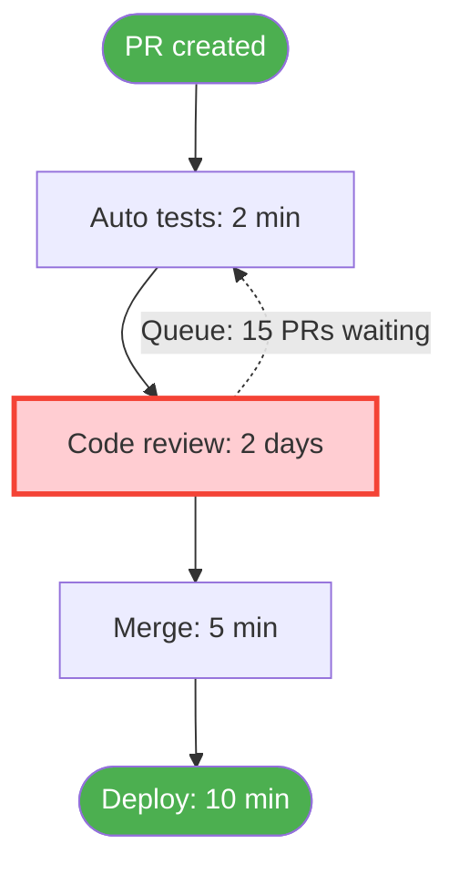
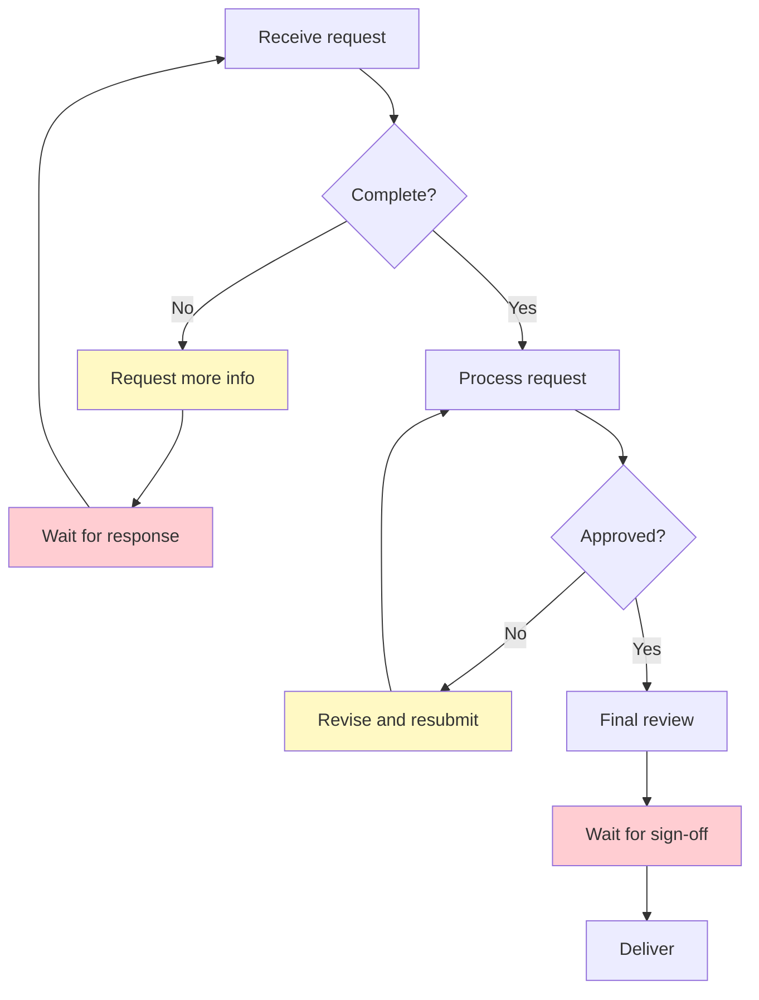
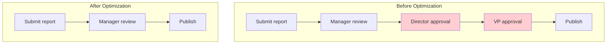
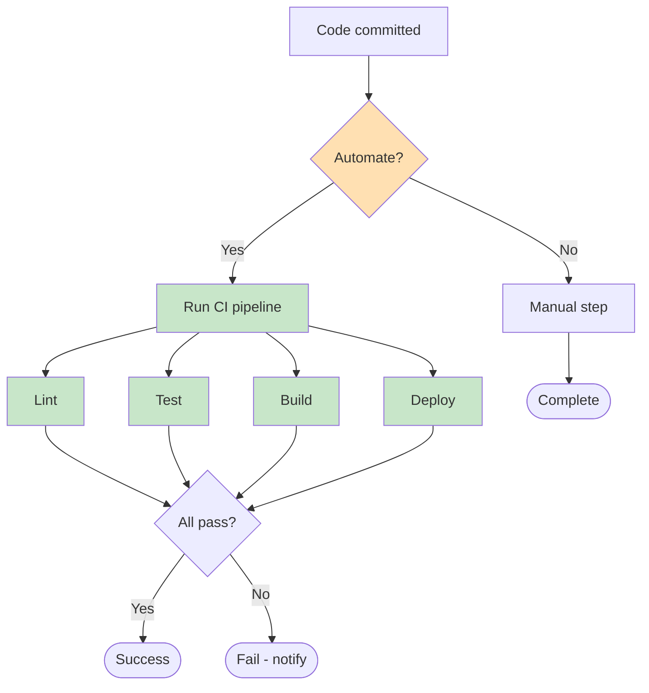
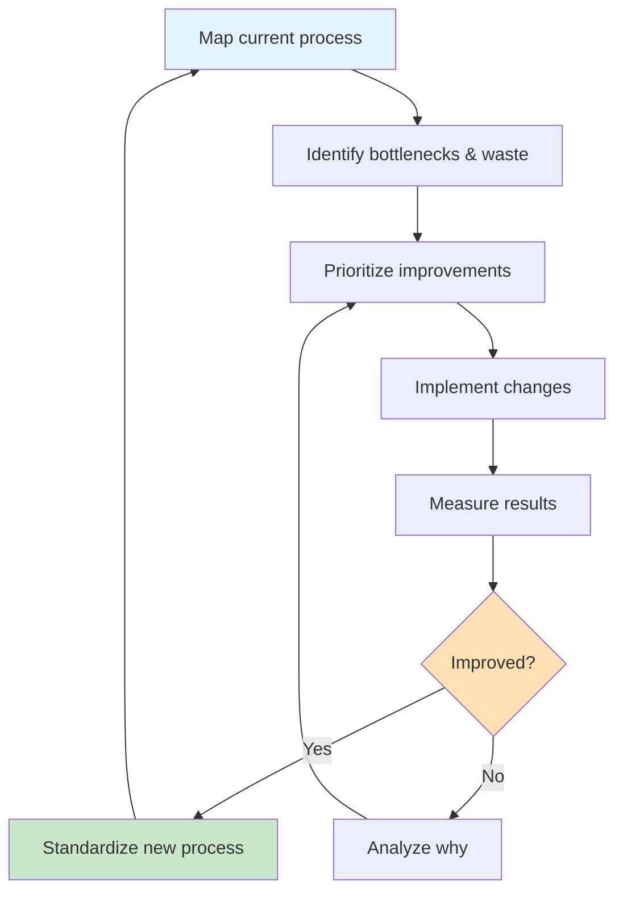
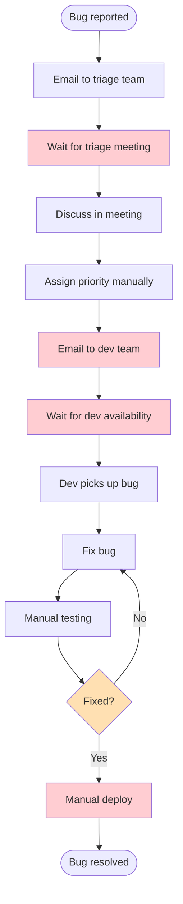
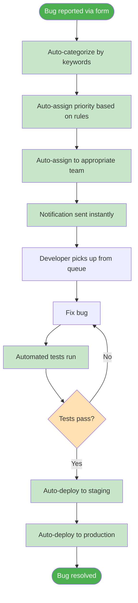

# Process Optimization

Flowcharts aren't just for documenting processes — they're powerful tools for improving them. In this final lesson, we'll learn how to use flowcharts to identify bottlenecks, eliminate waste, and optimize processes for better efficiency and quality.

## Why Optimize Processes?

Process optimization delivers tangible benefits:

| Benefit | Impact | Example |
|---|---|---|
| **Speed** | Faster delivery | Reduce order processing from 2 days to 2 hours |
| **Quality** | Fewer errors | Reduce bug rate by 40% with better review process |
| **Cost** | Lower expenses | Eliminate redundant approval steps |
| **Scalability** | Handle more volume | Automate manual steps to handle 10x load |
| **Satisfaction** | Happier users | Reduce customer wait time from 30 min to 5 min |

## Identifying Bottlenecks

A **bottleneck** is a step in a process that limits the overall throughput. It's the narrowest point that everything must pass through.

### The Bottleneck Analogy

```
┌──────────┐     ┌──────────┐     ┌──────┐     ┌──────────┐
│  Step 1  │────►│  Step 2  │────►│ Step │────►│  Step 4  │
│  Fast    │     │  Fast    │     │  3   │     │  Fast    │
│  10/s    │     │  10/s    │     │SLOW  │     │  10/s    │
└──────────┘     └──────────┘     │ 1/s  │     └──────────┘
                                  └──────┘
                                    ▲
                              THIS IS THE BOTTLENECK
                    Overall throughput: 1 item/second
```

### Spotting Bottlenecks in Flowcharts

Look for these visual indicators:



> [!TIP] The Queue Test
> Wherever work piles up waiting to be processed, you've found a bottleneck. Look for queues, backlogs, or waiting states in your flowchart.

### Real-World Bottleneck Example: Code Review



**Analysis:** The code review step takes 2 days while other steps take minutes. This is the bottleneck.

**Solutions:**
- Add more reviewers
- Set SLA for review turnaround
- Implement automated review for simple changes
- Split large PRs into smaller ones

## Types of Waste in Processes

Lean methodology identifies seven types of waste (TIMWOOD):

| Waste Type | Description | Software Example |
|---|---|---|
| **T**ransport | Moving items unnecessarily | Handing off work between teams |
| **I**nventory | Excess work in progress | Too many open PRs |
| **M**otion | Unnecessary movement | Searching for information |
| **W**aiting | Idle time between steps | Waiting for approvals |
| **O**verprocessing | Doing more than needed | Over-engineering solutions |
| **O**verproduction | Making more than needed | Building unused features |
| **D**efects | Errors requiring rework | Bugs found in production |

### Visualizing Waste in a Flowchart



**Waste identified:**
- `C` → Overprocessing (repeated requests)
- `D` → Waiting (idle time)
- `G` → Defects (rework)
- `I` → Waiting (approval delay)

## Optimization Techniques

### 1. Eliminate Unnecessary Steps

Question every step: "What happens if we skip this?"



### 2. Parallelize Independent Steps

Steps that don't depend on each other can run simultaneously.

```mermaid
flowchart TD
    subgraph Sequential (Before)
        A1[Write code] --> B1[Write tests]
        B1 --> C1[Write docs]
        C1 --> D1[Submit PR]
    end
    
    subgraph Parallel (After)
        A2[Write code] --> D2[Submit PR]
        B2[Write tests] -.-> D2
        C2[Write docs] -.-> D2
    end
    
    style A1 fill:#BBDEFB
    style B1 fill:#BBDEFB
    style C1 fill:#BBDEFB
    style A2 fill:#C8E6C9
    style B2 fill:#C8E6C9
    style C2 fill:#C8E6C9
```

### 3. Automate Repetitive Steps

Identify steps that are manual, repetitive, and rule-based.

| Step | Manual Time | Automated Time | Savings |
|---|---|---|---|
| Code formatting | 5 min | 10 sec | 97% |
| Test execution | 30 min | 5 min | 83% |
| Deployment | 45 min | 2 min | 96% |
| Log analysis | 60 min | 1 min | 98% |



### 4. Simplify Decision Points

Complex decisions slow down processes. Simplify by:
- Setting clear criteria upfront
- Using checklists
- Automating simple decisions
- Escalating only truly complex cases

```mermaid
flowchart TD
    subgraph Complex Decision (Before)
        A1[Receive request] --> B1{Analyze type}
        B1 -->|Type A| C1{Check priority}
        B1 -->|Type B| D1{Check urgency}
        B1 -->|Type C| E1{Check budget}
        C1 -->|High| F1[Route to team A]
        C1 -->|Low| G1[Route to team B]
        D1 -->|Urgent| F1
        D1 -->|Normal| G1
        E1 -->|Approved| F1
        E1 -->|Denied| H1[Reject]
    end
    
    subgraph Simplified Decision (After)
        A2[Receive request] --> B2{Priority score}
        B2 -->|Score > 7| C2[Fast track]
        B2 -->|Score ≤ 7| D2[Standard track]
    end
    
    style B1 fill:#FFCDD2
    style C1 fill:#FFCDD2
    style D1 fill:#FFCDD2
    style E1 fill:#FFCDD2
    style B2 fill:#C8E6C9
```

## The Optimization Cycle

Process optimization is not a one-time activity — it's a continuous cycle:



## Before & After: Real Optimization Example

### Before: Manual Bug Triage Process



**Problems:** Multiple waiting points, manual steps, email-based communication, no automation.

### After: Automated Bug Triage Process



**Improvements:**
- Eliminated 4 waiting points
- Automated 6 manual steps
- Reduced resolution time from days to hours
- Added automated testing and deployment

## Best Practices for Process Optimization

| Practice | Description |
|---|---|
| **Start with data** | Measure current performance before optimizing |
| **Focus on bottlenecks** | Improving non-bottleneck steps won't help overall throughput |
| **Involve the team** | People who do the work know the problems best |
| **Iterate** | Make small changes, measure, then adjust |
| **Document changes** | Keep flowcharts updated as processes evolve |
| **Set metrics** | Define what "better" means with measurable goals |
| **Celebrate wins** | Recognize improvements to maintain momentum |

> [!WARNING] Optimization Trap
> Don't optimize a process that shouldn't exist. Before optimizing, ask: "Should we be doing this at all?" The best process is sometimes no process.

## Key Metrics to Track

| Metric | What It Measures | How to Calculate |
|---|---|---|
| **Cycle Time** | Total time from start to finish | End time - Start time |
| **Throughput** | Items processed per time unit | Count / Time period |
| **Error Rate** | Percentage of items with defects | Errors / Total items × 100 |
| **Wait Time** | Time spent waiting between steps | Sum of all wait periods |
| **Touch Time** | Time actually spent working | Total time - Wait time |
| **Efficiency** | Ratio of touch time to cycle time | Touch time / Cycle time × 100 |

## Practice Exercises

### Exercise 1: Find the Bottleneck

Analyze this process and identify the bottleneck:

```
Customer order → Validate (1 min) → Check inventory (2 min) → 
Manager approval (4 hours) → Pack order (5 min) → Ship (1 day)
```

What's the bottleneck? What would you do to improve it?

<details>
<summary>Click to see the analysis</summary>

**Bottleneck:** Manager approval (4 hours) — all other steps take minutes.

**Improvement suggestions:**
- Set approval thresholds (only require manager approval for orders above $X)
- Implement auto-approval for standard orders
- Add more approvers to distribute the load
- Create pre-approved product lists

</details>

### Exercise 2: Optimize a Process

Take the "File Upload Process" from Lesson 5 and identify:
1. Potential bottlenecks
2. Types of waste (TIMWOOD)
3. Steps that could be automated
4. Steps that could be parallelized

### Exercise 3: Measure Improvement

A process currently takes 10 hours with 30% error rate. After optimization, it takes 4 hours with 10% error rate. Calculate:

1. Time improvement percentage
2. Error rate improvement percentage
3. If this process runs 100 times per week, how many hours are saved per week?

<details>
<summary>Click to see the calculations</summary>

1. **Time improvement:** (10 - 4) / 10 × 100 = **60% faster**
2. **Error rate improvement:** (30 - 10) / 30 × 100 = **67% fewer errors**
3. **Hours saved per week:** 100 × (10 - 4) = **600 hours saved per week**

</details>

## Course Summary

Congratulations on completing the "Processes & Flowcharts" course! Here's what you've learned:

| Lesson | Key Takeaway |
|---|---|
| **1. What Are Processes?** | Processes are repeatable sequences that transform inputs into outputs |
| **2. Process Components** | Every process has inputs, transformations, outputs, decisions, and actors |
| **3. Intro to Flowcharts** | Flowcharts visually communicate processes using standardized symbols |
| **4. Flowchart Symbols** | Master the core symbol set: terminals, processes, decisions, I/O, and more |
| **5. Building Flowcharts** | Follow a systematic approach: scope → steps → decisions → draw → review |
| **6. Process Optimization** | Use flowcharts to identify bottlenecks, eliminate waste, and improve efficiency |

> [!SUCCESS] Course Complete!
> You now have the foundational skills to document, analyze, and optimize any process using flowcharts. Keep practicing, and soon process thinking will become second nature.

## Next Steps

Continue your learning journey:
- Practice creating flowcharts for processes you encounter daily
- Explore advanced topics like BPMN (Business Process Model and Notation)
- Learn about process automation tools (Zapier, n8n, GitHub Actions)
- Study Lean and Six Sigma methodologies for deeper optimization techniques
