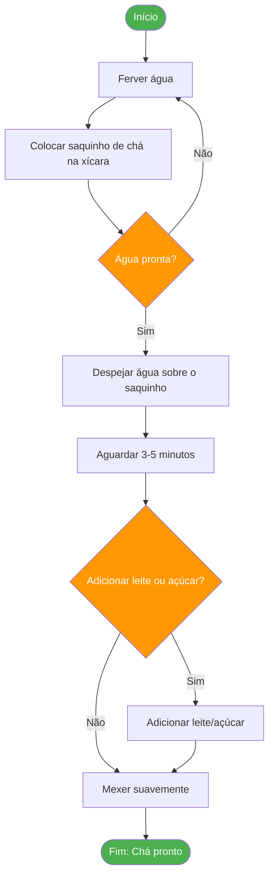
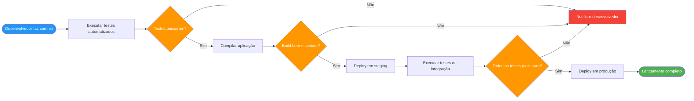
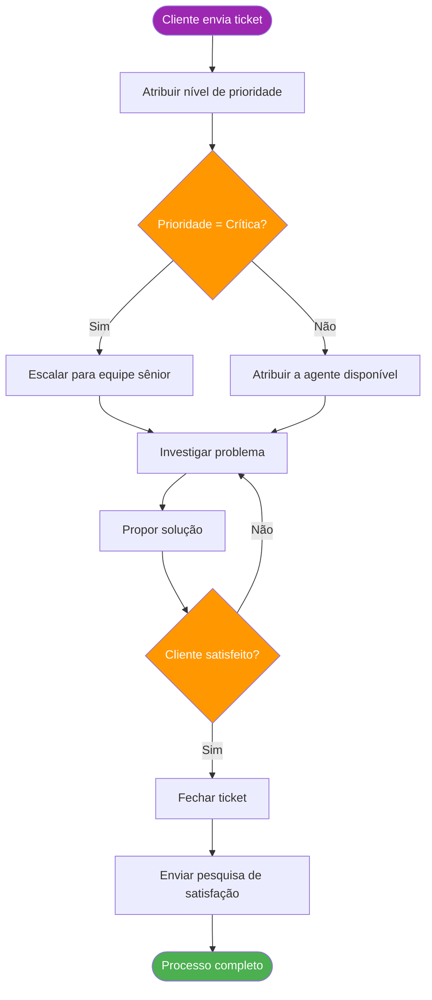

# O Que São Processos?

Processos estão em toda parte. Desde o momento em que você acorda até a hora de dormir, você interage com processos — tanto de forma consciente quanto inconsciente. Entender o que são processos e como eles funcionam é uma habilidade fundamental para qualquer pessoa que trabalhe com tecnologia, negócios ou qualquer área que exija pensamento sistemático.

## Definindo um Processo

Um **processo** é uma série de ações ou etapas executadas em uma ordem específica para alcançar um determinado objetivo. Ele transforma entradas em saídas por meio de uma sequência definida de operações.

> [!NOTE] Definição Importante
> Um processo é uma **série sistemática e repetível de ações** projetada para produzir um resultado consistente. A palavra-chave é *repetível* — se algo acontece uma vez por acaso, não é um processo.

### Características Fundamentais dos Processos

Todo processo bem definido compartilha estas características fundamentais:

| Característica | Descrição | Exemplo |
|---|---|---|
| **Sequência** | As etapas seguem uma ordem específica | Você não pode assar um bolo antes de misturar os ingredientes |
| **Repetibilidade** | Pode ser executado múltiplas vezes com resultados consistentes | Fazer café todas as manhãs |
| **Entradas** | Requer recursos para iniciar | Grãos de café, água, eletricidade |
| **Saídas** | Produz um resultado ou entregável | Uma xícara de café |
| **Limites** | Possui início e fim claros | Do pedido até a entrega |
| **Propósito** | Projetado para alcançar um objetivo específico | Satisfazer a fome do cliente |

## Exemplos de Processos do Mundo Real

### Exemplo 1: Preparando uma Xícara de Chá

Esta atividade diária simples é, na verdade, um processo bem estruturado:



### Exemplo 2: Pipeline de Deploy de Software

Na engenharia de software, processos são essenciais para confiabilidade:



### Exemplo 3: Resolução de Ticket de Suporte ao Cliente



## Pensamento Processual

**Pensamento processual** é uma mentalidade que enxerga o trabalho como uma série de atividades interconectadas, em vez de tarefas isoladas. Essa perspectiva é poderosa porque:

- Revela dependências entre etapas
- Identifica oportunidades de melhoria
- Facilita o diagnóstico de problemas
- Possibilita automação e otimização

> [!TIP] Pense em Processos
> Da próxima vez que completar uma tarefa, pause e pergunte a si mesmo:
> 1. O que disparou o início deste processo?
> 2. Quais etapas eu segui?
> 3. Quais decisões tomei ao longo do caminho?
> 4. Qual foi o resultado final?
> 
> Você ficará surpreso com a frequência com que consegue identificar um processo!

### A Mentalidade de Processos na Engenharia de Software

Na engenharia de software, o pensamento processual se aplica a tudo:

| Área | Exemplo de Processo |
|---|---|
| **Desenvolvimento** | Solicitação → Design → Código → Revisão → Teste → Deploy |
| **Operações** | Alerta → Investigar → Diagnosticar → Corrigir → Verificar → Documentar |
| **Segurança** | Relatório de vulnerabilidade → Avaliar → Priorizar → Corrigir → Verificar |
| **Dados** | Ingestão → Validação → Transformação → Armazenamento → Análise |

## Por Que Processos Importam

### Consistência e Qualidade

Processos garantem que o trabalho seja feito da mesma forma todas as vezes, reduzindo erros e variabilidade.

```
Sem Processo:           Com Processo:
┌──────────────┐          ┌──────────────┐
│  Pessoa A    │ ────►    │  Etapa 1     │
│  faz do      │          │  Etapa 2     │ ──► Resultados
│  seu jeito   │          │  Etapa 3     │     Consistentes
└──────────────┘          │  Etapa 4     │
┌──────────────┐          └──────────────┘
│  Pessoa B    │
│  faz do      │ ──► Resultados
│  seu jeito   │     Diferentes
└──────────────┘
```

### Escalabilidade

Processos permitem que o trabalho escale além da capacidade individual. Quando um processo está documentado, qualquer pessoa pode executá-lo.

### Melhoria Contínua

Você não pode melhorar o que não consegue descrever. Processos tornam a melhoria possível porque fornecem uma linha de base para comparação.

> [!WARNING] Armadilha Comum
> Não confunda **processos** com **burocracia**. Um bom processo reduz atrito; a burocracia o cria. Se uma etapa do processo não agrega valor, ela não deveria existir.

## Tipos de Processos

Processos podem ser categorizados de várias formas:

### Por Previsibilidade

| Tipo | Descrição | Exemplo |
|---|---|---|
| **Determinístico** | Mesmas entradas sempre produzem mesmas saídas | Cálculos matemáticos |
| **Probabilístico** | Resultados têm alguma variabilidade | Interações com suporte ao cliente |

### Por Estrutura

| Tipo | Descrição | Exemplo |
|---|---|---|
| **Linear** | Etapas sequenciais sem ramificação | Linha de montagem |
| **Condicional** | Etapas dependem de decisões tomadas | Aprovação de empréstimo |
| **Iterativo** | Etapas se repetem até uma condição ser atingida | Depuração de software |
| **Paralelo** | Múltiplas etapas ocorrem simultaneamente | Estágios de pipeline CI/CD |

### Por Escopo

| Tipo | Descrição | Exemplo |
|---|---|---|
| **Macro** | Alto nível, organizacional | Ciclo de vida de desenvolvimento de produto |
| **Micro** | Detalhado, nível de tarefa | Checklist de revisão de código |

## Exercícios Práticos

### Exercício 1: Identifique o Processo

Pense na sua rotina matinal. Anote cada etapa em ordem. Identifique:
- O que dispara o processo?
- Quais são as entradas?
- Quais são as saídas?
- Onde estão os pontos de decisão?

### Exercício 2: Analise um Processo

Considere o processo de pedir comida por um aplicativo de delivery. Desenhe um fluxograma simples mostrando:
1. As etapas principais, desde abrir o app até receber a comida
2. Pelo menos dois pontos de decisão
3. Os pontos de início e fim

### Exercício 3: Processo vs. Não-Processo

Determine quais dos seguintes são processos e explique o porquê:

1. Escovar os dentes todas as manhãs
2. Ganhar na loteria
3. Responder a um e-mail de cliente
4. Um gerador de números aleatórios produzindo 7
5. Implantar uma atualização de software

<details>
<summary>Clique para ver as respostas</summary>

1. **Processo** — Etapas repetíveis e ordenadas com um objetivo claro
2. **Não é processo** — Não é repetível nem controlável
3. **Processo** — Abordagem sistemática para lidar com solicitações
4. **Não é processo** — Sem transformação ou objetivo, apenas saída aleatória
5. **Processo** — Etapas definidas para alcançar um resultado específico

</details>

## Principais Conclusões

- Um processo é uma **série repetível de etapas** que transforma entradas em saídas
- Processos têm **limites claros**, **sequências definidas** e **propósitos específicos**
- O **pensamento processual** ajuda você a enxergar o trabalho como atividades interconectadas
- Entender processos é o primeiro passo para **otimizá-los** e **automatizá-los**
- Na próxima lição, vamos explorar os **componentes** que constituem qualquer processo

> [!SUCCESS] Você Completou a Lição 1
> Agora você entende o que são processos e consegue identificá-los no dia a dia. Na próxima lição, vamos explorar os blocos de construção dos processos: **entradas, saídas, transformações, pontos de decisão e atores**.
