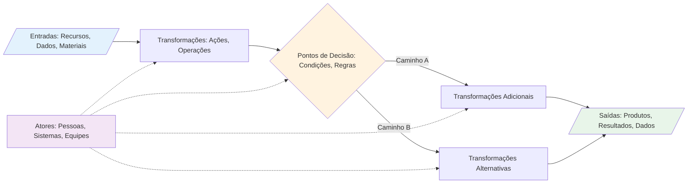
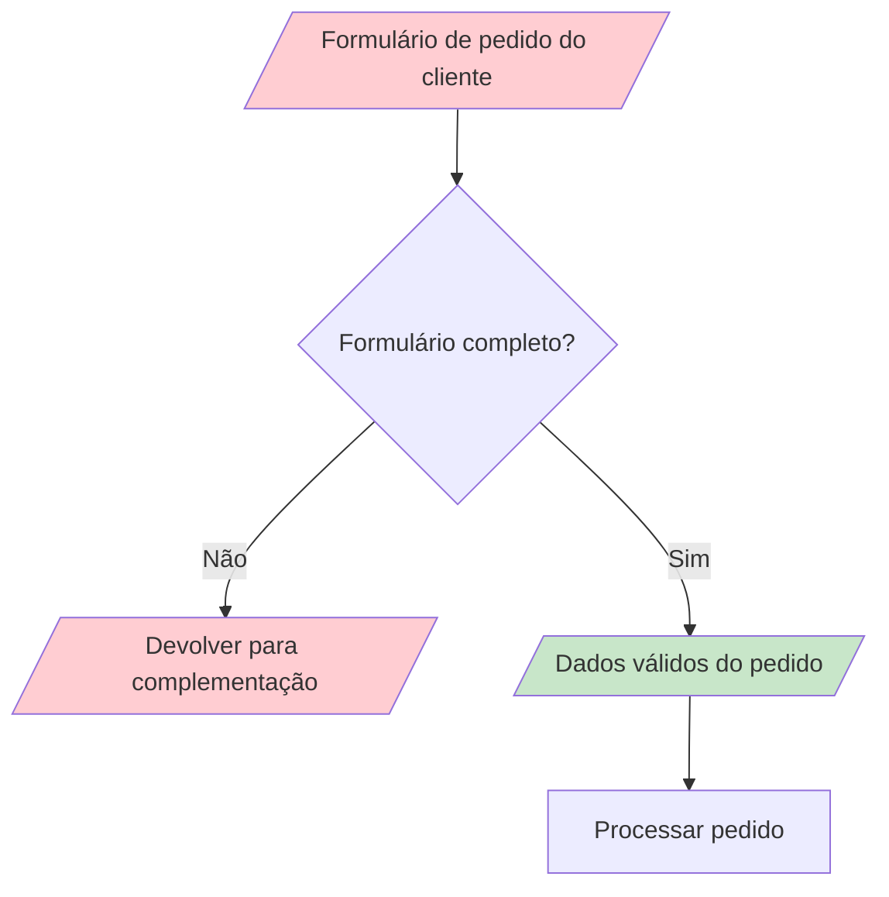
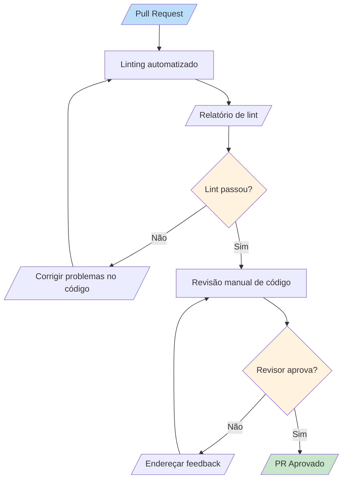
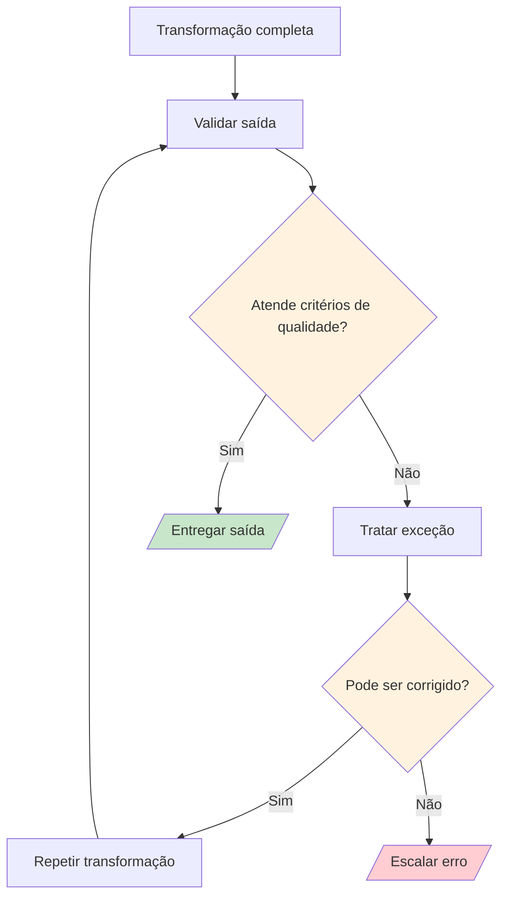
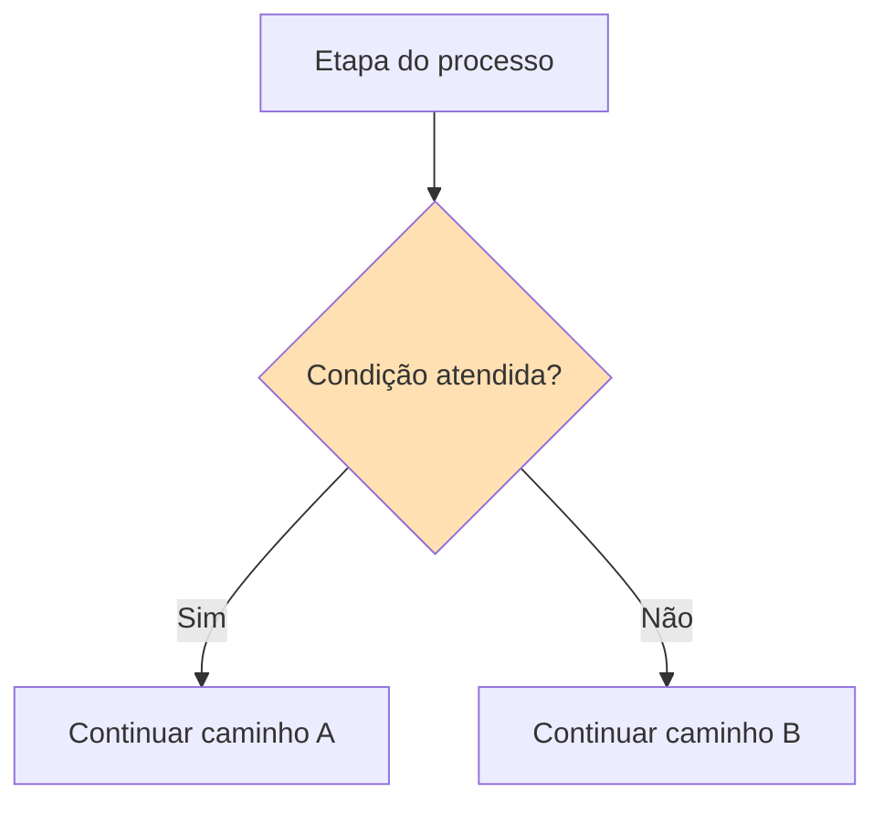
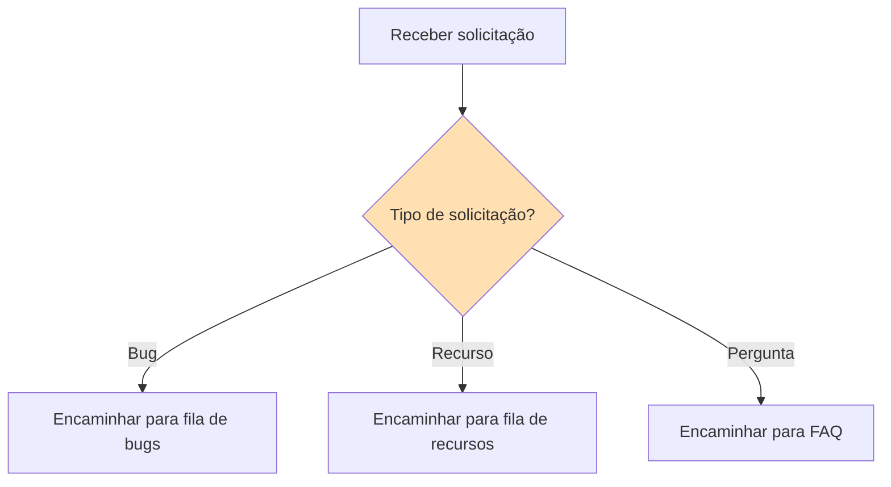
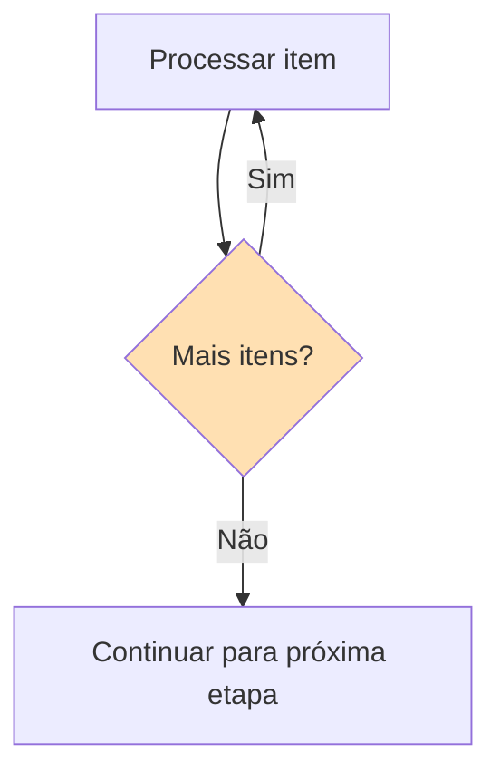
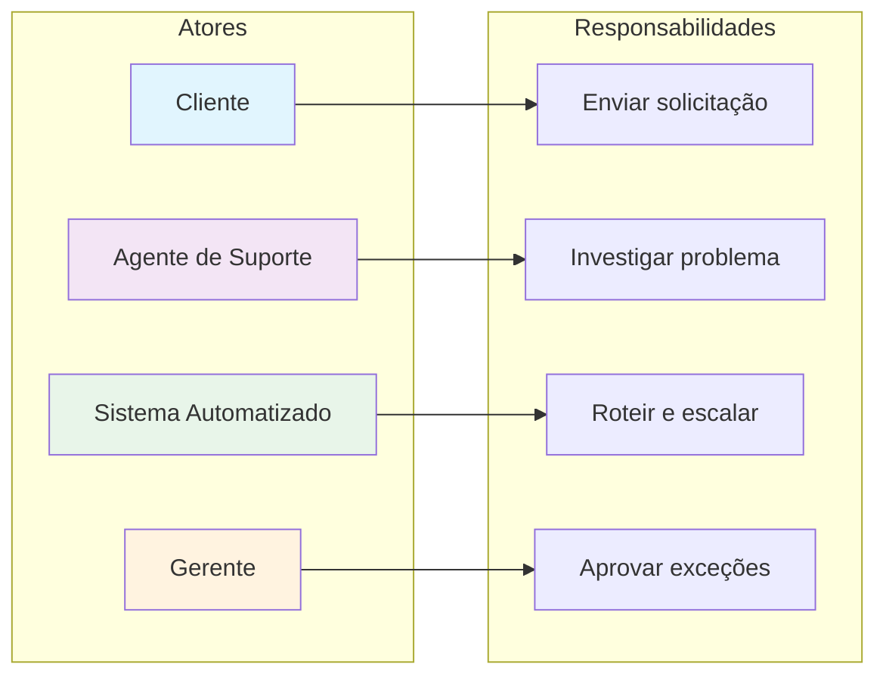
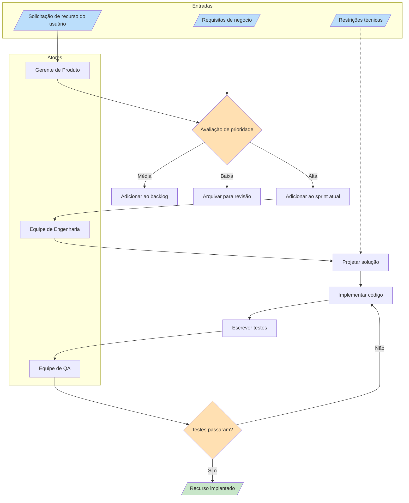

# Componentes de Processos

Todo processo, não importa quão simples ou complexo, é construído a partir de um conjunto de componentes fundamentais. Entender esses componentes é essencial para analisar, documentar e melhorar processos. Nesta lição, vamos detalhar cada componente e ver como eles trabalham juntos.

## Os Cinco Componentes Principais

Todos os processos consistem em cinco elementos fundamentais:

1. **Entradas** — Recursos que entram no processo
2. **Transformações** — Ações que modificam as entradas
3. **Saídas** — Resultados que saem do processo
4. **Pontos de Decisão** — Locais onde o processo se ramifica
5. **Atores** — Entidades que executam as ações



## 1. Entradas

Entradas são tudo o que um processo precisa para iniciar e operar. Elas podem ser tangíveis ou intangíveis.

### Tipos de Entradas

| Tipo | Descrição | Exemplos |
|---|---|---|
| **Material** | Recursos físicos | Matéria-prima, documentos, hardware |
| **Informação** | Dados ou conhecimento | Solicitação do cliente, especificações, requisitos |
| **Energia** | Força para impulsionar o processo | Eletricidade, esforço humano, recursos de computação |
| **Tempo** | Duração alocada | Prazos, SLAs, janelas agendadas |

### A Qualidade das Entradas Importa

> [!WARNING] Lixo Entra, Lixo Sai
> A qualidade das suas saídas é diretamente limitada pela qualidade das suas entradas. Um processo não pode produzir resultados de alta qualidade a partir de entradas de baixa qualidade.



### Exemplo do Mundo Real: Entradas de uma Cozinha de Restaurante

```
Entradas para um Pedido de Pizza:
├── Material: Massa, molho, queijo, coberturas
├── Informação: Pedido do cliente (tamanho, tipo, extras)
├── Energia: Calor do forno, trabalho do chef
└── Tempo: Janela de preparação de 15-20 minutos
```

## 2. Transformações

Transformações são as ações que convertem entradas em saídas. Elas são o "trabalho" do processo.

### Tipos de Transformações

| Tipo | Descrição | Exemplo |
|---|---|---|
| **Física** | Mudar forma ou estado | Cortar, montar, cozinhar |
| **Informacional** | Mudar dados ou conhecimento | Calcular, traduzir, analisar |
| **Locacional** | Mudar posição | Enviar, rotear, transferir |
| **Transacional** | Mudar propriedade ou status | Aprovar, comprar, registrar |

### Exemplo de Transformação: Processo de Revisão de Código



### Boas Práticas para Transformações

> [!TIP] Mantenha Transformações Atômicas
> Cada etapa de transformação deve fazer **uma coisa bem feita**. Se uma etapa faz múltiplas coisas, considere dividi-la em etapas menores. Isso torna os processos mais fáceis de entender, testar e melhorar.

## 3. Saídas

Saídas são os resultados produzidos pelo processo. Elas podem ser o entregável principal ou subprodutos secundários.

### Saídas Primárias vs. Secundárias

| Tipo | Descrição | Exemplo (Build de Software) |
|---|---|---|
| **Primária** | O resultado principal pretendido | Binário da aplicação compilada |
| **Secundária** | Resultados adicionais úteis | Logs de build, relatórios de teste, artefatos |
| **Desperdício** | Subprodutos não intencionais | Arquivos temporários, builds falhados |

### Validação de Saídas

Todo processo deve validar suas saídas antes da conclusão:



## 4. Pontos de Decisão

Pontos de decisão são onde um processo avalia condições e escolhe entre diferentes caminhos.

### Padrões de Pontos de Decisão

#### Padrão 1: Decisão Binária



#### Padrão 2: Decisão Múltipla



#### Padrão 3: Decisão de Loop



### Boas Práticas para Pontos de Decisão

| Prática | Por Que Importa |
|---|---|
| **Critérios claros** | Todos devem entender quando cada caminho é tomado |
| **Regras documentadas** | A lógica de decisão deve ser explícita, não implícita |
| **Caminhos de fallback** | Sempre defina o que acontece quando nenhuma condição corresponde |
| **Trilha de auditoria** | Registre qual caminho foi tomado e por quê |

> [!NOTE] Aviso de Complexidade de Decisão
> Se um ponto de decisão tem mais de 4-5 ramificações, considere se o processo pode ser simplificado. Decisões complexas frequentemente indicam que um processo deve ser dividido em sub-processos.

## 5. Atores

Atores são as entidades que realizam o trabalho em um processo. Eles podem ser humanos ou automatizados.

### Tipos de Atores

| Tipo | Descrição | Exemplos |
|---|---|---|
| **Humano** | Pessoas executando tarefas | Desenvolvedor, gerente, cliente |
| **Sistema** | Software executando tarefas | Servidor CI, banco de dados, API |
| **Híbrido** | Humano usando um sistema | Analista usando um painel |
| **Externo** | Fora da organização | Gateway de pagamento, transportadora |

### Matriz de Responsabilidade dos Atores



### Modelo RACI para Atores de Processos

O modelo RACI ajuda a esclarecer as responsabilidades dos atores:

| Papel | Significado | Exemplo em Revisão de Código |
|---|---|---|
| **R**esponsável | Executa o trabalho | Desenvolvedor escrevendo código |
| **A**ccountable (Responsável final) | Dono do resultado | Líder técnico aprovando mudanças |
| **C**onsultado | Fornece input | Equipe de segurança revisando |
| **I**nformado | Mantido atualizado | Gerente de projeto notificado |

## Juntando Tudo: Exemplo Completo de Processo

Vamos examinar um processo completo com todos os cinco componentes:

### Processo de Solicitação de Recurso de Software



## Exercícios Práticos

### Exercício 1: Identificação de Componentes

Para o processo de "Sacar dinheiro de um caixa eletrônico," identifique:
1. Todas as entradas
2. Todas as transformações
3. Todas as saídas
4. Todos os pontos de decisão
5. Todos os atores

### Exercício 2: Desenhe um Processo

Desenhe um fluxograma para o processo de "Publicar um post de blog" que inclua:
- Pelo menos 3 entradas
- Pelo menos 4 transformações
- Pelo menos 2 pontos de decisão
- Pelo menos 2 atores diferentes
- Saídas claras

### Exercício 3: Analise um Processo com Problemas

Considere este processo problemático:
```
Reclamação do cliente → Encaminhar ao departamento → Departamento resolve → Pronto
```

Identifique o que está faltando:
- As entradas estão claramente definidas?
- Existem pontos de decisão para roteamento?
- Há validação de saída?
- Quem são os atores?

<details>
<summary>Clique para ver a análise</summary>

**Problemas identificados:**
- Sem validação de entrada (a reclamação está completa?)
- Sem pontos de decisão (e se o departamento errado receber?)
- Sem validação de saída (o cliente ficou satisfeito?)
- Atores são vagos ("departamento" não é específico)
- Sem caminho de escalonamento se o departamento não responder
- Sem loop de feedback para melhoria

</details>

## Principais Conclusões

- Todo processo tem **cinco componentes principais**: entradas, transformações, saídas, pontos de decisão e atores
- A **qualidade das entradas** determina diretamente a qualidade das saídas
- **Transformações** devem ser atômicas — uma coisa por etapa
- **Pontos de decisão** devem ter critérios claros e documentados
- **Atores** precisam de responsabilidades bem definidas (use RACI)
- Entender componentes facilita **analisar** e **melhorar** qualquer processo

> [!SUCCESS] Você Completou a Lição 2
> Agora você entende os blocos de construção de todo processo. Na próxima lição, vamos explorar **fluxogramas** — a linguagem visual usada para documentar e comunicar processos.
