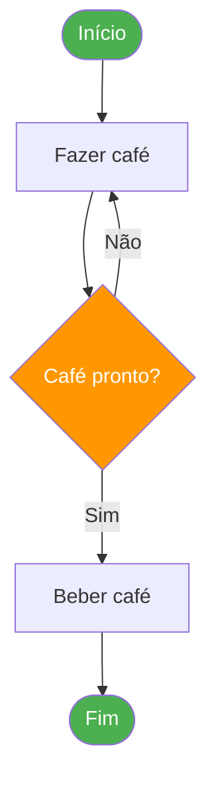
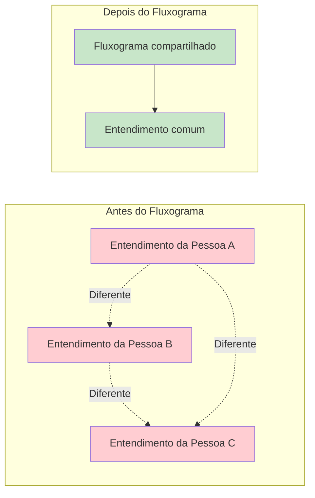
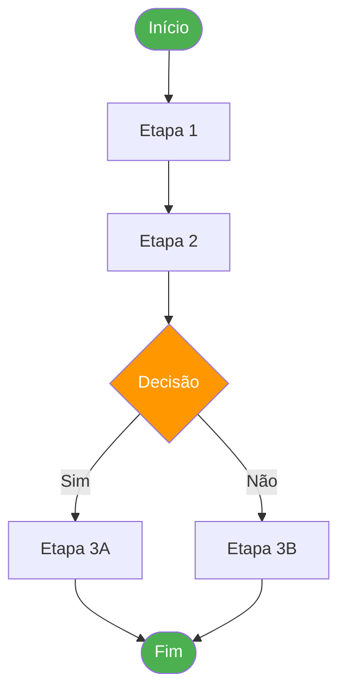
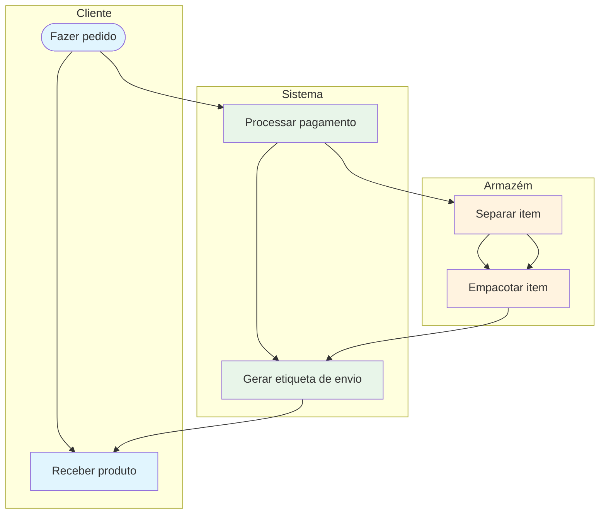
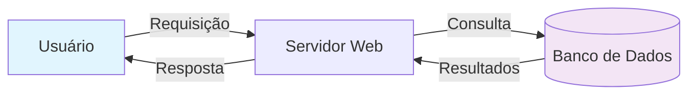
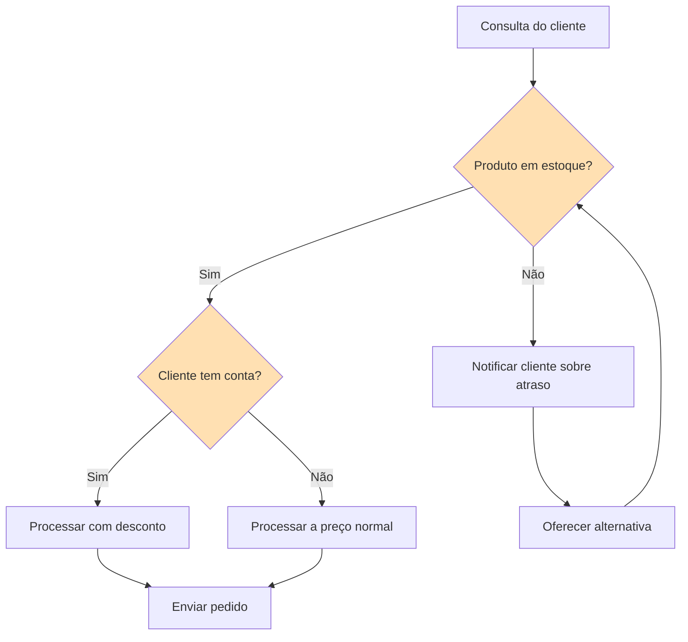
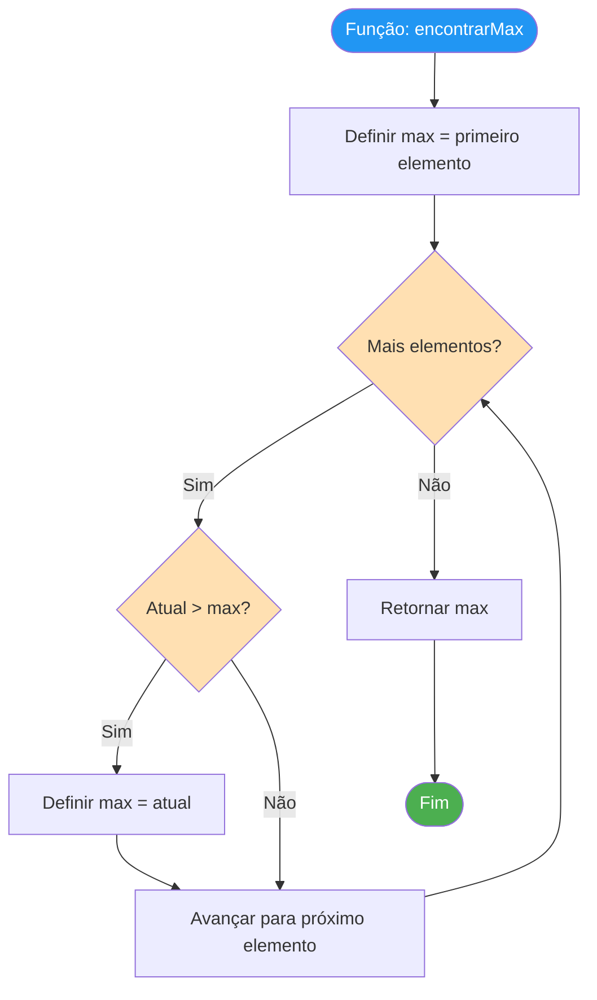
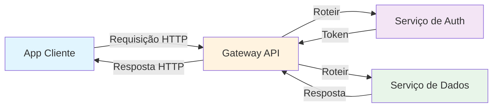

# Introdução aos Fluxogramas

Fluxogramas são uma das ferramentas mais poderosas para visualizar processos. Eles transformam sequências abstratas de etapas em diagramas visuais claros que qualquer pessoa pode entender. Nesta lição, vamos explorar o que são fluxogramas, por que são importantes e quando usá-los.

## O Que É um Fluxograma?

Um **fluxograma** é um diagrama que representa um processo ou fluxo de trabalho usando símbolos padronizados conectados por setas para mostrar a sequência de etapas e pontos de decisão.

> [!NOTE] Definição Simples
> Um fluxograma é uma **imagem de um processo**. Assim como uma fotografia captura um momento, um fluxograma captura como o trabalho flui do início ao fim.

### Um Exemplo Mínimo de Fluxograma



## Uma Breve História dos Fluxogramas

### Origens (Década de 1920)

Os fluxogramas foram introduzidos pela primeira vez por **Frank e Lillian Gilbreth** em 1921. Eles apresentaram um diagrama chamado "Flow Process Chart" à Sociedade Americana de Engenheiros Mecânicos (ASME). Os Gilbreths foram pioneiros em eficiência e otimização de fluxo de trabalho.

### Padronização (Décadas de 1940-1960)

- **1947**: A ASME adotou os símbolos dos Gilbreth como padrão
- **Década de 1960**: Fluxogramas se tornaram amplamente usados em programação de computadores
- **1970**: A ISO estabeleceu padrões internacionais para símbolos de fluxograma

### Era Moderna

Hoje, fluxogramas são usados em praticamente todas as indústrias:

| Indústria | Caso de Uso |
|---|---|
| **Software** | Design de algoritmos, arquitetura de sistemas, depuração |
| **Manufatura** | Linhas de montagem, controle de qualidade, cadeia de suprimentos |
| **Saúde** | Triagem de pacientes, protocolos de tratamento, resposta a emergências |
| **Negócios** | Integração, aprovações, jornadas do cliente |
| **Educação** | Caminhos de aprendizado, árvores de decisão, guias de estudo |

## Por Que Fluxogramas Importam

### 1. Comunicação Visual

Um fluxograma pode comunicar um processo complexo em segundos — algo que poderia levar páginas de texto para descrever.

```
Descrição em Texto:                Fluxograma:
"Para processar um pedido,         ([Início]) --> [Receber Pedido]
 primeiro você recebe o pedido,    --> [Validar] --> {Válido?}
 depois valida, e se não for       -->|Sim| [Processar Pagamento]
 válido você rejeita, mas          -->|Não| [Rejeitar]
 se for válido você processa       --> [Enviar] --> ([Fim])
 o pagamento, depois envia..."
```

> [!TIP] A Vantagem Visual
> Pesquisas mostram que as pessoas lembram **65% da informação visual** após 3 dias, comparado a apenas **10% da informação baseada em texto**. Fluxogramas aproveitam essa vantagem visual.

### 2. Análise de Processos

Fluxogramas facilitam identificar:
- **Redundâncias** — Etapas repetidas desnecessariamente
- **Gargalos** — Pontos onde o trabalho acumula
- **Etapas faltantes** — Lacunas no processo
- **Complexidade desnecessária** — Caminhos excessivamente complicados

### 3. Alinhamento da Equipe

Quando todos podem ver o mesmo diagrama de processo, os mal-entendidos diminuem e a colaboração melhora.



### 4. Documentação

Fluxogramas servem como documentação viva que pode ser atualizada conforme os processos evoluem.

## Quando Usar Fluxogramas

### Cenários Ideais

| Cenário | Por Que o Fluxograma Ajuda |
|---|---|
| **Integração de novos membros** | Mostra como o trabalho é feito de relance |
| **Depuração de um processo quebrado** | Facilita localizar onde as coisas dão errado |
| **Design de um novo sistema** | Ajuda a planejar o fluxo antes da implementação |
| **Melhoria de um processo existente** | Visualiza estado atual vs. estado futuro |
| **Explicar para stakeholders** | Pessoas não técnicas conseguem entender o fluxo |
| **Conformidade e auditoria** | Fornece documentação clara de procedimentos |

### Quando NÃO Usar Fluxogramas

| Situação | Alternativa Melhor |
|---|---|
| Sistemas extremamente complexos (100+ etapas) | Diagramas de arquitetura de sistema |
| Relacionamentos de dados | Diagramas entidade-relacionamento (DER) |
| Processos baseados em linha do tempo | Gráficos Gantt ou linhas do tempo |
| Estruturas hierárquicas | Organogramas |
| Mudanças de estado | Diagramas de máquina de estado |

> [!WARNING] Não Complicar Demais
> Se seu fluxograma tem mais de 30-40 nós, considere dividi-lo em múltiplos sub-fluxogramas. Um fluxograma muito complexo defeats o propósito de simplificação.

## Tipos de Fluxogramas

Diferentes situações pedem diferentes tipos de fluxogramas:

### 1. Fluxograma Básico

Mostra as etapas de um processo em sequência.



### 2. Fluxograma de Raias (Swimlane)

Mostra quem é responsável por cada etapa, organizado por função ou departamento.



### 3. Diagrama de Fluxo de Dados

Foca em como os dados se movem através de um sistema.



### 4. Fluxograma de Decisão

Foca na lógica de decisão e resultados.



## Fluxogramas na Engenharia de Software

Fluxogramas são particularmente valiosos no desenvolvimento de software:

### Design de Algoritmos

Antes de escrever código, faça um fluxograma da lógica:



### Depuração

Faça um fluxograma do fluxo esperado, depois compare com o comportamento real para encontrar discrepâncias.

### Design de Sistema

Mapeie como diferentes componentes interagem:



## Exercícios Práticos

### Exercício 1: Texto para Fluxograma

Converta esta descrição em texto em um fluxograma:

> "Quando um usuário faz login, o sistema verifica suas credenciais. Se válidas, verifica seu papel. Admins vão para o painel admin, usuários regulares vão para a página inicial. Se as credenciais são inválidas, o sistema mostra um erro e permite mais 2 tentativas. Após 3 tentativas falhadas, a conta é bloqueada."

### Exercício 2: Identifique o Tipo de Fluxograma

Para cada cenário, determine qual tipo de fluxograma seria mais apropriado:

1. Mostrar como um pedido de cliente passa pelos departamentos de Vendas, Armazém e Envio
2. Documentar as etapas para redefinir uma senha esquecida
3. Mapear como os dados do usuário fluem entre um app mobile, API e banco de dados
4. Mostrar a lógica de decisão para um sistema de aprovação de empréstimo

<details>
<summary>Clique para ver as respostas</summary>

1. **Fluxograma de raias (swimlane)** — Múltiplos departamentos envolvidos
2. **Fluxograma básico** — Processo sequencial simples
3. **Diagrama de fluxo de dados** — Foco no movimento de dados
4. **Fluxograma de decisão** — Lógica de decisão pesada

</details>

### Exercício 3: Identifique o Problema

Olhe esta descrição de fluxograma e identifique o que está errado:

```
Início → Etapa A → Etapa B → Etapa C → Etapa D → Fim
```

O processo realmente tem uma decisão na Etapa B que determina se vai para a Etapa C ou pula para a Etapa D. O que está faltando no fluxograma?

<details>
<summary>Clique para ver a resposta</summary>

O fluxograma está faltando um **ponto de decisão** (forma de diamante) na Etapa B. A representação correta deveria ser:

```
Início → Etapa A → Etapa B → {Condição?} →|Sim| Etapa C → Etapa D → Fim
                                       →|Não| Etapa D → Fim
```

</details>

## Principais Conclusões

- Fluxogramas são **representações visuais de processos** usando símbolos padronizados
> Foram inventados em **1921** por Frank e Lillian Gilbreth
- Fluxogramas melhoram **comunicação**, **análise**, **alinhamento** e **documentação**
- Use fluxogramas para **integração**, **depuração**, **design** e **melhoria** de processos
- Escolha o **tipo certo de fluxograma** para sua situação
- Mantenha fluxogramas **simples** — divida os complexos em sub-fluxogramas
- Na próxima lição, aprenderemos os **símbolos padrão** usados em fluxogramas

> [!SUCCESS] Você Completou a Lição 3
> Agora você entende o que são fluxogramas, por que são valiosos e quando usá-los. Na próxima lição, vamos mergulhar fundo nos **símbolos e notação de fluxogramas** — o vocabulário visual que torna os fluxogramas universais.
