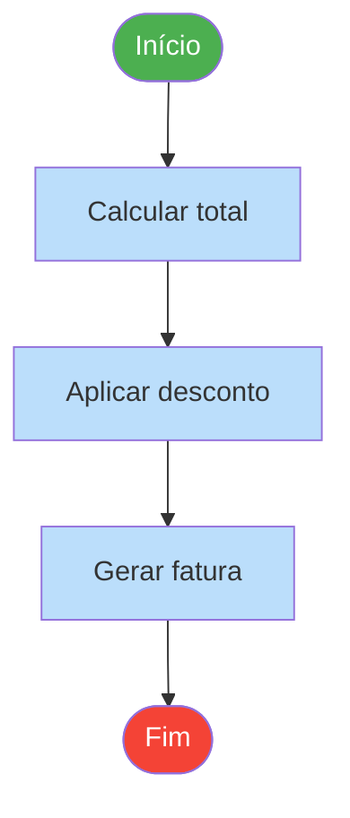
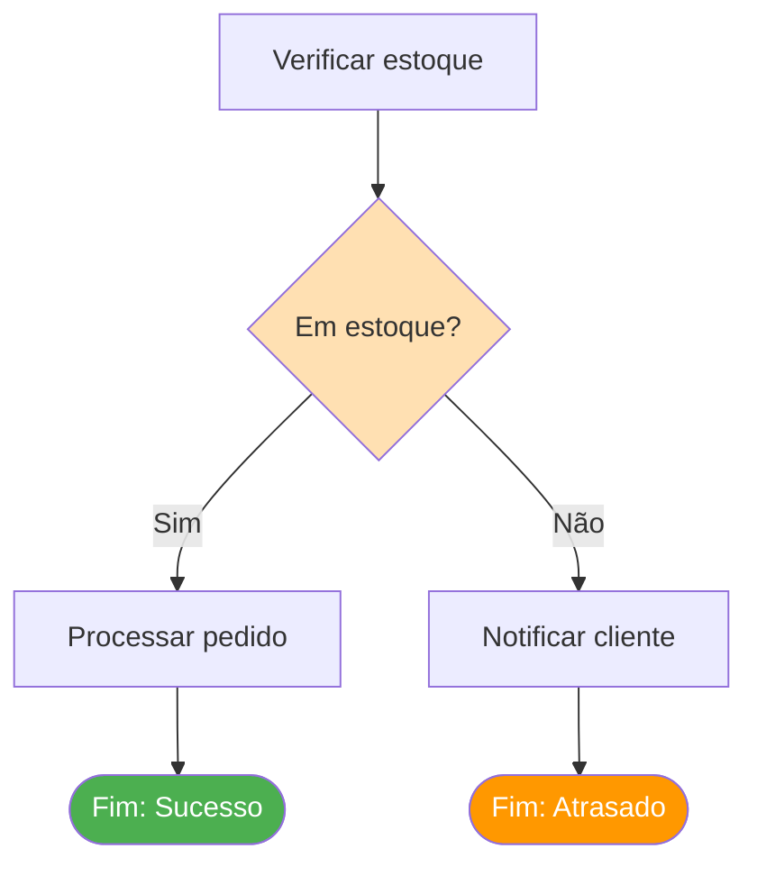
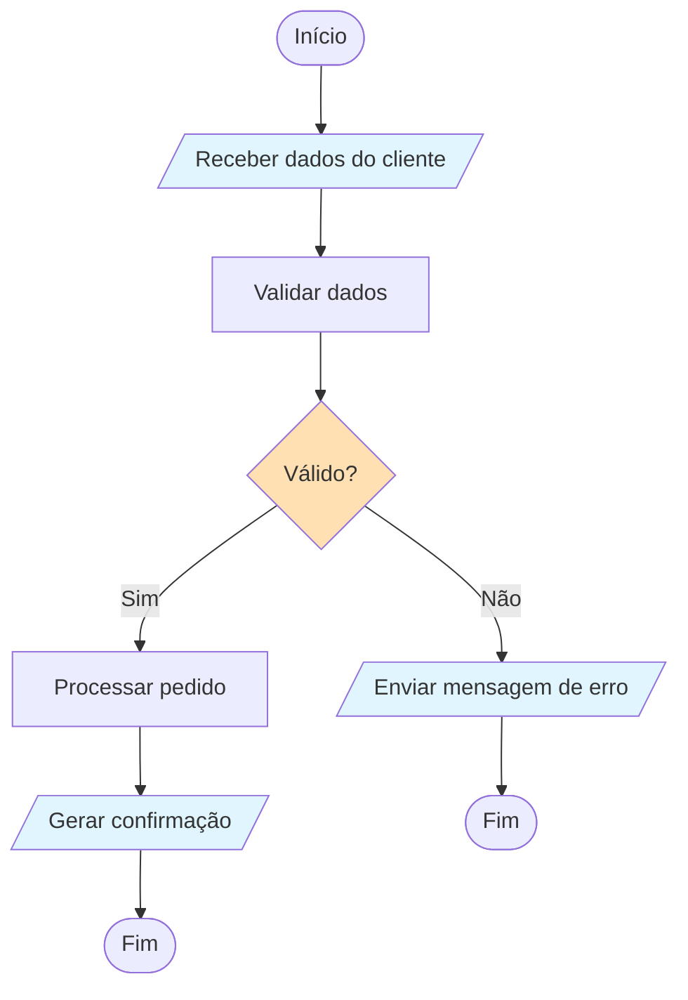
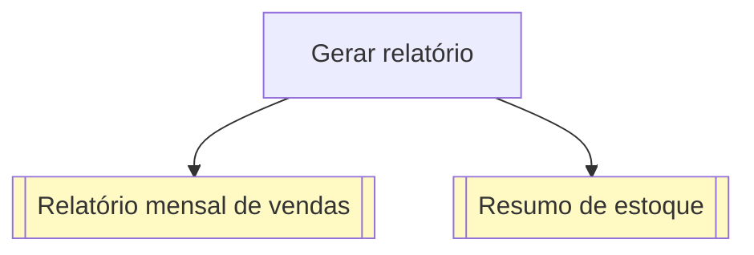
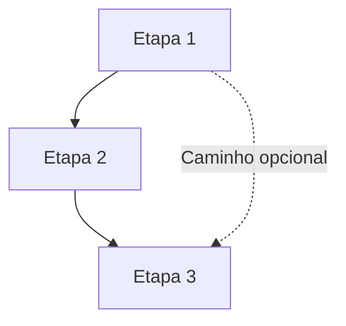
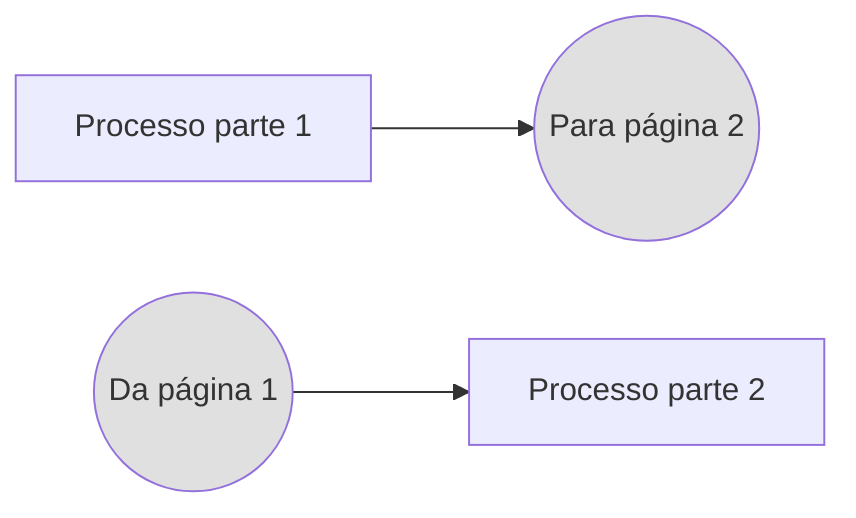
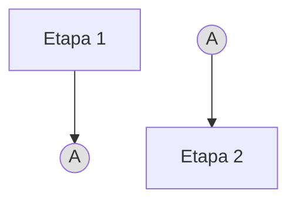
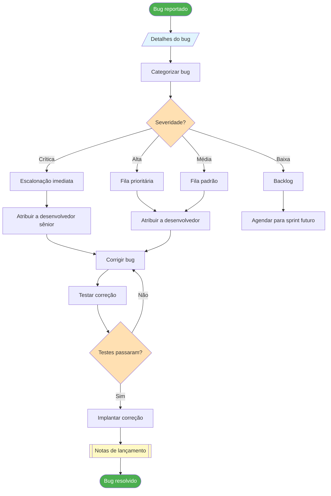

# Símbolos e Notação de Fluxogramas

Fluxogramas usam um conjunto padronizado de símbolos que os tornam universalmente compreendidos, independentemente de idioma ou indústria. Nesta lição, aprenderemos cada símbolo, seu significado e veremos exemplos práticos de como usá-los.

## O Conjunto Essencial de Símbolos

Embora existam dezenas de símbolos de fluxograma, você só precisa dominar um conjunto básico para criar fluxogramas eficazes na maioria das situações.

### Símbolos Terminais (Início/Fim)

Símbolos terminais marcam o início e o fim de um processo.

| Símbolo | Forma | Uso |
|---|---|---|
| `([Início])` | Retângulo arredondado / Pílula | Marca o início de um processo |
| `([Fim])` | Retângulo arredondado / Pílula | Marca o fim de um processo |


> [!NOTE] Boa Prática
> Todo fluxograma deve ter **exatamente um símbolo de Início**. Pode ter **um ou mais símbolos de Fim** (para diferentes caminhos de saída).

### Símbolos de Processo (Ação/Operação)

Símbolos de processo representam uma ação, operação ou etapa no fluxo de trabalho.

| Símbolo | Forma | Uso |
|---|---|---|
| `[Ação]` | Retângulo | Uma única etapa ou operação |



### Símbolos de Decisão

Símbolos de decisão representam um ponto onde o processo se ramifica com base em uma condição.

| Símbolo | Forma | Uso |
|---|---|---|
| `{Condição?}` | Losango | Uma decisão sim/não ou múltipla |



> [!TIP] Rotule Suas Ramificações
> Sempre rotule as setas que saem dos símbolos de decisão. Use rótulos claros como "Sim/Não", "Aprovado/Reprovado" ou valores específicos.

### Símbolos de Entrada/Saída

Símbolos de entrada/saída representam dados entrando ou saindo do processo.

| Símbolo | Forma | Uso |
|---|---|---|
| `[/Entrada/]` | Paralelogramo | Entrada de dados no processo |
| `[/Saída/]` | Paralelogramo | Saída de dados do processo |



### Símbolos de Documento

Símbolos de documento representam documentos ou relatórios gerados pelo processo.

| Símbolo | Forma | Uso |
|---|---|---|
| `[[Documento]]` | Retângulo com base ondulada | Um documento ou relatório |



### Símbolos de Banco de Dados

Símbolos de banco de dados representam armazenamento ou recuperação de dados.

| Símbolo | Forma | Uso |
|---|---|---|
| `[[(Banco de Dados)]]` | Cilindro | Banco de dados ou armazenamento |

```mermaid
flowchart TD
    A[Usuário envia formulário] --> B[Validar entrada]
    B --> C{Válido?}
    C -->|Sim| D[Salvar no banco de dados]
    C -->|Não| E[Mostrar erro]
    D --> F[[(Banco de dados de usuários)]]
    F --> G[Enviar confirmação]
    
    style F fill:#F3E5F5
    style C fill:#FFE0B2
```

## Símbolos Conectores

Conectores mostram a direção do fluxo e ligam diferentes partes do fluxograma.

### Linhas de Fluxo (Setas)

Setas mostram a direção do fluxo do processo.



### Conectores de Página

Quando um fluxograma abrange múltiplas páginas, conectores de página os ligam.



### Conectores de Página Única

Para fluxogramas complexos, conectores de página única evitam linhas cruzadas.



## Tabela de Referência Completa de Símbolos

| Símbolo | Sintaxe Mermaid | Forma | Nome | Quando Usar |
|---|---|---|---|---|
| `([Texto])` | `([Texto])` | Arredondado | Terminal | Início ou fim do processo |
| `[Texto]` | `[Texto]` | Retângulo | Processo | Ação ou operação |
| `{Texto}` | `{Texto}` | Losango | Decisão | Ponto de ramificação |
| `[/Texto/]` | `[/Texto/]` | Paralelogramo | E/S | Entrada ou saída de dados |
| `[[Texto]]` | `[[Texto]]` | Ret. ondulado | Documento | Relatório ou documento |
| `[[(Texto)]]` | `[[(Texto)]]` | Cilindro | Banco de dados | Armazenamento de dados |
| `((Texto))` | `((Texto))` | Círculo | Conector | Link para outro ponto |
| `==Texto==` | `==Texto==` | Linha dupla | Processo predefinido | Chamada de sub-processo |

## Exemplos Práticos

### Exemplo 1: Fluxo de Registro de Usuário

```mermaid
flowchart TD
    A([Início]) --> B[/Inserir e-mail e senha/]
    B --> C[Validar formato]
    C --> D{Formato válido?}
    D -->|Não| E[/Mostrar mensagem de erro/]
    D -->|Sim| F[Verificar se e-mail existe]
    E --> B
    F --> G{E-mail disponível?}
    G -->|Não| H[/E-mail já registrado/]
    G -->|Sim| I[Criar conta]
    H --> B
    I --> J[Enviar e-mail de verificação]
    J --> K[[(Banco de dados de usuários)]]
    K --> L[[E-mail de boas-vindas]]
    L --> M([Registro completo])
    
    style A fill:#4CAF50,color:#fff
    style M fill:#4CAF50,color:#fff
    style D fill:#FFE0B2
    style G fill:#FFE0B2
    style B fill:#E1F5FE
    style E fill:#E1F5FE
    style H fill:#E1F5FE
    style K fill:#F3E5F5
    style L fill:#FFF9C4
```

### Exemplo 2: Triagem de Relatório de Bug



### Exemplo 3: Checkout de E-Commerce

```mermaid
flowchart TD
    A([Iniciar checkout]) --> B[/Conteúdo do carrinho/]
    B --> C[Validar carrinho]
    C --> D{Carrinho válido?}
    D -->|Não| E[/Mostrar erros do carrinho/]
    D -->|Sim| F[/Detalhes de envio/]
    E --> A
    F --> G[Calcular frete]
    G --> H[/Detalhes de pagamento/]
    H --> I[Processar pagamento]
    I --> J{Pagamento bem-sucedido?}
    J -->|Não| K[/Pagamento falhou - tentar novamente/]
    J -->|Sim| L[Criar pedido]
    K --> H
    L --> M[[(Banco de dados de pedidos)]]
    M --> N[Atualizar estoque]
    N --> O[[(Banco de dados de estoque)]]
    O --> P[Enviar confirmação]
    P --> Q[[E-mail de confirmação do pedido]]
    Q --> R([Checkout completo])
    
    style A fill:#4CAF50,color:#fff
    style R fill:#4CAF50,color:#fff
    style D fill:#FFE0B2
    style J fill:#FFE0B2
    style B fill:#E1F5FE
    style E fill:#E1F5FE
    style F fill:#E1F5FE
    style H fill:#E1F5FE
    style K fill:#E1F5FE
    style M fill:#F3E5F5
    style O fill:#F3E5F5
    style Q fill:#FFF9C4
```

## Diretrizes de Uso de Símbolos

### O Que Fazer e O Que Não Fazer

| Fazer | Não Fazer |
|---|---|
| Use formas de símbolos consistentes | Misturar formas para o mesmo propósito |
| Rotule ramificações de decisão claramente | Deixar ramificações sem rótulo |
| Mantenha o texto conciso dentro dos símbolos | Escrever parágrafos dentro dos símbolos |
| Use símbolos padrão | Inventar símbolos personalizados sem legenda |
| Fluxo de cima para baixo ou esquerda para direita | Criar direções de fluxo confusas |
| Use cor de forma proposital | Usar cores aleatórias sem significado |

> [!WARNING] Erro Comum
> Não use um retângulo para decisões só porque é mais fácil de digitar. A forma de losango é universalmente reconhecida como ponto de decisão — usar a forma errada confunde os leitores.

### Convenções de Codificação de Cores

Embora não sejam padronizadas, estas convenções de cores são amplamente usadas:

| Cor | Significado Típico |
|---|---|
| Verde | Início, sucesso, resultado positivo |
| Vermelho | Fim, erro, falha, parada |
| Laranja/Amarelo | Pontos de decisão, avisos |
| Azul | Etapas de processo, ações |
| Roxo | Armazenamento de dados, bancos de dados |
| Amarelo | Documentos, relatórios |

## Exercícios Práticos

### Exercício 1: Identificação de Símbolos

Para cada descrição, identifique a forma correta do símbolo:

1. O ponto onde o status de assinatura de um usuário é verificado
2. A etapa onde um relatório é gerado
3. O início do processo de fulfillment de pedidos
4. Dados sendo lidos de um arquivo de configuração
5. Salvando um registro no banco de dados
6. Uma referência a um sub-processo definido em outro lugar

<details>
<summary>Clique para ver as respostas</summary>

1. **Losango** `{}` — Ponto de decisão
2. **Retângulo ondulado** `[[]]` — Documento
3. **Retângulo arredondado** `([ ])` — Terminal (Início)
4. **Paralelogramo** `[/ /]` — Entrada
5. **Cilindro** `[[( )]]` — Banco de dados
6. **Círculo** `(( ))` — Conector (ou retângulo de linha dupla para processo predefinido)

</details>

### Exercício 2: Corrija o Fluxograma

Este fluxograma tem erros de símbolos. Identifique e corrija-os:

```
[Início] → [Verificar papel do usuário] → [Admin?] → [Mostrar painel admin] → [Fim]
```

<details>
<summary>Clique para ver a versão corrigida</summary>

```
([Início]) → [Verificar papel do usuário] → {Admin?} →|Sim| [Mostrar painel admin] → ([Fim])
                                             →|Não| [Mostrar painel de usuário] → ([Fim])
```

**Erros corrigidos:**
- Início deve ser `([Início])` (terminal, não processo)
- "Admin?" deve ser `{Admin?}` (decisão, não processo)
- Fim deve ser `([Fim])` (terminal, não processo)
- Faltando o ramo "Não" da decisão
- Ramificações devem ser rotuladas

</details>

### Exercício 3: Desenhe um Fluxograma

Crie um fluxograma para "Fazer uma chamada telefônica" usando pelo menos:
- 2 símbolos terminais
- 4 símbolos de processo
- 2 símbolos de decisão
- 1 símbolo de entrada/saída
- Setas de fluxo adequadas com rótulos

## Principais Conclusões

- Fluxogramas usam **símbolos padronizados** que são universalmente compreendidos
- O **conjunto básico de símbolos** inclui: terminais, processos, decisões, E/S, documentos, bancos de dados e conectores
- Sempre **rotule as ramificações de decisão** claramente
- Use **formas consistentes** — não misture símbolos para o mesmo propósito
- **Codificação de cores** pode melhorar a legibilidade, mas não é obrigatória
- Mantenha o texto dos símbolos **conciso** — use descrições fora do diagrama se necessário
- Na próxima lição, aplicaremos esses símbolos para **construir seus primeiros fluxogramas** passo a passo

> [!SUCCESS] Você Completou a Lição 4
> Agora você conhece os símbolos padrão de fluxogramas e como usá-los. Na próxima lição, colocaremos esse conhecimento em prática **construindo fluxogramas do zero** com exemplos passo a passo.
