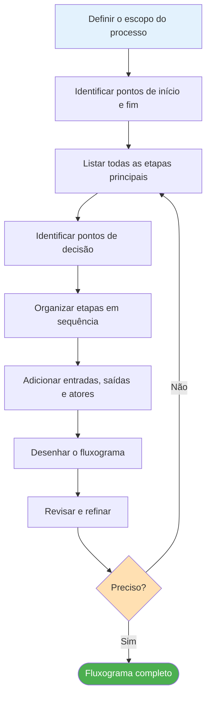
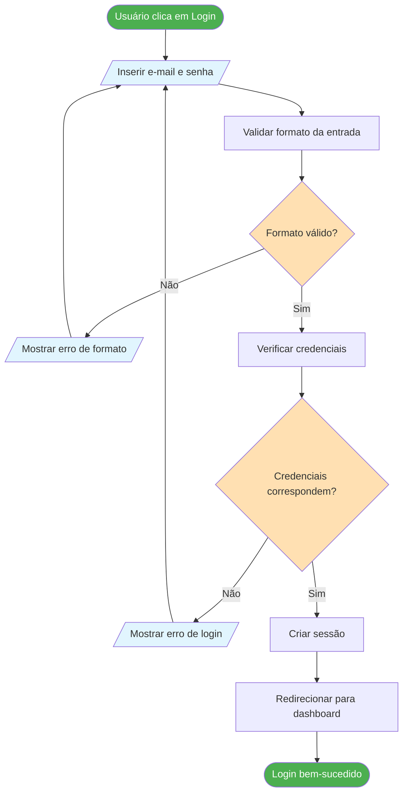
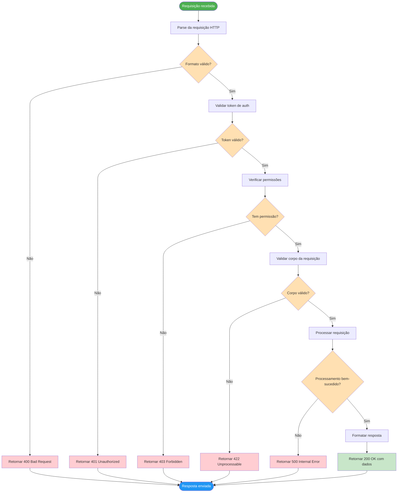
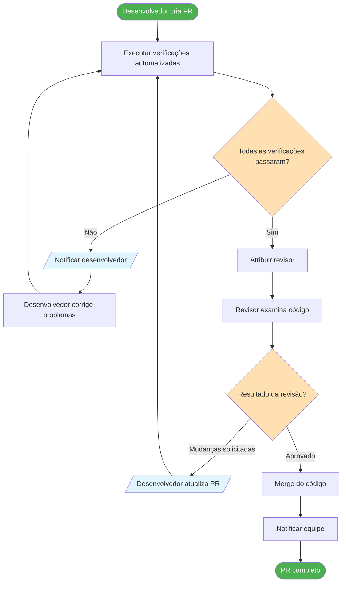
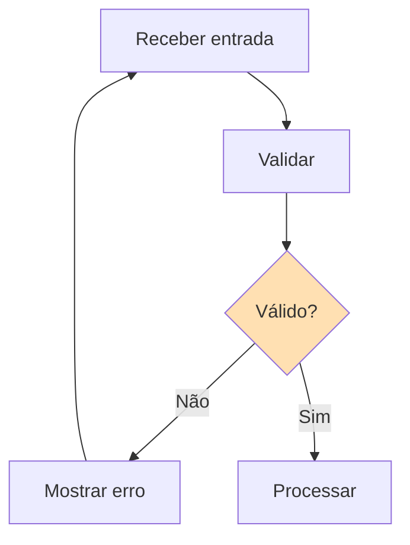
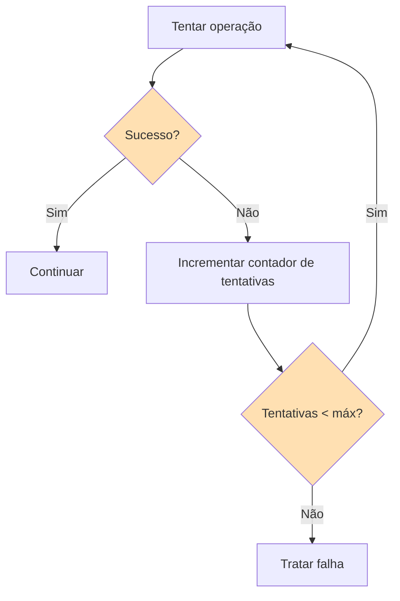
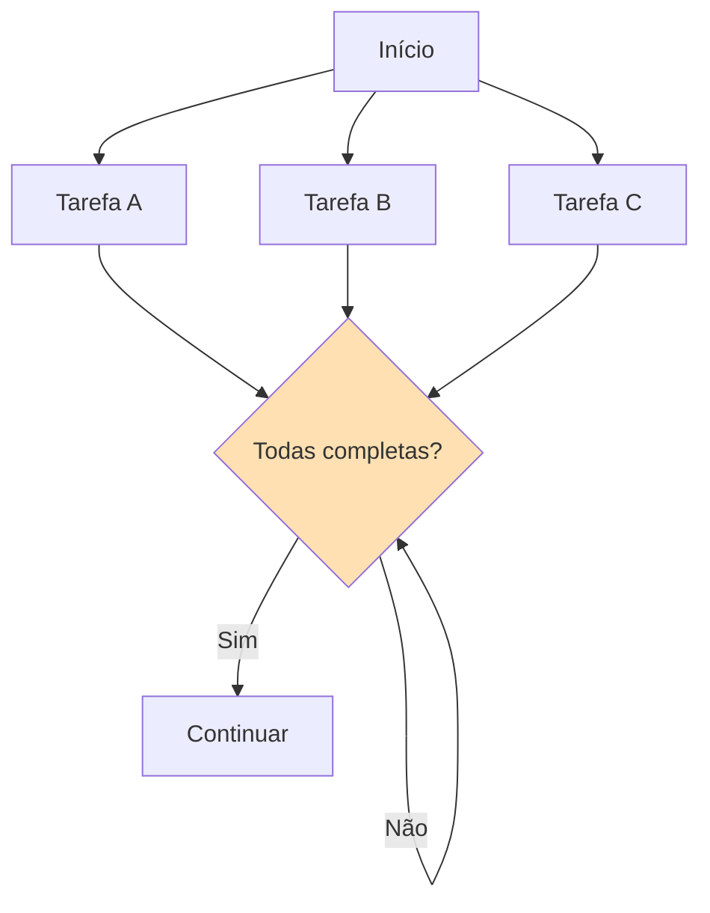
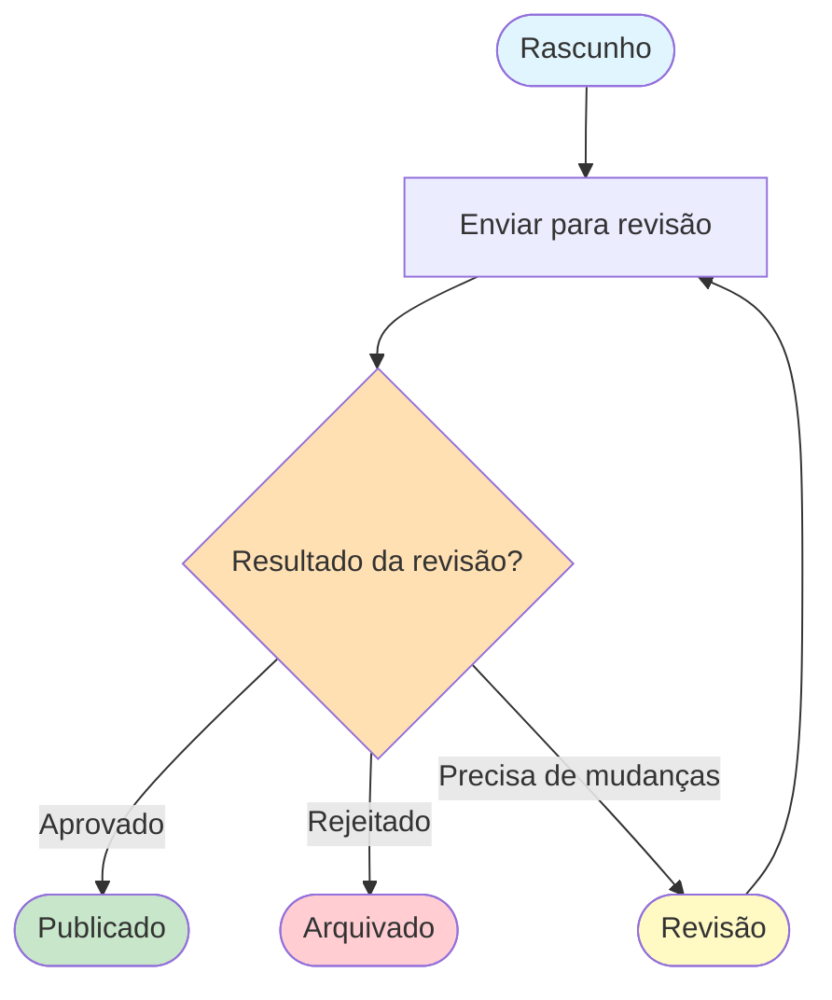

# Construindo Seus Primeiros Fluxogramas

Agora que você entende componentes de processos e símbolos de fluxogramas, é hora de colocar esse conhecimento em prática. Nesta lição, construiremos fluxogramas passo a passo, começando simples e gradualmente aumentando a complexidade.

## O Processo de Construção de Fluxogramas

Criar um fluxograma segue uma abordagem sistemática:



## Exemplo Passo a Passo 1: Processo de Login Simples

Vamos construir um fluxograma para um processo de login de usuário do zero.

### Passo 1: Definir o Escopo

**Processo:** Autenticação de usuário para uma aplicação web
**Início:** Usuário insere credenciais
**Fim:** Usuário está logado ou recebe um erro

### Passo 2: Listar as Etapas

1. Usuário insere e-mail e senha
2. Sistema valida formato da entrada
3. Sistema verifica credenciais no banco de dados
4. Se válidas, criar sessão
5. Se inválidas, mostrar mensagem de erro
6. Redirecionar para página apropriada

### Passo 3: Identificar Decisões

- O formato da entrada é válido?
- As credenciais correspondem?

### Passo 4: Construir o Fluxograma



> [!TIP] Construa Incrementalmente
> Comece com o "caminho feliz" (tudo dá certo), depois adicione tratamento de erros e casos extremos. Isso mantém seu fluxograma organizado.

## Exemplo Passo a Passo 2: Fluxo de Redefinição de Senha

Vamos construir um fluxograma um pouco mais complexo.

### Passo 1: Definir o Escopo

**Processo:** Redefinição de senha para uma aplicação web
**Início:** Usuário clica em "Esqueci minha senha"
**Fim:** Senha é redefinida ou processo é abandonado

### Passo 2: Listar as Etapas

1. Usuário clica em "Esqueci minha senha"
2. Usuário insere endereço de e-mail
3. Sistema valida se e-mail existe
4. Sistema gera token de redefinição
5. Sistema envia e-mail de redefinição
6. Usuário clica no link de redefinição
7. Sistema valida token
8. Usuário insere nova senha
9. Sistema valida força da senha
10. Sistema atualiza senha
11. Usuário faz login com nova senha

### Passo 3: Identificar Decisões

- O e-mail existe no sistema?
- O token de redefinição é válido e não expirou?
- A nova senha atende aos requisitos de força?

### Passo 4: Construir o Fluxograma

```mermaid
flowchart TD
    A([Esqueci senha clicado]) --> B[/Inserir endereço de e-mail/]
    B --> C[Verificar se e-mail existe]
    C --> D{E-mail encontrado?}
    D -->|Não| E[/Mostrar mensagem genérica/]
    D -->|Sim| F[Gerar token de redefinição]
    E --> G([Processo encerrado])
    F --> H[Enviar e-mail de redefinição]
    H --> I[[(Armazenar token)]]
    I --> J([Aguardar ação do usuário])
    
    J --> K[Usuário clica no link de redefinição]
    K --> L[Validar token]
    L --> M{Token válido e não expirado?}
    M -->|Não| N[/Mostrar mensagem de link expirado/]
    M -->|Sim| O[/Inserir nova senha/]
    N --> G
    O --> P[Validar força da senha]
    P --> Q{Atende requisitos?}
    Q -->|Não| R[/Mostrar requisitos de força/]
    Q -->|Sim| S[Atualizar senha]
    R --> O
    S --> T[Invalidar todas as sessões]
    T --> U[Enviar e-mail de confirmação]
    U --> V[[Confirmação de redefinição de senha]]
    V --> W([Redefinição de senha completa])
    
    style A fill:#4CAF50,color:#fff
    style W fill:#4CAF50,color:#fff
    style G fill:#F44336,color:#fff
    style D fill:#FFE0B2
    style M fill:#FFE0B2
    style Q fill:#FFE0B2
    style B fill:#E1F5FE
    style E fill:#E1F5FE
    style N fill:#E1F5FE
    style O fill:#E1F5FE
    style R fill:#E1F5FE
    style I fill:#F3E5F5
    style V fill:#FFF9C4
```

> [!NOTE] Nota de Segurança
> Observe que quando o e-mail não é encontrado, mostramos uma "mensagem genérica" em vez de "e-mail não encontrado". Esta é uma boa prática de segurança — não revele se um e-mail existe no seu sistema.

## Exemplo Passo a Passo 3: Processamento de Requisição API

Agora vamos construir um fluxograma técnico para processamento de requisições API.

### Passo 1: Definir o Escopo

**Processo:** Tratamento de uma requisição API recebida
**Início:** Requisição recebida pelo servidor
**Fim:** Resposta enviada ao cliente

### Passo 2: Listar as Etapas

1. Requisição recebida
2. Parse da requisição
3. Validar token de autenticação
4. Verificar autorização/permissões
5. Validar corpo da requisição
6. Processar a requisição
7. Formatar resposta
8. Enviar resposta

### Passo 3: Identificar Decisões

- O formato da requisição é válido?
- O token de autenticação é válido?
- O usuário tem permissão?
- O corpo da requisição é válido?
- O processamento foi bem-sucedido?

### Passo 4: Construir o Fluxograma



## Prática: Construa o Seu

### Exercício 1: Processo de Upload de Arquivo

Construa um fluxograma para um recurso de upload de arquivo com estes requisitos:
- Usuário seleciona um arquivo
- Sistema valida tipo de arquivo (apenas imagens permitidas)
- Sistema valida tamanho do arquivo (máximo 5MB)
- Sistema faz upload para armazenamento em nuvem
- Sistema gera uma miniatura
- Sistema salva metadados no banco de dados
- Usuário recebe uma mensagem de sucesso ou erro

### Exercício 2: Processo de Carrinho de Compras

Construa um fluxograma para adicionar um item a um carrinho de compras:
- Usuário navega no catálogo de produtos
- Usuário seleciona um produto
- Sistema verifica disponibilidade do produto
- Usuário seleciona quantidade
- Sistema verifica se a quantidade está disponível
- Sistema adiciona ao carrinho
- Sistema atualiza total do carrinho
- Usuário pode continuar comprando ou prosseguir para checkout

### Exercício 3: Processo de Revisão de Código

Construa um fluxograma para um fluxo de trabalho de revisão de código:
- Desenvolvedor cria um pull request
- Verificações automatizadas rodam (linting, testes)
- Se verificações falham, desenvolvedor corrige problemas
- Se verificações passam, revisor é atribuído
- Revisor examina o código
- Revisor aprova ou solicita mudanças
- Se mudanças solicitadas, desenvolvedor atualiza PR
- Se aprovado, código é merged
- Notificação é enviada à equipe

<details>
<summary>Clique para ver um fluxograma de revisão de código de exemplo</summary>



</details>

## Padrões Comuns de Fluxogramas

### Padrão 1: Loop de Validação



### Padrão 2: Tentativa com Limite



### Padrão 3: Processamento Paralelo



### Padrão 4: Máquina de Estado



## Ferramentas para Construir Fluxogramas

| Ferramenta | Tipo | Melhor Para |
|---|---|---|
| **Mermaid** | Baseado em código | Documentação, controle de versão |
| **Draw.io** | Editor visual | Diagramas rápidos, colaboração |
| **Lucidchart** | Editor visual | Colaboração em equipe, templates |
| **PlantUML** | Baseado em código | Diagramas técnicos |
| **Excalidraw** | Quadro branco | Brainstorming, diagramas informais |

> [!TIP] Comece com Mermaid
> Como o Mermaid é baseado em código, seus fluxogramas podem ser versionados, revisados em pull requests e renderizados automaticamente em arquivos Markdown. Isso o torna ideal para documentação.

## Principais Conclusões

- Siga uma **abordagem sistemática**: defina escopo → liste etapas → identifique decisões → desenhe → revise
- Construa o **caminho feliz primeiro**, depois adicione tratamento de erros
- Use **padrões comuns** como loops de validação, lógica de retry e processamento paralelo
- **Revise seu fluxograma** contra o processo real para garantir precisão
- **Mermaid** é uma ferramenta excelente para criar fluxogramas versionados
- A prática leva à perfeição — quanto mais fluxogramas você construir, melhor ficará

> [!SUCCESS] Você Completou a Lição 5
> Agora você sabe como construir fluxogramas do zero. Na lição final deste curso, vamos explorar **otimização de processos** — como usar fluxogramas para identificar gargalos e melhorar processos.
