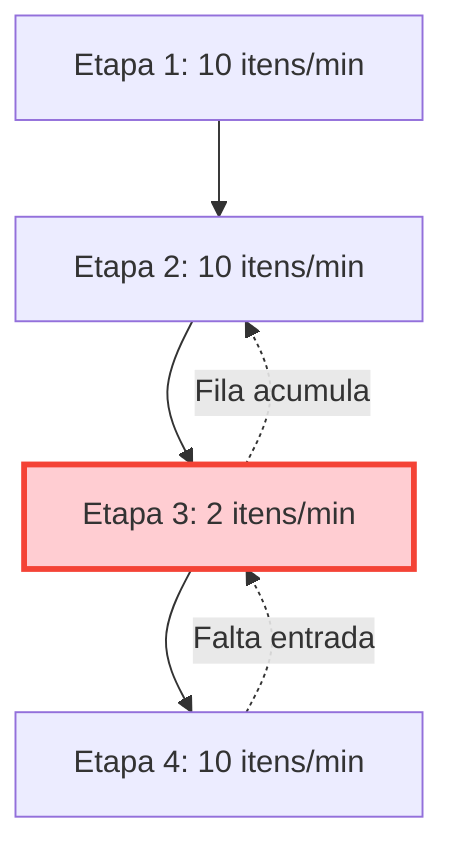
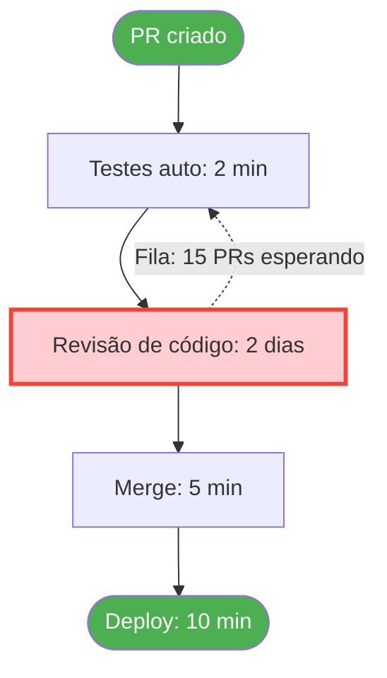
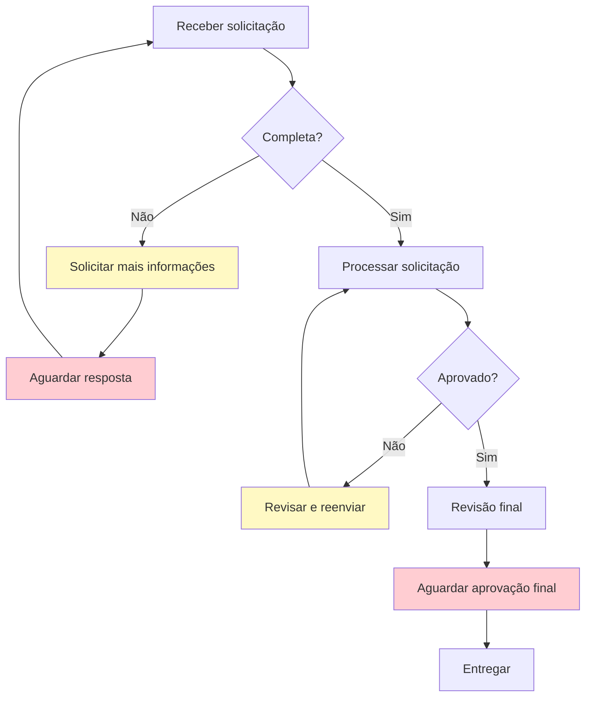
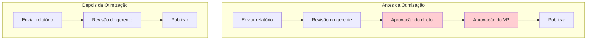
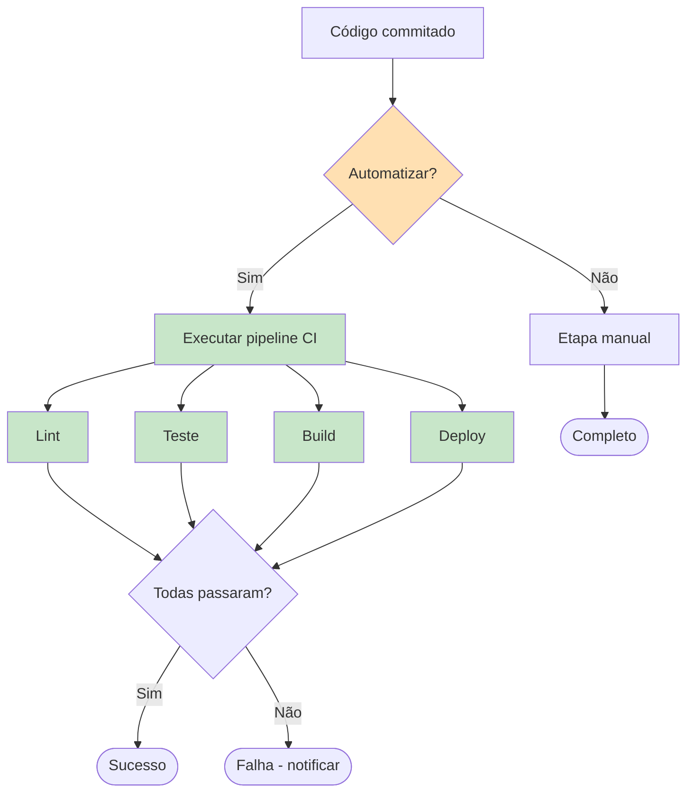
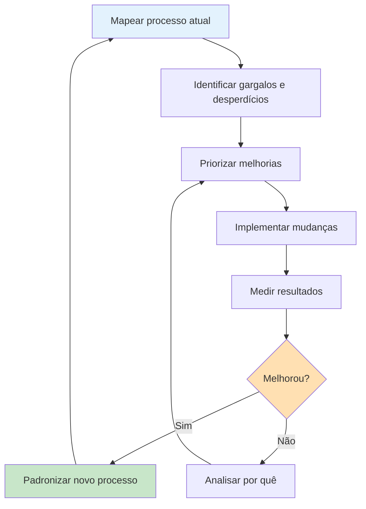
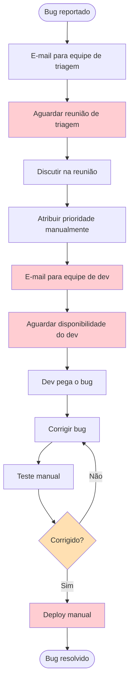
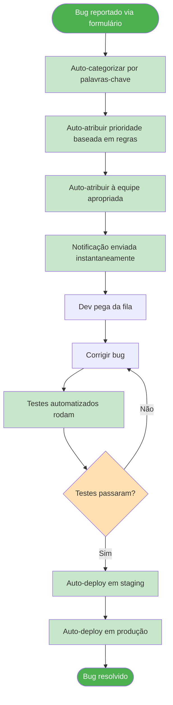

# Otimização de Processos

Fluxogramas não servem apenas para documentar processos — são ferramentas poderosas para melhorá-los. Nesta lição final, aprenderemos como usar fluxogramas para identificar gargalos, eliminar desperdícios e otimizar processos para melhor eficiência e qualidade.

## Por Que Otimizar Processos?

A otimização de processos entrega benefícios tangíveis:

| Benefício | Impacto | Exemplo |
|---|---|---|
| **Velocidade** | Entrega mais rápida | Reduzir processamento de pedidos de 2 dias para 2 horas |
| **Qualidade** | Menos erros | Reduzir taxa de bugs em 40% com melhor processo de revisão |
| **Custo** | Menores despesas | Eliminar etapas de aprovação redundantes |
| **Escalabilidade** | Lidar com mais volume | Automatizar etapas manuais para lidar com 10x mais carga |
| **Satisfação** | Usuários mais felizes | Reduzir tempo de espera do cliente de 30 min para 5 min |

## Identificando Gargalos

Um **gargalo** é uma etapa em um processo que limita o throughput geral. É o ponto mais estreito por onde tudo precisa passar.

### A Analogia do Gargalo

```
┌──────────┐     ┌──────────┐     ┌──────┐     ┌──────────┐
│  Etapa 1 │────►│  Etapa 2 │────►│Etapa │────►│  Etapa 4 │
│  Rápida  │     │  Rápida  │     │  3   │     │  Rápida  │
│  10/s    │     │  10/s    │     │LENTA │     │  10/s    │
└──────────┘     └──────────┘     │ 1/s  │     └──────────┘
                                  └──────┘
                                    ▲
                              ESTE É O GARGALO
                Throughput geral: 1 item/segundo
```

### Identificando Gargalos em Fluxogramas

Procure por estes indicadores visuais:



> [!TIP] O Teste da Fila
> Onde o trabalho acumula esperando para ser processado, você encontrou um gargalo. Procure por filas, backlogs ou estados de espera no seu fluxograma.

### Exemplo Real de Gargalo: Revisão de Código



**Análise:** A etapa de revisão de código leva 2 dias enquanto outras etapas levam minutos. Este é o gargalo.

**Soluções:**
- Adicionar mais revisores
- Definir SLA para tempo de revisão
- Implementar revisão automatizada para mudanças simples
- Dividir PRs grandes em menores

## Tipos de Desperdício em Processos

A metodologia Lean identifica sete tipos de desperdício (TIMWOOD):

| Tipo de Desperdício | Descrição | Exemplo em Software |
|---|---|---|
| **T**ransporte | Mover itens desnecessariamente | Passar trabalho entre equipes |
| **I**nventário | Excesso de trabalho em progresso | Muitos PRs abertos |
| **M**ovimento | Movimento desnecessário | Procurar por informações |
| **E**spera (Waiting) | Tempo ocioso entre etapas | Esperando por aprovações |
| **S**obreprocessamento | Fazer mais do que necessário | Superengenharia de soluções |
| **S**obreprodução | Fazer mais do que necessário | Construir recursos não usados |
| **D**efeitos | Erros que exigem retrabalho | Bugs encontrados em produção |

### Visualizando Desperdício em um Fluxograma



**Desperdícios identificados:**
- `C` → Sobreprocessamento (solicitações repetidas)
- `D` → Espera (tempo ocioso)
- `G` → Defeitos (retrabalho)
- `I` → Espera (atraso na aprovação)

## Técnicas de Otimização

### 1. Eliminar Etapas Desnecessárias

Questione cada etapa: "O que acontece se pularmos esta?"



### 2. Paralelizar Etapas Independentes

Etapas que não dependem umas das outras podem rodar simultaneamente.

```mermaid
flowchart TD
    subgraph Sequencial (Antes)
        A1[Escrever código] --> B1[Escrever testes]
        B1 --> C1[Escrever docs]
        C1 --> D1[Enviar PR]
    end
    
    subgraph Paralelo (Depois)
        A2[Escrever código] --> D2[Enviar PR]
        B2[Escrever testes] -.-> D2
        C2[Escrever docs] -.-> D2
    end
    
    style A1 fill:#BBDEFB
    style B1 fill:#BBDEFB
    style C1 fill:#BBDEFB
    style A2 fill:#C8E6C9
    style B2 fill:#C8E6C9
    style C2 fill:#C8E6C9
```

### 3. Automatizar Etapas Repetitivas

Identifique etapas que são manuais, repetitivas e baseadas em regras.

| Etapa | Tempo Manual | Tempo Automatizado | Economia |
|---|---|---|---|
| Formatação de código | 5 min | 10 seg | 97% |
| Execução de testes | 30 min | 5 min | 83% |
| Deploy | 45 min | 2 min | 96% |
| Análise de logs | 60 min | 1 min | 98% |



### 4. Simplificar Pontos de Decisão

Decisões complexas retardam processos. Simplifique:
- Definindo critérios claros desde o início
- Usando checklists
- Automatizando decisões simples
- Escalando apenas casos verdadeiramente complexos

```mermaid
flowchart TD
    subgraph Decisão Complexa (Antes)
        A1[Receber solicitação] --> B1{Analisar tipo}
        B1 -->|Tipo A| C1{Verificar prioridade}
        B1 -->|Tipo B| D1{Verificar urgência}
        B1 -->|Tipo C| E1{Verificar orçamento}
        C1 -->|Alta| F1[Encaminhar para equipe A]
        C1 -->|Baixa| G1[Encaminhar para equipe B]
        D1 -->|Urgente| F1
        D1 -->|Normal| G1
        E1 -->|Aprovado| F1
        E1 -->|Negado| H1[Rejeitar]
    end
    
    subgraph Decisão Simplificada (Depois)
        A2[Receber solicitação] --> B2{Pontuação de prioridade}
        B2 -->|Pontuação > 7| C2[Via rápida]
        B2 -->|Pontuação ≤ 7| D2[Via padrão]
    end
    
    style B1 fill:#FFCDD2
    style C1 fill:#FFCDD2
    style D1 fill:#FFCDD2
    style E1 fill:#FFCDD2
    style B2 fill:#C8E6C9
```

## O Ciclo de Otimização

Otimização de processos não é uma atividade única — é um ciclo contínuo:



## Antes e Depois: Exemplo Real de Otimização

### Antes: Processo Manual de Triagem de Bugs



**Problemas:** Múltiplos pontos de espera, etapas manuais, comunicação por e-mail, sem automação.

### Depois: Processo Automatizado de Triagem de Bugs



**Melhorias:**
- Eliminados 4 pontos de espera
- Automatizadas 6 etapas manuais
- Tempo de resolução reduzido de dias para horas
- Adicionados testes e deploy automatizados

## Boas Práticas para Otimização de Processos

| Prática | Descrição |
|---|---|
| **Comece com dados** | Meça o desempenho atual antes de otimizar |
| **Foque nos gargalos** | Melhorar etapas que não são gargalos não ajuda o throughput geral |
| **Envolva a equipe** | Quem faz o trabalho conhece melhor os problemas |
| **Itere** | Faça pequenas mudanças, meça, depois ajuste |
| **Documente mudanças** | Mantenha fluxogramas atualizados conforme processos evoluem |
| **Defina métricas** | Defina o que "melhor" significa com metas mensuráveis |
| **Celebre vitórias** | Reconheça melhorias para manter o impulso |

> [!WARNING] Armadilha da Otimização
> Não otimize um processo que não deveria existir. Antes de otimizar, pergunte: "Deveríamos estar fazendo isso?" O melhor processo às vezes é nenhum processo.

## Métricas Principais para Acompanhar

| Métrica | O Que Mede | Como Calcular |
|---|---|---|
| **Tempo de Ciclo** | Tempo total do início ao fim | Tempo final - Tempo inicial |
| **Throughput** | Itens processados por unidade de tempo | Contagem / Período |
| **Taxa de Erro** | Porcentagem de itens com defeitos | Erros / Total de itens × 100 |
| **Tempo de Espera** | Tempo gasto esperando entre etapas | Soma de todos os períodos de espera |
| **Tempo de Toque** | Tempo realmente gasto trabalhando | Tempo total - Tempo de espera |
| **Eficiência** | Razão entre tempo de toque e tempo de ciclo | Tempo de toque / Tempo de ciclo × 100 |

## Exercícios Práticos

### Exercício 1: Encontre o Gargalo

Analise este processo e identifique o gargalo:

```
Pedido do cliente → Validar (1 min) → Verificar estoque (2 min) → 
Aprovação do gerente (4 horas) → Empacotar pedido (5 min) → Enviar (1 dia)
```

Qual é o gargalo? O que você faria para melhorá-lo?

<details>
<summary>Clique para ver a análise</summary>

**Gargalo:** Aprovação do gerente (4 horas) — todas as outras etapas levam minutos.

**Sugestões de melhoria:**
- Definir limites de aprovação (exigir aprovação do gerente apenas para pedidos acima de R$X)
- Implementar auto-aprovação para pedidos padrão
- Adicionar mais aprovadores para distribuir a carga
- Criar listas de produtos pré-aprovados

</details>

### Exercício 2: Otimize um Processo

Pegue o "Processo de Upload de Arquivo" da Lição 5 e identifique:
1. Gargalos potenciais
2. Tipos de desperdício (TIMWOOD)
3. Etapas que poderiam ser automatizadas
4. Etapas que poderiam ser paralelizadas

### Exercício 3: Meça a Melhoria

Um processo atualmente leva 10 horas com 30% de taxa de erro. Após otimização, leva 4 horas com 10% de taxa de erro. Calcule:

1. Porcentagem de melhoria de tempo
2. Porcentagem de melhoria na taxa de erro
3. Se este processo roda 100 vezes por semana, quantas horas são economizadas por semana?

<details>
<summary>Clique para ver os cálculos</summary>

1. **Melhoria de tempo:** (10 - 4) / 10 × 100 = **60% mais rápido**
2. **Melhoria na taxa de erro:** (30 - 10) / 30 × 100 = **67% menos erros**
3. **Horas economizadas por semana:** 100 × (10 - 4) = **600 horas economizadas por semana**

</details>

## Resumo do Curso

Parabéns por completar o curso "Processos & Fluxogramas"! Aqui está o que você aprendeu:

| Lição | Principal Conclusão |
|---|---|
| **1. O Que São Processos?** | Processos são sequências repetíveis que transformam entradas em saídas |
| **2. Componentes de Processos** | Todo processo tem entradas, transformações, saídas, decisões e atores |
| **3. Intro aos Fluxogramas** | Fluxogramas comunicam visualmente processos usando símbolos padronizados |
| **4. Símbolos de Fluxogramas** | Domine o conjunto básico: terminais, processos, decisões, E/S e mais |
| **5. Construindo Fluxogramas** | Siga uma abordagem sistemática: escopo → etapas → decisões → desenhe → revise |
| **6. Otimização de Processos** | Use fluxogramas para identificar gargalos, eliminar desperdícios e melhorar eficiência |

> [!SUCCESS] Curso Completo!
> Agora você tem as habilidades fundamentais para documentar, analisar e otimizar qualquer processo usando fluxogramas. Continue praticando, e logo o pensamento processual se tornará segunda natureza.

## Próximos Passos

Continue sua jornada de aprendizado:
- Pratique criar fluxogramas para processos que você encontra no dia a dia
- Explore tópicos avançados como BPMN (Business Process Model and Notation)
- Aprenda sobre ferramentas de automação de processos (Zapier, n8n, GitHub Actions)
- Estude metodologias Lean e Six Sigma para técnicas de otimização mais profundas
