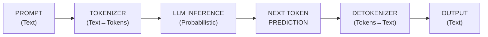
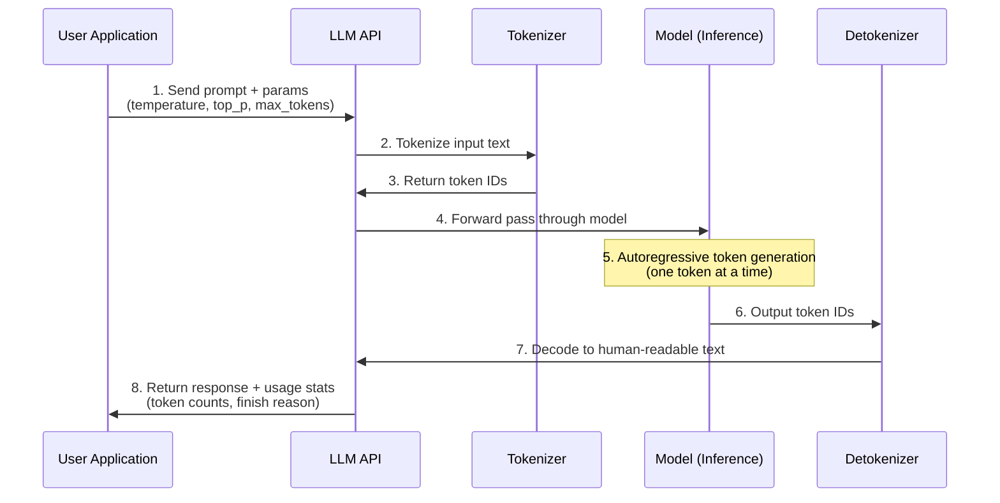
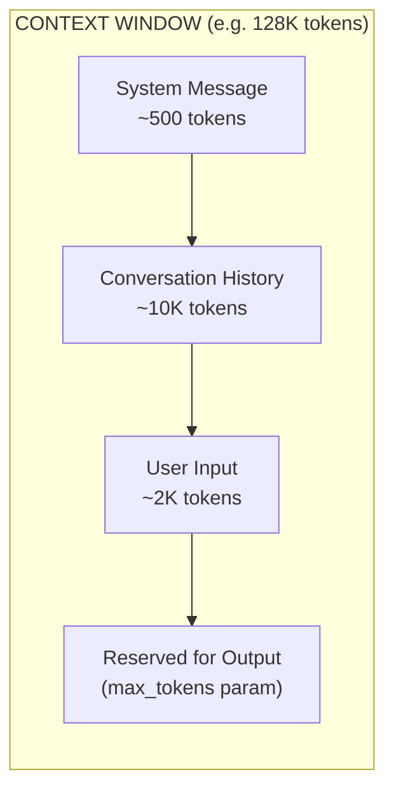
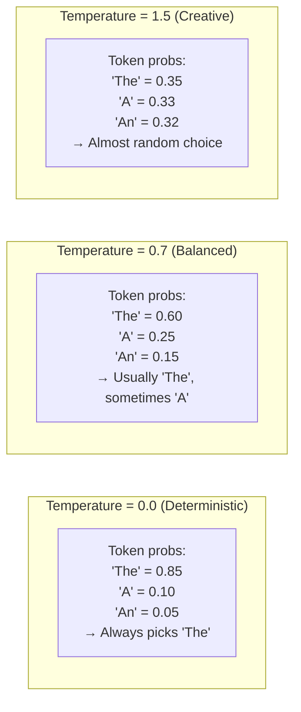
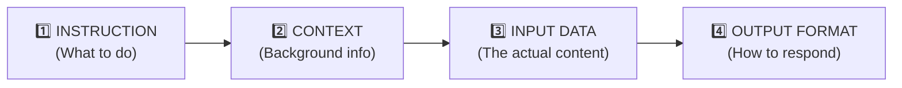

# Fundamentals of Prompt Engineering

## What is a Prompt?

A prompt is the input you provide to an LLM to elicit a specific response. It's the fundamental unit of interaction with modern AI models like GPT-4, Claude, and Llama. The quality of your prompt directly determines the quality of the model's output — garbage in, garbage out remains as true for AI as for traditional software.

### The LLM Input/Output Flow



### Full API Call Lifecycle



[!NOTE]
Each API call travels through multiple stages: tokenization converts your text to numbers the model understands, inference generates tokens probabilistically, and detokenization converts results back to text. Understanding this pipeline helps you debug issues like token limits or unexpected output.

---

## Tokenization

Tokenization is the process of breaking text into smaller units (tokens) that the model can understand. Different models use different tokenization algorithms — GPT-4 uses Byte-Pair Encoding (BPE), while other models may use SentencePiece or WordPiece.

### Token Facts:
- 1 token ≈ 4 characters in English
- 100 tokens ≈ 75 words
- Different models have different tokenizers
- Special tokens (like `<|endoftext|>`) also count toward your limit

### Tokenizer Comparison Across Models

| Model | Tokenizer Type | Vocabulary Size | Approx Tokens per Word (English) | Special Features |
|-------|---------------|-----------------|----------------------------------|------------------|
| **GPT-4 / GPT-3.5** | BPE (Byte-Pair Encoding) | ~100K | 1.3 | OpenAI tiktoken, handles code well |
| **Claude (Anthropic)** | BPE (Byte-Pair Encoding) | ~100K | 1.3 | Efficient for multilingual text |
| **Llama 2/3** | BPE (SentencePiece) | ~32K | 1.4 | Smaller vocab, good for memory-constrained |
| **Gemini (Google)** | SentencePiece | ~256K | 1.2 | Largest vocabulary, efficient for CJK |

```python
# Example: Tokenization with OpenAI's tiktoken
import tiktoken

# Load the tokenizer for GPT-4
encoding = tiktoken.encoding_for_model("gpt-4")

text = "Hello, how are you?"
tokens = encoding.encode(text)

print(f"Original text: {text}")
print(f"Tokens: {tokens}")
print(f"Token count: {len(tokens)}")

# Decode back to text
decoded = encoding.decode(tokens)
print(f"Decoded: {decoded}")
```

[!TIP]
Always estimate token usage before sending large prompts. A 1000-token prompt vs. response costs roughly $0.01-0.03 with GPT-4, but costs add up quickly in production. Use `tiktoken` or your model's tokenizer to count tokens client-side before the API call.

### Context Window Limits



[!IMPORTANT]
Each model has a **context window** (GPT-4: 8K-128K, Claude 3: 200K, Gemini: 32K-1M). The sum of your system message + conversation history + user input + generated output **must fit** within this window. Once exceeded, the model truncates older messages — potentially losing important context.

---

## System vs User vs Assistant Roles

LLMs use a conversation history with three distinct roles:

| Role | Purpose | Example Usage |
|------|---------|---------------|
| **System** | Sets behavior, personality, and context for the entire conversation | "You are a helpful Python tutor. Be concise and use code examples." |
| **User** | Represents the human's input or question | "How do I sort a list in Python?" |
| **Assistant** | Represents the AI's previous responses in the conversation history | "You can use the sorted() function or .sort() method..." |

[!NOTE]
The system message is particularly powerful—it persists throughout the conversation and guides how the model responds to all subsequent messages.

[!IMPORTANT]
**System prompt best practices:** Be specific about the model's persona, output format, and constraints. Include guardrails like "If you don't know the answer, say so." Avoid vague instructions like "be helpful" — instead, describe what helpful looks like in your context.

```python
from openai import OpenAI

client = OpenAI()

response = client.chat.completions.create(
    model="gpt-4",
    messages=[
        # System role: Sets the AI's persona
        {"role": "system", "content": "You are a concise math tutor. Explain concepts simply."},
        # User role: The actual question
        {"role": "user", "content": "What is the Pythagorean theorem?"}
    ]
)

# Assistant role: The response
assistant_reply = response.choices[0].message.content
print(assistant_reply)
```

### Cross-Provider Role Examples

```python
# Anthropic Claude API
import anthropic

client = anthropic.Anthropic()

response = client.messages.create(
    model="claude-3-opus-20240229",
    system="You are a concise math tutor. Explain concepts simply.",  # System prompt as separate param
    messages=[
        {"role": "user", "content": "What is the Pythagorean theorem?"}
    ]
)
print(response.content[0].text)
```

```python
# Google Gemini API
import google.generativeai as genai

genai.configure(api_key="YOUR_API_KEY")
model = genai.GenerativeModel(
    model_name="gemini-1.5-pro",
    system_instruction="You are a concise math tutor. Explain concepts simply."
)
response = model.generate_content("What is the Pythagorean theorem?")
print(response.text)
```

---

## Temperature and Top_p

These parameters control the randomness and creativity of the output:

| Parameter | Range | Purpose | Typical Values |
|-----------|-------|---------|----------------|
| **Temperature** | 0-2 | Controls randomness. Lower = more deterministic. | 0.0 (deterministic), 0.7 (balanced), 1.5 (creative) |
| **Top_p** | 0-1 | Nucleus sampling. Only consider tokens with cumulative probability mass. | 0.1 (focused), 0.9 (diverse) |

### How Temperature Actually Works

At temperature 0, the model always picks the highest-probability token (greedy decoding). As temperature increases, lower-probability tokens become more likely to be chosen, producing more varied and creative outputs.



[!TIP]
**Choosing temperature values:** For factual tasks (classification, extraction, Q&A), use 0.0-0.3. For creative tasks (story writing, brainstorming), use 0.7-1.2. Avoid temperatures above 1.5 unless you want near-random output — the "creative" output quickly becomes incoherent.

[!WARNING]
Setting temperature > 1.0 or top_p > 0.9 can lead to incoherent or hallucinated responses. For factual tasks, use temperature 0.0-0.5.

```python
from openai import OpenAI

client = OpenAI()

# Creative writing - high temperature
creative_response = client.chat.completions.create(
    model="gpt-4",
    messages=[{"role": "user", "content": "Write a one-sentence story about a robot"}],
    temperature=1.8,  # Very creative
    top_p=0.95
)
print("Creative:", creative_response.choices[0].message.content)

# Factual answer - low temperature
factual_response = client.chat.completions.create(
    model="gpt-4",
    messages=[{"role": "user", "content": "What is the boiling point of water at sea level?"}],
    temperature=0.0,  # Deterministic
    top_p=0.1
)
print("Factual:", factual_response.choices[0].message.content)
```

### Temperature and Top_p Interaction

| Scenario | Temperature | Top_p | Effect |
|----------|-------------|-------|--------|
| **Strict factual** | 0.0 | 1.0 | Model takes no risks, deterministic |
| **Creative writing** | 1.0 | 0.95 | Broad token selection, high creativity |
| **Focused creative** | 0.8 | 0.5 | Creative but stays within likely tokens |
| **Code generation** | 0.2 | 0.9 | Mostly deterministic, slight variation |
| **Brainstorming** | 1.2 | 0.95 | High variety, many alternatives |

[!NOTE]
Most APIs recommend adjusting only one parameter. If you set both, temperature first softens the probability distribution, then top_p cuts off the tail. Setting both to extreme values simultaneously can produce very strange results.

---

## Zero-Shot Prompting

Zero-shot prompting is when you ask the model to perform a task without any examples.

```
Classify this email as "important", "spam", or "neutral":

"URGENT: Your bank account has been compromised. Click here to verify."
```

### Basic Prompt Structure Template



### When Zero-Shot Works Best

| Task Type | Zero-Shot Performance | Notes |
|-----------|----------------------|-------|
| Common classification | Good | Models know common categories intrinsically |
| Simple Q&A | Excellent | Factual knowledge from training data |
| Translation | Variable | Depends on language pair and model training |
| Highly specialized tasks | Poor | Needs examples or fine-tuning |
| Novel formats | Poor | Models need examples of new output structures |

[!NOTE]
Zero-shot works surprisingly well for tasks the model encountered during training. It struggles with edge cases, highly specialized domains, or precise format requirements — that's where few-shot and advanced techniques come in.

---

## Practice Questions

```question
{
  "id": "pe-01-q1",
  "type": "multiple-choice",
  "question": "A software engineer wants to use an LLM for a customer support chatbot. Which conversation role should be used to define the chatbot's personality and behavior guidelines?",
  "options": ["User role", "System role", "Assistant role", "Tokenizer role"],
  "correct": 1,
  "explanation": "The system role sets the AI's persona and behavior guidelines for the entire conversation."
}
```

```question
{
  "id": "pe-01-q2",
  "type": "multiple-choice",
  "question": "When tokenizing the sentence \"Hello, how are you?\" using OpenAI's tiktoken, what happens during the tokenization process?",
  "options": ["The text is encrypted for security", "The text is broken into numerical tokens the model can process", "The text is translated into multiple languages", "The text is compressed to reduce storage size"],
  "correct": 1,
  "explanation": "Tokenization breaks text into numerical tokens (integers) that the model can process."
}
```

```question
{
  "id": "pe-01-q3",
  "type": "multiple-choice",
  "question": "A developer is building a medical diagnosis assistant and needs the model to give consistent, factual answers. Which temperature setting should they use?",
  "options": ["1.5", "1.0", "0.7", "0.0"],
  "correct": 3,
  "explanation": "Temperature 0.0 makes the model deterministic and factual, ideal for medical diagnosis."
}
```

```question
{
  "id": "pe-01-q4",
  "type": "multiple-choice",
  "question": "A prompt engineer needs the model to classify emails without providing any examples in the prompt. Which approach is being used?",
  "options": ["Few-shot prompting", "Zero-shot prompting", "Multi-shot prompting", "Chain-of-thought prompting"],
  "correct": 1,
  "explanation": "Zero-shot prompting asks the model to perform a task without providing any examples."
}
```

```question
{
  "id": "pe-01-q5",
  "type": "multiple-choice",
  "question": "What does the top_p parameter (nucleus sampling) control when generating LLM responses?",
  "options": ["The maximum number of tokens in the output", "The cumulative probability mass used to select tokens", "The priority level of system messages", "The temperature scaling factor"],
  "correct": 1,
  "explanation": "Top_p (nucleus sampling) limits token selection to those with cumulative probability mass up to the specified value."
}
```

```question
{
  "id": "pe-01-q6",
  "type": "multiple-choice",
  "question": "A team building a multilingual chatbot needs a model that handles Japanese, Korean, and Chinese efficiently. Based on the tokenizer comparison, which model's tokenizer is most efficient for CJK languages?",
  "options": ["GPT-4 (BPE, ~100K vocab)", "Claude (BPE, ~100K vocab)", "Gemini (SentencePiece, ~256K vocab)", "Llama 2 (BPE, ~32K vocab)"],
  "correct": 2,
  "explanation": "Gemini's SentencePiece tokenizer has the largest vocabulary (~256K), making it most efficient for CJK languages where individual characters each become tokens."
}
```

```question
{
  "id": "pe-01-q7",
  "type": "multiple-choice",
  "question": "A prompt engineer sends a 150K-token document to a model with a 128K context window and sets max_tokens to 4000. What will happen?",
  "options": ["The model will process all 150K tokens and generate 4000 output tokens", "The model will truncate the input, losing older content to fit within 128K minus 4000 reserved for output", "The API will automatically upgrade to a larger model", "The model will summarize the document first, then process it"],
  "correct": 1,
  "explanation": "The total tokens (input + reserved output) must fit within the context window. The model will truncate the beginning of the input to make room."
}
```

```question
{
  "id": "pe-01-q8",
  "type": "multiple-choice",
  "question": "Using temperature=0.8 with top_p=0.5 together produces what kind of behavior?",
  "options": ["Highly random, incoherent output", "Creative but constrained to a focused subset of high-probability tokens", "Completely deterministic, identical output every time", "The model refuses to generate any output"],
  "correct": 1,
  "explanation": "Temperature=0.8 introduces creativity, but top_p=0.5 restricts token selection to a narrow cumulative probability mass, resulting in creative choices within a focused set of plausible tokens."
}
```

```question
{
  "id": "pe-01-q9",
  "type": "multiple-choice",
  "question": "A developer notices their GPT-4 API call returned 150 tokens in the response but they set max_tokens to 500. The finish_reason was 'stop'. What does this mean?",
  "options": ["The API capped the response at 150 tokens due to rate limits", "The model decided it had completed its response after 150 tokens and stopped naturally", "There was an error in the token counting", "The model ran out of tokens and stopped mid-response"],
  "correct": 1,
  "explanation": "max_tokens is an upper bound, not a target. The model stops when it generates a stop token (indicating completion), regardless of the max_tokens limit."
}
```

```question
{
  "id": "pe-01-q10",
  "type": "multiple-choice",
  "question": "A prompt engineer is comparing a Llama 2 model (32K vocab) with a GPT-4 model (100K vocab) for a code generation task. What trade-off should they consider?",
  "options": ["Llama 2 uses fewer tokens per word of code, reducing costs", "Llama 2's smaller vocabulary may use more tokens for code, but requires less memory", "GPT-4 cannot process code at all", "There is no difference — all tokenizers perform identically on code"],
  "correct": 1,
  "explanation": "A smaller vocabulary means more tokens are needed to represent the same text, potentially increasing inference time. However, smaller vocabularies mean smaller embedding tables, reducing memory requirements."
}
```

---

[!SUCCESS]
**Key Takeaways:**

- A prompt is the input to an LLM, and tokenization converts text to model-readable tokens
- The three conversation roles are: system (persona), user (human input), assistant (AI responses)
- Temperature (0-2) controls randomness; lower values = more deterministic outputs
- Top_p (0-1) performs nucleus sampling, limiting token selection probability
- Zero-shot prompting works without examples; good basic structure = Instruction + Context + Input + Output Format
- Context window limits constrain total tokens; always estimate before sending large inputs
- Different providers (OpenAI, Anthropic, Google) have similar API patterns but different client libraries
