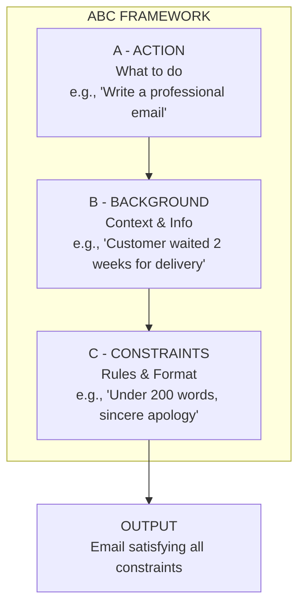
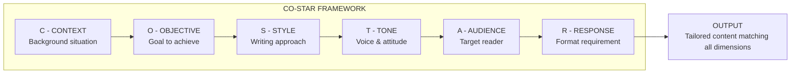
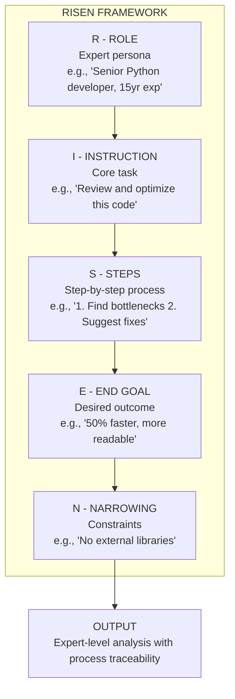

# Prompt Frameworks: ABC, CO-STAR, RISEN

## Why Use Frameworks?

Prompt frameworks provide structured templates that consistently produce high-quality outputs from LLMs. They eliminate guesswork and help ensure your prompts are complete, clear, and effective. Without a framework, prompts tend to be vague, miss critical context, or produce unpredictable results.

### The Problem with Unstructured Prompts

| Issue | Unstructured Prompt | Framework-Based Prompt |
|-------|---------------------|----------------------|
| Missing context | "Write an email" | Specifies sender, recipient, situation, and desired outcome |
| Vague instructions | "Make it good" | Defines tone, style, length, and specific requirements |
| Inconsistent output | Varies wildly between runs | Predictable format and quality |
| Hard to debug | No clear components to isolate issues | Each component can be tested separately |

---

## ABC Framework

**ABC** stands for **A**ction, **B**ackground, **C**onstraints.

| Component | Purpose | Example |
|-----------|---------|---------|
| **A - Action** | What the model should do | "Write a product description" |
| **B - Background** | Context and information | "For a waterproof hiking boot" |
| **C - Constraints** | Rules and format | "150 words, friendly tone, highlight durability" |

### ABC Framework Flowchart



### ABC Framework Example

```
[ACTION] Write a professional email response to a customer complaint.

[BACKGROUND] The customer waited 2 weeks for delivery that was promised in 3 days.
They're frustrated but haven't asked for a refund yet. Your company is "QuickShip Inc."

[CONSTRAINTS] 
- Keep it under 200 words
- Apologize sincerely (no excuses)
- Offer a 20% discount on their next order
- Provide a tracking update
- Sign as "Customer Support Team"
```

[!TIP]
ABC is ideal for tasks that have clear instructions but don't require complex role-playing. It's the fastest framework to write — perfect for quick classification, simple content generation, or straightforward email drafting.

### ABC in Code

```python
# ABC framework applied via API
from openai import OpenAI

client = OpenAI()

def abc_prompt(action: str, background: str, constraints: list[str]) -> str:
    """Build an ABC-format prompt"""
    constraint_text = "\n".join(f"- {c}" for c in constraints)
    return f"""[ACTION] {action}

[BACKGROUND] {background}

[CONSTRAINTS] 
{constraint_text}"""

prompt = abc_prompt(
    action="Write a professional email response to a customer complaint.",
    background="The customer waited 2 weeks for delivery that was promised in 3 days.",
    constraints=[
        "Keep it under 200 words",
        "Apologize sincerely (no excuses)",
        "Offer a 20% discount on their next order",
    ]
)

response = client.chat.completions.create(
    model="gpt-4",
    messages=[{"role": "user", "content": prompt}]
)
print(response.choices[0].message.content)
```

---

## CO-STAR Framework

**CO-STAR** stands for **C**ontext, **O**bjective, **S**tyle, **T**one, **A**udience, **R**esponse.

| Component | Purpose | Example |
|-----------|---------|---------|
| **C - Context** | Background situation | "You're a marketing consultant" |
| **O - Objective** | The goal to achieve | "Increase social media engagement" |
| **S - Style** | Writing style | "Bullet points, actionable items" |
| **T - Tone** | Voice/attitude | "Energetic, encouraging" |
| **A - Audience** | Who's reading | "Small business owners new to social media" |
| **R - Response** | Format requirement | "5 tips, each with a 'why it works' explanation" |

### CO-STAR Framework Flowchart



### CO-STAR Framework Example

```
[CONTEXT] You are an experienced nutritionist helping busy professionals eat healthier.

[OBJECTIVE] Create a 5-day simple meal plan that requires less than 30 minutes prep per day.

[STYLE] Structured table format with columns: Meal, Ingredients, Quick Tip.

[TONE] Encouraging, practical, non-judgmental.

[AUDIENCE] Software developers working 60+ hour weeks who order takeout 5+ times per week.

[RESPONSE] Include a breakfast, lunch, and dinner option for each day. Add one "emergency snack" section at the end.
```

[!NOTE]
CO-STAR excels when **tone and style matter as much as the content itself**. Marketing copy, executive communications, and user-facing content benefit enormously from specifying all six dimensions separately.

---

## RISEN Framework

**RISEN** stands for **R**ole, **I**nstruction, **S**teps, **E**nd goal, **N**arrowing.

| Component | Purpose | Example |
|-----------|---------|---------|
| **R - Role** | Who the AI should be | "Senior Python developer with 15 years experience" |
| **I - Instruction** | What to do | "Review and optimize this code" |
| **S - Steps** | Process to follow | "1. Identify bottlenecks 2. Suggest fixes 3. Show before/after" |
| **E - End goal** | Desired outcome | "Make it run 50% faster and be more readable" |
| **N - Narrowing** | Constraints/filters | "No external libraries, must maintain backwards compatibility" |

### RISEN Framework Flowchart



[!NOTE]
RISEN is particularly powerful for complex tasks where the AI needs to embody expertise and follow a specific process.

### RISEN Framework Example

```
[ROLE] You are a senior UX designer who has worked at companies like Apple and Google. You specialize in accessible, user-friendly interfaces.

[INSTRUCTION] Review this app screen description and identify usability issues.

[STEPS]
1. First, identify 3-5 potential usability problems
2. For each problem, explain why it's an issue
3. Provide a concrete solution for each
4. Rank issues by severity (Critical, High, Medium, Low)

[END GOAL] The output should help the product team prioritize improvements for their next sprint.

[NARROWING] Focus only on mobile usability. Ignore backend concerns and marketing copy. Consider accessibility for color-blind users as high priority.
```

---

## Framework Comparison

| Framework | Best For | Strengths | Weaknesses |
|-----------|----------|-----------|------------|
| **ABC** | Quick tasks, simple requests | Fastest to write, easy to remember | Less detailed for complex tasks |
| **CO-STAR** | Content creation, marketing | Excellent for tone/style matching | More components to remember |
| **RISEN** | Complex tasks, expert roles | Step-by-step process, role immersion | Longest to craft, most detailed |

### Detailed Side-by-Side Comparison

| Dimension | ABC | CO-STAR | RISEN |
|-----------|-----|---------|-------|
| **Number of components** | 3 | 6 | 5 |
| **Role specification** | Implicit (via Action) | Implicit (via Context) | Explicit first component |
| **Step-by-step process** | Not supported | Not supported | Built-in (Steps) |
| **Tone/style control** | Optional (via Constraints) | Dedicated fields (Style, Tone) | Implicit (via Role) |
| **Audience awareness** | Optional (via Background) | Dedicated field (Audience) | Optional (via Narrowing) |
| **Output format control** | Via Constraints | Via Response | Via Steps + End goal |
| **Time to write** | ~30 seconds | ~2 minutes | ~5 minutes |
| **Best with small context** | Yes | Moderate | Can be verbose |

### When to Use Each

| Scenario | Recommended Framework |
|----------|----------------------|
| Quick email, simple classification | ABC |
| Blog post, social media, marketing copy | CO-STAR |
| Code review, legal analysis, technical debugging | RISEN |
| Brainstorming creative ideas | CO-STAR or ABC |
| Step-by-step tutorial generation | RISEN |
| Customer support response | ABC |
| Executive presentation | CO-STAR |

[!WARNING]
Don't force a framework for every prompt. For simple questions like "What's 2+2?", frameworks are overkill. Use them when the quality or specificity of output matters.

[!TIP]
**Combining frameworks:** For very complex tasks, you can layer frameworks. For example, use RISEN's Role and Steps structure but incorporate CO-STAR's Tone and Audience components. The best prompt engineers mix and match based on the specific requirements.

[!IMPORTANT]
**Framework limitations:** No framework guarantees perfect output. They are heuristics, not algorithms. Even the most carefully structured prompt can fail if the underlying model lacks the knowledge or reasoning ability for the task. Always test and iterate.

---

## Applying Frameworks to the Same Problem

Let's apply all three frameworks to the **same problem**: "Create content explaining AI to executives."

### ABC Version
```
[ACTION] Write a 2-page executive summary about AI.

[BACKGROUND] For Fortune 500 C-suite executives who know nothing about AI.
Company sells enterprise software. Competitors are starting to mention AI.

[CONSTRAINTS] Avoid jargon. Focus on business value not technology.
Include: What AI can do for us, 3 practical use cases, estimated costs/ROI.
```

### CO-STAR Version
```
[CONTEXT] You're an AI consultant presenting to the executive board.

[OBJECTIVE] Get budget approval for an AI pilot program ($500K).

[STYLE] Executive brief format with clear sections and bullet points.

[TONE] Confident but realistic. Not hype-driven.

[AUDIENCE] CEO, CFO, CTO - all skeptical about "shiny new things."

[RESPONSE] Executive Summary, 3 Use Cases with ROI, Budget Breakdown,
Risk Assessment, Next Steps. All on 2 pages.
```

### RISEN Version
```
[ROLE] You're a former McKinsey consultant specializing in AI digital transformation.
You've helped 20+ Fortune 500 companies adopt AI.

[INSTRUCTION] Create a persuasive AI strategy document for executive approval.

[STEPS]
1. Start with a 1-sentence "why this matters now" hook
2. Present 3 competitor AI initiatives to create urgency
3. Outline 3 specific use cases with estimated 6-month ROI
4. Include a "no action" scenario showing risks of waiting
5. End with clear "ask" and next steps

[END GOAL] Get verbal commitment for $500K pilot budget by end of presentation.

[NARROWING] No mention of neural networks, training data, or model architectures.
Every claim must be business-outcome focused.
```

### Python: Applying All Three to the Same Input

```python
from openai import OpenAI

client = OpenAI()

# Same base scenario for all three frameworks
scenario = "Explain the benefits of cloud migration to a skeptical CFO."

# ABC approach
abc_prompt = f"""[ACTION] Write a persuasive one-page memo about cloud migration.

[BACKGROUND] {scenario}

[CONSTRAINTS]
- Under 300 words
- Focus on cost savings and security (the CFO's priorities)
- Include a 3-bullet ROI summary
- No technical jargon"""

# CO-STAR approach
costar_prompt = f"""[CONTEXT] You're a cloud architect presenting to a CFO who is skeptical about cloud costs.

[OBJECTIVE] Convince the CFO to approve a $2M cloud migration budget.

[STYLE] Executive memo format with clear ROI calculations.

[TONE] Data-driven, confident, conservative with promises.

[AUDIENCE] CFO of a mid-sized enterprise, very cost-conscious.

[RESPONSE] A one-page memo with: 3-year cost comparison, security benefits, migration timeline, and risk mitigation."""

# RISEN approach
risen_prompt = f"""[ROLE] You're a senior cloud architect who has led 15+ enterprise migrations with an average 30% cost reduction.

[INSTRUCTION] Write a persuasive migration proposal.

[STEPS]
1. Open with the cost problem the company faces on-premise
2. Present 3-year TCO (Total Cost of Ownership) comparison
3. List security/compliance benefits
4. Address the CFO's likely objections
5. End with a clear, low-risk first step

[END GOAL] Get approval for a $50K proof-of-concept.

[NARROWING] Only discuss AWS. Ignore multi-cloud. Focus on infrastructure, not application refactoring."""

# Test all three
for name, prompt in [("ABC", abc_prompt), ("CO-STAR", costar_prompt), ("RISEN", risen_prompt)]:
    response = client.chat.completions.create(
        model="gpt-4",
        messages=[{"role": "user", "content": prompt}],
        temperature=0.3
    )
    print(f"\n=== {name} OUTPUT ===")
    print(response.choices[0].message.content)
    print(f"Tokens used: {response.usage.total_tokens}")
```

---

## Practice Questions

```question
{
  "id": "pe-02-q1",
  "type": "multiple-choice",
  "question": "A content marketer needs to write a blog post with a specific tone and style for a target audience. Which framework is most appropriate?",
  "options": ["ABC", "CO-STAR", "RISEN", "No framework needed"],
  "correct": 1,
  "explanation": "CO-STAR has dedicated fields for Style, Tone, and Audience, making it ideal for content creation where these dimensions matter."
}
```

```question
{
  "id": "pe-02-q2",
  "type": "multiple-choice",
  "question": "In the ABC framework, what does the 'B' (Background) component provide?",
  "options": ["The main action the model must perform", "The context and information needed for the task", "The rules and format constraints", "The AI's role and persona"],
  "correct": 1,
  "explanation": "The Background component provides the context and information needed for the task."
}
```

```question
{
  "id": "pe-02-q3",
  "type": "multiple-choice",
  "question": "A senior developer is debugging a complex distributed system issue and needs the AI to follow a specific step-by-step diagnostic process while acting as an expert. Which framework is best suited?",
  "options": ["ABC", "CO-STAR", "RISEN", "Any framework works equally"],
  "correct": 2,
  "explanation": "RISEN has built-in Steps and Role components, making it ideal for complex, process-driven expert tasks."
}
```

```question
{
  "id": "pe-02-q4",
  "type": "multiple-choice",
  "question": "According to the lesson, when is it appropriate to skip using a prompt framework?",
  "options": ["For complex multi-step technical tasks", "For content creation with specific tone requirements", "For simple, direct questions like 'What's 2+2?'", "For role-playing expert scenarios"],
  "correct": 2,
  "explanation": "For simple direct questions, frameworks are overkill. Use them when output quality or specificity matters."
}
```

```question
{
  "id": "pe-02-q5",
  "type": "multiple-choice",
  "question": "A project manager asks the AI to 'Write a product description for a waterproof hiking boot, 150 words, friendly tone.' Which framework component is being used for the '150 words, friendly tone' part?",
  "options": ["ABC - Action", "ABC - Background", "ABC - Constraints", "CO-STAR - Objective"],
  "correct": 2,
  "explanation": "'150 words, friendly tone' are rules and format requirements, which map to the Constraints (C) component of ABC."
}
```

```question
{
  "id": "pe-02-q6",
  "type": "multiple-choice",
  "question": "A prompt engineer needs to generate a response that includes a specific step-by-step diagnostic process. Only one framework has a dedicated component for specifying procedural steps. Which one?",
  "options": ["ABC's Action component", "CO-STAR's Response component", "RISEN's Steps component", "None — steps must be included in the instruction text for all frameworks"],
  "correct": 2,
  "explanation": "RISEN uniquely includes a dedicated Steps (S) component for specifying the exact process the AI should follow."
}
```

```question
{
  "id": "pe-02-q7",
  "type": "multiple-choice",
  "question": "An engineer uses CO-STAR for a task but finds the output lacks the expert depth they need. Which framework modification would most likely help?",
  "options": ["Switch to ABC which has fewer components", "Switch to RISEN which has a Role component and Steps for process guidance", "Add more constraints to the Context field in CO-STAR", "Reduce the temperature to make output more deterministic"],
  "correct": 1,
  "explanation": "RISEN's explicit Role and Steps components provide the expert persona definition and procedural guidance that CO-STAR lacks."
}
```

```question
{
  "id": "pe-02-q8",
  "type": "multiple-choice",
  "question": "Comparing ABC and CO-STAR, what is the main advantage CO-STAR has over ABC for marketing content?",
  "options": ["CO-STAR has fewer components, making it faster to write", "CO-STAR has separate fields for Style, Tone, and Audience, giving finer control over content voice", "CO-STAR is the only framework that supports JSON output", "CO-STAR automatically generates better content than ABC for all tasks"],
  "correct": 1,
  "explanation": "CO-STAR's dedicated Style, Tone, and Audience fields provide finer-grained control over the content's voice and target, which is critical for marketing."
}
```

```question
{
  "id": "pe-02-q9",
  "type": "multiple-choice",
  "question": "A prompt team needs their prompt frameworks to be testable — each component should be isolatable for A/B testing. Which framework's component structure makes this easiest?",
  "options": ["ABC with 3 broad components", "CO-STAR with 6 specific, separable components", "RISEN with 5 tightly-coupled components", "All frameworks are equally testable"],
  "correct": 1,
  "explanation": "CO-STAR's 6 specific and separable components (Context, Objective, Style, Tone, Audience, Response) make it easiest to isolate and A/B test individual dimensions."
}
```

```question
{
  "id": "pe-02-q10",
  "type": "multiple-choice",
  "question": "A developer applies ABC to a legal contract analysis task but gets vague results. RISEN produces better results because:",
  "options": ["ABC's Constraints component cannot handle legal requirements", "RISEN's Role (expert lawyer) and Steps (analysis process) provide structure ABC lacks for expert domains", "RISEN uses more tokens, which always produces better output", "ABC only works for email writing tasks"],
  "correct": 1,
  "explanation": "For expert domains like legal analysis, RISEN's explicit Role definition and procedural Steps provide guidance that ABC's simpler structure lacks."
}
```

---

[!SUCCESS]
**Key Takeaways:**

- **ABC** (Action, Background, Constraints): Fastest framework for simple tasks
- **CO-STAR** (Context, Objective, Style, Tone, Audience, Response): Best for content creation with specific style requirements
- **RISEN** (Role, Instruction, Steps, End goal, Narrowing): Most detailed for complex, role-based expert tasks
- Framework choice depends on task complexity and output specificity needed
- Don't over-engineer: simple questions don't need frameworks
- Frameworks can be combined for complex tasks — mix and match components
- Always test and iterate — frameworks are heuristics, not guarantees
