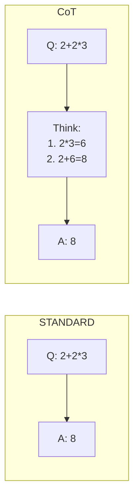
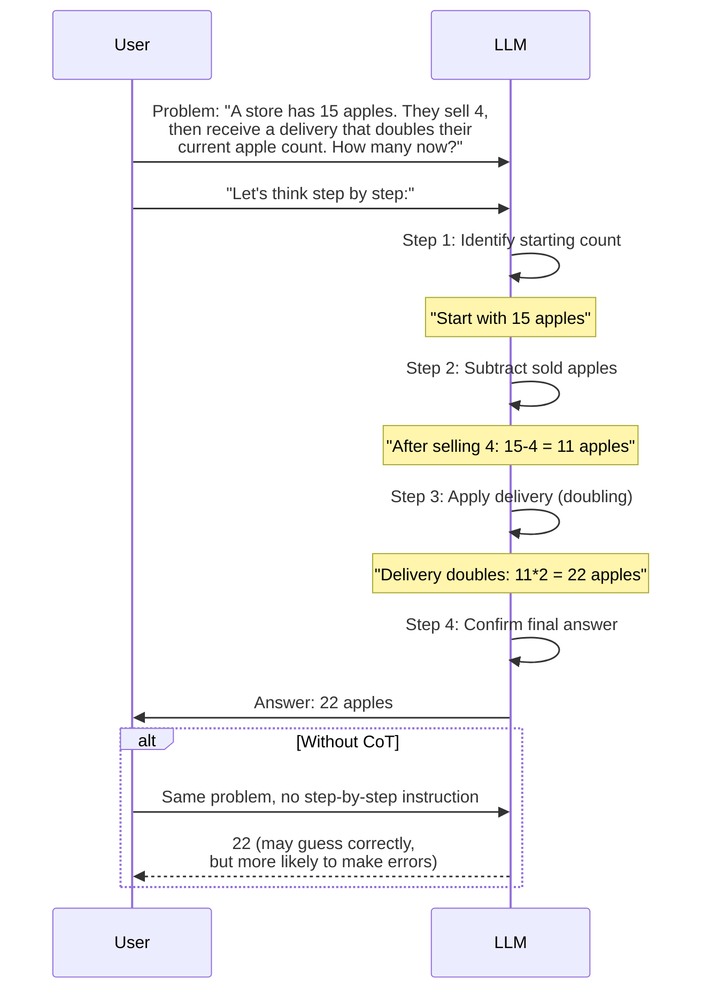
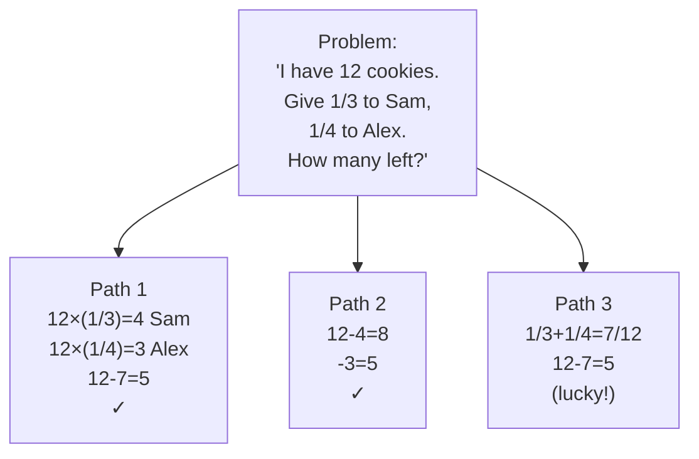
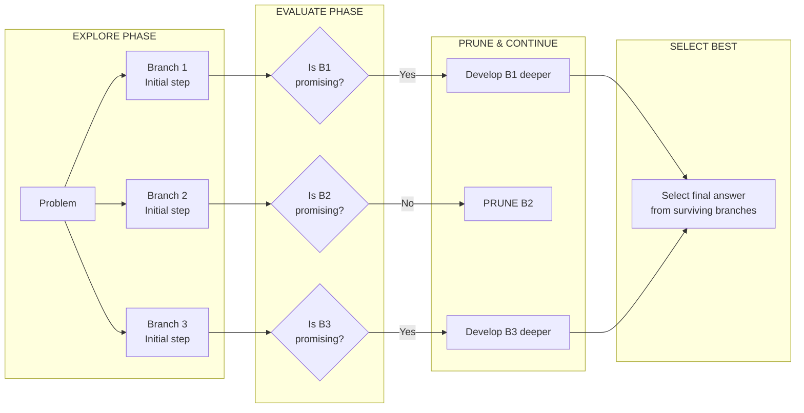

# Advanced Prompting Techniques

## Why Advanced Techniques?

Basic prompting works for simple tasks, but complex reasoning, structured outputs, and specialized problems require more sophisticated approaches. Each technique in this lesson addresses a specific limitation of basic prompting — from improving step-by-step reasoning to enabling multi-path exploration.

### When Basic Prompting Falls Short

| Limitation | Basic Attempt | Advanced Technique |
|------------|--------------|-------------------|
| Multi-step math/logic problems | Model guesses final answer | Chain-of-Thought: step-by-step reasoning |
| Unfamiliar output formats | Model invents wrong format | Few-Shot: examples guide the model |
| Need machine-readable output | Inconsistent text responses | Structured Outputs: JSON mode |
| Single answer may be wrong | No way to verify correctness | Self-Consistency: majority voting |
| Complex exploration/planning | Model follows one path | Tree-of-Thoughts: multiple branches |

---

## Chain-of-Thought (CoT) Prompting

Chain-of-Thought prompting encourages the model to break down problems into intermediate reasoning steps. Rather than jumping directly to an answer, the model "shows its work," which both improves accuracy and makes errors easier to debug.

### CoT Reasoning Flow



### Full CoT Reasoning Sequence



### CoT Example

```
Q: A store has 15 apples. They sell 4, then receive a delivery that doubles
their current apple count. How many apples do they have now?

Let's think step by step:
1. Start with 15 apples
2. After selling 4: 15 - 4 = 11 apples
3. Delivery doubles current count: 11 * 2 = 22 apples

Answer: 22
```

[!NOTE]
Simply adding "Let's think step by step" to your prompt can significantly improve reasoning performance on math and logic problems.

[!WARNING]
**CoT token costs:** Chain-of-Thought can increase output tokens by 3-10x because the model generates intermediate reasoning steps before the final answer. For cost-sensitive applications, consider using shorter prompts like "Explain briefly" or limiting max_tokens. For a production system processing millions of requests, this token multiplier directly affects your bottom line.

### CoT in Code

```python
from openai import OpenAI

client = OpenAI()

# Without CoT
response_direct = client.chat.completions.create(
    model="gpt-4",
    messages=[
        {"role": "user", "content": "If a shirt costs $40 and is on sale for 25% off, plus 8% tax, what's the final price?"}
    ],
    temperature=0.0
)
print("Direct:", response_direct.choices[0].message.content)

# With CoT
response_cot = client.chat.completions.create(
    model="gpt-4",
    messages=[
        {"role": "user", "content": """If a shirt costs $40 and is on sale for 25% off, plus 8% tax, what's the final price?

Let's think step by step:"""}
    ],
    temperature=0.0
)
print("\nCoT:", response_cot.choices[0].message.content)
```

### CoT Variants

| Variant | Description | Best For |
|---------|-------------|----------|
| **Zero-shot CoT** | Just add "Let's think step by step" | Quick reasoning improvement |
| **Few-shot CoT** | Provide example reasoning chains | Consistent format, harder problems |
| **Structured CoT** | Require numbered steps or bullet format | Debugging, audit trails |
| **Multi-prompt CoT** | Ask for reasoning, then answer in separate calls | Complex problems needing verification |

---

## Few-Shot and Multi-Shot Prompting

Few-shot prompting provides examples in the prompt to guide the model's behavior.

| Technique | Examples Provided | Best For |
|-----------|-------------------|----------|
| **Zero-Shot** | 0 examples | Simple tasks, common patterns |
| **Few-Shot** | 1-5 examples | Specific formats, novel tasks |
| **Multi-Shot** | 5+ examples | Complex patterns, fine-tuning alternative |

### Few-Shot Example: Sentiment Analysis

```
Classify the sentiment as POSITIVE, NEGATIVE, or NEUTRAL.

Example 1:
Review: "This movie was amazing, best I've seen all year!"
Sentiment: POSITIVE

Example 2:
Review: "Terrible service, never coming back."
Sentiment: NEGATIVE

Example 3:
Review: "The restaurant was on 5th street."
Sentiment: NEUTRAL

Now classify:
Review: "Product works as described, nothing exceptional."
Sentiment:
```

[!TIP]
**Choosing the right examples:** Select examples that cover the range of expected inputs. Include edge cases and ambiguous examples. Poorly chosen examples (e.g., all positive sentiment when the test set has mixed sentiment) bias the model. Also, order matters — models tend to be influenced most by the last example (recency bias).

### Few-Shot in Code

```python
from openai import OpenAI

client = OpenAI()

# Few-shot examples
examples = [
    {"review": "This movie was amazing, best I've seen all year!", "sentiment": "POSITIVE"},
    {"review": "Terrible service, never coming back.", "sentiment": "NEGATIVE"},
    {"review": "The restaurant was on 5th street.", "sentiment": "NEUTRAL"},
]

def few_shot_classify(review_text: str, examples: list[dict]) -> str:
    prompt = "Classify the sentiment as POSITIVE, NEGATIVE, or NEUTRAL.\n\n"
    for i, ex in enumerate(examples, 1):
        prompt += f"Example {i}:\nReview: \"{ex['review']}\"\nSentiment: {ex['sentiment']}\n\n"
    prompt += f"Now classify:\nReview: \"{review_text}\"\nSentiment:"
    
    response = client.chat.completions.create(
        model="gpt-4",
        messages=[{"role": "user", "content": prompt}],
        temperature=0.0
    )
    return response.choices[0].message.content.strip()

test_review = "Product works as described, nothing exceptional."
print(few_shot_classify(test_review, examples))
```

---

## Structured Outputs (JSON Mode)

Many LLMs support structured output formats, critical for programmatic integration.

```python
from openai import OpenAI
import json

client = OpenAI()

response = client.chat.completions.create(
    model="gpt-4-turbo-preview",
    messages=[
        {"role": "system", "content": "Extract customer data and return as JSON."},
        {"role": "user", "content": """
        Extract info from this email:
        "Hi, I'm John Smith from Acme Corp. My phone is 555-0123.
        I'd like to order 10 units of the PRO plan at $99/month."
        """}
    ],
    response_format={"type": "json_object"}  # JSON mode enabled
)

# Parse the structured output
result = json.loads(response.choices[0].message.content)
print(json.dumps(result, indent=2))
```

**Expected Output:**
```json
{
  "customer": {
    "name": "John Smith",
    "company": "Acme Corp",
    "phone": "555-0123"
  },
  "order": {
    "product": "PRO plan",
    "quantity": 10,
    "price": 99,
    "billing_cycle": "monthly"
  }
}
```

[!TIP]
**JSON mode validation:** Always validate JSON outputs before using them in production. Use `json.loads()` with try/except to catch malformed JSON. Consider using Pydantic models for schema validation in Python applications.

### JSON Schema Validation

```python
import json
from typing import Optional
from pydantic import BaseModel, Field, ValidationError

class Customer(BaseModel):
    name: str
    company: str
    phone: Optional[str] = None

class Order(BaseModel):
    product: str
    quantity: int = Field(gt=0)
    price: float = Field(gt=0)
    billing_cycle: str

class ExtractionResult(BaseModel):
    customer: Customer
    order: Order

# Parse and validate API output
raw_json = '{"customer": {"name": "John Smith", "company": "Acme Corp"}, "order": {"product": "PRO plan", "quantity": 10, "price": 99, "billing_cycle": "monthly"}}'

try:
    validated = ExtractionResult(**json.loads(raw_json))
    print(f"Validated: {validated.model_dump_json(indent=2)}")
except ValidationError as e:
    print(f"Validation failed: {e}")
```

### Structured Outputs with Other Providers

```python
# Anthropic Claude - structured output via system prompt
import anthropic

client = anthropic.Anthropic()
response = client.messages.create(
    model="claude-3-opus-20240229",
    max_tokens=1000,
    system="You extract data to JSON. Only output valid JSON, no other text.",
    messages=[
        {"role": "user", "content": "Extract: John, Acme Corp, 555-0123, 10 units PRO plan $99/mo"}
    ]
)
print(response.content[0].text)
```

---

## Self-Consistency

Self-Consistency generates multiple reasoning paths and selects the most frequent answer. It's like asking three experts separately and taking the majority vote — diverse reasoning paths reduce the chance that any single mistake determines the final answer.

```
Generate 3 different solutions to this problem, then pick the most common answer:

Problem: A train travels at 60 mph for 2 hours, then 80 mph for 1 hour.
What's the average speed?

Solution 1:
- Distance 1: 60 * 2 = 120 miles
- Distance 2: 80 * 1 = 80 miles
- Total: 200 miles in 3 hours
- Average: 200/3 = 66.67 mph

Solution 2:
- Average formula = total distance / total time
- Total distance = (60*2) + (80*1) = 200
- Total time = 3
- 200/3 = 66.67 mph

Solution 3:
- Just average the speeds: (60+80)/2 = 70 mph

Most common answer: 66.67 mph (appears 2 times)
```

### Self-Consistency in Code

```python
from openai import OpenAI
from collections import Counter

client = OpenAI()

def self_consistency(problem: str, n_paths: int = 3, temperature: float = 0.7) -> str:
    """Generate n reasoning paths and return the most frequent answer."""
    answers = []
    
    for i in range(n_paths):
        response = client.chat.completions.create(
            model="gpt-4",
            messages=[
                {"role": "user", "content": f"{problem}\n\nLet's think step by step:"}
            ],
            temperature=temperature,  # Higher temp for diverse paths
        )
        answers.append(response.choices[0].message.content)
        print(f"\nPath {i+1}:\n{answers[-1]}")
    
    # Extract final answers (simplified - production would use regex/NER)
    # In practice you'd use a final aggregation prompt
    # For now, demonstrate the concept
    return answers

problem = "A train travels at 60 mph for 2 hours, then 80 mph for 1 hour. What's the average speed?"
results = self_consistency(problem, n_paths=3)
```

---

## Tree-of-Thoughts (ToT)

Tree-of-Thoughts explores multiple reasoning paths simultaneously, like a decision tree. Unlike CoT which follows one reasoning chain, ToT branches out, evaluates each branch, and either continues promising paths or prunes dead ends.



### Tree-of-Thoughts Branching Flowchart



[!WARNING]
Self-Consistency and Tree-of-Thoughts require multiple API calls, significantly increasing cost and latency. Only use when single-call techniques aren't sufficient.

### ToT Prompt Template

```
I want you to solve this problem using Tree-of-Thoughts reasoning.

Problem: {problem}

Instructions:
1. First, generate {num_branches} different initial approaches to this problem
2. For each approach, think through the first step
3. Evaluate each approach — which seems most promising?
4. For the most promising approach, continue developing it
5. Repeat: explore, evaluate, focus, until you reach an answer

Start by listing {num_branches} different ways to approach this problem:
```

---

## Technique Comparison

| Technique | Complexity | Best Use Case | Performance Gain | Token Cost |
|-----------|------------|---------------|------------------|------------|
| **Chain-of-Thought** | Low | Math, logic, multi-step problems | +20-50% on reasoning | 2-5x increase |
| **Few-Shot** | Low | Classification, format matching | +10-30% vs zero-shot | 1-2x (example tokens) |
| **JSON Mode** | Low | API integration, structured data | Critical for reliability | Minimal (format instruction) |
| **Self-Consistency** | Medium | Voting on multiple outputs | +5-15% vs single CoT | 3-10x (multiple responses) |
| **Tree-of-Thoughts** | High | Complex search/exploration | +25-60% on hard problems | 5-20x (many branches) |

### When to Use Each Technique

| Scenario | Recommended Technique | Why |
|----------|----------------------|-----|
| Math word problem | CoT | Simple step-by-step works best |
| Classify customer emails | Few-Shot | Examples clarify ambiguous categories |
| Extract data for database | JSON Mode | Machine-readable output required |
| Critical medical diagnosis | Self-Consistency + CoT | Safety requires majority voting |
| Novel puzzle/game strategy | Tree-of-Thoughts | Need to explore multiple approaches |
| Summarize a document | CoT (if complex) or Zero-Shot | Simpler is usually better |

[!IMPORTANT]
**Technique stacking:** These techniques are not mutually exclusive. You can combine CoT with Few-Shot (provide example reasoning chains), use Self-Consistency with JSON Mode, or use ToT with structured outputs. Stacking techniques can compound benefits — but also compound token costs.

---

## Practice Questions

```question
{
  "id": "pe-03-q1",
  "type": "multiple-choice",
  "question": "A data analyst needs the LLM to extract customer information from emails and return it in a machine-readable format for database insertion. Which technique should they use?",
  "options": ["Chain-of-Thought", "Few-Shot", "Structured Outputs (JSON Mode)", "Self-Consistency"],
  "correct": 2,
  "explanation": "Structured Outputs (JSON Mode) returns data in a machine-readable JSON format suitable for database insertion."
}
```

```question
{
  "id": "pe-03-q2",
  "type": "multiple-choice",
  "question": "Adding the phrase \"Let's think step by step\" to a math problem prompt improves accuracy by encouraging the model to:",
  "options": ["Generate multiple answers and vote", "Break down the reasoning into intermediate steps", "Return the answer in JSON format", "Explore multiple reasoning paths simultaneously"],
  "correct": 1,
  "explanation": "Chain-of-Thought prompting encourages the model to break down problems into intermediate reasoning steps."
}
```

```question
{
  "id": "pe-03-q3",
  "type": "multiple-choice",
  "question": "A sentiment analysis task requires the model to classify reviews as POSITIVE, NEGATIVE, or NEUTRAL. The prompt includes three labeled examples before asking the model to classify a new review. This approach is known as:",
  "options": ["Zero-shot prompting", "Few-shot prompting", "Tree-of-Thoughts", "Self-Consistency"],
  "correct": 1,
  "explanation": "Few-shot prompting provides examples in the prompt to guide the model's behavior."
}
```

```question
{
  "id": "pe-03-q4",
  "type": "multiple-choice",
  "question": "A research team needs to solve a novel logic puzzle that requires exploring different reasoning approaches simultaneously, like a decision tree. Which technique should they use?",
  "options": ["Chain-of-Thought", "Self-Consistency", "Tree-of-Thoughts", "JSON Mode"],
  "correct": 2,
  "explanation": "Tree-of-Thoughts explores multiple reasoning paths simultaneously, like a decision tree."
}
```

```question
{
  "id": "pe-03-q5",
  "type": "multiple-choice",
  "question": "What is the main trade-off when using Self-Consistency or Tree-of-Thoughts compared to simpler techniques?",
  "options": ["Lower accuracy on simple tasks", "Significantly higher cost and latency due to multiple API calls", "Incompatibility with OpenAI models", "Inability to handle structured outputs"],
  "correct": 1,
  "explanation": "Self-Consistency and Tree-of-Thoughts require multiple API calls, significantly increasing cost and latency."
}
```

```question
{
  "id": "pe-03-q6",
  "type": "multiple-choice",
  "question": "A developer implements a system where the LLM first generates a reasoning chain, then produces a JSON output. What technique combination is this?",
  "options": ["Zero-Shot + Few-Shot", "CoT + Structured Outputs", "Self-Consistency + ToT", "Multi-Shot + JSON Mode"],
  "correct": 1,
  "explanation": "Combining CoT (for step-by-step reasoning) with Structured Outputs/JSON Mode (for the final machine-readable result) is a common stacking pattern."
}
```

```question
{
  "id": "pe-03-q7",
  "type": "multiple-choice",
  "question": "A team runs CoT on a simple classification task and sees accuracy decrease compared to zero-shot. What is the most likely explanation?",
  "options": ["CoT only works with GPT-4, not older models", "CoT adds unnecessary reasoning steps that can lead to confusion for simple tasks", "The temperature was set too low", "Few-shot examples were missing"],
  "correct": 1,
  "explanation": "For simple tasks, CoT's additional reasoning steps can introduce confusion or lead the model to overthink. Simpler techniques are often better for straightforward tasks."
}
```

```question
{
  "id": "pe-03-q8",
  "type": "multiple-choice",
  "question": "A production system processes 1M requests/month. Switching from zero-shot to CoT increases output tokens from 50 to 200 per request. At $0.03/1K tokens, what is the monthly cost increase?",
  "options": ["$1,500", "$4,500", "$450", "$15,000"],
  "correct": 1,
  "explanation": "Each request now uses 150 more tokens. 1M × 150 = 150M extra tokens. At $0.03/1K, that's $4,500/month. This illustrates why CoT's token cost matters at scale."
}
```

```question
{
  "id": "pe-03-q9",
  "type": "multiple-choice",
  "question": "A developer uses few-shot prompting with examples ordered: NEGATIVE, POSITIVE, NEUTRAL. The model misclassifies most test cases as NEUTRAL. What's the most likely cause?",
  "options": ["The model doesn't understand sentiment analysis", "Recency bias — the model is most influenced by the last example (NEUTRAL)", "The temperature is set too high", "NEUTRAL is not a valid sentiment category"],
  "correct": 1,
  "explanation": "LLMs exhibit recency bias, meaning they are disproportionately influenced by the last examples in the prompt. Reordering examples so the most frequent or important category appears last can improve accuracy."
}
```

```question
{
  "id": "pe-03-q10",
  "type": "multiple-choice",
  "question": "A prompt engineer validates a JSON output with Pydantic and catches a ValidationError. What should they do next?",
  "options": ["Ignore the error and use the raw JSON anyway", "Retry the API call with a stricter system prompt and possibly a higher temperature", "Log the error, retry with a corrected prompt, and alert if failures exceed a threshold", "Switch to a different LLM provider"],
  "correct": 2,
  "explanation": "Production systems should log validation errors, implement retry logic with prompt adjustments, and alert when failure rates exceed acceptable thresholds."
}
```

---

[!SUCCESS]
**Key Takeaways:**

- **Chain-of-Thought (CoT):** "Let's think step by step" improves reasoning on math/logic
- **Few-Shot:** Provide 1-5 examples to guide output format and style
- **Structured Outputs (JSON Mode):** Critical for programmatic API integration
- **Self-Consistency:** Generate multiple outputs and select the most frequent answer
- **Tree-of-Thoughts:** Explore multiple reasoning branches like a decision tree
- Advanced techniques cost more tokens—balance performance needs with cost
- Techniques can be stacked: CoT + JSON, Few-Shot + CoT, Self-Consistency + Structured Outputs
- For simple tasks, simpler techniques often outperform complex ones
- Always validate structured outputs before production use
