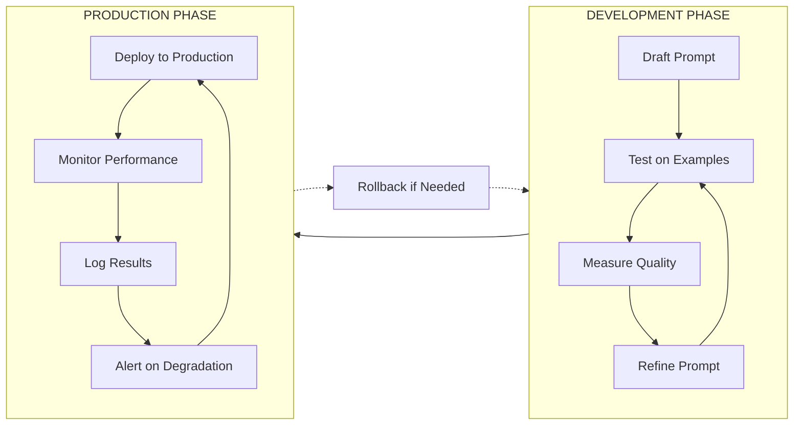
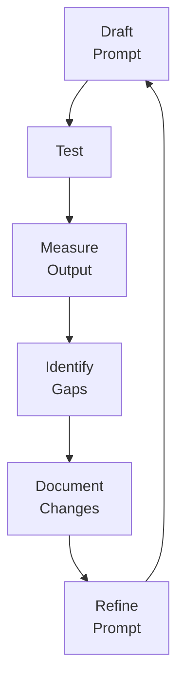
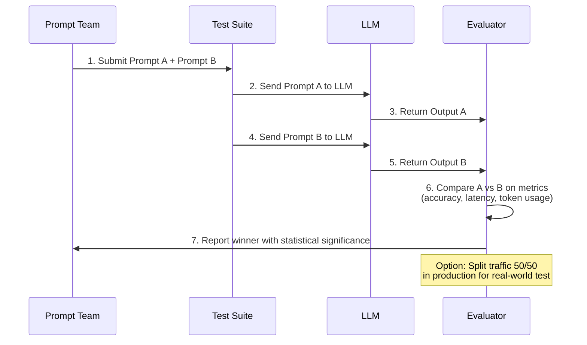
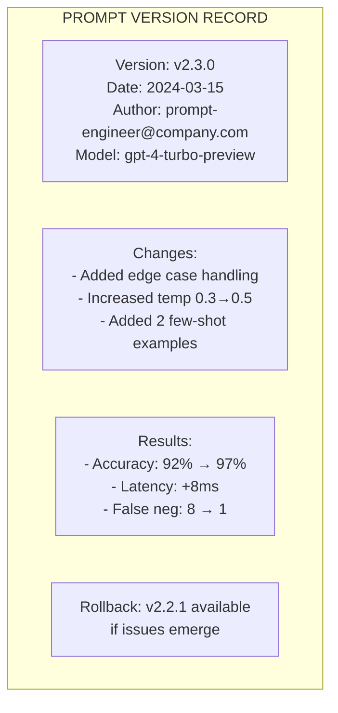
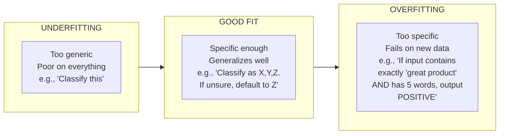

# Prompt Optimization, Testing and Versioning

## The Iterative Nature of Prompt Engineering

Great prompts are rarely created on the first try. Professional prompt engineering is a systematic process of testing, measuring, and refining. Like software engineering, prompt engineering requires version control, testing frameworks, and deployment pipelines.

### The Prompt Engineering Lifecycle



---

## Iterative Prompt Refinement

### The Optimization Loop



### Example: Refining a Classification Prompt

**Version 1 (Initial):**
```
Classify this customer ticket.
```

**Version 2 (Added categories):**
```
Classify this customer ticket as: BILLING, TECHNICAL, REFUND, or GENERAL.
```

**Version 3 (Added examples):**
```
Classify this customer ticket. Categories: BILLING, TECHNICAL, REFUND, GENERAL.

Example: "My card was charged twice" → BILLING
Example: "The app crashes on login" → TECHNICAL

Ticket: "{{ticket_text}}"
Classification:
```

**Version 4 (Added edge cases):**
```
Classify this customer ticket. Must be exactly one of: BILLING, TECHNICAL, REFUND, GENERAL.

- BILLING: Payment, charges, invoices
- TECHNICAL: Bugs, errors, functionality
- REFUND: Requesting money back
- GENERAL: Everything else

If unsure, output GENERAL.

Ticket: "{{ticket_text}}"
Classification:
```

[!NOTE]
Each version in the refinement cycle targeted a specific gap: V1 lacked categories, V2 lacked examples, V3 lacked edge-case handling. Documenting what each version changed (and why) is critical for learning and reproducibility.

### Refinement Tracking Template

| Version | Change | Metric Before | Metric After | Decision Driver |
|---------|--------|---------------|--------------|-----------------|
| v1 | Initial draft | Acc: 45% | 45% | Baseline |
| v2 | Added categories | Acc: 45% | 72% | Unclear categories caused errors |
| v3 | Added 2 examples | Acc: 72% | 85% | Format inconsistencies |
| v4 | Edge case handling | Acc: 85% | 94% | Ambiguous tickets misclassified |

---

## A/B Testing Prompts

A/B testing compares two prompt versions with the same inputs to measure which performs better.

### A/B Test Pipeline



### A/B Test Framework

| Metric | How to Measure | Good Score |
|--------|----------------|------------|
| **Accuracy** | % correctly classified/answered | >90% |
| **Consistency** | Same input → same output (low temp) | 100% for factual |
| **Latency** | Time to first token | <1s for chat |
| **Token Efficiency** | Output quality per token used | Maximize |
| **User Satisfaction** | Human rating or downstream metrics | >4/5 stars |

```python
# Example: A/B testing two prompt versions
from openai import OpenAI
import json

client = OpenAI()

def test_prompt(prompt_version: str, input_text: str) -> dict:
    """Test a specific prompt version"""
    
    prompts = {
        "A": f"Classify: {input_text} →",
        "B": f"""Classify this text as POSITIVE, NEGATIVE, or NEUTRAL.
        Consider sarcasm and context. Text: {input_text}"""
    }
    
    response = client.chat.completions.create(
        model="gpt-3.5-turbo",
        messages=[{"role": "user", "content": prompts[prompt_version]}],
        temperature=0.0
    )
    return {"version": prompt_version, "output": response.choices[0].message.content}

# Run A/B test on test suite
test_cases = [
    ("Great product, love it!", "POSITIVE"),
    ("Terrible experience, never again", "NEGATIVE"),
    ("The sky is blue", "NEUTRAL")
]

results = []
for text, expected in test_cases:
    results.append({
        "input": text,
        "expected": expected,
        "prompt_A": test_prompt("A", text),
        "prompt_B": test_prompt("B", text)
    })

print(json.dumps(results, indent=2))
```

[!TIP]
**Statistical significance:** Running A/B tests on 3 test cases doesn't prove much. Use at least 50-100 diverse test cases per version. Calculate statistical significance (p < 0.05) before declaring a winner. Tools like SciPy's `ttest_ind` can help determine if the difference is meaningful or just noise.

### A/B Test Automation

```yaml
# ab-test-config.yaml
test_name: sentiment-classification-v4-vs-v5
prompt_a: "Classify the sentiment as POSITIVE, NEGATIVE, or NEUTRAL.\n\nText: {input}"
prompt_b: "Analyze the emotional tone of this text. Return one of: POSITIVE, NEGATIVE, NEUTRAL.\nConsider context and sarcasm.\n\nText: {input}"
test_cases_file: "test_cases/sentiment_test_set.json"
metrics:
  - accuracy
  - latency_p50
  - token_usage
model: gpt-3.5-turbo
temperature: 0.0
min_sample_size: 100
```

---

## Prompt Versioning Strategies

| Strategy | Description | Pros | Cons |
|----------|-------------|------|------|
| **SemVer** | v1.0.0, v1.1.0 | Clear breaking changes | Overkill for simple changes |
| **Date-Based** | 2024-03-15, 2024-03-15-a | Chronologically clear | Hard to see relationships |
| **Git-Based** | Commit hash + tag | Full history, provenance | Requires git discipline |
| **Environment** | prod-v1, staging-v2 | Clear deployment status | Can drift between envs |

### Versioning Strategy Comparison

| Dimension | SemVer | Date-Based | Git-Based | Environment |
|-----------|--------|------------|-----------|-------------|
| **Shows breaking changes** | Yes (major version) | No | Via commit messages | No |
| **Chronological ordering** | Partial | Yes | Yes (commit history) | No |
| **Rollback ease** | Moderate | Hard | Easy (git revert) | Very easy |
| **Automation friendly** | Yes | Yes | Yes | Yes |
| **Human readability** | Good | Good | Poor (hashes) | Excellent |
| **Recommended for** | Production APIs | Internal experiments | All production work | Deployment tracking |

[!NOTE]
For production systems, combine **Git tracking** with **SemVer tags** and **change logs**. This provides both auditability and clear communication.

### Version Control Template



### Semantic Versioning for Prompts

```
vMAJOR.MINOR.PATCH

MAJOR = Breaking change (new model, complete rewrite, format change)
MINOR = Enhancement (new examples, added constraints, improved instructions)
PATCH = Fix (typo fix, minor clarification, edge case handling)
```

Example:
- v1.0.0: Initial version
- v1.1.0: Added 3 few-shot examples (enhancement)
- v1.1.1: Fixed typo in system prompt (patch)
- v2.0.0: Switched from gpt-3.5-turbo to gpt-4 (breaking change)

### Git-Based Prompt Management

```bash
# Initialize prompt version control
git init
git add prompts/classification-v1.txt
git commit -m "feat: initial classification prompt v1.0.0"

# After refinement
git add prompts/classification-v2.txt
git commit -m "feat: add few-shot examples, increase accuracy 72%→85%"

# Tag versions
git tag -a "classification-v2.0.0" -m "production-ready classification prompt"
git tag -a "classification-v2.0.1" -m "fix: handle empty input edge case"

# Rollback if needed
git checkout classification-v2.0.0
```

---

## Prompt Templates and Variables

Templates separate prompt structure from dynamic data.

```python
# Example: Prompt template system
from dataclasses import dataclass
from typing import Dict, Any

@dataclass
class PromptTemplate:
    name: str
    version: str
    system_template: str
    user_template: str
    variables: list[str]
    
    def render(self, **kwargs) -> tuple[str, str]:
        """Render the template with provided variables"""
        # Validate all required variables provided
        for var in self.variables:
            if var not in kwargs:
                raise ValueError(f"Missing required variable: {var}")
        
        # Render templates
        system = self.system_template.format(**kwargs)
        user = self.user_template.format(**kwargs)
        
        return system, user

# Define a template
classification_template = PromptTemplate(
    name="ticket-classification",
    version="2.3.0",
    system_template="""You are a customer support classifier.
Categories: {categories}
If uncertain, use GENERAL.""",
    user_template="""Classify this ticket:

Ticket Text:
{ticket_text}

Respond with ONLY the category name.""",
    variables=["categories", "ticket_text"]
)

# Use the template
system_msg, user_msg = classification_template.render(
    categories="BILLING, TECHNICAL, REFUND, GENERAL",
    ticket_text="My app crashes when I try to upload photos"
)

print("System:", system_msg)
print("User:", user_msg)
```

[!TIP]
**Prompt template libraries:** For production systems, consider using dedicated template management libraries. Python's `string.Template` and Jinja2 are excellent for complex templates with conditional logic and loops. For larger teams, tools like `promptfoo` or custom template registries with database storage provide centralized versioning and lookup.

### Template Library with Jinja2

```python
from jinja2 import Template

# Complex template with conditionals
template_str = """
You are a {{ role }} specializing in {{ domain }}.


Context: {{ context }}


Task: {{ instruction }}


Examples:

Input: {{ ex.input }}
Output: {{ ex.output }}



Now process:
Input: {{ current_input }}
Output:"""

template = Template(template_str)

rendered = template.render(
    role="data analyst",
    domain="customer feedback analysis",
    context="We process thousands of support tickets daily",
    instruction="Classify the sentiment of each ticket",
    examples=[
        {"input": "Love the new feature!", "output": "POSITIVE"},
        {"input": "This is broken", "output": "NEGATIVE"},
    ],
    current_input="The product works fine"
)
print(rendered)
```

### Template Management Best Practices

| Practice | Description | Benefit |
|----------|-------------|---------|
| **Registry pattern** | Store templates in a database/registry | Central lookup, audit trail |
| **Version pinning** | Each template reference includes version | Reproducibility |
| **A/B test integration** | Template ID + variant = test group | Easy experimentation |
| **Rendered preview** | Preview rendered template before API call | Debugging, validation |
| **Variable validation** | Validate all variables exist before rendering | Prevents runtime errors |

---

## Avoiding Overfitting

[!WARNING]
**Prompt overfitting** occurs when your prompt works great on your test examples but fails catastrophically on real-world data.

### Signs of Overfitting:
- Works perfectly on your 10 test cases, fails on the 11th
- Highly specific instructions that don't generalize
- Performance drops when the input format changes slightly

### The Overfitting Spectrum



### Prevention Strategies:

1. **Holdout validation**: Keep 20% of data unseen during iteration
2. **Adversarial testing**: Test with edge cases and weird inputs
3. **Simplify**: Remove instructions that don't improve metrics
4. **Cross-validate**: Test across different model versions
5. **Monitor production**: Track performance on real data

[!IMPORTANT]
**Avoiding overfitting is the single most important skill in production prompt engineering.** A prompt that scores 98% on your hand-crafted test set but 60% in production is worse than useless — it gives false confidence. Always maintain a held-out test set that you never optimize against, and continuously monitor production performance.

### Overfitting Case Study

| Test Case | Training Set (optimized) | Holdout Set (unseen) |
|-----------|-------------------------|---------------------|
| "Great service!" | POSITIVE ✓ | POSITIVE ✓ |
| "Meh, it's okay" | NEUTRAL ✓ | NEUTRAL ✓ |
| "The product arrived broken and I'm furious but the refund was processed" | NEGATIVE ✓ | POSITIVE ✗ (model confused by mixed sentiment) |
| "I don't hate it" | POSITIVE ✓ | NEGATIVE ✗ (model missed double negative) |
| "LOUD ANGRY CUSTOMER" | NEGATIVE ✓ | POSITIVE ✗ (model confused by ALL CAPS) |

**Root cause:** The training set only had simple, single-sentence, single-sentiment examples. Real-world inputs had mixed sentiment, double negatives, and unusual formatting.

---

## Practice Questions

```question
{
  "id": "pe-04-q1",
  "type": "multiple-choice",
  "question": "A prompt engineer iterates through four versions of a classification prompt, each time measuring accuracy and refining based on gaps. This process is called:",
  "options": ["A/B testing", "Iterative prompt refinement", "Prompt overfitting", "Version control"],
  "correct": 1,
  "explanation": "Iterative prompt refinement is the systematic process of testing, measuring, and refining prompts."
}
```

```question
{
  "id": "pe-04-q2",
  "type": "multiple-choice",
  "question": "A team compares two prompt versions (A and B) on the same suite of test cases, measuring which produces more accurate classifications. This is known as:",
  "options": ["Iterative refinement", "A/B testing", "SemVer tagging", "Template rendering"],
  "correct": 1,
  "explanation": "A/B testing compares two prompt versions with the same inputs to measure which performs better."
}
```

```question
{
  "id": "pe-04-q3",
  "type": "multiple-choice",
  "question": "For a production prompt system that needs full change history and clear communication about breaking changes, the recommended versioning strategy is:",
  "options": ["Date-based versioning only", "Environment-based naming only", "Git tracking combined with SemVer tags", "Sequential numbering without documentation"],
  "correct": 2,
  "explanation": "Combining Git tracking with SemVer tags provides both auditability and clear communication about changes."
}
```

```question
{
  "id": "pe-04-q4",
  "type": "multiple-choice",
  "question": "A prompt achieves 98% accuracy on the engineer's 10 test cases but drops to 60% when deployed on real customer tickets. This phenomenon is called:",
  "options": ["Template mismatch", "Prompt overfitting", "Token inefficiency", "Latency degradation"],
  "correct": 1,
  "explanation": "Prompt overfitting occurs when a prompt works well on test examples but fails on real-world data."
}
```

```question
{
  "id": "pe-04-q5",
  "type": "multiple-choice",
  "question": "What is the primary advantage of using prompt templates with variables like `{{ticket_text}}`?",
  "options": ["They automatically improve model accuracy", "They eliminate the need for A/B testing", "They separate prompt structure from dynamic data, improving maintainability", "They reduce token usage by 50%"],
  "correct": 2,
  "explanation": "Prompt templates separate prompt structure from dynamic data, improving maintainability and consistency."
}
```

```question
{
  "id": "pe-04-q6",
  "type": "multiple-choice",
  "question": "A prompt engineer runs an A/B test with only 5 test cases. Version A gets 4/5 correct and version B gets 5/5. What should they conclude?",
  "options": ["Version B is definitively better — deploy immediately", "The sample size is too small to draw statistically significant conclusions", "Both versions are equally good", "Version A should be discarded permanently"],
  "correct": 1,
  "explanation": "With only 5 test cases, a single result difference doesn't prove superiority. A/B tests need at least 50-100 diverse cases per version for meaningful results."
}
```

```question
{
  "id": "pe-04-q7",
  "type": "multiple-choice",
  "question": "A prompt engineer updates a prompt by adding two new few-shot examples. Following SemVer, this change should be versioned as:",
  "options": ["v1.0.0 → v2.0.0 (major change)", "v1.0.0 → v1.1.0 (minor enhancement)", "v1.0.0 → v1.0.1 (patch)", "v1.0.0 → v1.0.0-a (alpha)"],
  "correct": 1,
  "explanation": "Adding examples is an enhancement, not a breaking change, so it's a MINOR version bump (v1.0.0 → v1.1.0)."
}
```

```question
{
  "id": "pe-04-q8",
  "type": "multiple-choice",
  "question": "A prompt template renders with missing variable values producing 'I am a None assistant for None company'. What is the root cause?",
  "options": ["The model hallucinated the None values", "The template used .format() with a missing variable, causing KeyError or string 'None'", "The temperature was too high", "The JSON mode was not enabled"],
  "correct": 1,
  "explanation": "A missing variable in .format() either raises KeyError (if not in kwargs) or renders as 'None' (if the variable exists but is None). Always validate all template variables before rendering."
}
```

```question
{
  "id": "pe-04-q9",
  "type": "multiple-choice",
  "question": "A prompt team deploys Prompt Version A to production but sees accuracy drop from 94% to 82%. They need to revert quickly. Which versioning strategy makes this easiest?",
  "options": ["Date-based versioning (requires finding the right date)", "Git-based with tags (simple git revert/checkout)", "Sequential numbering (must remember which version worked)", "No versioning (no rollback possible)"],
  "correct": 1,
  "explanation": "Git-based versioning with tags makes rollback trivial via git commands, providing the fastest recovery path."
}
```

```question
{
  "id": "pe-04-q10",
  "type": "multiple-choice",
  "question": "A prompt engineer adds a complex instruction to handle a rare edge case, improving accuracy from 94% to 95% on the test set. The prompt is now 3x longer. Should they deploy it?",
  "options": ["Yes — higher accuracy always wins", "No — the marginal gain likely doesn't justify the added complexity and potential overfitting risk", "Only if they also increase the temperature", "Yes — longer prompts always produce better results"],
  "correct": 1,
  "explanation": "A 1% accuracy gain at 3x complexity likely indicates overfitting to edge cases in the test set. The added complexity may hurt generalization on unseen data. Simpler prompts generalize better."
}
```

---

[!SUCCESS]
**Key Takeaways:**

- Prompt engineering is iterative: Draft → Test → Measure → Identify Gaps → Refine → Repeat
- A/B testing compares prompt versions systematically using metrics like accuracy, consistency, and latency
- Version control (Git + SemVer) is critical for production prompts; always document changes
- Prompt templates separate structure from data, improving maintainability and consistency
- Overfitting happens when prompts work on test data but fail on real data—use holdout validation
- Production systems need monitoring, logging, and rollback capabilities
- Statistical significance matters in A/B testing — don't declare winners on tiny samples
- Template libraries like Jinja2 enable complex conditional prompt generation
- Simpler prompts generalize better — don't over-engineer for marginal gains
