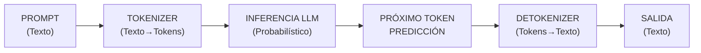
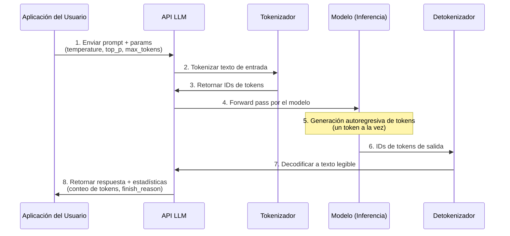
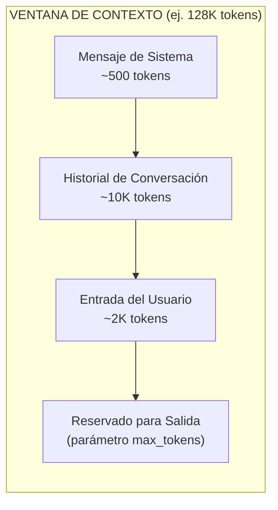
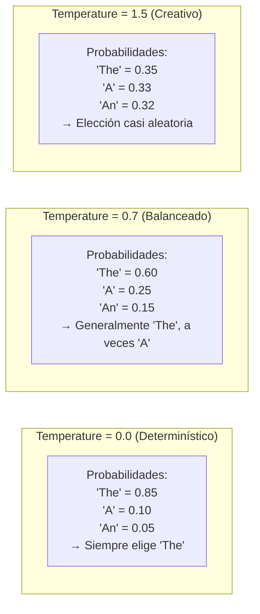
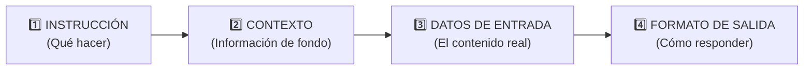

# Fundamentos de la Ingeniería de Prompts

## ¿Qué es un Prompt?

Un prompt es la entrada que proporcionas a un LLM para obtener una respuesta específica. Es la unidad fundamental de interacción con modelos de IA modernos como GPT-4, Claude y Llama. La calidad de tu prompt determina directamente la calidad de la salida del modelo — basura entra, basura sale sigue siendo tan cierto para IA como para software tradicional.

### Flujo de Entrada/Salida del LLM



### Ciclo de Vida Completo de una Llamada de API



[!NOTE]
Cada llamada de API pasa por múltiples etapas: tokenización convierte tu texto a números que el modelo entiende, inferencia genera tokens probabilísticamente y detokenización convierte los resultados de vuelta a texto. Entender este pipeline ayuda a depurar problemas como límites de token o salidas inesperadas.

---

## Tokenización

Tokenización es el proceso de dividir el texto en unidades más pequeñas (tokens) que el modelo puede entender. Diferentes modelos usan diferentes algoritmos de tokenización — GPT-4 usa Byte-Pair Encoding (BPE), mientras que otros modelos pueden usar SentencePiece o WordPiece.

### Datos sobre Tokens:
- 1 token ≈ 4 caracteres en inglés
- 100 tokens ≈ 75 palabras
- Diferentes modelos tienen diferentes tokenizadores
- Los tokens especiales (como `<|endoftext|>`) también cuentan para tu límite

### Comparación de Tokenizadores entre Modelos

| Modelo | Tipo de Tokenizador | Tamaño del Vocabulario | Aprox. Tokens por Palabra (Inglés) | Características Especiales |
|--------|---------------------|------------------------|-------------------------------------|---------------------------|
| **GPT-4 / GPT-3.5** | BPE (Byte-Pair Encoding) | ~100K | 1.3 | OpenAI tiktoken, maneja bien código |
| **Claude (Anthropic)** | BPE (Byte-Pair Encoding) | ~100K | 1.3 | Eficiente para texto multilingüe |
| **Llama 2/3** | BPE (SentencePiece) | ~32K | 1.4 | Vocabulario menor, bueno para memoria limitada |
| **Gemini (Google)** | SentencePiece | ~256K | 1.2 | Mayor vocabulario, eficiente para CJK |

```python
# Ejemplo: Tokenización con tiktoken de OpenAI
import tiktoken

# Carga el tokenizador para GPT-4
encoding = tiktoken.encoding_for_model("gpt-4")

text = "Hola, ¿cómo estás?"
tokens = encoding.encode(text)

print(f"Texto original: {text}")
print(f"Tokens: {tokens}")
print(f"Cantidad de tokens: {len(tokens)}")

# Decodifica de vuelta a texto
decoded = encoding.decode(tokens)
print(f"Decodificado: {decoded}")
```

[!TIP]
Siempre estima el uso de tokens antes de enviar prompts grandes. Un prompt de 1000 tokens + respuesta cuesta aproximadamente $0.01-0.03 con GPT-4, pero los costos se acumulan rápidamente en producción. Usa `tiktoken` o el tokenizador de tu modelo para contar tokens del lado del cliente antes de la llamada de API.

### Límites de Ventana de Contexto



[!IMPORTANT]
Cada modelo tiene una **ventana de contexto** (GPT-4: 8K-128K, Claude 3: 200K, Gemini: 32K-1M). La suma de tu mensaje de sistema + historial de conversación + entrada del usuario + salida generada **debe caber** dentro de esta ventana. Una vez excedida, el modelo trunca mensajes más antiguos — potencialmente perdiendo contexto importante.

---

## Roles: Sistema vs Usuario vs Asistente

Los LLMs usan un historial de conversación con tres roles distintos:

| Rol | Propósito | Ejemplo de Uso |
|-----|-----------|----------------|
| **Sistema** | Define comportamiento, personalidad y contexto para toda la conversación | "Eres un tutor de Python servicial. Sé conciso y usa ejemplos de código." |
| **Usuario** | Representa la entrada o pregunta del humano | "¿Cómo ordeno una lista en Python?" |
| **Asistente** | Representa las respuestas anteriores de la IA en el historial | "Puedes usar la función sorted() o el método .sort()..." |

[!NOTE]
El mensaje de sistema es particularmente poderoso—persiste durante toda la conversación y guía cómo el modelo responde a todos los mensajes subsecuentes.

[!IMPORTANT]
**Mejores prácticas de prompt de sistema:** Sé específico sobre la persona del modelo, formato de salida y restricciones. Incluye salvaguardas como "Si no sabes la respuesta, dilo." Evita instrucciones vagas como "sé útil" — en su lugar, describe cómo se ve ser útil en tu contexto.

```python
from openai import OpenAI

client = OpenAI()

response = client.chat.completions.create(
    model="gpt-4",
    messages=[
        # Rol sistema: Define la persona de la IA
        {"role": "system", "content": "Eres un tutor de matemáticas conciso. Explica conceptos de forma simple."},
        # Rol usuario: La pregunta real
        {"role": "user", "content": "¿Qué es el teorema de Pitágoras?"}
    ]
)

# Rol asistente: La respuesta
assistant_reply = response.choices[0].message.content
print(assistant_reply)
```

### Ejemplos de Diferentes Proveedores

```python
# API Anthropic Claude
import anthropic

client = anthropic.Anthropic()

response = client.messages.create(
    model="claude-3-opus-20240229",
    system="Eres un tutor de matemáticas conciso. Explica conceptos de forma simple.",
    messages=[
        {"role": "user", "content": "¿Qué es el teorema de Pitágoras?"}
    ]
)
print(response.content[0].text)
```

```python
# API Google Gemini
import google.generativeai as genai

genai.configure(api_key="YOUR_API_KEY")
model = genai.GenerativeModel(
    model_name="gemini-1.5-pro",
    system_instruction="Eres un tutor de matemáticas conciso. Explica conceptos de forma simple."
)
response = model.generate_content("¿Qué es el teorema de Pitágoras?")
print(response.text)
```

---

## Temperature y Top_p

Estos parámetros controlan la aleatoriedad y creatividad de la salida:

| Parámetro | Rango | Propósito | Valores Típicos |
|-----------|-------|-----------|-----------------|
| **Temperature** | 0-2 | Controla aleatoriedad. Menor = más determinístico | 0.0 (determinístico), 0.7 (balanceado), 1.5 (creativo) |
| **Top_p** | 0-1 | Muestreo por núcleo. Solo considera tokens con masa de probabilidad acumulativa | 0.1 (enfocado), 0.9 (diverso) |

### Cómo Funciona Realmente la Temperature

En temperature 0, el modelo siempre elige el token de mayor probabilidad (decodificación voraz). A medida que la temperature aumenta, los tokens de menor probabilidad se vuelven más propensos a ser elegidos, produciendo salidas más variadas y creativas.



[!TIP]
**Eligiendo valores de temperature:** Para tareas factuales (clasificación, extracción, Q&A), usa 0.0-0.3. Para tareas creativas (escritura de historias, brainstorming), usa 0.7-1.2. Evita temperatures por encima de 1.5 a menos que quieras salida casi aleatoria — la salida "creativa" rápidamente se vuelve incoherente.

[!WARNING]
Configurar temperature > 1.0 o top_p > 0.9 puede llevar a respuestas incoherentes o alucinadas. Para tareas factuales, usa temperature 0.0-0.5.

```python
from openai import OpenAI

client = OpenAI()

# Escritura creativa - temperature alta
creative_response = client.chat.completions.create(
    model="gpt-4",
    messages=[{"role": "user", "content": "Escribe una historia de una frase sobre un robot"}],
    temperature=1.8,  # Muy creativo
    top_p=0.95
)
print("Creativo:", creative_response.choices[0].message.content)

# Respuesta factual - temperature baja
factual_response = client.chat.completions.create(
    model="gpt-4",
    messages=[{"role": "user", "content": "¿Cuál es el punto de ebullición del agua al nivel del mar?"}],
    temperature=0.0,  # Determinístico
    top_p=0.1
)
print("Factual:", factual_response.choices[0].message.content)
```

### Interacción entre Temperature y Top_p

| Escenario | Temperature | Top_p | Efecto |
|-----------|-------------|-------|--------|
| **Factual estricto** | 0.0 | 1.0 | Modelo no toma riesgos, determinístico |
| **Escritura creativa** | 1.0 | 0.95 | Selección amplia de tokens, alta creatividad |
| **Creativo enfocado** | 0.8 | 0.5 | Creativo pero dentro de tokens probables |
| **Generación de código** | 0.2 | 0.9 | Mayoría determinístico, variación leve |
| **Brainstorming** | 1.2 | 0.95 | Alta variedad, muchas alternativas |

[!NOTE]
La mayoría de las APIs recomiendan ajustar solo un parámetro. Si configuras ambos, temperature primero suaviza la distribución de probabilidad, luego top_p corta la cola. Configurar ambos a valores extremos simultáneamente puede producir resultados muy extraños.

---

## Zero-Shot Prompting

Zero-shot prompting es cuando le pides al modelo que realice una tarea sin ningún ejemplo.

```
Clasifica este correo como "importante", "spam" o "neutral":

"URGENTE: Tu cuenta bancaria ha sido comprometida. Haz clic aquí para verificar."
```

### Estructura Básica de Prompt



### Cuándo Funciona Mejor Zero-Shot

| Tipo de Tarea | Rendimiento Zero-Shot | Notas |
|---------------|----------------------|-------|
| Clasificación común | Bueno | Modelos conocen categorías intrínsecamente |
| Q&A simple | Excelente | Conocimiento factual de datos de entrenamiento |
| Traducción | Variable | Depende del par de idiomas y entrenamiento |
| Tareas altamente especializadas | Malo | Necesita ejemplos o fine-tuning |
| Formatos nuevos | Malo | Modelos necesitan ejemplos de nuevas estructuras |

[!NOTE]
Zero-shot funciona sorprendentemente bien para tareas que el modelo encontró durante el entrenamiento. Le cuesta con casos límite, dominios altamente especializados o requisitos precisos de formato — ahí es donde entran las técnicas few-shot y avanzadas.

---

## Preguntas de Práctica

```question
{
  "id": "pe-01-es-q1",
  "type": "multiple-choice",
  "question": "Un ingeniero de software quiere usar un LLM para un chatbot de soporte al cliente. ¿Qué rol de la conversación debe usarse para definir la personalidad y las pautas de comportamiento del chatbot?",
  "options": ["Rol del usuario", "Rol del sistema", "Rol del asistente", "Rol del tokenizador"],
  "correct": 1,
  "explanation": "El rol de sistema define la personalidad y las pautas de comportamiento de la IA para toda la conversación."
}
```

```question
{
  "id": "pe-01-es-q2",
  "type": "multiple-choice",
  "question": "Al tokenizar la frase \"Hola, ¿cómo estás?\" usando tiktoken de OpenAI, ¿qué ocurre durante el proceso de tokenización?",
  "options": ["El texto se encripta por seguridad", "El texto se divide en tokens numéricos que el modelo puede procesar", "El texto se traduce a múltiples idiomas", "El texto se comprime para reducir el tamaño de almacenamiento"],
  "correct": 1,
  "explanation": "La tokenización divide el texto en tokens numéricos (enteros) que el modelo puede procesar."
}
```

```question
{
  "id": "pe-01-es-q3",
  "type": "multiple-choice",
  "question": "Un desarrollador está construyendo un asistente de diagnóstico médico y necesita que el modelo dé respuestas consistentes y factuales. ¿Qué configuración de temperature debe usar?",
  "options": ["1.5", "1.0", "0.7", "0.0"],
  "correct": 3,
  "explanation": "Temperature 0.0 hace que el modelo sea determinístico y factual, ideal para diagnóstico médico."
}
```

```question
{
  "id": "pe-01-es-q4",
  "type": "multiple-choice",
  "question": "Un ingeniero de prompts necesita que el modelo clasifique correos sin proporcionar ningún ejemplo en el prompt. ¿Qué enfoque está usando?",
  "options": ["Few-shot prompting", "Zero-shot prompting", "Multi-shot prompting", "Chain-of-thought prompting"],
  "correct": 1,
  "explanation": "Zero-shot prompting le pide al modelo que realice una tarea sin proporcionar ningún ejemplo."
}
```

```question
{
  "id": "pe-01-es-q5",
  "type": "multiple-choice",
  "question": "¿Qué controla el parámetro top_p (muestreo por núcleo) al generar respuestas del LLM?",
  "options": ["El número máximo de tokens en la salida", "La masa de probabilidad acumulativa usada para seleccionar tokens", "El nivel de prioridad de los mensajes de sistema", "El factor de escala de la temperature"],
  "correct": 1,
  "explanation": "Top_p (muestreo por núcleo) limita la selección de tokens a aquellos con masa de probabilidad acumulativa hasta el valor especificado."
}
```

```question
{
  "id": "pe-01-es-q6",
  "type": "multiple-choice",
  "question": "Un equipo que construye un chatbot multilingüe necesita un modelo que maneje japonés, coreano y chino eficientemente. Basado en la comparación de tokenizadores, ¿qué tokenizador es más eficiente para idiomas CJK?",
  "options": ["GPT-4 (BPE, ~100K vocabulario)", "Claude (BPE, ~100K vocabulario)", "Gemini (SentencePiece, ~256K vocabulario)", "Llama 2 (BPE, ~32K vocabulario)"],
  "correct": 2,
  "explanation": "El tokenizador SentencePiece de Gemini tiene el mayor vocabulario (~256K), haciéndolo más eficiente para idiomas CJK donde caracteres individuales se convierten en tokens."
}
```

```question
{
  "id": "pe-01-es-q7",
  "type": "multiple-choice",
  "question": "Un ingeniero de prompts envía un documento de 150K tokens a un modelo con ventana de contexto de 128K y establece max_tokens en 4000. ¿Qué ocurrirá?",
  "options": ["El modelo procesará todos los 150K tokens y generará 4000 tokens de salida", "El modelo truncará la entrada, perdiendo contenido más antiguo para caber en 128K menos 4000 reservados para salida", "La API actualizará automáticamente a un modelo más grande", "El modelo resumirá el documento primero, luego lo procesará"],
  "correct": 1,
  "explanation": "El total de tokens (entrada + salida reservada) debe caber en la ventana de contexto. El modelo truncará el inicio de la entrada para hacer espacio."
}
```

```question
{
  "id": "pe-01-es-q8",
  "type": "multiple-choice",
  "question": "Usar temperature=0.8 con top_p=0.5 juntos produce ¿qué tipo de comportamiento?",
  "options": ["Altamente aleatorio, incoherente", "Creativo pero restringido a un subconjunto enfocado de tokens de alta probabilidad", "Completamente determinístico, salida idéntica cada vez", "El modelo se niega a generar cualquier salida"],
  "correct": 1,
  "explanation": "Temperature=0.8 introduce creatividad, pero top_p=0.5 restringe la selección de tokens a una masa de probabilidad acumulativa estrecha, resultando en elecciones creativas dentro de un conjunto enfocado de tokens plausibles."
}
```

```question
{
  "id": "pe-01-es-q9",
  "type": "multiple-choice",
  "question": "Un desarrollador nota que su llamada de API GPT-4 devolvió 150 tokens en la respuesta pero configuró max_tokens en 500. El finish_reason fue 'stop'. ¿Qué significa esto?",
  "options": ["La API limitó la respuesta a 150 tokens debido a límites de tasa", "El modelo decidió que completó su respuesta después de 150 tokens y se detuvo naturalmente", "Hubo un error en el conteo de tokens", "El modelo se quedó sin tokens y se detuvo a medio camino"],
  "correct": 1,
  "explanation": "max_tokens es un límite superior, no un objetivo. El modelo se detiene cuando genera un token de parada (indicando finalización), independientemente del límite max_tokens."
}
```

```question
{
  "id": "pe-01-es-q10",
  "type": "multiple-choice",
  "question": "Un ingeniero de prompts compara un modelo Llama 2 (32K vocabulario) con un GPT-4 (100K vocabulario) para una tarea de generación de código. ¿Qué trade-off deben considerar?",
  "options": ["Llama 2 usa menos tokens por palabra de código, reduciendo costos", "El vocabulario menor de Llama 2 puede usar más tokens para código, pero requiere menos memoria", "GPT-4 no puede procesar código", "No hay diferencia — todos los tokenizadores funcionan igual en código"],
  "correct": 1,
  "explanation": "Un vocabulario menor significa que se necesitan más tokens para representar el mismo texto, potencialmente aumentando el tiempo de inferencia. Sin embargo, vocabularios más pequeños significan tablas de embedding más pequeñas, reduciendo requisitos de memoria."
}
```

---

[!SUCCESS]
**Conclusiones Clave:**

- Un prompt es la entrada de un LLM, y la tokenización convierte texto a tokens legibles por el modelo
- Los tres roles de la conversación son: sistema (persona), usuario (entrada humana), asistente (respuestas de IA)
- Temperature (0-2) controla aleatoriedad; valores menores = salidas más determinísticas
- Top_p (0-1) realiza muestreo por núcleo, limitando la probabilidad de selección de tokens
- Zero-shot prompting funciona sin ejemplos; buena estructura básica = Instrucción + Contexto + Entrada + Formato de Salida
- Los límites de ventana de contexto restringen tokens totales; siempre estima antes de enviar entradas grandes
- Diferentes proveedores (OpenAI, Anthropic, Google) tienen patrones de API similares pero bibliotecas diferentes
