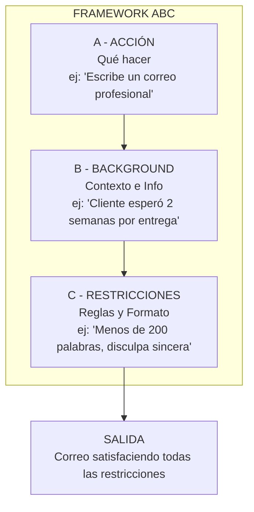
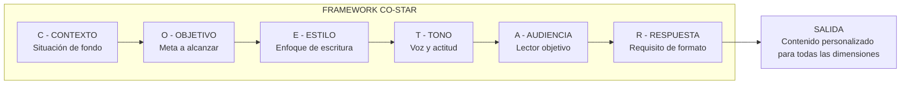
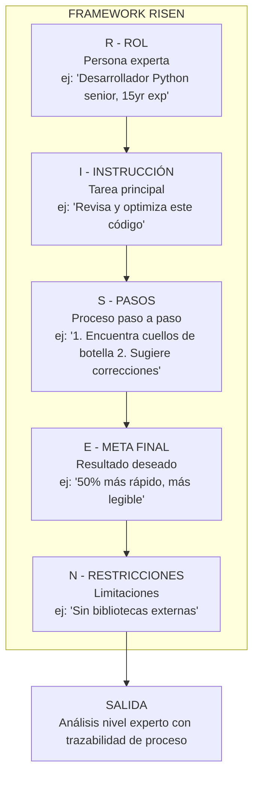

# Frameworks de Prompts: ABC, CO-STAR, RISEN

## ¿Por qué Usar Frameworks?

Los frameworks de prompts proporcionan plantillas estructuradas que producen consistentemente salidas de alta calidad de los LLMs. Eliminan la adivinación y ayudan a garantizar que tus prompts sean completos, claros y efectivos. Sin un framework, los prompts tienden a ser vagos, pierden contexto crítico o producen resultados impredecibles.

### El Problema con Prompts No Estructurados

| Problema | Prompt No Estructurado | Prompt Basado en Framework |
|----------|------------------------|----------------------------|
| Contexto ausente | "Escribe un correo" | Especifica remitente, destinatario, situación y resultado deseado |
| Instrucciones vagas | "Hazlo bueno" | Define tono, estilo, longitud y requisitos específicos |
| Salida inconsistente | Varía enormemente entre ejecuciones | Formato y calidad predecibles |
| Difícil de depurar | Sin componentes claros para aislar problemas | Cada componente puede probarse por separado |

---

## Framework ABC

**ABC** significa **A**cción, **B**ackground (Contexto), **C**onstraints (Restricciones).

| Componente | Propósito | Ejemplo |
|------------|-----------|---------|
| **A - Acción** | Lo que el modelo debe hacer | "Escribe una descripción de producto" |
| **B - Background** | Contexto e información | "Para una bota de senderismo impermeable" |
| **C - Restricciones** | Reglas y formato | "150 palabras, tono amigable, destaca durabilidad" |

### Diagrama de Flujo del Framework ABC



### Ejemplo del Framework ABC

```
[ACCIÓN] Escribe una respuesta profesional por correo a una queja de cliente.

[BACKGROUND] El cliente esperó 2 semanas por una entrega prometida en 3 días.
Está frustrado pero aún no ha pedido un reembolso. Tu empresa es "QuickShip Inc."

[RESTRICCIONES] 
- Manténlo bajo 200 palabras
- Discúlpate sinceramente (sin excusas)
- Ofrece un 20% de descuento en su próximo pedido
- Proporciona una actualización de seguimiento
- Firma como "Equipo de Soporte al Cliente"
```

[!TIP]
ABC es ideal para tareas que tienen instrucciones claras pero no requieren interpretación de roles compleja. Es el framework más rápido de escribir — perfecto para clasificación rápida, generación simple de contenido o redacción directa de correos.

### ABC en Código

```python
# Framework ABC aplicado vía API
from openai import OpenAI

client = OpenAI()

def abc_prompt(accion: str, background: str, restricciones: list[str]) -> str:
    """Construye un prompt en formato ABC"""
    texto_restricciones = "\n".join(f"- {r}" for r in restricciones)
    return f"""[ACCIÓN] {accion}

[BACKGROUND] {background}

[RESTRICCIONES] 
{texto_restricciones}"""

prompt = abc_prompt(
    accion="Escribe una respuesta profesional por correo a una queja de cliente.",
    background="El cliente esperó 2 semanas por una entrega prometida en 3 días.",
    restricciones=[
        "Mantenlo bajo 200 palabras",
        "Discúlpate sinceramente (sin excusas)",
        "Ofrece un 20% de descuento en su próximo pedido",
    ]
)

response = client.chat.completions.create(
    model="gpt-4",
    messages=[{"role": "user", "content": prompt}]
)
print(response.choices[0].message.content)
```

---

## Framework CO-STAR

**CO-STAR** significa **C**ontexto, **O**bjetivo, **E**stilo, **T**ono, **A**udiencia, **R**espuesta.

| Componente | Propósito | Ejemplo |
|------------|-----------|---------|
| **C - Contexto** | Situación de fondo | "Eres un consultor de marketing" |
| **O - Objetivo** | La meta a alcanzar | "Aumentar el engagement en redes sociales" |
| **E - Estilo** | Estilo de escritura | "Puntos clave, elementos accionables" |
| **T - Tono** | Voz/actitud | "Energético, alentador" |
| **A - Audiencia** | Quién está leyendo | "Pequeños empresarios nuevos en redes sociales" |
| **R - Respuesta** | Requisito de formato | "5 consejos, cada uno con explicación 'por qué funciona'" |

### Diagrama de Flujo del Framework CO-STAR



### Ejemplo del Framework CO-STAR

```
[CONTEXTO] Eres un nutricionista experimentado ayudando a profesionales ocupados a comer más saludable.

[OBJETIVO] Crea un plan de comidas simple de 5 días que requiera menos de 30 minutos de preparación por día.

[ESTILO] Formato de tabla estructurado con columnas: Comida, Ingredientes, Consejo Rápido.

[TONO] Alentador, práctico, sin juzgar.

[AUDIENCIA] Desarrolladores de software trabajando 60+ horas semanales que piden delivery 5+ veces por semana.

[RESPUESTA] Incluye opciones de desayuno, almuerzo y cena para cada día. Agrega una sección de "snack de emergencia" al final.
```

[!NOTE]
CO-STAR se destaca cuando **el tono y el estilo importan tanto como el contenido mismo**. Copias de marketing, comunicaciones ejecutivas y contenido orientado al usuario se benefician enormemente de especificar las seis dimensiones por separado.

---

## Framework RISEN

**RISEN** significa **R**ol, **I**nstrucción, **S**teps (Pasos), **E**nd goal (Meta final), **N**arrowing (Restricciones).

| Componente | Propósito | Ejemplo |
|------------|-----------|---------|
| **R - Rol** | Quién debe ser la IA | "Desarrollador Python senior con 15 años de experiencia" |
| **I - Instrucción** | Qué hacer | "Revisa y optimiza este código" |
| **S - Pasos** | Proceso a seguir | "1. Identifica cuellos de botella 2. Sugiere correcciones 3. Muestra antes/después" |
| **E - Meta final** | Resultado deseado | "Hacerlo funcionar 50% más rápido y ser más legible" |
| **N - Restricciones** | Filtros/limitaciones | "Sin bibliotecas externas, debe mantener compatibilidad hacia atrás" |

### Diagrama de Flujo del Framework RISEN



[!NOTE]
RISEN es particularmente poderoso para tareas complejas donde la IA necesita incorporar experiencia y seguir un proceso específico.

### Ejemplo del Framework RISEN

```
[ROL] Eres un diseñador UX senior que ha trabajado en empresas como Apple y Google. Estás especializado en interfaces accesibles y amigables.

[INSTRUCCIÓN] Revisa esta descripción de pantalla de aplicación e identifica problemas de usabilidad.

[PASOS]
1. Primero, identifica 3-5 problemas potenciales de usabilidad
2. Para cada problema, explica por qué es un problema
3. Proporciona una solución concreta para cada uno
4. Clasifica los problemas por severidad (Crítico, Alto, Medio, Bajo)

[META FINAL] La salida debe ayudar al equipo de producto a priorizar mejoras para su próximo sprint.

[RESTRICCIONES] Enfócate solo en usabilidad móvil. Ignora preocupaciones de backend y texto de marketing. Considera la accesibilidad para usuarios daltónicos como alta prioridad.
```

---

## Comparación de Frameworks

| Framework | Mejor Para | Fortalezas | Debilidades |
|-----------|------------|------------|-------------|
| **ABC** | Tareas rápidas, solicitudes simples | Más rápido de escribir, fácil de recordar | Menos detallado para tareas complejas |
| **CO-STAR** | Creación de contenido, marketing | Excelente para coincidencia de tono/estilo | Más componentes para recordar |
| **RISEN** | Tareas complejas, roles expertos | Proceso paso a paso, inmersión de rol | Más largo de elaborar, más detallado |

### Comparación Detallada Lado a Lado

| Dimensión | ABC | CO-STAR | RISEN |
|-----------|-----|---------|-------|
| **Número de componentes** | 3 | 6 | 5 |
| **Especificación de rol** | Implícita (vía Acción) | Implícita (vía Contexto) | Primer componente explícito |
| **Proceso paso a paso** | No soportado | No soportado | Integrado (Pasos) |
| **Control de tono/estilo** | Opcional (vía Restricciones) | Campos dedicados (Estilo, Tono) | Implícito (vía Rol) |
| **Conciencia de audiencia** | Opcional (vía Background) | Campo dedicado (Audiencia) | Opcional (vía Restricciones) |
| **Control de formato salida** | Vía Restricciones | Vía Respuesta | Vía Pasos + Meta final |
| **Tiempo para escribir** | ~30 segundos | ~2 minutos | ~5 minutos |
| **Mejor con contexto pequeño** | Sí | Moderado | Puede ser verboso |

### Cuándo Usar Cada Uno

| Escenario | Framework Recomendado |
|-----------|----------------------|
| Correo rápido, clasificación simple | ABC |
| Post de blog, redes sociales, copy marketing | CO-STAR |
| Revisión de código, análisis legal, depuración técnica | RISEN |
| Brainstorming de ideas creativas | CO-STAR o ABC |
| Generación de tutorial paso a paso | RISEN |
| Respuesta de soporte al cliente | ABC |
| Presentación ejecutiva | CO-STAR |

[!WARNING]
No fuerces un framework para cada prompt. Para preguntas simples como "¿Cuánto es 2+2?", los frameworks son excesivos. Úsalos cuando la calidad o especificidad de la salida importe.

[!TIP]
**Combinando frameworks:** Para tareas muy complejas, puedes superponer frameworks. Por ejemplo, usa la estructura de Rol y Pasos de RISEN pero incorpora los componentes de Tono y Audiencia de CO-STAR. Los mejores ingenieros de prompts mezclan y combinan según los requisitos específicos.

[!IMPORTANT]
**Limitaciones de los frameworks:** Ningún framework garantiza una salida perfecta. Son heurísticas, no algoritmos. Incluso el prompt más cuidadosamente estructurado puede fallar si el modelo subyacente carece del conocimiento o capacidad de razonamiento para la tarea. Siempre prueba e itera.

---

## Aplicando Frameworks al Mismo Problema

Apliquemos los tres frameworks al **mismo problema**: "Crea contenido explicando IA a ejecutivos."

### Versión ABC
```
[ACCIÓN] Escribe un resumen ejecutivo de 2 páginas sobre IA.

[BACKGROUND] Para ejecutivos C-suite de Fortune 500 que no saben nada sobre IA.
La empresa vende software empresarial. Los competidores están empezando a mencionar IA.

[RESTRICCIONES] Evita jerga. Enfócate en valor de negocio, no tecnología.
Incluye: Qué puede hacer la IA por nosotros, 3 casos de uso prácticos, costos/ROI estimados.
```

### Versión CO-STAR
```
[CONTEXTO] Eres un consultor de IA presentando al consejo ejecutivo.

[OBJETIVO] Conseguir aprobación de presupuesto para un programa piloto de IA ($500K).

[ESTILO] Formato de informe ejecutivo con secciones claras y viñetas.

[TONO] Confiado pero realista. No basado en hype.

[AUDIENCIA] CEO, CFO, CTO - todos escépticos sobre "cosas nuevas brillantes."

[RESPUESTA] Resumen Ejecutivo, 3 Casos de Uso con ROI, Desglose de Presupuesto,
Evaluación de Riesgos, Próximos Pasos. Todo en 2 páginas.
```

### Versión RISEN
```
[ROL] Eres un exconsultor de McKinsey especializado en transformación digital de IA.
Has ayudado a más de 20 empresas Fortune 500 a adoptar IA.

[INSTRUCCIÓN] Crea un documento de estrategia de IA persuasivo para aprobación ejecutiva.

[PASOS]
1. Comienza con un gancho de una frase "por qué esto importa ahora"
2. Presenta 3 iniciativas de IA de competidores para crear urgencia
3. Delinea 3 casos de uso específicos con ROI estimado de 6 meses
4. Incluye un escenario de "sin acción" mostrando riesgos de esperar
5. Termina con una "solicitud" clara y próximos pasos

[META FINAL] Conseguir compromiso verbal para presupuesto piloto de $500K al final de la presentación.

[RESTRICCIONES] Sin mención de redes neuronales, datos de entrenamiento o arquitecturas de modelo.
Cada afirmación debe estar enfocada en resultados de negocio.
```

### Python: Aplicando los Tres a la Misma Entrada

```python
from openai import OpenAI

client = OpenAI()

# Mismo escenario base para los tres frameworks
scenario = "Explica los beneficios de la migración a la nube a un CFO escéptico."

# Enfoque ABC
abc_prompt = f"""[ACCIÓN] Escribe un memorando persuasivo de una página sobre migración a la nube.

[BACKGROUND] {scenario}

[RESTRICCIONES]
- Menos de 300 palabras
- Enfócate en ahorro de costos y seguridad (las prioridades del CFO)
- Incluye un resumen de ROI en 3 viñetas
- Sin jerga técnica"""

# Enfoque CO-STAR
costar_prompt = f"""[CONTEXTO] Eres un arquitecto de nube presentando a un CFO escéptico sobre costos de nube.

[OBJETIVO] Convencer al CFO de aprobar un presupuesto de migración de $2M.

[ESTILO] Formato de memorando ejecutivo con cálculos claros de ROI.

[TONO] Basado en datos, confiado, conservador con promesas.

[AUDIENCIA] CFO de una empresa mediana, muy consciente de costos.

[RESPUESTA] Un memorando de una página con: comparación de costos a 3 años, beneficios de seguridad, cronograma de migración y mitigación de riesgos."""

# Enfoque RISEN
risen_prompt = f"""[ROL] Eres un arquitecto de nube senior que ha liderado 15+ migraciones empresariales con reducción promedio del 30% de costos.

[INSTRUCCIÓN] Escribe una propuesta de migración persuasiva.

[PASOS]
1. Abre con el problema de costo que la empresa enfrenta on-premise
2. Presenta comparación de TCO (Costo Total de Propiedad) a 3 años
3. Enumera beneficios de seguridad/cumplimiento
4. Aborda las objeciones probables del CFO
5. Termina con un primer paso claro y de bajo riesgo

[META FINAL] Conseguir aprobación para una prueba de concepto de $50K.

[RESTRICCIONES] Discute solo AWS. Ignora multi-nube. Enfócate en infraestructura, no en refactorización de aplicaciones."""

# Probar los tres
for nombre, prompt in [("ABC", abc_prompt), ("CO-STAR", costar_prompt), ("RISEN", risen_prompt)]:
    response = client.chat.completions.create(
        model="gpt-4",
        messages=[{"role": "user", "content": prompt}],
        temperature=0.3
    )
    print(f"\n=== SALIDA {nombre} ===")
    print(response.choices[0].message.content)
    print(f"Tokens usados: {response.usage.total_tokens}")
```

---

## Preguntas de Práctica

```question
{
  "id": "pe-02-es-q1",
  "type": "multiple-choice",
  "question": "Un profesional de marketing de contenido necesita escribir un post de blog con un tono y estilo específicos para un público objetivo. ¿Qué framework es más apropiado?",
  "options": ["ABC", "CO-STAR", "RISEN", "Ningún framework necesario"],
  "correct": 1,
  "explanation": "CO-STAR tiene campos dedicados para Estilo, Tono y Audiencia, haciéndolo ideal para creación de contenido donde estas dimensiones importan."
}
```

```question
{
  "id": "pe-02-es-q2",
  "type": "multiple-choice",
  "question": "En el framework ABC, ¿qué proporciona el componente 'B' (Background)?",
  "options": ["La acción principal que el modelo debe ejecutar", "El contexto y la información necesaria para la tarea", "Las reglas y restricciones de formato", "El rol y la persona de la IA"],
  "correct": 1,
  "explanation": "El componente Background proporciona el contexto y la información necesaria para la tarea."
}
```

```question
{
  "id": "pe-02-es-q3",
  "type": "multiple-choice",
  "question": "Un desarrollador senior está depurando un problema complejo de sistema distribuido y necesita que la IA siga un proceso de diagnóstico paso a paso específico mientras actúa como experto. ¿Qué framework es más adecuado?",
  "options": ["ABC", "CO-STAR", "RISEN", "Cualquier framework funciona igual"],
  "correct": 2,
  "explanation": "RISEN tiene componentes integrados de Pasos y Rol, haciéndolo ideal para tareas complejas de expertos orientadas a proceso."
}
```

```question
{
  "id": "pe-02-es-q4",
  "type": "multiple-choice",
  "question": "Según la lección, ¿cuándo es apropiado no usar un framework de prompts?",
  "options": ["Para tareas técnicas complejas de múltiples pasos", "Para creación de contenido con requisitos específicos de tono", "Para preguntas simples y directas como '¿Cuánto es 2+2?'", "Para escenarios de interpretación de expertos"],
  "correct": 2,
  "explanation": "Para preguntas simples y directas, los frameworks son excesivos. Úsalos cuando la calidad o especificidad de la salida importe."
}
```

```question
{
  "id": "pe-02-es-q5",
  "type": "multiple-choice",
  "question": "Un gerente de proyectos pide a la IA 'Escribe una descripción de producto para una bota de senderismo impermeable, 150 palabras, tono amigable.' ¿Qué componente del framework se está usando para la parte '150 palabras, tono amigable'?",
  "options": ["ABC - Acción", "ABC - Background", "ABC - Restricciones", "CO-STAR - Objetivo"],
  "correct": 2,
  "explanation": "'150 palabras, tono amigable' son reglas y requisitos de formato, que corresponden al componente Restricciones (C) de ABC."
}
```

```question
{
  "id": "pe-02-es-q6",
  "type": "multiple-choice",
  "question": "Un ingeniero de prompts necesita generar una respuesta que incluya un proceso de diagnóstico paso a paso específico. Solo un framework tiene un componente dedicado para especificar pasos procesales. ¿Cuál?",
  "options": ["Componente Acción de ABC", "Componente Respuesta de CO-STAR", "Componente Pasos de RISEN", "Ninguno — los pasos deben incluirse en el texto de instrucción para todos los frameworks"],
  "correct": 2,
  "explanation": "RISEN incluye exclusivamente un componente dedicado Pasos (S) para especificar el proceso exacto que la IA debe seguir."
}
```

```question
{
  "id": "pe-02-es-q7",
  "type": "multiple-choice",
  "question": "Un ingeniero usa CO-STAR para una tarea pero descubre que la salida carece de la profundidad de experto que necesita. ¿Qué modificación de framework probablemente ayudaría?",
  "options": ["Cambiar a ABC que tiene menos componentes", "Cambiar a RISEN que tiene un componente de Rol y Pasos para orientación de proceso", "Agregar más restricciones al campo Contexto en CO-STAR", "Reducir la temperature para hacer la salida más determinística"],
  "correct": 1,
  "explanation": "Los componentes explícitos de Rol y Pasos de RISEN proporcionan la definición de persona experta y orientación procesal que CO-STAR no tiene."
}
```

```question
{
  "id": "pe-02-es-q8",
  "type": "multiple-choice",
  "question": "Comparando ABC y CO-STAR, ¿cuál es la principal ventaja que CO-STAR tiene sobre ABC para contenido de marketing?",
  "options": ["CO-STAR tiene menos componentes, haciéndolo más rápido de escribir", "CO-STAR tiene campos separados para Estilo, Tono y Audiencia, dando control más fino sobre la voz del contenido", "CO-STAR es el único framework que soporta salida JSON", "CO-STAR automáticamente genera mejor contenido que ABC para todas las tareas"],
  "correct": 1,
  "explanation": "Los campos dedicados de Estilo, Tono y Audiencia de CO-STAR proporcionan control más granular sobre la voz y el objetivo del contenido, que es crítico para marketing."
}
```

```question
{
  "id": "pe-02-es-q9",
  "type": "multiple-choice",
  "question": "Un equipo de prompts necesita que sus frameworks de prompts sean probables — cada componente debe poder aislarse para pruebas A/B. ¿Qué estructura de componentes del framework hace esto más fácil?",
  "options": ["ABC con 3 componentes amplios", "CO-STAR con 6 componentes específicos y separables", "RISEN con 5 componentes fuertemente acoplados", "Todos los frameworks son igualmente probables"],
  "correct": 1,
  "explanation": "Los 6 componentes específicos y separables de CO-STAR (Contexto, Objetivo, Estilo, Tono, Audiencia, Respuesta) hacen más fácil aislar y probar A/B dimensiones individuales."
}
```

```question
{
  "id": "pe-02-es-q10",
  "type": "multiple-choice",
  "question": "Un desarrollador aplica ABC a una tarea de análisis de contrato legal pero obtiene resultados vagos. RISEN produce mejores resultados porque:",
  "options": ["El componente Restricciones de ABC no puede manejar requisitos legales", "El Rol (abogado experto) y Pasos (proceso de análisis) de RISEN proporcionan estructura que ABC no tiene para dominios expertos", "RISEN usa más tokens, lo que siempre produce mejores resultados", "ABC solo funciona para tareas de escritura de correos"],
  "correct": 1,
  "explanation": "Para dominios expertos como análisis legal, la definición explícita de Rol y los Pasos procesales de RISEN proporcionan orientación que la estructura más simple de ABC no tiene."
}
```

---

[!SUCCESS]
**Conclusiones Clave:**

- **ABC** (Acción, Background, Restricciones): Framework más rápido para tareas simples
- **CO-STAR** (Contexto, Objetivo, Estilo, Tono, Audiencia, Respuesta): Mejor para creación de contenido con requisitos específicos de estilo
- **RISEN** (Rol, Instrucción, Pasos, Meta final, Restricciones): Más detallado para tareas complejas y especializadas
- La elección del framework depende de la complejidad de la tarea y necesidad de especificidad de la salida
- No sobreingeniería: preguntas simples no necesitan frameworks
- Los frameworks pueden combinarse para tareas complejas — mezcla y combina componentes
- Siempre prueba e itera — los frameworks son heurísticas, no garantías
