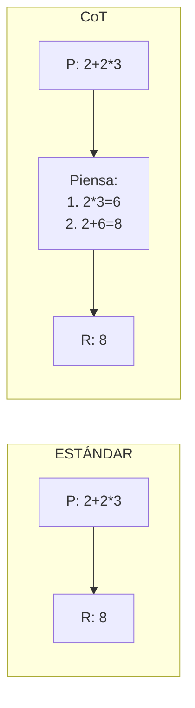
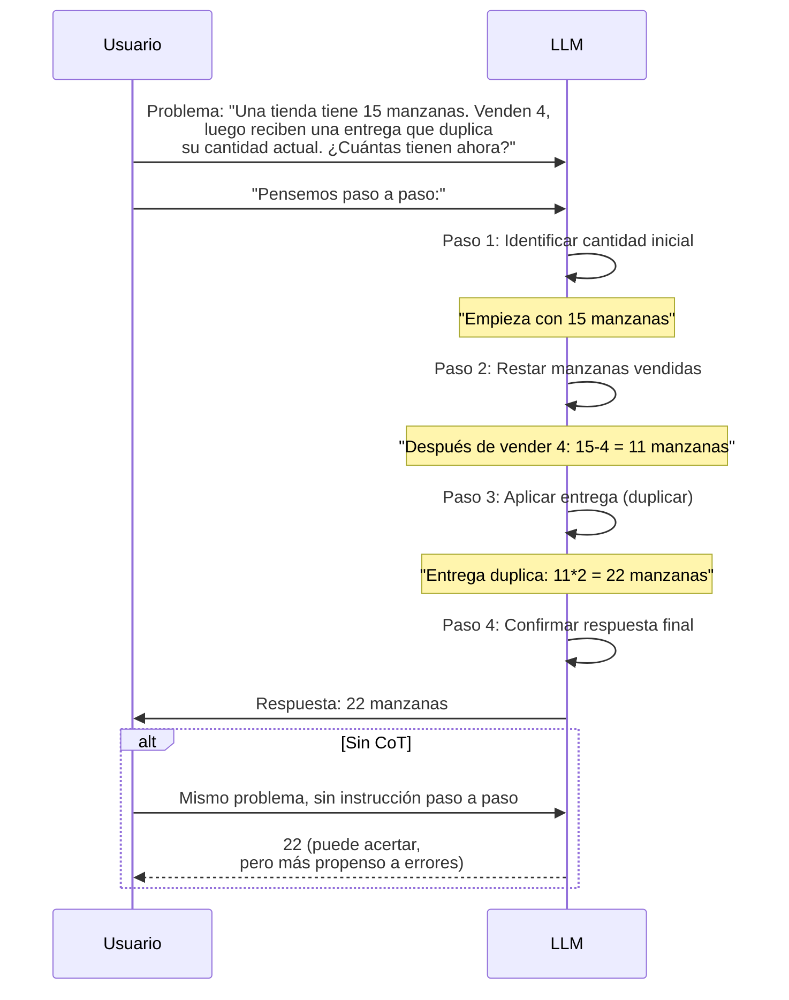
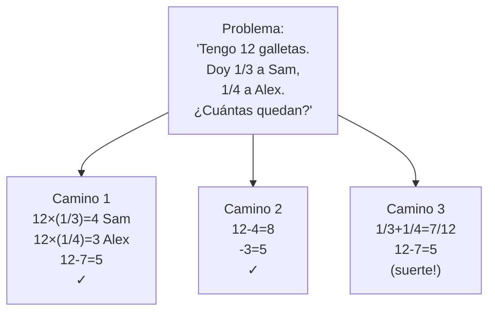
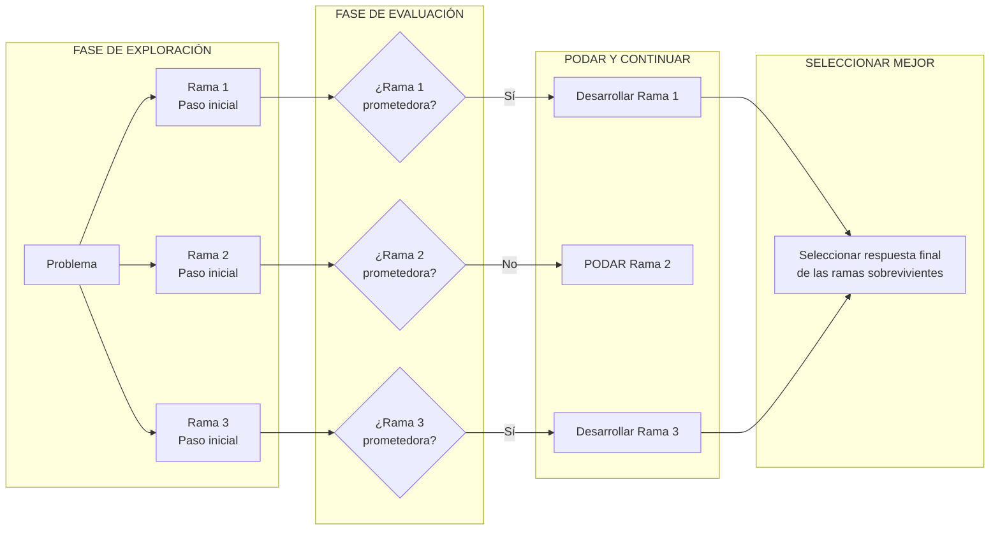

# Técnicas Avanzadas de Prompting

## ¿Por qué Técnicas Avanzadas?

El prompting básico funciona para tareas simples, pero el razonamiento complejo, las salidas estructuradas y los problemas especializados requieren enfoques más sofisticados. Cada técnica en esta lección aborda una limitación específica del prompting básico — desde mejorar el razonamiento paso a paso hasta permitir exploración multi-camino.

### Cuándo el Prompting Básico es Insuficiente

| Limitación | Intento Básico | Técnica Avanzada |
|------------|----------------|------------------|
| Problemas de matemáticas/lógica multi-paso | Modelo adivina respuesta final | Chain-of-Thought: razonamiento paso a paso |
| Formatos de salida desconocidos | Modelo inventa formato incorrecto | Few-Shot: ejemplos guían al modelo |
| Necesidad de salida legible por máquina | Respuestas de texto inconsistentes | Salidas Estructuradas: modo JSON |
| Respuesta única puede estar equivocada | Sin forma de verificar corrección | Self-Consistency: votación mayoritaria |
| Exploración/planificación compleja | Modelo sigue un camino | Tree-of-Thoughts: múltiples ramas |

---

## Chain-of-Thought (CoT) Prompting

Chain-of-Thought prompting anima al modelo a dividir problemas en pasos intermedios de razonamiento. En lugar de saltar directamente a una respuesta, el modelo "muestra su trabajo," lo que tanto mejora la precisión como facilita la depuración de errores.

### Flujo de Razonamiento CoT



### Secuencia Completa de Razonamiento CoT



### Ejemplo CoT

```
P: Una tienda tiene 15 manzanas. Venden 4, luego reciben una entrega que duplica
su cantidad actual de manzanas. ¿Cuántas manzanas tienen ahora?

Pensemos paso a paso:
1. Empieza con 15 manzanas
2. Después de vender 4: 15 - 4 = 11 manzanas
3. La entrega duplica la cantidad actual: 11 * 2 = 22 manzanas

Respuesta: 22
```

[!NOTE]
Simplemente agregar "Pensemos paso a paso" a tu prompt puede mejorar significativamente el rendimiento de razonamiento en problemas de matemáticas y lógica.

[!WARNING]
**Costos de token del CoT:** Chain-of-Thought puede aumentar los tokens de salida en 3-10x porque el modelo genera pasos intermedios de razonamiento antes de la respuesta final. Para aplicaciones sensibles al costo, considera usar prompts más cortos como "Explica brevemente" o limitar max_tokens. Para un sistema de producción procesando millones de solicitudes, este multiplicador de tokens afecta directamente tus costos.

### CoT en Código

```python
from openai import OpenAI

client = OpenAI()

# Sin CoT
response_direct = client.chat.completions.create(
    model="gpt-4",
    messages=[
        {"role": "user", "content": "Si una camiseta cuesta $40 y tiene 25% de descuento, más 8% de impuesto, ¿cuál es el precio final?"}
    ],
    temperature=0.0
)
print("Directo:", response_direct.choices[0].message.content)

# Con CoT
response_cot = client.chat.completions.create(
    model="gpt-4",
    messages=[
        {"role": "user", "content": """Si una camiseta cuesta $40 y tiene 25% de descuento, más 8% de impuesto, ¿cuál es el precio final?

Pensemos paso a paso:"""}
    ],
    temperature=0.0
)
print("\nCoT:", response_cot.choices[0].message.content)
```

### Variantes de CoT

| Variante | Descripción | Mejor Para |
|----------|-------------|------------|
| **Zero-shot CoT** | Solo añade "Pensemos paso a paso" | Mejora rápida de razonamiento |
| **Few-shot CoT** | Proporciona cadenas de razonamiento de ejemplo | Formato consistente, problemas más difíciles |
| **CoT Estructurado** | Exige pasos numerados o formato de viñetas | Depuración, pistas de auditoría |
| **CoT Multi-prompt** | Pide razonamiento, luego respuesta en llamadas separadas | Problemas complejos que necesitan verificación |

---

## Few-Shot y Multi-Shot Prompting

Few-shot prompting proporciona ejemplos en el prompt para guiar el comportamiento del modelo.

| Técnica | Ejemplos Proporcionados | Mejor Para |
|---------|-------------------------|------------|
| **Zero-Shot** | 0 ejemplos | Tareas simples, patrones comunes |
| **Few-Shot** | 1-5 ejemplos | Formatos específicos, tareas nuevas |
| **Multi-Shot** | 5+ ejemplos | Patrones complejos, alternativa a fine-tuning |

### Ejemplo Few-Shot: Análisis de Sentimiento

```
Clasifica el sentimiento como POSITIVO, NEGATIVO o NEUTRO.

Ejemplo 1:
Reseña: "¡Esta película fue increíble, la mejor que he visto en todo el año!"
Sentimiento: POSITIVO

Ejemplo 2:
Reseña: "Servicio terrible, nunca volveré."
Sentimiento: NEGATIVO

Ejemplo 3:
Reseña: "El restaurante está en la calle 5."
Sentimiento: NEUTRO

Ahora clasifica:
Reseña: "El producto funciona como se describe, nada excepcional."
Sentimiento:
```

[!TIP]
**Eligiendo los ejemplos correctos:** Selecciona ejemplos que cubran el rango de entradas esperadas. Incluye casos límite y ejemplos ambiguos. Ejemplos mal elegidos (ej: todos sentimiento positivo cuando el conjunto de prueba tiene sentimiento mixto) sesgan al modelo. Además, el orden importa — los modelos tienden a estar más influenciados por el último ejemplo (sesgo de actualidad).

### Few-Shot en Código

```python
from openai import OpenAI

client = OpenAI()

# Ejemplos few-shot
ejemplos = [
    {"resena": "¡Esta película fue increíble, la mejor que he visto en todo el año!", "sentimiento": "POSITIVO"},
    {"resena": "Servicio terrible, nunca volveré.", "sentimiento": "NEGATIVO"},
    {"resena": "El restaurante está en la calle 5.", "sentimiento": "NEUTRO"},
]

def few_shot_clasificar(texto_resena: str, ejemplos: list[dict]) -> str:
    prompt = "Clasifica el sentimiento como POSITIVO, NEGATIVO o NEUTRO.\n\n"
    for i, ej in enumerate(ejemplos, 1):
        prompt += f"Ejemplo {i}:\nReseña: \"{ej['resena']}\"\nSentimiento: {ej['sentimiento']}\n\n"
    prompt += f"Ahora clasifica:\nReseña: \"{texto_resena}\"\nSentimiento:"
    
    response = client.chat.completions.create(
        model="gpt-4",
        messages=[{"role": "user", "content": prompt}],
        temperature=0.0
    )
    return response.choices[0].message.content.strip()

prueba = "El producto funciona como se describe, nada excepcional."
print(few_shot_clasificar(prueba, ejemplos))
```

---

## Salidas Estructuradas (Modo JSON)

Muchos LLMs soportan formatos de salida estructurados, críticos para integración programática.

```python
from openai import OpenAI
import json

client = OpenAI()

response = client.chat.completions.create(
    model="gpt-4-turbo-preview",
    messages=[
        {"role": "system", "content": "Extrae datos del cliente y devuélvelos como JSON."},
        {"role": "user", "content": """
        Extrae información de este correo:
        "Hola, soy Juan Pérez de Acme Corp. Mi teléfono es 555-0123.
        Me gustaría pedir 10 unidades del plan PRO a $99/mes."
        """}
    ],
    response_format={"type": "json_object"}  # Modo JSON activado
)

# Parsear la salida estructurada
result = json.loads(response.choices[0].message.content)
print(json.dumps(result, indent=2, ensure_ascii=False))
```

**Salida Esperada:**
```json
{
  "cliente": {
    "nombre": "Juan Pérez",
    "empresa": "Acme Corp",
    "telefono": "555-0123"
  },
  "pedido": {
    "producto": "plan PRO",
    "cantidad": 10,
    "precio": 99,
    "ciclo_facturacion": "mensual"
  }
}
```

[!TIP]
**Validación de modo JSON:** Siempre valida las salidas JSON antes de usarlas en producción. Usa `json.loads()` con try/except para capturar JSON malformado. Considera usar modelos Pydantic para validación de esquema en aplicaciones Python.

### Validación de Esquema JSON

```python
import json
from typing import Optional
from pydantic import BaseModel, Field, ValidationError

class Cliente(BaseModel):
    nombre: str
    empresa: str
    telefono: Optional[str] = None

class Pedido(BaseModel):
    producto: str
    cantidad: int = Field(gt=0)
    precio: float = Field(gt=0)
    ciclo_facturacion: str

class ResultadoExtraccion(BaseModel):
    cliente: Cliente
    pedido: Pedido

# Parsear y validar salida de API
raw_json = '{"cliente": {"nombre": "Juan Pérez", "empresa": "Acme Corp"}, "pedido": {"producto": "plan PRO", "cantidad": 10, "precio": 99, "ciclo_facturacion": "mensual"}}'

try:
    validated = ResultadoExtraccion(**json.loads(raw_json))
    print(f"Validado: {validated.model_dump_json(indent=2, ensure_ascii=False)}")
except ValidationError as e:
    print(f"Error de validación: {e}")

# Anthropic Claude - salida estructurada vía prompt de sistema
import anthropic

client = anthropic.Anthropic()
response = client.messages.create(
    model="claude-3-opus-20240229",
    max_tokens=1000,
    system="Extraes datos a JSON. Solo produce JSON válido, sin otro texto.",
    messages=[
        {"role": "user", "content": "Extrae: Juan, Acme Corp, 555-0123, 10 unidades plan PRO $99/mes"}
    ]
)
print(response.content[0].text)
```

---

## Self-Consistency

Self-Consistency genera múltiples caminos de razonamiento y selecciona la respuesta más frecuente. Es como preguntar a tres expertos por separado y tomar el voto mayoritario — diversos caminos de razonamiento reducen la posibilidad de que un error único determine la respuesta final.

```
Genera 3 soluciones diferentes para este problema, luego elige la respuesta más común:

Problema: Un tren viaja a 60 mph por 2 horas, luego 80 mph por 1 hora.
¿Cuál es la velocidad media?

Solución 1:
- Distancia 1: 60 * 2 = 120 millas
- Distancia 2: 80 * 1 = 80 millas
- Total: 200 millas en 3 horas
- Media: 200/3 = 66.67 mph

Solución 2:
- Fórmula de la media = distancia total / tiempo total
- Distancia total = (60*2) + (80*1) = 200
- Tiempo total = 3
- 200/3 = 66.67 mph

Solución 3:
- Solo media de velocidades: (60+80)/2 = 70 mph

Respuesta más común: 66.67 mph (aparece 2 veces)
```

### Self-Consistency en Código

```python
from openai import OpenAI
from collections import Counter

client = OpenAI()

def self_consistency(problema: str, n_caminos: int = 3, temperature: float = 0.7) -> list[str]:
    """Genera n caminos de razonamiento y devuelve el más frecuente."""
    respuestas = []
    
    for i in range(n_caminos):
        response = client.chat.completions.create(
            model="gpt-4",
            messages=[
                {"role": "user", "content": f"{problema}\n\nPensemos paso a paso:"}
            ],
            temperature=temperature,
        )
        respuestas.append(response.choices[0].message.content)
        print(f"\nCamino {i+1}:\n{respuestas[-1]}")
    
    return respuestas

problema = "Un tren viaja a 60 mph por 2 horas, luego 80 mph por 1 hora. ¿Cuál es la velocidad media?"
resultados = self_consistency(problema, n_caminos=3)
```

---

## Tree-of-Thoughts (ToT)

Tree-of-Thoughts explora múltiples caminos de razonamiento simultáneamente, como un árbol de decisión. A diferencia de CoT que sigue una cadena de razonamiento, ToT se ramifica, evalúa cada rama y continúa caminos prometedores o poda callejones sin salida.



### Diagrama de Flujo de Ramificación Tree-of-Thoughts



[!WARNING]
Self-Consistency y Tree-of-Thoughts requieren múltiples llamadas de API, aumentando significativamente costo y latencia. Úsalas solo cuando las técnicas de una sola llamada no sean suficientes.

### Template de Prompt ToT

```
Quiero que resuelvas este problema usando razonamiento Tree-of-Thoughts.

Problema: {problema}

Instrucciones:
1. Primero, genera {num_ramas} enfoques iniciales diferentes para este problema
2. Para cada enfoque, piensa en el primer paso
3. Evalúa cada enfoque — ¿cuál parece más prometedor?
4. Para el enfoque más prometedor, continúa desarrollándolo
5. Repite: explora, evalúa, enfoca, hasta llegar a una respuesta

Comienza enumerando {num_ramas} maneras diferentes de abordar este problema:
```

---

## Comparación de Técnicas

| Técnica | Complejidad | Mejor Caso de Uso | Ganancia de Rendimiento | Costo de Token |
|---------|-------------|-------------------|-------------------------|----------------|
| **Chain-of-Thought** | Baja | Matemáticas, lógica, problemas multi-paso | +20-50% en razonamiento | 2-5x aumento |
| **Few-Shot** | Baja | Clasificación, coincidencia de formato | +10-30% vs zero-shot | 1-2x (tokens ejemplo) |
| **Modo JSON** | Baja | Integración API, datos estructurados | Crítico para fiabilidad | Mínimo (instrucción formato) |
| **Self-Consistency** | Media | Votación en múltiples salidas | +5-15% vs CoT único | 3-10x (múltiples respuestas) |
| **Tree-of-Thoughts** | Alta | Búsqueda/exploración compleja | +25-60% en problemas difíciles | 5-20x (muchas ramas) |

### Cuándo Usar Cada Técnica

| Escenario | Técnica Recomendada | Por qué |
|-----------|---------------------|---------|
| Problema de matemáticas | CoT | Paso a paso simple funciona mejor |
| Clasificar correos de clientes | Few-Shot | Ejemplos aclaran categorías ambiguas |
| Extraer datos para base de datos | Modo JSON | Salida legible por máquina necesaria |
| Diagnóstico médico crítico | Self-Consistency + CoT | Seguridad requiere votación mayoritaria |
| Estrategia de juego/nuevo rompecabezas | Tree-of-Thoughts | Necesario explorar múltiples enfoques |
| Resumir un documento | CoT (si complejo) o Zero-Shot | Simple generalmente es mejor |

[!IMPORTANT]
**Combinación de técnicas:** Estas técnicas no son mutuamente excluyentes. Puedes combinar CoT con Few-Shot (proporcionar cadenas de razonamiento de ejemplo), usar Self-Consistency con Modo JSON, o usar ToT con salidas estructuradas. Combinar técnicas puede componer beneficios — pero también componer costos de token.

---

## Preguntas de Práctica

```question
{
  "id": "pe-03-es-q1",
  "type": "multiple-choice",
  "question": "Un analista de datos necesita que el LLM extraiga información de clientes de correos y la devuelva en un formato legible por máquina para inserción en base de datos. ¿Qué técnica debe usar?",
  "options": ["Chain-of-Thought", "Few-Shot", "Salidas Estructuradas (Modo JSON)", "Self-Consistency"],
  "correct": 2,
  "explanation": "Salidas Estructuradas (Modo JSON) devuelve datos en formato JSON legible por máquina, adecuado para inserción en base de datos."
}
```

```question
{
  "id": "pe-03-es-q2",
  "type": "multiple-choice",
  "question": "Agregar la frase \"Pensemos paso a paso\" a un problema de matemáticas mejora la precisión al animar al modelo a:",
  "options": ["Generar múltiples respuestas y votar", "Dividir el razonamiento en pasos intermedios", "Devolver la respuesta en formato JSON", "Explorar múltiples caminos de razonamiento simultáneamente"],
  "correct": 1,
  "explanation": "Chain-of-Thought prompting anima al modelo a dividir problemas en pasos intermedios de razonamiento."
}
```

```question
{
  "id": "pe-03-es-q3",
  "type": "multiple-choice",
  "question": "Una tarea de análisis de sentimiento requiere que el modelo clasifique reseñas como POSITIVO, NEGATIVO o NEUTRO. El prompt incluye tres ejemplos etiquetados antes de pedir al modelo que clasifique una nueva reseña. Este enfoque se conoce como:",
  "options": ["Zero-shot prompting", "Few-shot prompting", "Tree-of-Thoughts", "Self-Consistency"],
  "correct": 1,
  "explanation": "Few-shot prompting proporciona ejemplos en el prompt para guiar el comportamiento del modelo."
}
```

```question
{
  "id": "pe-03-es-q4",
  "type": "multiple-choice",
  "question": "Un equipo de investigación necesita resolver un rompecabezas lógico novedoso que requiere explorar diferentes enfoques de razonamiento simultáneamente, como un árbol de decisión. ¿Qué técnica deben usar?",
  "options": ["Chain-of-Thought", "Self-Consistency", "Tree-of-Thoughts", "Modo JSON"],
  "correct": 2,
  "explanation": "Tree-of-Thoughts explora múltiples caminos de razonamiento simultáneamente, como un árbol de decisión."
}
```

```question
{
  "id": "pe-03-es-q5",
  "type": "multiple-choice",
  "question": "¿Cuál es el principal trade-off al usar Self-Consistency o Tree-of-Thoughts en comparación con técnicas más simples?",
  "options": ["Menor precisión en tareas simples", "Costo y latencia significativamente mayores debido a múltiples llamadas de API", "Incompatibilidad con modelos OpenAI", "Incapacidad para manejar salidas estructuradas"],
  "correct": 1,
  "explanation": "Self-Consistency y Tree-of-Thoughts requieren múltiples llamadas de API, aumentando significativamente costo y latencia."
}
```

```question
{
  "id": "pe-03-es-q6",
  "type": "multiple-choice",
  "question": "Un desarrollador implementa un sistema donde el LLM primero genera una cadena de razonamiento, luego produce una salida JSON. ¿Qué combinación de técnicas es esta?",
  "options": ["Zero-Shot + Few-Shot", "CoT + Salidas Estructuradas", "Self-Consistency + ToT", "Multi-Shot + Modo JSON"],
  "correct": 1,
  "explanation": "Combinar CoT (para razonamiento paso a paso) con Salidas Estructuradas/Modo JSON (para el resultado final legible por máquina) es un patrón de combinación común."
}
```

```question
{
  "id": "pe-03-es-q7",
  "type": "multiple-choice",
  "question": "Un equipo ejecuta CoT en una tarea de clasificación simple y ve que la precisión disminuye en comparación con zero-shot. ¿Cuál es la explicación más probable?",
  "options": ["CoT solo funciona con GPT-4, no con modelos más antiguos", "CoT añade pasos de razonamiento innecesarios que pueden causar confusión en tareas simples", "La temperature estaba demasiado baja", "Faltaban ejemplos few-shot"],
  "correct": 1,
  "explanation": "Para tareas simples, los pasos de razonamiento adicionales de CoT pueden introducir confusión o llevar al modelo a pensar demasiado. Las técnicas más simples son generalmente mejores para tareas directas."
}
```

```question
{
  "id": "pe-03-es-q8",
  "type": "multiple-choice",
  "question": "Un sistema de producción procesa 1M solicitudes/mes. Cambiar de zero-shot a CoT aumenta los tokens de salida de 50 a 200 por solicitud. A $0.03/1K tokens, ¿cuál es el aumento de costo mensual?",
  "options": ["$1,500", "$4,500", "$450", "$15,000"],
  "correct": 1,
  "explanation": "Cada solicitud ahora usa 150 tokens más. 1M × 150 = 150M tokens extra. A $0.03/1K, son $4,500/mes. Esto ilustra por qué el costo de token de CoT importa a escala."
}
```

```question
{
  "id": "pe-03-es-q9",
  "type": "multiple-choice",
  "question": "Un desarrollador usa few-shot prompting con ejemplos ordenados: NEGATIVO, POSITIVO, NEUTRO. El modelo clasifica mal la mayoría de los casos de prueba como NEUTRO. ¿Cuál es la causa más probable?",
  "options": ["El modelo no entiende análisis de sentimiento", "Sesgo de actualidad — el modelo está más influenciado por el último ejemplo (NEUTRO)", "La temperature está demasiado alta", "NEUTRO no es una categoría de sentimiento válida"],
  "correct": 1,
  "explanation": "Los LLMs exhiben sesgo de actualidad, lo que significa que están desproporcionadamente influenciados por los últimos ejemplos en el prompt. Reordenar ejemplos para que la categoría más frecuente o importante aparezca al final puede mejorar la precisión."
}
```

```question
{
  "id": "pe-03-es-q10",
  "type": "multiple-choice",
  "question": "Un ingeniero de prompts valida una salida JSON con Pydantic y captura un ValidationError. ¿Qué debe hacer a continuación?",
  "options": ["Ignorar el error y usar el JSON crudo de todos modos", "Reintentar la llamada de API con un prompt de sistema más estricto y posiblemente una temperature más alta", "Registrar el error, reintentar con un prompt corregido y alertar si los fallos exceden un umbral", "Cambiar a un proveedor de LLM diferente"],
  "correct": 2,
  "explanation": "Los sistemas de producción deben registrar errores de validación, implementar lógica de reintento con ajustes de prompt y alertar cuando las tasas de fallo excedan umbrales aceptables."
}
```

---

[!SUCCESS]
**Conclusiones Clave:**

- **Chain-of-Thought (CoT):** "Pensemos paso a paso" mejora el razonamiento en matemáticas/lógica
- **Few-Shot:** Proporciona 1-5 ejemplos para guiar el formato y estilo de la salida
- **Salidas Estructuradas (Modo JSON):** Crítico para integración programática de APIs
- **Self-Consistency:** Genera múltiples salidas y selecciona la respuesta más frecuente
- **Tree-of-Thoughts:** Explora múltiples ramas de razonamiento como un árbol de decisión
- Las técnicas avanzadas cuestan más tokens — equilibra necesidades de rendimiento con costo
- Las técnicas pueden combinarse: CoT + JSON, Few-Shot + CoT, Self-Consistency + Salidas Estructuradas
- Para tareas simples, las técnicas más simples generalmente superan a las complejas
- Siempre valida las salidas estructuradas antes del uso en producción
