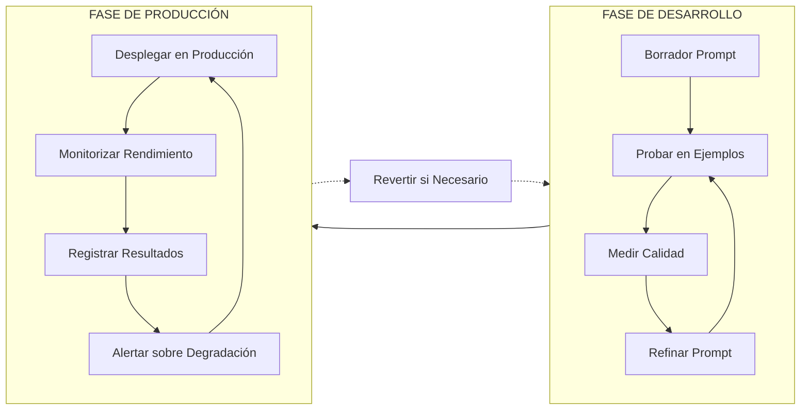
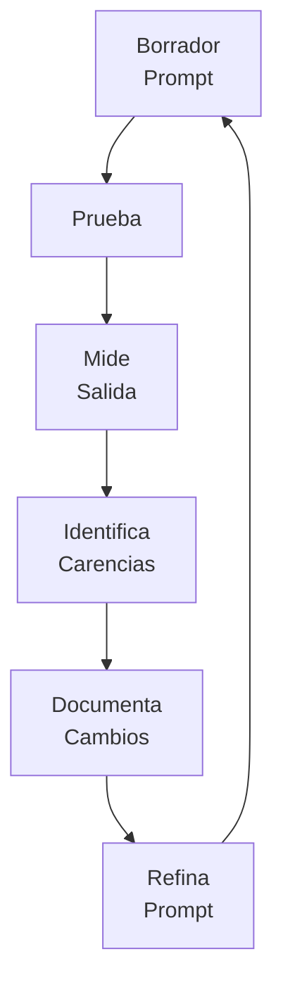
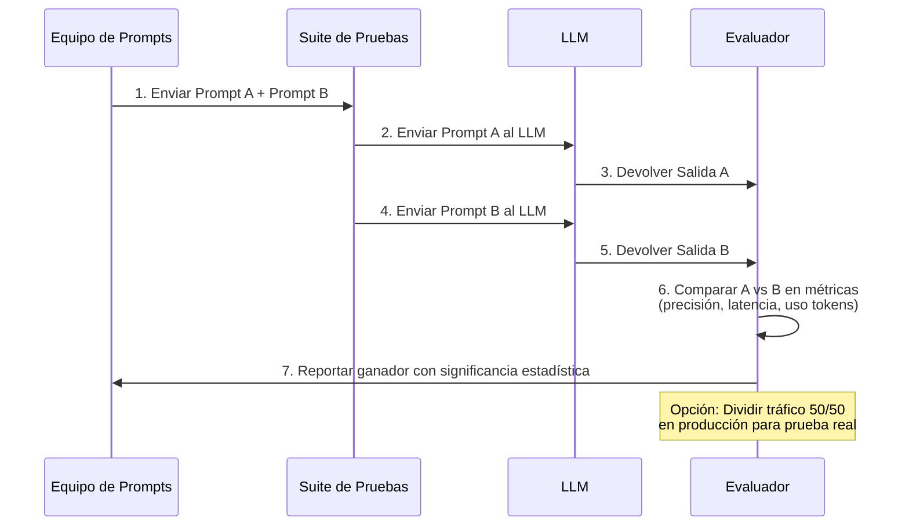
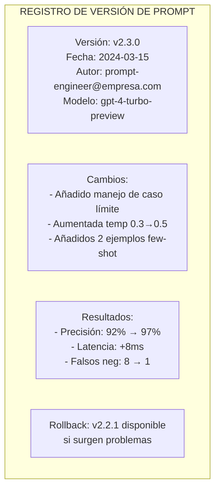
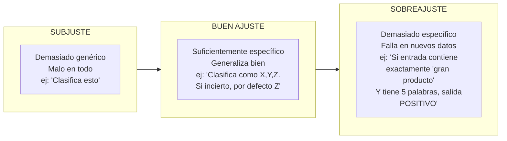

# Optimización, Pruebas y Versionado de Prompts

## La Naturaleza Iterativa de la Ingeniería de Prompts

Los grandes prompts raramente se crean en el primer intento. La ingeniería de prompts profesional es un proceso sistemático de prueba, medición y refinamiento. Como la ingeniería de software, la ingeniería de prompts requiere control de versiones, frameworks de prueba y pipelines de despliegue.

### El Ciclo de Vida de la Ingeniería de Prompts



---

## Refinamiento Iterativo de Prompts

### El Bucle de Optimización



### Ejemplo: Refinando un Prompt de Clasificación

**Versión 1 (Inicial):**
```
Clasifica este ticket de cliente.
```

**Versión 2 (Categorías añadidas):**
```
Clasifica este ticket de cliente como: FACTURACIÓN, TÉCNICO, REEMBOLSO o GENERAL.
```

**Versión 3 (Ejemplos añadidos):**
```
Clasifica este ticket de cliente. Categorías: FACTURACIÓN, TÉCNICO, REEMBOLSO, GENERAL.

Ejemplo: "Mi tarjeta fue cobrada dos veces" → FACTURACIÓN
Ejemplo: "La app se bloquea al iniciar sesión" → TÉCNICO

Ticket: "{{texto_ticket}}"
Clasificación:
```

**Versión 4 (Casos límite añadidos):**
```
Clasifica este ticket de cliente. Debe ser exactamente uno de: FACTURACIÓN, TÉCNICO, REEMBOLSO, GENERAL.

- FACTURACIÓN: Pago, cobros, facturas
- TÉCNICO: Bugs, errores, funcionalidad
- REEMBOLSO: Solicitando devolución de dinero
- GENERAL: Todo lo demás

Si es incierto, devuelve GENERAL.

Ticket: "{{texto_ticket}}"
Clasificación:
```

[!NOTE]
Cada versión en el ciclo de refinamiento apuntó a una carencia específica: V1 carecía de categorías, V2 carecía de ejemplos, V3 carecía de tratamiento de casos límite. Documentar qué cambió cada versión (y por qué) es crítico para el aprendizaje y la reproducibilidad.

### Plantilla de Seguimiento de Refinamiento

| Versión | Cambio | Métrica Antes | Métrica Después | Motivador de Decisión |
|---------|--------|---------------|-----------------|----------------------|
| v1 | Borrador inicial | Prec: 45% | 45% | Línea base |
| v2 | Categorías añadidas | Prec: 45% | 72% | Categorías poco claras causaron errores |
| v3 | 2 ejemplos añadidos | Prec: 72% | 85% | Inconsistencias de formato |
| v4 | Manejo de casos límite | Prec: 85% | 94% | Tickets ambiguos mal clasificados |

---

## Pruebas A/B de Prompts

Las pruebas A/B comparan dos versiones de prompt con las mismas entradas para medir cuál rinde mejor.

### Pipeline de Pruebas A/B



### Framework de Pruebas A/B

| Métrica | Cómo Medir | Buen Valor |
|---------|------------|------------|
| **Precisión** | % clasificado/respondido correctamente | >90% |
| **Consistencia** | Misma entrada → misma salida (temp baja) | 100% para factual |
| **Latencia** | Tiempo hasta el primer token | <1s para chat |
| **Eficiencia de Token** | Calidad de salida por token usado | Maximizar |
| **Satisfacción del Usuario** | Calificación humana o métricas downstream | >4/5 estrellas |

```python
# Ejemplo: Pruebas A/B de dos versiones de prompt
from openai import OpenAI
import json

client = OpenAI()

def probar_prompt(version_prompt: str, texto_entrada: str) -> dict:
    """Prueba una versión específica de prompt"""
    
    prompts = {
        "A": f"Clasifica: {texto_entrada} →",
        "B": f"""Clasifica este texto como POSITIVO, NEGATIVO o NEUTRO.
        Considera sarcasmo y contexto. Texto: {texto_entrada}"""
    }
    
    response = client.chat.completions.create(
        model="gpt-3.5-turbo",
        messages=[{"role": "user", "content": prompts[version_prompt]}],
        temperature=0.0
    )
    return {"version": version_prompt, "salida": response.choices[0].message.content}

# Ejecutar prueba A/B en la suite de pruebas
casos_prueba = [
    ("¡Excelente producto, me encanta!", "POSITIVO"),
    ("Experiencia terrible, nunca más", "NEGATIVO"),
    ("El cielo es azul", "NEUTRO")
]

resultados = []
for texto, esperado in casos_prueba:
    resultados.append({
        "entrada": texto,
        "esperado": esperado,
        "prompt_A": probar_prompt("A", texto),
        "prompt_B": probar_prompt("B", texto)
    })

print(json.dumps(resultados, indent=2, ensure_ascii=False))
```

[!TIP]
**Significancia estadística:** Ejecutar pruebas A/B en solo 3 casos de prueba no prueba nada. Usa al menos 50-100 casos de prueba diversos por versión. Calcula significancia estadística (p < 0.05) antes de declarar un ganador. Herramientas como `ttest_ind` de SciPy pueden ayudar a determinar si la diferencia es significativa o solo ruido.

### Automatización de Pruebas A/B

```yaml
# config-prueba-ab.yaml
nombre_prueba: clasificacion-sentimiento-v4-vs-v5
prompt_a: "Clasifica el sentimiento como POSITIVO, NEGATIVO o NEUTRO.\n\nTexto: {entrada}"
prompt_b: "Analiza el tono emocional de este texto. Devuelve uno de: POSITIVO, NEGATIVO, NEUTRO.\nConsidera contexto y sarcasmo.\n\nTexto: {entrada}"
archivo_casos_prueba: "casos_prueba/conjunto_prueba_sentimiento.json"
metricas:
  - precision
  - latencia_p50
  - uso_tokens
modelo: gpt-3.5-turbo
temperature: 0.0
tamano_minimo_muestra: 100
```

---

## Estrategias de Versionado de Prompts

| Estrategia | Descripción | Pros | Contras |
|------------|-------------|------|---------|
| **SemVer** | v1.0.0, v1.1.0 | Cambios importantes claros | Excesivo para cambios simples |
| **Basado en Fecha** | 2024-03-15, 2024-03-15-a | Cronológicamente claro | Difícil ver relaciones |
| **Basado en Git** | Hash commit + tag | Historial completo, procedencia | Requiere disciplina git |
| **Entorno** | prod-v1, staging-v2 | Estado de deploy claro | Puede divergir entre entornos |

### Comparación de Estrategias de Versionado

| Dimensión | SemVer | Basado en Fecha | Basado en Git | Entorno |
|-----------|--------|-----------------|---------------|---------|
| **Muestra cambios importantes** | Sí (major) | No | Vía mensajes commit | No |
| **Ordenación cronológica** | Parcial | Sí | Sí (historial) | No |
| **Facilidad de rollback** | Moderada | Difícil | Fácil (git revert) | Muy fácil |
| **Amigable para automatización** | Sí | Sí | Sí | Sí |
| **Legibilidad humana** | Buena | Buena | Mala (hashes) | Excelente |
| **Recomendado para** | APIs de producción | Experimentos internos | Todo trabajo producción | Seguimiento deploy |

[!NOTE]
Para sistemas de producción, combina **seguimiento Git** con **etiquetas SemVer** y **registros de cambios**. Esto proporciona auditabilidad y comunicación clara.

### Plantilla de Control de Versiones



### Versionado Semántico para Prompts

```
vMAJOR.MINOR.PATCH

MAJOR = Cambio importante (nuevo modelo, reescritura completa, cambio de formato)
MINOR = Mejora (nuevos ejemplos, restricciones añadidas, instrucciones mejoradas)
PATCH = Corrección (corrección de error tipográfico, clarificación menor, caso límite)
```

Ejemplo:
- v1.0.0: Versión inicial
- v1.1.0: Añadidos 3 ejemplos few-shot (mejora)
- v1.1.1: Corregido error tipográfico en prompt de sistema (parche)
- v2.0.0: Cambio de gpt-3.5-turbo a gpt-4 (cambio importante)

### Gestión de Prompts Basada en Git

```bash
# Inicializar control de versiones de prompt
git init
git add prompts/clasificacion-v1.txt
git commit -m "feat: prompt de clasificación inicial v1.0.0"

# Después de refinamiento
git add prompts/clasificacion-v2.txt
git commit -m "feat: añadir ejemplos few-shot, aumento precisión 72%→85%"

# Etiquetar versiones
git tag -a "clasificacion-v2.0.0" -m "prompt de clasificación listo para producción"
git tag -a "clasificacion-v2.0.1" -m "fix: manejar caso límite de entrada vacía"

# Rollback si es necesario
git checkout clasificacion-v2.0.0
```

---

## Plantillas de Prompts y Variables

Las plantillas separan la estructura del prompt de los datos dinámicos.

```python
# Ejemplo: Sistema de plantillas de prompt
from dataclasses import dataclass
from typing import Dict, Any

@dataclass
class PlantillaPrompt:
    nombre: str
    version: str
    plantilla_sistema: str
    plantilla_usuario: str
    variables: list[str]
    
    def renderizar(self, **kwargs) -> tuple[str, str]:
        """Renderiza la plantilla con las variables proporcionadas"""
        # Valida que todas las variables requeridas estén presentes
        for var in self.variables:
            if var not in kwargs:
                raise ValueError(f"Falta variable requerida: {var}")
        
        # Renderizar plantillas
        sistema = self.plantilla_sistema.format(**kwargs)
        usuario = self.plantilla_usuario.format(**kwargs)
        
        return sistema, usuario

# Define una plantilla
plantilla_clasificacion = PlantillaPrompt(
    nombre="clasificacion-ticket",
    version="2.3.0",
    plantilla_sistema="""Eres un clasificador de soporte al cliente.
Categorías: {categorias}
Si es incierto, usa GENERAL.""",
    plantilla_usuario="""Clasifica este ticket:

Texto del Ticket:
{texto_ticket}

Responde SOLO con el nombre de la categoría.""",
    variables=["categorias", "texto_ticket"]
)

# Usar la plantilla
msg_sistema, msg_usuario = plantilla_clasificacion.renderizar(
    categorias="FACTURACIÓN, TÉCNICO, REEMBOLSO, GENERAL",
    texto_ticket="Mi app se bloquea cuando intento subir fotos"
)

print("Sistema:", msg_sistema)
print("Usuario:", msg_usuario)
```

[!TIP]
**Bibliotecas de plantillas de prompts:** Para sistemas de producción, considera usar bibliotecas dedicadas de gestión de plantillas. `string.Template` de Python y Jinja2 son excelentes para plantillas complejas con lógica condicional y bucles. Para equipos más grandes, herramientas como `promptfoo` o registros de plantillas personalizados con almacenamiento en base de datos proporcionan versionado y consulta centralizados.

### Biblioteca de Plantillas con Jinja2

```python
from jinja2 import Template

# Plantilla compleja con condicionales
template_str = """
Eres un {{ rol }} especializado en {{ dominio }}.


Contexto: {{ contexto }}


Tarea: {{ instruccion }}


Ejemplos:

Entrada: {{ ex.entrada }}
Salida: {{ ex.salida }}



Ahora procesa:
Entrada: {{ entrada_actual }}
Salida:"""

template = Template(template_str)

renderizado = template.render(
    rol="analista de datos",
    dominio="análisis de comentarios de clientes",
    contexto="Procesamos miles de tickets de soporte diariamente",
    instruccion="Clasifica el sentimiento de cada ticket",
    ejemplos=[
        {"entrada": "¡Me encanta la nueva función!", "salida": "POSITIVO"},
        {"entrada": "Esto está roto", "salida": "NEGATIVO"},
    ],
    entrada_actual="El producto funciona bien"
)
print(renderizado)
```

### Mejores Prácticas de Gestión de Plantillas

| Práctica | Descripción | Beneficio |
|----------|-------------|-----------|
| **Patrón de registro** | Almacenar plantillas en BD/registro | Consulta centralizada, pista de auditoría |
| **Fijación de versión** | Cada referencia de plantilla incluye versión | Reproducibilidad |
| **Integración prueba A/B** | ID de plantilla + variante = grupo de prueba | Experimentación fácil |
| **Vista previa renderizada** | Vista previa de plantilla antes de llamada API | Depuración, validación |
| **Validación de variables** | Validar todas las variables antes de renderizar | Previene errores en tiempo de ejecución |

---

## Evitando el Sobreajuste

[!WARNING]
**Sobreajuste de prompt** ocurre cuando tu prompt funciona muy bien en tus ejemplos de prueba pero falla catastróficamente en datos del mundo real.

### Señales de Sobreajuste:
- Funciona perfectamente en tus 10 casos de prueba, falla en el 11
- Instrucciones altamente específicas que no generalizan
- El rendimiento cae cuando el formato de entrada cambia ligeramente

### El Espectro del Sobreajuste



### Estrategias de Prevención:

1. **Validación Holdout**: Mantén el 20% de datos no vistos durante la iteración
2. **Pruebas Adversariales**: Prueba con casos límite y entradas extrañas
3. **Simplifica**: Elimina instrucciones que no mejoran las métricas
4. **Cross-valida**: Prueba en diferentes versiones de modelo
5. **Monitoriza Producción**: Rastrea el rendimiento en datos reales

[!IMPORTANT]
**Evitar el sobreajuste es la habilidad más importante en la ingeniería de prompts de producción.** Un prompt que obtiene 98% en tu conjunto de prueba artesanal pero 60% en producción es peor que inútil — da falsa confianza. Siempre mantén un conjunto de prueba retenido que nunca optimices, y monitoriza continuamente el rendimiento en producción.

### Estudio de Caso de Sobreajuste

| Caso de Prueba | Conjunto de Entrenamiento (optimizado) | Conjunto Holdout (no visto) |
|----------------|--------------------------------------|----------------------------|
| "¡Excelente servicio!" | POSITIVO ✓ | POSITIVO ✓ |
| "Meh, está bien" | NEUTRO ✓ | NEUTRO ✓ |
| "El producto llegó roto y estoy furioso pero el reembolso fue procesado" | NEGATIVO ✓ | POSITIVO ✗ (modelo confundido por sentimiento mixto) |
| "No lo odio" | POSITIVO ✓ | NEGATIVO ✗ (modelo perdió doble negativa) |
| "CLIENTE ENOJADO Y FUERTE" | NEGATIVO ✓ | POSITIVO ✗ (modelo confundido por MAYÚSCULAS) |

**Causa raíz:** El conjunto de entrenamiento solo tenía ejemplos simples, de una sola frase y un solo sentimiento. Las entradas del mundo real tenían sentimiento mixto, dobles negativas y formato inusual.

---

## Preguntas de Práctica

```question
{
  "id": "pe-04-es-q1",
  "type": "multiple-choice",
  "question": "Un ingeniero de prompts itera a través de cuatro versiones de un prompt de clasificación, cada vez midiendo la precisión y refinando según las carencias. Este proceso se llama:",
  "options": ["Pruebas A/B", "Refinamiento iterativo de prompts", "Sobreajuste de prompts", "Control de versiones"],
  "correct": 1,
  "explanation": "El refinamiento iterativo de prompts es el proceso sistemático de prueba, medición y refinamiento."
}
```

```question
{
  "id": "pe-04-es-q2",
  "type": "multiple-choice",
  "question": "Un equipo compara dos versiones de prompt (A y B) en la misma suite de casos de prueba, midiendo cuál produce clasificaciones más precisas. Esto se conoce como:",
  "options": ["Refinamiento iterativo", "Pruebas A/B", "Etiquetado SemVer", "Renderizado de plantilla"],
  "correct": 1,
  "explanation": "Las pruebas A/B comparan dos versiones de prompt con las mismas entradas para medir cuál rinde mejor."
}
```

```question
{
  "id": "pe-04-es-q3",
  "type": "multiple-choice",
  "question": "Para un sistema de prompts de producción que necesita historial completo de cambios y comunicación clara sobre cambios importantes, la estrategia de versionado recomendada es:",
  "options": ["Solo versionado basado en fecha", "Solo nomenclatura basada en entorno", "Seguimiento Git combinado con etiquetas SemVer", "Numeración secuencial sin documentación"],
  "correct": 2,
  "explanation": "Combinar seguimiento Git con etiquetas SemVer proporciona auditabilidad y comunicación clara sobre cambios."
}
```

```question
{
  "id": "pe-04-es-q4",
  "type": "multiple-choice",
  "question": "Un prompt alcanza 98% de precisión en los 10 casos de prueba del ingeniero, pero cae a 60% cuando se despliega en tickets reales de clientes. Este fenómeno se llama:",
  "options": ["Desajuste de plantilla", "Sobreajuste de prompts", "Ineficiencia de tokens", "Degradación de latencia"],
  "correct": 1,
  "explanation": "El sobreajuste de prompts ocurre cuando un prompt funciona bien en datos de prueba pero falla en datos del mundo real."
}
```

```question
{
  "id": "pe-04-es-q5",
  "type": "multiple-choice",
  "question": "¿Cuál es la principal ventaja de usar plantillas de prompts con variables como `{{texto_ticket}}`?",
  "options": ["Mejoran automáticamente la precisión del modelo", "Eliminan la necesidad de pruebas A/B", "Separan la estructura del prompt de los datos dinámicos, mejorando la mantenibilidad", "Reducen el uso de tokens en un 50%"],
  "correct": 2,
  "explanation": "Las plantillas de prompts separan la estructura del prompt de los datos dinámicos, mejorando la mantenibilidad y consistencia."
}
```

```question
{
  "id": "pe-04-es-q6",
  "type": "multiple-choice",
  "question": "Un ingeniero de prompts ejecuta una prueba A/B con solo 5 casos de prueba. La versión A acierta 4/5 y la versión B acierta 5/5. ¿Qué debe concluir?",
  "options": ["La versión B es definitivamente mejor — desplegar inmediatamente", "El tamaño de la muestra es demasiado pequeño para sacar conclusiones estadísticamente significativas", "Ambas versiones son igualmente buenas", "La versión A debe descartarse permanentemente"],
  "correct": 1,
  "explanation": "Con solo 5 casos de prueba, una diferencia de un resultado no prueba superioridad. Las pruebas A/B necesitan al menos 50-100 casos diversos por versión para resultados significativos."
}
```

```question
{
  "id": "pe-04-es-q7",
  "type": "multiple-choice",
  "question": "Un ingeniero de prompts actualiza un prompt añadiendo dos nuevos ejemplos few-shot. Siguiendo SemVer, este cambio debe versionarse como:",
  "options": ["v1.0.0 → v2.0.0 (cambio major)", "v1.0.0 → v1.1.0 (mejora minor)", "v1.0.0 → v1.0.1 (parche)", "v1.0.0 → v1.0.0-a (alfa)"],
  "correct": 1,
  "explanation": "Añadir ejemplos es una mejora, no un cambio importante, por lo que es un incremento de versión MINOR (v1.0.0 → v1.1.0)."
}
```

```question
{
  "id": "pe-04-es-q8",
  "type": "multiple-choice",
  "question": "Una plantilla de prompt renderiza con valores de variables ausentes produciendo 'Soy un None asistente para None empresa'. ¿Cuál es la causa raíz?",
  "options": ["El modelo alucinó los valores None", "La plantilla usó .format() con una variable faltante, causando KeyError o string 'None'", "La temperature estaba demasiado alta", "El modo JSON no estaba activado"],
  "correct": 1,
  "explanation": "Una variable faltante en .format() o lanza KeyError (si no está en kwargs) o renderiza como 'None' (si la variable existe pero es None). Siempre valida todas las variables de la plantilla antes de renderizar."
}
```

```question
{
  "id": "pe-04-es-q9",
  "type": "multiple-choice",
  "question": "Un equipo de prompts despliega la Versión A del Prompt en producción pero ve la precisión caer de 94% a 82%. Necesitan revertir rápidamente. ¿Qué estrategia de versionado facilita esto más?",
  "options": ["Basado en fecha (necesita encontrar la fecha correcta)", "Basado en Git con etiquetas (git revert/checkout simple)", "Numeración secuencial (necesita recordar qué versión funcionaba)", "Sin versionado (rollback imposible)"],
  "correct": 1,
  "explanation": "El versionado basado en Git con etiquetas hace que el rollback sea trivial mediante comandos git, proporcionando la ruta de recuperación más rápida."
}
```

```question
{
  "id": "pe-04-es-q10",
  "type": "multiple-choice",
  "question": "Un ingeniero de prompts añade una instrucción compleja para manejar un caso límite raro, mejorando la precisión de 94% a 95% en el conjunto de prueba. El prompt ahora es 3x más largo. ¿Debe desplegarlo?",
  "options": ["Sí — mayor precisión siempre gana", "No — la ganancia marginal probablemente no justifica la complejidad adicional y el riesgo potencial de sobreajuste", "Solo si también aumentan la temperature", "Sí — los prompts más largos siempre producen mejores resultados"],
  "correct": 1,
  "explanation": "Una ganancia del 1% de precisión con 3x complejidad probablemente indica sobreajuste a casos límite en el conjunto de prueba. La complejidad adicional puede perjudicar la generalización en datos no vistos. Los prompts más simples generalizan mejor."
}
```

---

[!SUCCESS]
**Conclusiones Clave:**

- La ingeniería de prompts es iterativa: Borrador → Probar → Medir → Identificar Carencias → Refinar → Repetir
- Las pruebas A/B comparan versiones de prompts sistemáticamente usando métricas como precisión, consistencia y latencia
- El control de versiones (Git + SemVer) es crítico para prompts de producción; siempre documenta cambios
- Las plantillas de prompts separan estructura de datos, mejorando mantenibilidad y consistencia
- El sobreajuste ocurre cuando los prompts funcionan en datos de prueba pero fallan en datos reales — usa validación holdout
- Los sistemas de producción necesitan monitorización, registro y capacidades de rollback
- La significancia estadística importa en pruebas A/B — no declares ganadores en muestras pequeñas
- Las bibliotecas de plantillas como Jinja2 permiten generación condicional compleja de prompts
- Los prompts más simples generalizan mejor — no sobreingeniería para ganancias marginales
