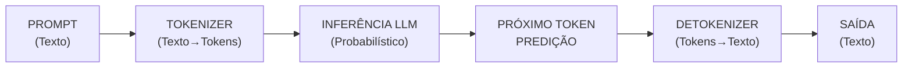
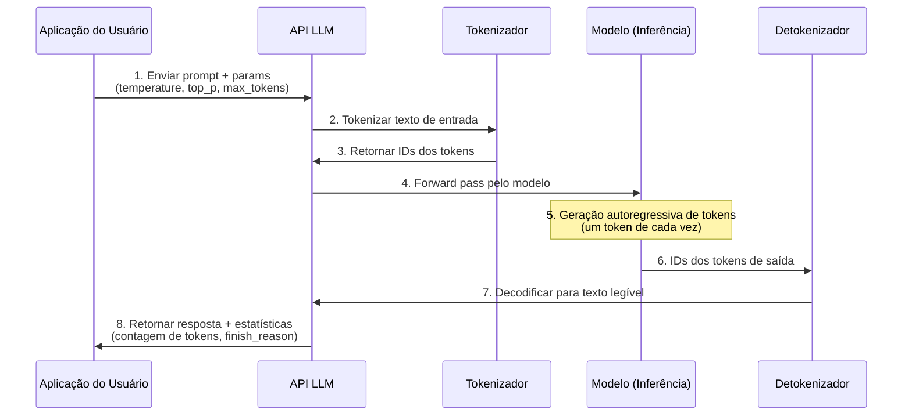
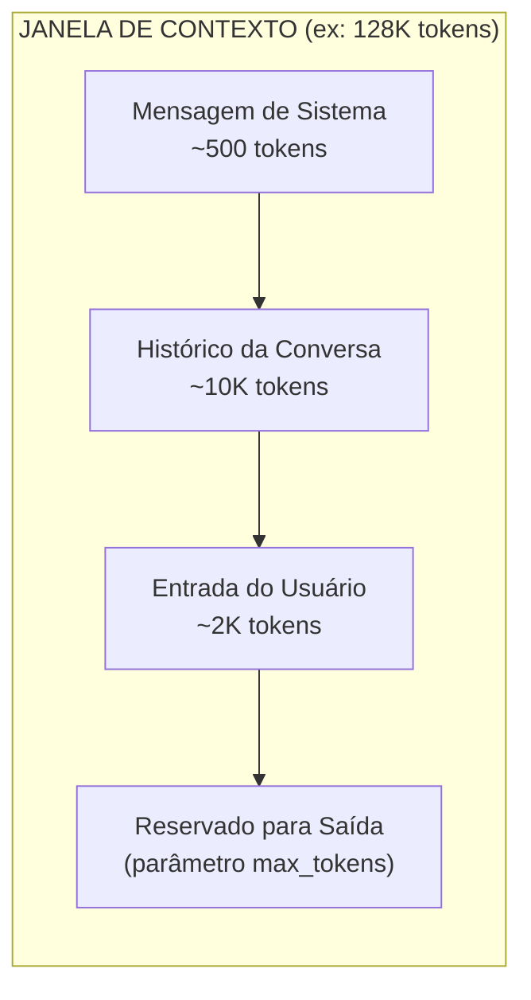
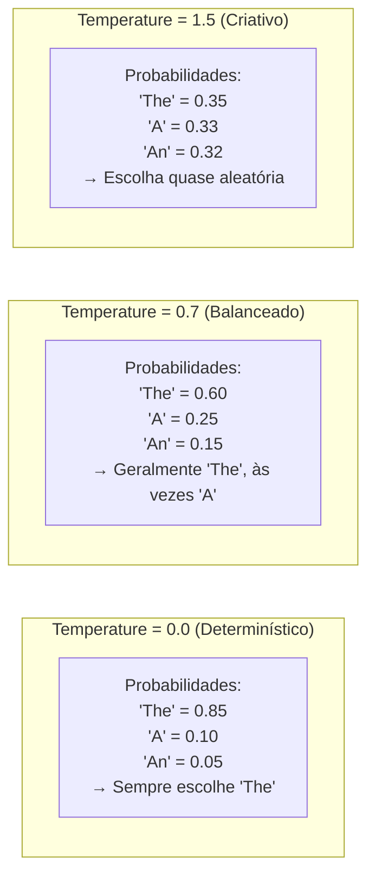
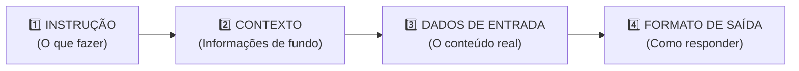

# Fundamentos da Engenharia de Prompt

## O que é um Prompt?

Um prompt é a entrada que você fornece a um LLM para obter uma resposta específica. É a unidade fundamental de interação com modelos de IA modernos como GPT-4, Claude e Llama. A qualidade do seu prompt determina diretamente a qualidade da saída do modelo — lixo entra, lixo sai continua sendo tão verdadeiro para IA quanto para software tradicional.

### Fluxo de Entrada/Saída do LLM



### Ciclo de Vida Completo de uma Chamada de API



[!NOTE]
Cada chamada de API passa por múltiplos estágios: tokenização converte seu texto em números que o modelo entende, inferência gera tokens probabilisticamente e detokenização converte os resultados de volta para texto. Entender esse pipeline ajuda a depurar problemas como limites de token ou saídas inesperadas.

---

## Tokenização

Tokenização é o processo de dividir o texto em unidades menores (tokens) que o modelo consegue entender. Modelos diferentes usam algoritmos de tokenização diferentes — GPT-4 usa Byte-Pair Encoding (BPE), enquanto outros modelos podem usar SentencePiece ou WordPiece.

### Fatos sobre Tokens:
- 1 token ≈ 4 caracteres em inglês
- 100 tokens ≈ 75 palavras
- Modelos diferentes têm tokenizadores diferentes
- Tokens especiais (como `<|endoftext|>`) também contam para seu limite

### Comparação de Tokenizadores entre Modelos

| Modelo | Tipo de Tokenizador | Tamanho do Vocabulário | Aprox. Tokens por Palavra (Inglês) | Características Especiais |
|--------|---------------------|------------------------|-------------------------------------|---------------------------|
| **GPT-4 / GPT-3.5** | BPE (Byte-Pair Encoding) | ~100K | 1.3 | OpenAI tiktoken, lida bem com código |
| **Claude (Anthropic)** | BPE (Byte-Pair Encoding) | ~100K | 1.3 | Eficiente para texto multilíngue |
| **Llama 2/3** | BPE (SentencePiece) | ~32K | 1.4 | Vocabulário menor, bom para memória limitada |
| **Gemini (Google)** | SentencePiece | ~256K | 1.2 | Maior vocabulário, eficiente para CJK |

```python
# Exemplo: Tokenização com tiktoken da OpenAI
import tiktoken

# Carrega o tokenizador para GPT-4
encoding = tiktoken.encoding_for_model("gpt-4")

text = "Olá, como você está?"
tokens = encoding.encode(text)

print(f"Texto original: {text}")
print(f"Tokens: {tokens}")
print(f"Quantidade de tokens: {len(tokens)}")

# Decodifica de volta para texto
decoded = encoding.decode(tokens)
print(f"Decodificado: {decoded}")
```

[!TIP]
Sempre estime o uso de tokens antes de enviar prompts grandes. Um prompt de 1000 tokens + resposta custa aproximadamente $0.01-0.03 com GPT-4, mas os custos se acumulam rapidamente em produção. Use `tiktoken` ou o tokenizador do seu modelo para contar tokens no lado do cliente antes da chamada de API.

### Limites de Janela de Contexto



[!IMPORTANT]
Cada modelo tem uma **janela de contexto** (GPT-4: 8K-128K, Claude 3: 200K, Gemini: 32K-1M). A soma da sua mensagem de sistema + histórico da conversa + entrada do usuário + saída gerada **deve caber** dentro desta janela. Uma vez excedida, o modelo trunca mensagens mais antigas — potencialmente perdendo contexto importante.

---

## Papéis: Sistema vs Usuário vs Assistente

LLMs usam um histórico de conversa com três papéis distintos:

| Papel | Propósito | Exemplo de Uso |
|-------|-----------|----------------|
| **Sistema** | Define comportamento, personalidade e contexto para toda a conversa | "Você é um tutor de Python prestativo. Seja conciso e use exemplos de código." |
| **Usuário** | Representa a entrada ou pergunta do humano | "Como ordeno uma lista em Python?" |
| **Assistente** | Representa as respostas anteriores da IA no histórico | "Você pode usar a função sorted() ou o método .sort()..." |

[!NOTE]
A mensagem de sistema é particularmente poderosa—ela persiste durante toda a conversa e guia como o modelo responde a todas as mensagens subsequentes.

[!IMPORTANT]
**Melhores práticas de prompt de sistema:** Seja específico sobre a persona do modelo, formato de saída e restrições. Inclua salvaguardas como "Se você não souber a resposta, diga." Evite instruções vagas como "seja útil" — em vez disso, descreva como ser útil parece no seu contexto.

```python
from openai import OpenAI

client = OpenAI()

response = client.chat.completions.create(
    model="gpt-4",
    messages=[
        # Papel sistema: Define a persona da IA
        {"role": "system", "content": "Você é um tutor de matemática conciso. Explique conceitos de forma simples."},
        # Papel usuário: A pergunta real
        {"role": "user", "content": "O que é o teorema de Pitágoras?"}
    ]
)

# Papel assistente: A resposta
assistant_reply = response.choices[0].message.content
print(assistant_reply)
```

### Exemplos de Diferentes Provedores

```python
# API Anthropic Claude
import anthropic

client = anthropic.Anthropic()

response = client.messages.create(
    model="claude-3-opus-20240229",
    system="Você é um tutor de matemática conciso. Explique conceitos de forma simples.",
    messages=[
        {"role": "user", "content": "O que é o teorema de Pitágoras?"}
    ]
)
print(response.content[0].text)
```

```python
# API Google Gemini
import google.generativeai as genai

genai.configure(api_key="YOUR_API_KEY")
model = genai.GenerativeModel(
    model_name="gemini-1.5-pro",
    system_instruction="Você é um tutor de matemática conciso. Explique conceitos de forma simples."
)
response = model.generate_content("O que é o teorema de Pitágoras?")
print(response.text)
```

---

## Temperature e Top_p

Esses parâmetros controlam a aleatoriedade e a criatividade da saída:

| Parâmetro | Intervalo | Propósito | Valores Típicos |
|-----------|-----------|-----------|-----------------|
| **Temperature** | 0-2 | Controla aleatoriedade. Menor = mais determinístico | 0.0 (determinístico), 0.7 (balanceado), 1.5 (criativo) |
| **Top_p** | 0-1 | Amostragem por núcleo. Considera apenas tokens com massa de probabilidade cumulativa | 0.1 (focado), 0.9 (diverso) |

### Como a Temperature Realmente Funciona

Na temperature 0, o modelo sempre escolhe o token de maior probabilidade (decodificação gulosa). Conforme a temperature aumenta, tokens de menor probabilidade se tornam mais propensos a serem escolhidos, produzindo saídas mais variadas e criativas.



[!TIP]
**Escolhendo valores de temperature:** Para tarefas factuais (classificação, extração, Q&A), use 0.0-0.3. Para tarefas criativas (escrita de histórias, brainstorming), use 0.7-1.2. Evite temperatures acima de 1.5 a menos que você queira saída quase aleatória — a saída "criativa" rapidamente se torna incoerente.

[!WARNING]
Definir temperature > 1.0 ou top_p > 0.9 pode levar a respostas incoerentes ou alucinadas. Para tarefas factuais, use temperature 0.0-0.5.

```python
from openai import OpenAI

client = OpenAI()

# Escrita criativa - temperature alta
creative_response = client.chat.completions.create(
    model="gpt-4",
    messages=[{"role": "user", "content": "Escreva uma história de uma frase sobre um robô"}],
    temperature=1.8,  # Muito criativo
    top_p=0.95
)
print("Criativo:", creative_response.choices[0].message.content)

# Resposta factual - temperature baixa
factual_response = client.chat.completions.create(
    model="gpt-4",
    messages=[{"role": "user", "content": "Qual é o ponto de ebulição da água ao nível do mar?"}],
    temperature=0.0,  # Determinístico
    top_p=0.1
)
print("Factual:", factual_response.choices[0].message.content)
```

### Interação entre Temperature e Top_p

| Cenário | Temperature | Top_p | Efeito |
|---------|-------------|-------|--------|
| **Factual estrito** | 0.0 | 1.0 | Modelo não assume riscos, determinístico |
| **Escrita criativa** | 1.0 | 0.95 | Seleção ampla de tokens, alta criatividade |
| **Criativo focado** | 0.8 | 0.5 | Criativo mas dentro de tokens prováveis |
| **Geração de código** | 0.2 | 0.9 | Maioria determinístico, variação leve |
| **Brainstorming** | 1.2 | 0.95 | Alta variedade, muitas alternativas |

[!NOTE]
A maioria das APIs recomenda ajustar apenas um parâmetro. Se você definir ambos, temperature primeiro suaviza a distribuição de probabilidade, depois top_p corta a cauda. Definir ambos para valores extremos simultaneamente pode produzir resultados muito estranhos.

---

## Zero-Shot Prompting

Zero-shot prompting é quando você pede ao modelo para executar uma tarefa sem nenhum exemplo.

```
Classifique este email como "importante", "spam" ou "neutro":

"URGENTE: Sua conta bancária foi comprometida. Clique aqui para verificar."
```

### Modelo Básico de Estrutura de Prompt



### Quando o Zero-Shot Funciona Melhor

| Tipo de Tarefa | Desempenho Zero-Shot | Notas |
|----------------|----------------------|-------|
| Classificação comum | Bom | Modelos conhecem categorias intrinsecamente |
| Q&A simples | Excelente | Conhecimento factual dos dados de treino |
| Tradução | Variável | Depende do par de idiomas e treinamento |
| Tarefas altamente especializadas | Ruim | Precisa de exemplos ou fine-tuning |
| Formatos novos | Ruim | Modelos precisam de exemplos de novas estruturas |

[!NOTE]
Zero-shot funciona surpreendentemente bem para tarefas que o modelo encontrou durante o treinamento. Ele luta com casos de borda, domínios altamente especializados ou requisitos precisos de formato — é aí que entram as técnicas few-shot e avançadas.

---

## Perguntas de Prática

```question
{
  "id": "pe-01-pt-q1",
  "type": "multiple-choice",
  "question": "Um engenheiro de software quer usar um LLM para um chatbot de suporte ao cliente. Qual papel da conversa deve ser usado para definir a personalidade e as diretrizes de comportamento do chatbot?",
  "options": ["Papel do usuário", "Papel do sistema", "Papel do assistente", "Papel do tokenizador"],
  "correct": 1,
  "explanation": "O papel de sistema define a personalidade e as diretrizes de comportamento da IA para toda a conversa."
}
```

```question
{
  "id": "pe-01-pt-q2",
  "type": "multiple-choice",
  "question": "Ao tokenizar a frase \"Olá, como você está?\" usando o tiktoken da OpenAI, o que acontece durante o processo de tokenização?",
  "options": ["O texto é criptografado por segurança", "O texto é dividido em tokens numéricos que o modelo pode processar", "O texto é traduzido para vários idiomas", "O texto é compactado para reduzir o tamanho do armazenamento"],
  "correct": 1,
  "explanation": "A tokenização divide o texto em tokens numéricos (inteiros) que o modelo pode processar."
}
```

```question
{
  "id": "pe-01-pt-q3",
  "type": "multiple-choice",
  "question": "Um desenvolvedor está construindo um assistente de diagnóstico médico e precisa que o modelo forneça respostas consistentes e factuais. Qual configuração de temperature ele deve usar?",
  "options": ["1.5", "1.0", "0.7", "0.0"],
  "correct": 3,
  "explanation": "Temperature 0.0 torna o modelo determinístico e factual, ideal para diagnóstico médico."
}
```

```question
{
  "id": "pe-01-pt-q4",
  "type": "multiple-choice",
  "question": "Um engenheiro de prompt precisa que o modelo classifique emails sem fornecer nenhum exemplo no prompt. Qual abordagem está sendo usada?",
  "options": ["Few-shot prompting", "Zero-shot prompting", "Multi-shot prompting", "Chain-of-thought prompting"],
  "correct": 1,
  "explanation": "Zero-shot prompting pede ao modelo que execute uma tarefa sem fornecer nenhum exemplo."
}
```

```question
{
  "id": "pe-01-pt-q5",
  "type": "multiple-choice",
  "question": "O que o parâmetro top_p (amostragem por núcleo) controla ao gerar respostas do LLM?",
  "options": ["O número máximo de tokens na saída", "A massa de probabilidade cumulativa usada para selecionar tokens", "O nível de prioridade das mensagens de sistema", "O fator de escala da temperature"],
  "correct": 1,
  "explanation": "Top_p (amostragem por núcleo) limita a seleção de tokens àqueles com massa de probabilidade cumulativa até o valor especificado."
}
```

```question
{
  "id": "pe-01-pt-q6",
  "type": "multiple-choice",
  "question": "Uma equipe construindo um chatbot multilíngue precisa de um modelo que lide eficientemente com japonês, coreano e chinês. Baseado na comparação de tokenizadores, qual tokenizador é mais eficiente para idiomas CJK?",
  "options": ["GPT-4 (BPE, ~100K vocabulário)", "Claude (BPE, ~100K vocabulário)", "Gemini (SentencePiece, ~256K vocabulário)", "Llama 2 (BPE, ~32K vocabulário)"],
  "correct": 2,
  "explanation": "O tokenizador SentencePiece do Gemini tem o maior vocabulário (~256K), tornando-o mais eficiente para idiomas CJK onde caracteres individuais se tornam tokens."
}
```

```question
{
  "id": "pe-01-pt-q7",
  "type": "multiple-choice",
  "question": "Um engenheiro de prompt envia um documento de 150K tokens para um modelo com janela de contexto de 128K e define max_tokens como 4000. O que acontecerá?",
  "options": ["O modelo processará todos os 150K tokens e gerará 4000 tokens de saída", "O modelo truncará a entrada, perdendo conteúdo mais antigo para caber em 128K menos 4000 reservados para saída", "A API fará upgrade automático para um modelo maior", "O modelo resumirá o documento primeiro, depois processará"],
  "correct": 1,
  "explanation": "O total de tokens (entrada + saída reservada) deve caber na janela de contexto. O modelo truncará o início da entrada para abrir espaço."
}
```

```question
{
  "id": "pe-01-pt-q8",
  "type": "multiple-choice",
  "question": "Usar temperature=0.8 com top_p=0.5 juntos produz que tipo de comportamento?",
  "options": ["Altamente aleatório, incoerente", "Criativo mas restrito a um subconjunto focado de tokens de alta probabilidade", "Completamente determinístico, saída idêntica toda vez", "O modelo se recusa a gerar qualquer saída"],
  "correct": 1,
  "explanation": "Temperature=0.8 introduz criatividade, mas top_p=0.5 restringe a seleção de tokens a uma massa de probabilidade cumulativa estreita, resultando em escolhas criativas dentro de um conjunto focado de tokens plausíveis."
}
```

```question
{
  "id": "pe-01-pt-q9",
  "type": "multiple-choice",
  "question": "Um desenvolvedor nota que sua chamada de API GPT-4 retornou 150 tokens na resposta mas ele definiu max_tokens como 500. O finish_reason foi 'stop'. O que isso significa?",
  "options": ["A API limitou a resposta a 150 tokens devido a limites de taxa", "O modelo decidiu que completou sua resposta após 150 tokens e parou naturalmente", "Houve um erro na contagem de tokens", "O modelo ficou sem tokens e parou no meio da resposta"],
  "correct": 1,
  "explanation": "max_tokens é um limite superior, não um alvo. O modelo para quando gera um token de parada (indicando conclusão), independentemente do limite max_tokens."
}
```

```question
{
  "id": "pe-01-pt-q10",
  "type": "multiple-choice",
  "question": "Um engenheiro de prompt está comparando um modelo Llama 2 (32K vocabulário) com um GPT-4 (100K vocabulário) para uma tarefa de geração de código. Qual trade-off eles devem considerar?",
  "options": ["Llama 2 usa menos tokens por palavra de código, reduzindo custos", "O vocabulário menor do Llama 2 pode usar mais tokens para código, mas requer menos memória", "GPT-4 não pode processar código", "Não há diferença — todos os tokenizadores funcionam igualmente em código"],
  "correct": 1,
  "explanation": "Um vocabulário menor significa que mais tokens são necessários para representar o mesmo texto, potencialmente aumentando o tempo de inferência. No entanto, vocabulários menores significam tabelas de embedding menores, reduzindo requisitos de memória."
}
```

---

[!SUCCESS]
**Principais Aprendizados:**

- Um prompt é a entrada de um LLM, e a tokenização converte texto para tokens legíveis pelo modelo
- Os três papéis da conversa são: sistema (persona), usuário (entrada humana), assistente (respostas da IA)
- Temperature (0-2) controla aleatoriedade; valores menores = saídas mais determinísticas
- Top_p (0-1) realiza amostragem por núcleo, limitando a probabilidade de seleção de tokens
- Zero-shot prompting funciona sem exemplos; boa estrutura básica = Instrução + Contexto + Entrada + Formato de Saída
- Limites de janela de contexto restringem tokens totais; sempre estime antes de enviar entradas grandes
- Diferentes provedores (OpenAI, Anthropic, Google) têm padrões de API similares mas bibliotecas diferentes
