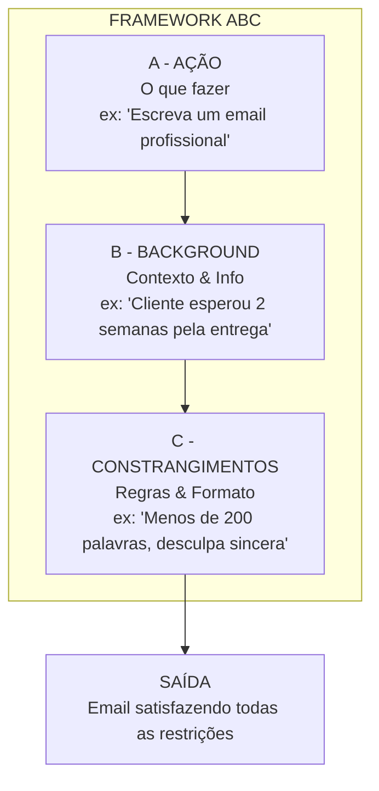
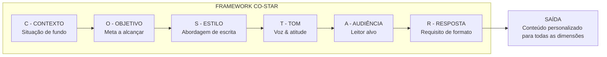
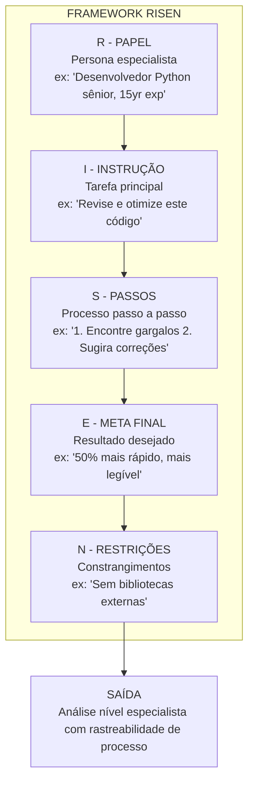

# Frameworks de Prompt: ABC, CO-STAR, RISEN

## Por que Usar Frameworks?

Frameworks de prompt fornecem modelos estruturados que produzem consistentemente saídas de alta qualidade de LLMs. Eles eliminam a adivinhação e ajudam a garantir que seus prompts sejam completos, claros e eficazes. Sem um framework, prompts tendem a ser vagos, perder contexto crítico ou produzir resultados imprevisíveis.

### O Problema com Prompts Não Estruturados

| Problema | Prompt Não Estruturado | Prompt Baseado em Framework |
|----------|------------------------|-----------------------------|
| Contexto ausente | "Escreva um email" | Especifica remetente, destinatário, situação e resultado desejado |
| Instruções vagas | "Faça ficar bom" | Define tom, estilo, tamanho e requisitos específicos |
| Saída inconsistente | Varia enormemente entre execuções | Formato e qualidade previsíveis |
| Difícil de depurar | Sem componentes claros para isolar problemas | Cada componente pode ser testado separadamente |

---

## Framework ABC

**ABC** significa **A**ção, **B**ackground (Contexto), **C**onstrangimentos.

| Componente | Propósito | Exemplo |
|------------|-----------|---------|
| **A - Ação** | O que o modelo deve fazer | "Escreva uma descrição de produto" |
| **B - Background** | Contexto e informação | "Para uma bota de caminhada impermeável" |
| **C - Constrangimentos** | Regras e formato | "150 palavras, tom amigável, destaque durabilidade" |

### Fluxograma do Framework ABC



### Exemplo do Framework ABC

```
[AÇÃO] Escreva uma resposta profissional por email para uma reclamação de cliente.

[BACKGROUND] O cliente esperou 2 semanas por uma entrega prometida em 3 dias.
Ele está frustrado mas ainda não pediu reembolso. Sua empresa é "QuickShip Inc."

[CONSTRANGIMENTOS] 
- Mantenha com menos de 200 palavras
- Peça desculpas sinceramente (sem desculpas)
- Ofereça 20% de desconto no próximo pedido
- Forneça uma atualização de rastreamento
- Assine como "Equipe de Suporte ao Cliente"
```

[!TIP]
ABC é ideal para tarefas que têm instruções claras mas não exigem interpretação de papéis complexa. É o framework mais rápido de escrever — perfeito para classificação rápida, geração simples de conteúdo ou rascunho direto de emails.

### ABC em Código

```python
# Framework ABC aplicado via API
from openai import OpenAI

client = OpenAI()

def abc_prompt(acao: str, background: str, constrangimentos: list[str]) -> str:
    """Constrói um prompt no formato ABC"""
    texto_constrangimentos = "\n".join(f"- {c}" for c in constrangimentos)
    return f"""[AÇÃO] {acao}

[BACKGROUND] {background}

[CONSTRANGIMENTOS] 
{texto_constrangimentos}"""

prompt = abc_prompt(
    acao="Escreva uma resposta profissional por email para uma reclamação de cliente.",
    background="O cliente esperou 2 semanas por uma entrega prometida em 3 dias.",
    constrangimentos=[
        "Mantenha com menos de 200 palavras",
        "Peça desculpas sinceramente (sem desculpas)",
        "Ofereça 20% de desconto no próximo pedido",
    ]
)

response = client.chat.completions.create(
    model="gpt-4",
    messages=[{"role": "user", "content": prompt}]
)
print(response.choices[0].message.content)
```

---

## Framework CO-STAR

**CO-STAR** significa **C**ontexto, **O**bjetivo, **S**tilo, **T**om, **A**udiência, **R**esposta.

| Componente | Propósito | Exemplo |
|------------|-----------|---------|
| **C - Contexto** | Situação de fundo | "Você é um consultor de marketing" |
| **O - Objetivo** | A meta a alcançar | "Aumentar o engajamento em redes sociais" |
| **S - Estilo** | Estilo de escrita | "Marcadores, itens acionáveis" |
| **T - Tom** | Voz/atitude | "Energético, encorajador" |
| **A - Audiência** | Quem está lendo | "Pequenos empresários novos em redes sociais" |
| **R - Resposta** | Requisito de formato | "5 dicas, cada uma com uma explicação 'por que funciona'" |

### Fluxograma do Framework CO-STAR



### Exemplo do Framework CO-STAR

```
[CONTEXTO] Você é um nutricionista experiente ajudando profissionais ocupados a comer de forma mais saudável.

[OBJETIVO] Crie um plano de refeições simples de 5 dias que exija menos de 30 minutos de preparo por dia.

[ESTILO] Formato de tabela estruturado com colunas: Refeição, Ingredientes, Dica Rápida.

[TOM] Encorajador, prático, não julgador.

[AUDIÊNCIA] Desenvolvedores de software trabalhando 60+ horas semanais que pedem delivery 5+ vezes por semana.

[RESPOSTA] Inclua opções de café da manhã, almoço e jantar para cada dia. Adicione uma seção de "lanche de emergência" no final.
```

[!NOTE]
CO-STAR se destaca quando **tom e estilo importam tanto quanto o conteúdo em si**. Copy de marketing, comunicações executivas e conteúdo voltado ao usuário se beneficiam enormemente de especificar todas as seis dimensões separadamente.

---

## Framework RISEN

**RISEN** significa **R**ole (Papel), **I**nstrução, **S**teps (Passos), **E**nd goal (Meta final), **N**arrowing (Restrições).

| Componente | Propósito | Exemplo |
|------------|-----------|---------|
| **R - Papel** | Quem a IA deve ser | "Desenvolvedor Python sênior com 15 anos de experiência" |
| **I - Instrução** | O que fazer | "Revise e otimize este código" |
| **S - Passos** | Processo a seguir | "1. Identifique gargalos 2. Sugira correções 3. Mostre antes/depois" |
| **E - Meta final** | Resultado desejado | "Fazer rodar 50% mais rápido e ser mais legível" |
| **N - Restrições** | Constrangimentos/filtros | "Sem bibliotecas externas, deve manter compatibilidade retroativa" |

### Fluxograma do Framework RISEN



[!NOTE]
RISEN é particularmente poderoso para tarefas complexas onde a IA precisa incorporar expertise e seguir um processo específico.

### Exemplo do Framework RISEN

```
[PAPEL] Você é um designer UX sênior que trabalhou em empresas como Apple e Google. É especializado em interfaces acessíveis e amigáveis.

[INSTRUÇÃO] Revise esta descrição de tela de aplicativo e identifique problemas de usabilidade.

[PASSOS]
1. Primeiro, identifique 3-5 potenciais problemas de usabilidade
2. Para cada problema, explique por que é uma questão
3. Forneça uma solução concreta para cada
4. Classifique os problemas por severidade (Crítico, Alto, Médio, Baixo)

[META FINAL] A saída deve ajudar a equipe de produto a priorizar melhorias para a próxima sprint.

[RESTRIÇÕES] Foque apenas em usabilidade móvel. Ignore preocupações de backend e texto de marketing. Considere acessibilidade para usuários daltônicos como alta prioridade.
```

---

## Comparação de Frameworks

| Framework | Melhor Para | Pontos Fortes | Pontos Fracos |
|-----------|-------------|---------------|---------------|
| **ABC** | Tarefas rápidas, solicitações simples | Mais rápido de escrever, fácil de lembrar | Menos detalhado para tarefas complexas |
| **CO-STAR** | Criação de conteúdo, marketing | Excelente para correspondência de tom/estilo | Mais componentes para lembrar |
| **RISEN** | Tarefas complexas, papéis especializados | Processo passo a passo, imersão de papel | Mais longo de elaborar, mais detalhado |

### Comparação Detalhada Lado a Lado

| Dimensão | ABC | CO-STAR | RISEN |
|-----------|-----|---------|-------|
| **Número de componentes** | 3 | 6 | 5 |
| **Especificação de papel** | Implícita (via Ação) | Implícita (via Contexto) | Primeiro componente explícito |
| **Processo passo a passo** | Não suportado | Não suportado | Integrado (Passos) |
| **Controle de tom/estilo** | Opcional (via Constrangimentos) | Campos dedicados (Estilo, Tom) | Implícito (via Papel) |
| **Consciência de audiência** | Opcional (via Background) | Campo dedicado (Audiência) | Opcional (via Restrições) |
| **Controle de formato saída** | Via Constrangimentos | Via Resposta | Via Passos + Meta final |
| **Tempo para escrever** | ~30 segundos | ~2 minutos | ~5 minutos |
| **Melhor com contexto pequeno** | Sim | Moderado | Pode ser verboso |

### Quando Usar Cada Um

| Cenário | Framework Recomendado |
|---------|----------------------|
| Email rápido, classificação simples | ABC |
| Post de blog, redes sociais, copy de marketing | CO-STAR |
| Revisão de código, análise legal, depuração técnica | RISEN |
| Brainstorming de ideias criativas | CO-STAR ou ABC |
| Geração de tutorial passo a passo | RISEN |
| Resposta de suporte ao cliente | ABC |
| Apresentação executiva | CO-STAR |

[!WARNING]
Não force um framework para cada prompt. Para perguntas simples como "Quanto é 2+2?", frameworks são excessivos. Use-os quando a qualidade ou especificidade da saída importar.

[!TIP]
**Combinando frameworks:** Para tarefas muito complexas, você pode camadas de frameworks. Por exemplo, use a estrutura de Papel e Passos do RISEN mas incorpore os componentes de Tom e Audiência do CO-STAR. Os melhores engenheiros de prompt misturam e combinam baseado nos requisitos específicos.

[!IMPORTANT]
**Limitações dos frameworks:** Nenhum framework garante saída perfeita. Eles são heurísticas, não algoritmos. Mesmo o prompt mais cuidadosamente estruturado pode falhar se o modelo subjacente não tiver o conhecimento ou capacidade de raciocínio para a tarefa. Sempre teste e itere.

---

## Aplicando Frameworks ao Mesmo Problema

Vamos aplicar os três frameworks ao **mesmo problema**: "Crie conteúdo explicando IA para executivos."

### Versão ABC
```
[AÇÃO] Escreva um sumário executivo de 2 páginas sobre IA.

[BACKGROUND] Para executivos C-suite de Fortune 500 que não sabem nada sobre IA.
Empresa vende software empresarial. Concorrentes estão começando a mencionar IA.

[CONSTRANGIMENTOS] Evite jargões. Foque em valor de negócio, não tecnologia.
Inclua: O que a IA pode fazer por nós, 3 casos de uso práticos, custos/ROI estimados.
```

### Versão CO-STAR
```
[CONTEXTO] Você é um consultor de IA apresentando ao conselho executivo.

[OBJETIVO] Conseguir aprovação de orçamento para um programa piloto de IA ($500K).

[ESTILO] Formato de brief executivo com seções claras e marcadores.

[TOM] Confiante mas realista. Não baseado em hype.

[AUDIÊNCIA] CEO, CFO, CTO - todos céticos sobre "coisas novas brilhantes."

[RESPOSTA] Sumário Executivo, 3 Casos de Uso com ROI, Detalhamento de Orçamento,
Avaliação de Riscos, Próximos Passos. Tudo em 2 páginas.
```

### Versão RISEN
```
[PAPEL] Você é um ex-consultor McKinsey especializado em transformação digital de IA.
Já ajudou mais de 20 empresas Fortune 500 a adotar IA.

[INSTRUÇÃO] Crie um documento de estratégia de IA persuasivo para aprovação executiva.

[PASSOS]
1. Comece com um gancho de uma frase "por que isso importa agora"
2. Apresente 3 iniciativas de IA de concorrentes para criar urgência
3. Delineie 3 casos de uso específicos com ROI estimado de 6 meses
4. Inclua um cenário de "sem ação" mostrando riscos de esperar
5. Termine com um "pedido" claro e próximos passos

[META FINAL] Conseguir compromisso verbal para orçamento piloto de $500K ao final da apresentação.

[RESTRIÇÕES] Nenhuma menção a redes neurais, dados de treinamento ou arquiteturas de modelo.
Toda afirmação deve ser focada em resultado de negócio.
```

### Python: Aplicando Todos os Três à Mesma Entrada

```python
from openai import OpenAI

client = OpenAI()

# Mesmo cenário base para os três frameworks
scenario = "Explique os benefícios da migração para nuvem a um CFO cético."

# Abordagem ABC
abc_prompt = f"""[AÇÃO] Escreva um memorando persuasivo de uma página sobre migração para nuvem.

[BACKGROUND] {scenario}

[CONSTRANGIMENTOS]
- Menos de 300 palavras
- Foque em economia de custos e segurança (as prioridades do CFO)
- Inclua um resumo de ROI em 3 marcadores
- Sem jargão técnico"""

# Abordagem CO-STAR
costar_prompt = f"""[CONTEXTO] Você é um arquiteto de nuvem apresentando a um CFO cético sobre custos de nuvem.

[OBJETIVO] Convencer o CFO a aprovar um orçamento de migração de $2M.

[ESTILO] Formato de memorando executivo com cálculos claros de ROI.

[TOM] Baseado em dados, confiante, conservador com promessas.

[AUDIÊNCIA] CFO de uma empresa de médio porte, muito consciente de custos.

[RESPOSTA] Um memorando de uma página com: comparação de custos de 3 anos, benefícios de segurança, cronograma de migração e mitigação de riscos."""

# Abordagem RISEN
risen_prompt = f"""[PAPEL] Você é um arquiteto de nuvem sênior que liderou 15+ migrações empresariais com redução média de 30% de custos.

[INSTRUÇÃO] Escreva uma proposta de migração persuasiva.

[PASSOS]
1. Abra com o problema de custo que a empresa enfrenta on-premise
2. Apresente comparação de TCO (Custo Total de Propriedade) de 3 anos
3. Liste benefícios de segurança/conformidade
4. Aborde as objeções prováveis do CFO
5. Termine com um primeiro passo claro e de baixo risco

[META FINAL] Conseguir aprovação para um prova de conceito de $50K.

[RESTRIÇÕES] Discuta apenas AWS. Ignore multi-nuvem. Foque em infraestrutura, não refatoração de aplicativos."""

# Testar todos os três
for nome, prompt in [("ABC", abc_prompt), ("CO-STAR", costar_prompt), ("RISEN", risen_prompt)]:
    response = client.chat.completions.create(
        model="gpt-4",
        messages=[{"role": "user", "content": prompt}],
        temperature=0.3
    )
    print(f"\n=== SAÍDA {nome} ===")
    print(response.choices[0].message.content)
    print(f"Tokens usados: {response.usage.total_tokens}")
```

---

## Perguntas de Prática

```question
{
  "id": "pe-02-pt-q1",
  "type": "multiple-choice",
  "question": "Um profissional de marketing de conteúdo precisa escrever um post de blog com um tom e estilo específicos para um público-alvo. Qual framework é mais apropriado?",
  "options": ["ABC", "CO-STAR", "RISEN", "Nenhum framework necessário"],
  "correct": 1,
  "explanation": "CO-STAR tem campos dedicados para Estilo, Tom e Audiência, tornando-o ideal para criação de conteúdo onde essas dimensões importam."
}
```

```question
{
  "id": "pe-02-pt-q2",
  "type": "multiple-choice",
  "question": "No framework ABC, o que o componente 'B' (Background) fornece?",
  "options": ["A ação principal que o modelo deve executar", "O contexto e as informações necessárias para a tarefa", "As regras e restrições de formato", "O papel e a persona da IA"],
  "correct": 1,
  "explanation": "O componente Background fornece o contexto e as informações necessárias para a tarefa."
}
```

```question
{
  "id": "pe-02-pt-q3",
  "type": "multiple-choice",
  "question": "Um desenvolvedor sênior está depurando um problema complexo de sistema distribuído e precisa que a IA siga um processo de diagnóstico passo a passo específico enquanto atua como especialista. Qual framework é mais adequado?",
  "options": ["ABC", "CO-STAR", "RISEN", "Qualquer framework funciona igualmente"],
  "correct": 2,
  "explanation": "RISEN tem componentes integrados de Passos e Papel, tornando-o ideal para tarefas complexas de especialistas orientadas a processo."
}
```

```question
{
  "id": "pe-02-pt-q4",
  "type": "multiple-choice",
  "question": "De acordo com a lição, quando é apropriado não usar um framework de prompt?",
  "options": ["Para tarefas técnicas complexas de múltiplos passos", "Para criação de conteúdo com requisitos específicos de tom", "Para perguntas simples e diretas como 'Quanto é 2+2?'", "Para cenários de interpretação de especialistas"],
  "correct": 2,
  "explanation": "Para perguntas simples e diretas, frameworks são excessivos. Use-os quando a qualidade ou especificidade da saída importar."
}
```

```question
{
  "id": "pe-02-pt-q5",
  "type": "multiple-choice",
  "question": "Um gerente de projetos pede à IA para 'Escrever uma descrição de produto para uma bota de caminhada impermeável, 150 palavras, tom amigável.' Qual componente do framework está sendo usado para a parte '150 palavras, tom amigável'?",
  "options": ["ABC - Ação", "ABC - Background", "ABC - Constrangimentos", "CO-STAR - Objetivo"],
  "correct": 2,
  "explanation": "'150 palavras, tom amigável' são regras e requisitos de formato, que mapeiam para o componente Constrangimentos (C) do ABC."
}
```

```question
{
  "id": "pe-02-pt-q6",
  "type": "multiple-choice",
  "question": "Um engenheiro de prompt precisa gerar uma resposta que inclua um processo de diagnóstico passo a passo específico. Apenas um framework tem um componente dedicado para especificar passos processuais. Qual?",
  "options": ["Componente Ação do ABC", "Componente Resposta do CO-STAR", "Componente Passos do RISEN", "Nenhum — passos devem ser incluídos no texto da instrução para todos os frameworks"],
  "correct": 2,
  "explanation": "RISEN exclusivamente inclui um componente dedicado Passos (S) para especificar o processo exato que a IA deve seguir."
}
```

```question
{
  "id": "pe-02-pt-q7",
  "type": "multiple-choice",
  "question": "Um engenheiro usa CO-STAR para uma tarefa mas descobre que a saída não tem a profundidade de especialista que precisam. Qual modificação de framework provavelmente ajudaria?",
  "options": ["Mudar para ABC que tem menos componentes", "Mudar para RISEN que tem um componente de Papel e Passos para orientação de processo", "Adicionar mais restrições ao campo Contexto no CO-STAR", "Reduzir a temperature para tornar a saída mais determinística"],
  "correct": 1,
  "explanation": "Os componentes explícitos de Papel e Passos do RISEN fornecem a definição de persona especialista e orientação processual que o CO-STAR não tem."
}
```

```question
{
  "id": "pe-02-pt-q8",
  "type": "multiple-choice",
  "question": "Comparando ABC e CO-STAR, qual é a principal vantagem que CO-STAR tem sobre ABC para conteúdo de marketing?",
  "options": ["CO-STAR tem menos componentes, tornando mais rápido de escrever", "CO-STAR tem campos separados para Estilo, Tom e Audiência, dando controle mais fino sobre a voz do conteúdo", "CO-STAR é o único framework que suporta saída JSON", "CO-STAR automaticamente gera melhor conteúdo que ABC para todas as tarefas"],
  "correct": 1,
  "explanation": "Os campos dedicados de Estilo, Tom e Audiência do CO-STAR fornecem controle mais granular sobre a voz e o alvo do conteúdo, que é crítico para marketing."
}
```

```question
{
  "id": "pe-02-pt-q9",
  "type": "multiple-choice",
  "question": "Uma equipe de prompt precisa que seus frameworks de prompt sejam testáveis — cada componente deve ser isolável para teste A/B. Qual estrutura de componentes do framework torna isso mais fácil?",
  "options": ["ABC com 3 componentes amplos", "CO-STAR com 6 componentes específicos e separáveis", "RISEN com 5 componentes fortemente acoplados", "Todos os frameworks são igualmente testáveis"],
  "correct": 1,
  "explanation": "Os 6 componentes específicos e separáveis do CO-STAR (Contexto, Objetivo, Estilo, Tom, Audiência, Resposta) tornam mais fácil isolar e testar A/B dimensões individuais."
}
```

```question
{
  "id": "pe-02-pt-q10",
  "type": "multiple-choice",
  "question": "Um desenvolvedor aplica ABC a uma tarefa de análise de contrato legal mas obtém resultados vagos. RISEN produz melhores resultados porque:",
  "options": ["O componente Constrangimentos do ABC não pode lidar com requisitos legais", "O Papel (advogado especialista) e Passos (processo de análise) do RISEN fornecem estrutura que o ABC não tem para domínios especialistas", "RISEN usa mais tokens, o que sempre produz melhores resultados", "ABC só funciona para tarefas de escrita de email"],
  "correct": 1,
  "explanation": "Para domínios especialistas como análise legal, a definição explícita de Papel e os Passos processuais do RISEN fornecem orientação que a estrutura mais simples do ABC não tem."
}
```

---

[!SUCCESS]
**Principais Aprendizados:**

- **ABC** (Ação, Background, Constrangimentos): Framework mais rápido para tarefas simples
- **CO-STAR** (Contexto, Objetivo, Estilo, Tom, Audiência, Resposta): Melhor para criação de conteúdo com requisitos específicos de estilo
- **RISEN** (Papel, Instrução, Passos, Meta final, Restrições): Mais detalhado para tarefas complexas e especializadas
- A escolha do framework depende da complexidade da tarefa e necessidade de especificidade da saída
- Não sobre-engenharia: perguntas simples não precisam de frameworks
- Frameworks podem ser combinados para tarefas complexas — misture e combine componentes
- Sempre teste e itere — frameworks são heurísticas, não garantias
