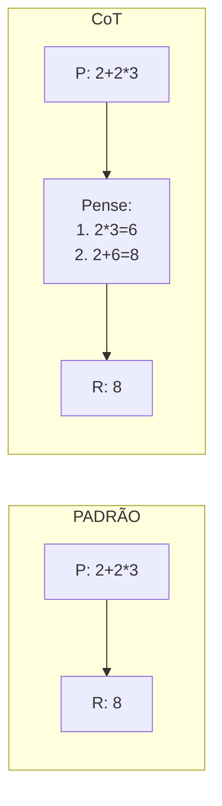
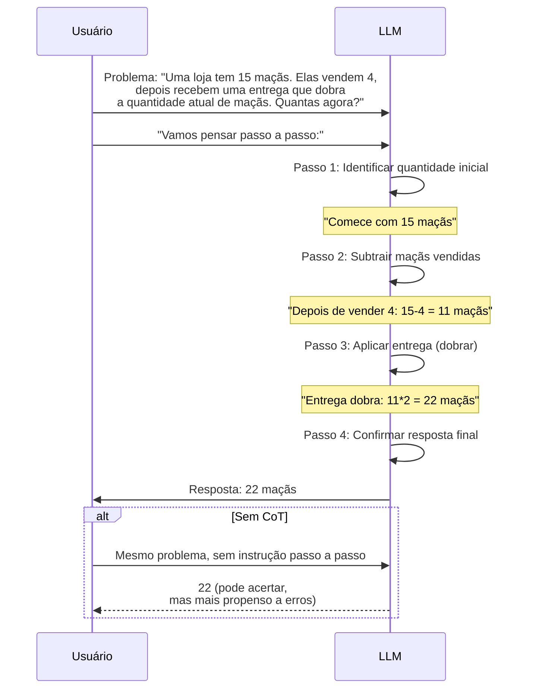
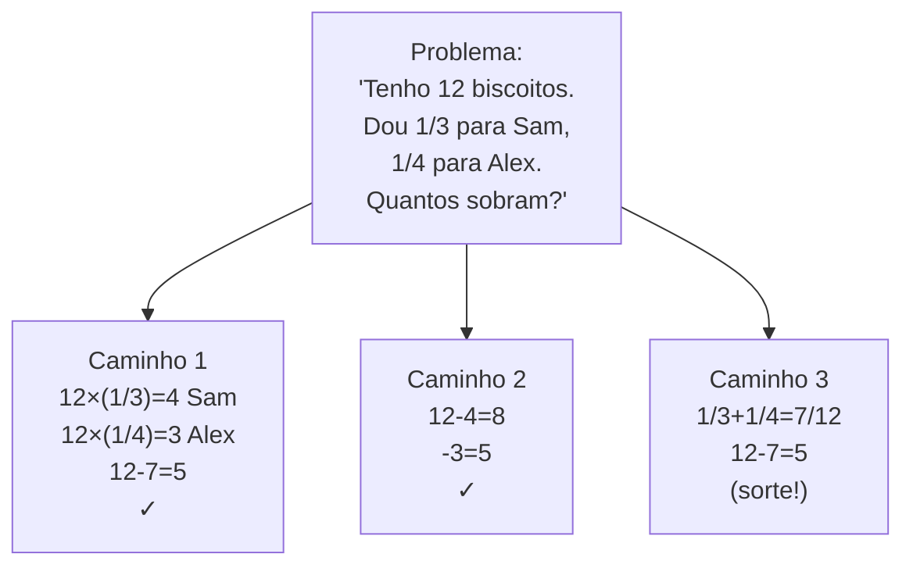
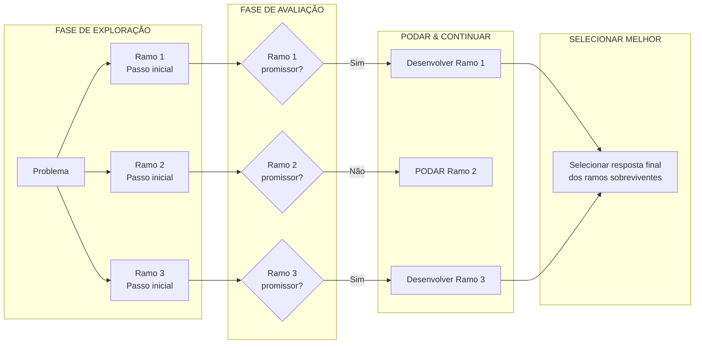

# Técnicas Avançadas de Prompt

## Por que Técnicas Avançadas?

Prompting básico funciona para tarefas simples, mas raciocínio complexo, saídas estruturadas e problemas especializados exigem abordagens mais sofisticadas. Cada técnica nesta lição aborda uma limitação específica do prompting básico — desde melhorar o raciocínio passo a passo até permitir exploração multi-caminho.

### Quando o Prompting Básico é Insuficiente

| Limitação | Tentativa Básica | Técnica Avançada |
|-----------|-----------------|------------------|
| Problemas de matemática/lógica multi-passo | Modelo adivinha resposta final | Chain-of-Thought: raciocínio passo a passo |
| Formatos de saída desconhecidos | Modelo inventa formato errado | Few-Shot: exemplos guiam o modelo |
| Necessidade de saída legível por máquina | Respostas de texto inconsistentes | Saídas Estruturadas: modo JSON |
| Resposta única pode estar errada | Sem forma de verificar correção | Self-Consistency: votação majoritária |
| Exploração/planejamento complexo | Modelo segue um caminho | Tree-of-Thoughts: múltiplos ramos |

---

## Chain-of-Thought (CoT) Prompting

Chain-of-Thought prompting encoraja o modelo a dividir problemas em passos intermediários de raciocínio. Em vez de pular diretamente para uma resposta, o modelo "mostra seu trabalho," o que tanto melhora a precisão quanto torna erros mais fáceis de depurar.

### Fluxo de Raciocínio CoT



### Sequência Completa de Raciocínio CoT



### Exemplo CoT

```
P: Uma loja tem 15 maçãs. Elas vendem 4, depois recebem uma entrega que dobra
a quantidade atual de maçãs. Quantas maçãs elas têm agora?

Vamos pensar passo a passo:
1. Comece com 15 maçãs
2. Depois de vender 4: 15 - 4 = 11 maçãs
3. Entrega dobra a quantidade atual: 11 * 2 = 22 maçãs

Resposta: 22
```

[!NOTE]
Simplesmente adicionar "Vamos pensar passo a passo" ao seu prompt pode melhorar significativamente o desempenho de raciocínio em problemas de matemática e lógica.

[!WARNING]
**Custos de token do CoT:** Chain-of-Thought pode aumentar os tokens de saída em 3-10x porque o modelo gera passos intermediários de raciocínio antes da resposta final. Para aplicações sensíveis a custo, considere usar prompts mais curtos como "Explique brevemente" ou limitar max_tokens. Para um sistema de produção processando milhões de requisições, este multiplicador de tokens afeta diretamente seus custos.

### CoT em Código

```python
from openai import OpenAI

client = OpenAI()

# Sem CoT
response_direct = client.chat.completions.create(
    model="gpt-4",
    messages=[
        {"role": "user", "content": "Se uma camisa custa R$40 e está com 25% de desconto, mais 8% de imposto, qual é o preço final?"}
    ],
    temperature=0.0
)
print("Direto:", response_direct.choices[0].message.content)

# Com CoT
response_cot = client.chat.completions.create(
    model="gpt-4",
    messages=[
        {"role": "user", "content": """Se uma camisa custa R$40 e está com 25% de desconto, mais 8% de imposto, qual é o preço final?

Vamos pensar passo a passo:"""}
    ],
    temperature=0.0
)
print("\nCoT:", response_cot.choices[0].message.content)
```

### Variantes de CoT

| Variante | Descrição | Melhor Para |
|----------|-----------|-------------|
| **Zero-shot CoT** | Apenas adicione "Vamos pensar passo a passo" | Melhoria rápida de raciocínio |
| **Few-shot CoT** | Forneça cadeias de raciocínio de exemplo | Formato consistente, problemas mais difíceis |
| **CoT Estruturado** | Exija passos numerados ou formato de marcadores | Depuração, trilhas de auditoria |
| **CoT Multi-prompt** | Peça raciocínio, depois resposta em chamadas separadas | Problemas complexos que precisam verificação |

---

## Few-Shot e Multi-Shot Prompting

Few-shot prompting fornece exemplos no prompt para guiar o comportamento do modelo.

| Técnica | Exemplos Fornecidos | Melhor Para |
|---------|---------------------|-------------|
| **Zero-Shot** | 0 exemplos | Tarefas simples, padrões comuns |
| **Few-Shot** | 1-5 exemplos | Formatos específicos, tarefas novas |
| **Multi-Shot** | 5+ exemplos | Padrões complexos, alternativa a fine-tuning |

### Exemplo Few-Shot: Análise de Sentimento

```
Classifique o sentimento como POSITIVO, NEGATIVO ou NEUTRO.

Exemplo 1:
Avaliação: "Este filme foi incrível, melhor que vi o ano todo!"
Sentimento: POSITIVO

Exemplo 2:
Avaliação: "Serviço terrível, nunca mais volto."
Sentimento: NEGATIVO

Exemplo 3:
Avaliação: "O restaurante fica na rua 5."
Sentimento: NEUTRO

Agora classifique:
Avaliação: "Produto funciona como descrito, nada excepcional."
Sentimento:
```

[!TIP]
**Escolhendo os exemplos certos:** Selecione exemplos que cubram a gama de entradas esperadas. Inclua casos de borda e exemplos ambíguos. Exemplos mal escolhidos (ex: todos sentimento positivo quando o conjunto de teste tem sentimento misto) enviesam o modelo. Além disso, a ordem importa — modelos tendem a ser mais influenciados pelo último exemplo (viés de recência).

### Few-Shot em Código

```python
from openai import OpenAI

client = OpenAI()

# Exemplos few-shot
exemplos = [
    {"avaliacao": "Este filme foi incrível, melhor que vi o ano todo!", "sentimento": "POSITIVO"},
    {"avaliacao": "Serviço terrível, nunca mais volto.", "sentimento": "NEGATIVO"},
    {"avaliacao": "O restaurante fica na rua 5.", "sentimento": "NEUTRO"},
]

def few_shot_classificar(texto_avaliacao: str, exemplos: list[dict]) -> str:
    prompt = "Classifique o sentimento como POSITIVO, NEGATIVO ou NEUTRO.\n\n"
    for i, ex in enumerate(exemplos, 1):
        prompt += f"Exemplo {i}:\nAvaliação: \"{ex['avaliacao']}\"\nSentimento: {ex['sentimento']}\n\n"
    prompt += f"Agora classifique:\nAvaliação: \"{texto_avaliacao}\"\nSentimento:"
    
    response = client.chat.completions.create(
        model="gpt-4",
        messages=[{"role": "user", "content": prompt}],
        temperature=0.0
    )
    return response.choices[0].message.content.strip()

teste = "Produto funciona como descrito, nada excepcional."
print(few_shot_classificar(teste, exemplos))
```

---

## Saídas Estruturadas (Modo JSON)

Muitos LLMs suportam formatos de saída estruturados, críticos para integração programática.

```python
from openai import OpenAI
import json

client = OpenAI()

response = client.chat.completions.create(
    model="gpt-4-turbo-preview",
    messages=[
        {"role": "system", "content": "Extraia dados do cliente e retorne como JSON."},
        {"role": "user", "content": """
        Extraia informações deste email:
        "Olá, sou João Silva da Acme Corp. Meu telefone é 555-0123.
        Gostaria de pedir 10 unidades do plano PRO a R$99/mês."
        """}
    ],
    response_format={"type": "json_object"}  # Modo JSON ativado
)

# Parse da saída estruturada
result = json.loads(response.choices[0].message.content)
print(json.dumps(result, indent=2, ensure_ascii=False))
```

**Saída Esperada:**
```json
{
  "cliente": {
    "nome": "João Silva",
    "empresa": "Acme Corp",
    "telefone": "555-0123"
  },
  "pedido": {
    "produto": "plano PRO",
    "quantidade": 10,
    "preco": 99,
    "ciclo_faturamento": "mensal"
  }
}
```

[!TIP]
**Validação de modo JSON:** Sempre valide saídas JSON antes de usá-las em produção. Use `json.loads()` com try/except para capturar JSON malformado. Considere usar modelos Pydantic para validação de esquema em aplicações Python.

### Validação de Esquema JSON

```python
import json
from typing import Optional
from pydantic import BaseModel, Field, ValidationError

class Cliente(BaseModel):
    nome: str
    empresa: str
    telefone: Optional[str] = None

class Pedido(BaseModel):
    produto: str
    quantidade: int = Field(gt=0)
    preco: float = Field(gt=0)
    ciclo_faturamento: str

class ResultadoExtracao(BaseModel):
    cliente: Cliente
    pedido: Pedido

# Parse e valida a saída da API
raw_json = '{"cliente": {"nome": "João Silva", "empresa": "Acme Corp"}, "pedido": {"produto": "plano PRO", "quantidade": 10, "preco": 99, "ciclo_faturamento": "mensal"}}'

try:
    validated = ResultadoExtracao(**json.loads(raw_json))
    print(f"Validado: {validated.model_dump_json(indent=2, ensure_ascii=False)}")
except ValidationError as e:
    print(f"Falha na validação: {e}")

# Anthropic Claude - saída estruturada via prompt de sistema
import anthropic

client = anthropic.Anthropic()
response = client.messages.create(
    model="claude-3-opus-20240229",
    max_tokens=1000,
    system="Você extrai dados para JSON. Apenas produza JSON válido, sem outro texto.",
    messages=[
        {"role": "user", "content": "Extraia: João, Acme Corp, 555-0123, 10 unidades plano PRO R$99/mês"}
    ]
)
print(response.content[0].text)
```

---

## Self-Consistency

Self-Consistency gera múltiplos caminhos de raciocínio e seleciona a resposta mais frequente. É como perguntar a três especialistas separadamente e tomar o voto da maioria — caminhos de raciocínio diversos reduzem a chance de qualquer erro único determinar a resposta final.

```
Gere 3 soluções diferentes para este problema, depois escolha a resposta mais comum:

Problema: Um trem viaja a 60 km/h por 2 horas, depois 80 km/h por 1 hora.
Qual é a velocidade média?

Solução 1:
- Distância 1: 60 * 2 = 120 km
- Distância 2: 80 * 1 = 80 km
- Total: 200 km em 3 horas
- Média: 200/3 = 66.67 km/h

Solução 2:
- Fórmula da média = distância total / tempo total
- Distância total = (60*2) + (80*1) = 200
- Tempo total = 3
- 200/3 = 66.67 km/h

Solução 3:
- Apenas média das velocidades: (60+80)/2 = 70 km/h

Resposta mais comum: 66.67 km/h (aparece 2 vezes)
```

### Self-Consistency em Código

```python
from openai import OpenAI
from collections import Counter

client = OpenAI()

def self_consistency(problema: str, n_caminhos: int = 3, temperature: float = 0.7) -> list[str]:
    """Gera n caminhos de raciocínio e retorna o mais frequente."""
    respostas = []
    
    for i in range(n_caminhos):
        response = client.chat.completions.create(
            model="gpt-4",
            messages=[
                {"role": "user", "content": f"{problema}\n\nVamos pensar passo a passo:"}
            ],
            temperature=temperature,
        )
        respostas.append(response.choices[0].message.content)
        print(f"\nCaminho {i+1}:\n{respostas[-1]}")
    
    return respostas

problema = "Um trem viaja a 60 km/h por 2 horas, depois 80 km/h por 1 hora. Qual é a velocidade média?"
resultados = self_consistency(problema, n_caminhos=3)
```

---

## Tree-of-Thoughts (ToT)

Tree-of-Thoughts explora múltiplos caminhos de raciocínio simultaneamente, como uma árvore de decisão. Diferente do CoT que segue uma cadeia de raciocínio, ToT se ramifica, avalia cada ramo e continua caminhos promissores ou poda becos sem saída.



### Fluxograma de Ramificação Tree-of-Thoughts



[!WARNING]
Self-Consistency e Tree-of-Thoughts exigem múltiplas chamadas de API, aumentando significativamente custo e latência. Use apenas quando técnicas de chamada única não forem suficientes.

### Template de Prompt ToT

```
Quero que você resolva este problema usando raciocínio Tree-of-Thoughts.

Problema: {problema}

Instruções:
1. Primeiro, gere {num_ramos} abordagens iniciais diferentes para este problema
2. Para cada abordagem, pense no primeiro passo
3. Avalie cada abordagem — qual parece mais promissora?
4. Para a abordagem mais promissora, continue desenvolvendo-a
5. Repita: explore, avalie, foque, até chegar a uma resposta

Comece listando {num_ramos} maneiras diferentes de abordar este problema:
```

---

## Comparação de Técnicas

| Técnica | Complexidade | Melhor Caso de Uso | Ganho de Desempenho | Custo de Token |
|---------|--------------|---------------------|---------------------|----------------|
| **Chain-of-Thought** | Baixa | Matemática, lógica, problemas multi-passos | +20-50% no raciocínio | 2-5x aumento |
| **Few-Shot** | Baixa | Classificação, correspondência de formato | +10-30% vs zero-shot | 1-2x (tokens exemplo) |
| **Modo JSON** | Baixa | Integração API, dados estruturados | Crítico para confiabilidade | Mínimo (instrução formato) |
| **Self-Consistency** | Média | Votação em múltiplas saídas | +5-15% vs CoT único | 3-10x (múltiplas respostas) |
| **Tree-of-Thoughts** | Alta | Busca/exploração complexa | +25-60% em problemas difíceis | 5-20x (muitos ramos) |

### Quando Usar Cada Técnica

| Cenário | Técnica Recomendada | Porquê |
|---------|---------------------|--------|
| Problema de matemática | CoT | Passo a passo simples funciona melhor |
| Classificar emails de clientes | Few-Shot | Exemplos esclarecem categorias ambíguas |
| Extrair dados para banco de dados | Modo JSON | Saída legível por máquina necessária |
| Diagnóstico médico crítico | Self-Consistency + CoT | Segurança exige votação majoritária |
| Estratégia de jogo/quebra-cabeça novo | Tree-of-Thoughts | Necessário explorar múltiplas abordagens |
| Resumir um documento | CoT (se complexo) ou Zero-Shot | Simples geralmente é melhor |

[!IMPORTANT]
**Combinação de técnicas:** Estas técnicas não são mutuamente exclusivas. Você pode combinar CoT com Few-Shot (fornecer cadeias de raciocínio de exemplo), usar Self-Consistency com Modo JSON, ou usar ToT com saídas estruturadas. Combinar técnicas pode compor benefícios — mas também compor custos de token.

---

## Perguntas de Prática

```question
{
  "id": "pe-03-pt-q1",
  "type": "multiple-choice",
  "question": "Um analista de dados precisa que o LLM extraia informações de clientes de emails e as retorne em um formato legível por máquina para inserção em banco de dados. Qual técnica ele deve usar?",
  "options": ["Chain-of-Thought", "Few-Shot", "Saídas Estruturadas (Modo JSON)", "Self-Consistency"],
  "correct": 2,
  "explanation": "Saídas Estruturadas (Modo JSON) retorna dados em formato JSON legível por máquina, adequado para inserção em banco de dados."
}
```

```question
{
  "id": "pe-03-pt-q2",
  "type": "multiple-choice",
  "question": "Adicionar a frase \"Vamos pensar passo a passo\" a um problema de matemática melhora a precisão ao incentivar o modelo a:",
  "options": ["Gerar múltiplas respostas e votar", "Dividir o raciocínio em passos intermediários", "Retornar a resposta em formato JSON", "Explorar múltiplos caminhos de raciocínio simultaneamente"],
  "correct": 1,
  "explanation": "Chain-of-Thought prompting incentiva o modelo a dividir problemas em passos intermediários de raciocínio."
}
```

```question
{
  "id": "pe-03-pt-q3",
  "type": "multiple-choice",
  "question": "Uma tarefa de análise de sentimento requer que o modelo classifique avaliações como POSITIVO, NEGATIVO ou NEUTRO. O prompt inclui três exemplos rotulados antes de pedir ao modelo para classificar uma nova avaliação. Esta abordagem é conhecida como:",
  "options": ["Zero-shot prompting", "Few-shot prompting", "Tree-of-Thoughts", "Self-Consistency"],
  "correct": 1,
  "explanation": "Few-shot prompting fornece exemplos no prompt para guiar o comportamento do modelo."
}
```

```question
{
  "id": "pe-03-pt-q4",
  "type": "multiple-choice",
  "question": "Uma equipe de pesquisa precisa resolver um quebra-cabeça lógico inédito que requer explorar diferentes abordagens de raciocínio simultaneamente, como uma árvore de decisão. Qual técnica eles devem usar?",
  "options": ["Chain-of-Thought", "Self-Consistency", "Tree-of-Thoughts", "Modo JSON"],
  "correct": 2,
  "explanation": "Tree-of-Thoughts explora múltiplos caminhos de raciocínio simultaneamente, como uma árvore de decisão."
}
```

```question
{
  "id": "pe-03-pt-q5",
  "type": "multiple-choice",
  "question": "Qual é o principal trade-off ao usar Self-Consistency ou Tree-of-Thoughts em comparação com técnicas mais simples?",
  "options": ["Menor precisão em tarefas simples", "Custo e latência significativamente maiores devido a múltiplas chamadas de API", "Incompatibilidade com modelos OpenAI", "Incapacidade de lidar com saídas estruturadas"],
  "correct": 1,
  "explanation": "Self-Consistency e Tree-of-Thoughts exigem múltiplas chamadas de API, aumentando significativamente custo e latência."
}
```

```question
{
  "id": "pe-03-pt-q6",
  "type": "multiple-choice",
  "question": "Um desenvolvedor implementa um sistema onde o LLM primeiro gera uma cadeia de raciocínio, depois produz uma saída JSON. Que combinação de técnicas é esta?",
  "options": ["Zero-Shot + Few-Shot", "CoT + Saídas Estruturadas", "Self-Consistency + ToT", "Multi-Shot + Modo JSON"],
  "correct": 1,
  "explanation": "Combinar CoT (para raciocínio passo a passo) com Saídas Estruturadas/Modo JSON (para o resultado final legível por máquina) é um padrão de combinação comum."
}
```

```question
{
  "id": "pe-03-pt-q7",
  "type": "multiple-choice",
  "question": "Uma equipe executa CoT em uma tarefa de classificação simples e vê a precisão diminuir em comparação com zero-shot. Qual é a explicação mais provável?",
  "options": ["CoT só funciona com GPT-4, não com modelos mais antigos", "CoT adiciona passos de raciocínio desnecessários que podem causar confusão para tarefas simples", "A temperature estava muito baixa", "Exemplos few-shot estavam faltando"],
  "correct": 1,
  "explanation": "Para tarefas simples, os passos de raciocínio adicionais do CoT podem introduzir confusão ou levar o modelo a pensar demais. Técnicas mais simples são geralmente melhores para tarefas diretas."
}
```

```question
{
  "id": "pe-03-pt-q8",
  "type": "multiple-choice",
  "question": "Um sistema de produção processa 1M requisições/mês. Mudar de zero-shot para CoT aumenta tokens de saída de 50 para 200 por requisição. A $0.03/1K tokens, qual é o aumento de custo mensal?",
  "options": ["$1,500", "$4,500", "$450", "$15,000"],
  "correct": 1,
  "explanation": "Cada requisição agora usa 150 tokens a mais. 1M × 150 = 150M tokens extras. A $0.03/1K, são $4,500/mês. Isso ilustra porque o custo de token do CoT importa em escala."
}
```

```question
{
  "id": "pe-03-pt-q9",
  "type": "multiple-choice",
  "question": "Um desenvolvedor usa few-shot prompting com exemplos ordenados: NEGATIVO, POSITIVO, NEUTRO. O modelo classifica mal a maioria dos casos de teste como NEUTRO. Qual é a causa mais provável?",
  "options": ["O modelo não entende análise de sentimento", "Viés de recência — o modelo é mais influenciado pelo último exemplo (NEUTRO)", "A temperature está muito alta", "NEUTRO não é uma categoria de sentimento válida"],
  "correct": 1,
  "explanation": "LLMs exibem viés de recência, significando que são desproporcionalmente influenciados pelos últimos exemplos no prompt. Reordenar exemplos para que a categoria mais frequente ou importante apareça por último pode melhorar a precisão."
}
```

```question
{
  "id": "pe-03-pt-q10",
  "type": "multiple-choice",
  "question": "Um engenheiro de prompt valida uma saída JSON com Pydantic e captura um ValidationError. O que eles devem fazer a seguir?",
  "options": ["Ignorar o erro e usar o JSON bruto mesmo assim", "Re-tentar a chamada de API com um prompt de sistema mais rigoroso e possivelmente uma temperature maior", "Registrar o erro, re-tentar com um prompt corrigido e alertar se as falhas excederem um limite", "Mudar para um provedor de LLM diferente"],
  "correct": 2,
  "explanation": "Sistemas de produção devem registrar erros de validação, implementar lógica de retry com ajustes de prompt e alertar quando as taxas de falha excederem limites aceitáveis."
}
```

---

[!SUCCESS]
**Principais Aprendizados:**

- **Chain-of-Thought (CoT):** "Vamos pensar passo a passo" melhora o raciocínio em matemática/lógica
- **Few-Shot:** Forneça 1-5 exemplos para guiar o formato e estilo da saída
- **Saídas Estruturadas (Modo JSON):** Crítico para integração programática de APIs
- **Self-Consistency:** Gere múltiplas saídas e selecione a resposta mais frequente
- **Tree-of-Thoughts:** Explore múltiplos ramos de raciocínio como uma árvore de decisão
- Técnicas avançadas custam mais tokens—equilibre necessidades de desempenho com custo
- Técnicas podem ser combinadas: CoT + JSON, Few-Shot + CoT, Self-Consistency + Saídas Estruturadas
- Para tarefas simples, técnicas mais simples geralmente superam as complexas
- Sempre valide saídas estruturadas antes do uso em produção
