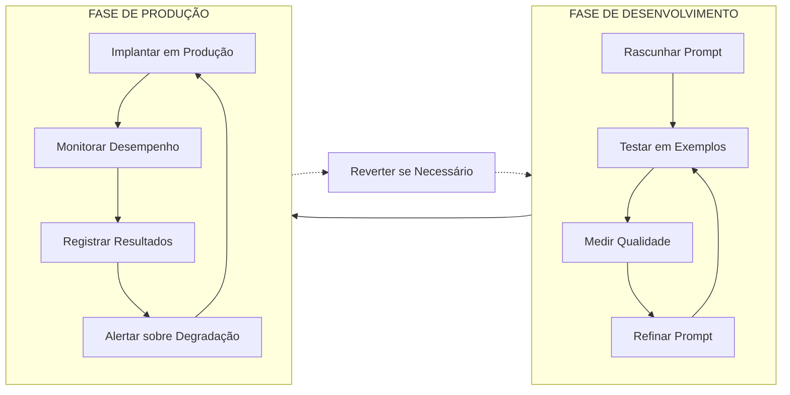
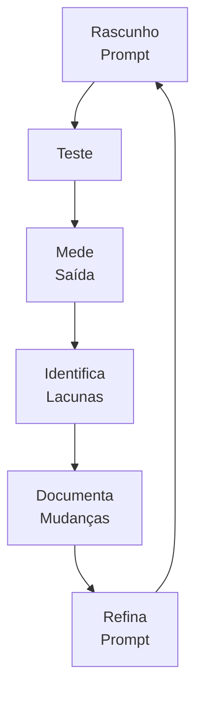
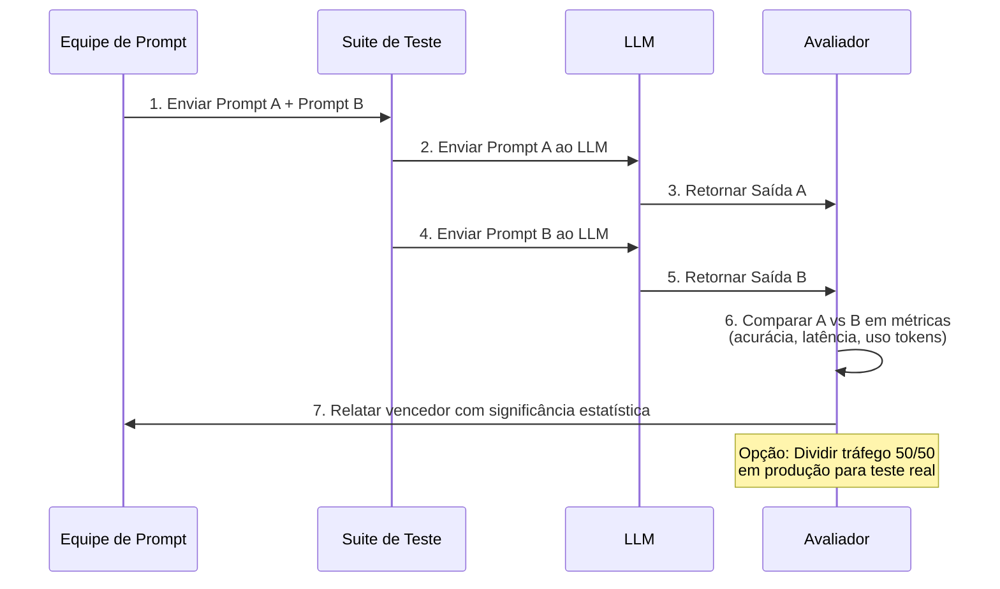
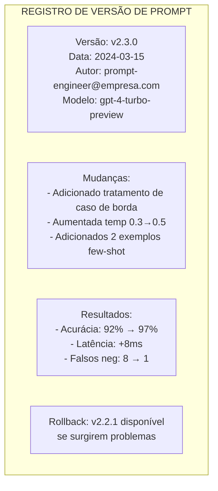
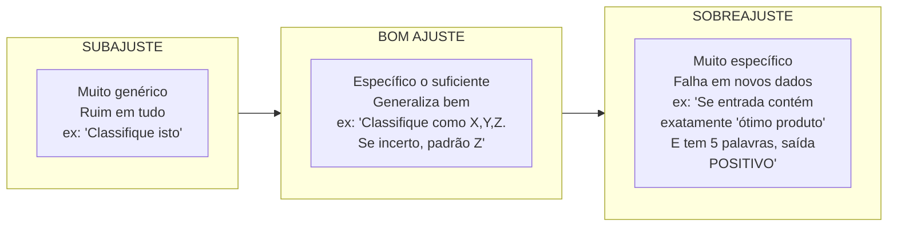

# Otimização, Teste e Versionamento de Prompts

## A Natureza Iterativa da Engenharia de Prompt

Ótimos prompts raramente são criados na primeira tentativa. Engenharia de prompt profissional é um processo sistemático de teste, medição e refinamento. Como engenharia de software, a engenharia de prompt requer controle de versão, frameworks de teste e pipelines de implantação.

### O Ciclo de Vida da Engenharia de Prompt



---

## Refinamento Iterativo de Prompt

### O Loop de Otimização



### Exemplo: Refinando um Prompt de Classificação

**Versão 1 (Inicial):**
```
Classifique este ticket de cliente.
```

**Versão 2 (Categorias adicionadas):**
```
Classifique este ticket de cliente como: FATURAMENTO, TÉCNICO, REEMBOLSO ou GERAL.
```

**Versão 3 (Exemplos adicionados):**
```
Classifique este ticket de cliente. Categorias: FATURAMENTO, TÉCNICO, REEMBOLSO, GERAL.

Exemplo: "Meu cartão foi cobrado duas vezes" → FATURAMENTO
Exemplo: "O app trava no login" → TÉCNICO

Ticket: "{{texto_ticket}}"
Classificação:
```

**Versão 4 (Casos de borda adicionados):**
```
Classifique este ticket de cliente. Deve ser exatamente um destes: FATURAMENTO, TÉCNICO, REEMBOLSO, GERAL.

- FATURAMENTO: Pagamento, cobranças, faturas
- TÉCNICO: Bugs, erros, funcionalidade
- REEMBOLSO: Solicitando dinheiro de volta
- GERAL: Todo o resto

Se incerto, retorne GERAL.

Ticket: "{{texto_ticket}}"
Classificação:
```

[!NOTE]
Cada versão no ciclo de refinamento mirou uma lacuna específica: V1 não tinha categorias, V2 não tinha exemplos, V3 não tinha tratamento de caso de borda. Documentar o que cada versão mudou (e porquê) é crítico para aprendizado e reprodutibilidade.

### Template de Acompanhamento de Refinamento

| Versão | Mudança | Métrica Antes | Métrica Depois | Motivador da Decisão |
|--------|---------|---------------|----------------|----------------------|
| v1 | Rascunho inicial | Acc: 45% | 45% | Linha base |
| v2 | Categorias adicionadas | Acc: 45% | 72% | Categorias pouco claras causaram erros |
| v3 | 2 exemplos adicionados | Acc: 72% | 85% | Inconsistências de formato |
| v4 | Tratamento de caso de borda | Acc: 85% | 94% | Tickets ambíguos mal classificados |

---

## Teste A/B de Prompts

Teste A/B compara duas versões de prompt com as mesmas entradas para medir qual performa melhor.

### Pipeline de Teste A/B



### Framework de Teste A/B

| Métrica | Como Medir | Bom Valor |
|---------|------------|-----------|
| **Acurácia** | % classificado/respondido corretamente | >90% |
| **Consistência** | Mesma entrada → mesma saída (temp baixa) | 100% para factual |
| **Latência** | Tempo até o primeiro token | <1s para chat |
| **Eficiência de Token** | Qualidade da saída por token usado | Maximizar |
| **Satisfação do Usuário** | Avaliação humana ou métricas downstream | >4/5 estrelas |

```python
# Exemplo: Teste A/B de duas versões de prompt
from openai import OpenAI
import json

client = OpenAI()

def testar_prompt(versao_prompt: str, texto_entrada: str) -> dict:
    """Testa uma versão específica de prompt"""
    
    prompts = {
        "A": f"Classifique: {texto_entrada} →",
        "B": f"""Classifique este texto como POSITIVO, NEGATIVO ou NEUTRO.
        Considere sarcasmo e contexto. Texto: {texto_entrada}"""
    }
    
    response = client.chat.completions.create(
        model="gpt-3.5-turbo",
        messages=[{"role": "user", "content": prompts[versao_prompt]}],
        temperature=0.0
    )
    return {"versao": versao_prompt, "saida": response.choices[0].message.content}

# Executa teste A/B na suíte de teste
casos_teste = [
    ("Ótimo produto, adorei!", "POSITIVO"),
    ("Experiência terrível, nunca mais", "NEGATIVO"),
    ("O céu é azul", "NEUTRO")
]

resultados = []
for texto, esperado in casos_teste:
    resultados.append({
        "entrada": texto,
        "esperado": esperado,
        "prompt_A": testar_prompt("A", texto),
        "prompt_B": testar_prompt("B", texto)
    })

print(json.dumps(resultados, indent=2, ensure_ascii=False))
```

[!TIP]
**Significância estatística:** Executar testes A/B em apenas 3 casos de teste não prova nada. Use pelo menos 50-100 casos de teste diversos por versão. Calcule significância estatística (p < 0.05) antes de declarar um vencedor. Ferramentas como `ttest_ind` do SciPy podem ajudar a determinar se a diferença é significativa ou apenas ruído.

### Automação de Teste A/B

```yaml
# config-teste-ab.yaml
nome_teste: classificacao-sentimento-v4-vs-v5
prompt_a: "Classifique o sentimento como POSITIVO, NEGATIVO ou NEUTRO.\n\nTexto: {entrada}"
prompt_b: "Analise o tom emocional deste texto. Retorne um de: POSITIVO, NEGATIVO, NEUTRO.\nConsidere contexto e sarcasmo.\n\nTexto: {entrada}"
arquivo_casos_teste: "casos_teste/conjunto_teste_sentimento.json"
metricas:
  - acuracia
  - latencia_p50
  - uso_tokens
modelo: gpt-3.5-turbo
temperature: 0.0
tamanho_minimo_amostra: 100
```

---

## Estratégias de Versionamento de Prompt

| Estratégia | Descrição | Prós | Contras |
|------------|-----------|------|---------|
| **SemVer** | v1.0.0, v1.1.0 | Mudanças de quebra claras | Excessivo para mudanças simples |
| **Baseado em Data** | 2024-03-15, 2024-03-15-a | Cronicamente claro | Difícil ver relacionamentos |
| **Baseado em Git** | Hash do commit + tag | Histórico completo, proveniência | Requer disciplina git |
| **Ambiente** | prod-v1, staging-v2 | Status de deploy claro | Pode divergir entre ambientes |

### Comparação de Estratégias de Versionamento

| Dimensão | SemVer | Baseado em Data | Baseado em Git | Ambiente |
|-----------|--------|-----------------|----------------|----------|
| **Mostra mudanças de quebra** | Sim (major) | Não | Via mensagens commit | Não |
| **Ordenação cronológica** | Parcial | Sim | Sim (histórico) | Não |
| **Facilidade de rollback** | Moderada | Difícil | Fácil (git revert) | Muito fácil |
| **Amigável para automação** | Sim | Sim | Sim | Sim |
| **Legibilidade humana** | Boa | Boa | Ruim (hashes) | Excelente |
| **Recomendado para** | APIs de produção | Experimentos internos | Todo trabalho produção | Rastreamento deploy |

[!NOTE]
Para sistemas de produção, combine **rastreamento Git** com **tags SemVer** e **logs de alteração**. Isso fornece auditabilidade e comunicação clara.

### Template de Controle de Versão



### Versionamento Semântico para Prompts

```
vMAJOR.MINOR.PATCH

MAJOR = Mudança de quebra (novo modelo, reescrita completa, mudança de formato)
MINOR = Melhoria (novos exemplos, restrições adicionadas, instruções melhoradas)
PATCH = Correção (correção de digitação, clarificação menor, caso de borda)
```

Exemplo:
- v1.0.0: Versão inicial
- v1.1.0: Adicionados 3 exemplos few-shot (melhoria)
- v1.1.1: Corrigido erro digitação no prompt de sistema (patch)
- v2.0.0: Mudança de gpt-3.5-turbo para gpt-4 (mudança de quebra)

### Gerenciamento de Prompt Baseado em Git

```bash
# Inicializar controle de versão de prompt
git init
git add prompts/classificacao-v1.txt
git commit -m "feat: prompt de classificação inicial v1.0.0"

# Após refinamento
git add prompts/classificacao-v2.txt
git commit -m "feat: adicionar exemplos few-shot, aumento acurácia 72%→85%"

# Marcar versões
git tag -a "classificacao-v2.0.0" -m "prompt de classificação pronto para produção"
git tag -a "classificacao-v2.0.1" -m "fix: tratar caso de borda de entrada vazia"

# Rollback se necessário
git checkout classificacao-v2.0.0
```

---

## Templates de Prompt e Variáveis

Templates separam a estrutura do prompt dos dados dinâmicos.

```python
# Exemplo: Sistema de template de prompt
from dataclasses import dataclass
from typing import Dict, Any

@dataclass
class PromptTemplate:
    nome: str
    versao: str
    template_sistema: str
    template_usuario: str
    variaveis: list[str]
    
    def renderizar(self, **kwargs) -> tuple[str, str]:
        """Renderiza o template com as variáveis fornecidas"""
        # Valida que todas as variáveis necessárias foram fornecidas
        for var in self.variaveis:
            if var not in kwargs:
                raise ValueError(f"Faltando variável obrigatória: {var}")
        
        # Renderiza templates
        sistema = self.template_sistema.format(**kwargs)
        usuario = self.template_usuario.format(**kwargs)
        
        return sistema, usuario

# Define um template
template_classificacao = PromptTemplate(
    nome="classificacao-ticket",
    versao="2.3.0",
    template_sistema="""Você é um classificador de suporte ao cliente.
Categorias: {categorias}
Se incerto, use GERAL.""",
    template_usuario="""Classifique este ticket:

Texto do Ticket:
{texto_ticket}

Responda APENAS com o nome da categoria.""",
    variaveis=["categorias", "texto_ticket"]
)

# Usa o template
msg_sistema, msg_usuario = template_classificacao.renderizar(
    categorias="FATURAMENTO, TÉCNICO, REEMBOLSO, GERAL",
    texto_ticket="Meu app trava quando tento enviar fotos"
)

print("Sistema:", msg_sistema)
print("Usuário:", msg_usuario)
```

[!TIP]
**Bibliotecas de template de prompt:** Para sistemas de produção, considere usar bibliotecas dedicadas de gerenciamento de templates. `string.Template` do Python e Jinja2 são excelentes para templates complexos com lógica condicional e loops. Para equipes maiores, ferramentas como `promptfoo` ou registros de template personalizados com armazenamento em banco de dados fornecem versionamento e consulta centralizados.

### Biblioteca de Templates com Jinja2

```python
from jinja2 import Template

# Template complexo com condicionais
template_str = """
Você é um {{ papel }} especializado em {{ dominio }}.


Contexto: {{ contexto }}


Tarefa: {{ instrucao }}


Exemplos:

Entrada: {{ ex.entrada }}
Saída: {{ ex.saida }}



Agora processe:
Entrada: {{ entrada_atual }}
Saída:"""

template = Template(template_str)

renderizado = template.render(
    papel="analista de dados",
    dominio="análise de feedback de clientes",
    contexto="Processamos milhares de tickets de suporte diariamente",
    instrucao="Classifique o sentimento de cada ticket",
    exemplos=[
        {"entrada": "Adorei o novo recurso!", "saida": "POSITIVO"},
        {"entrada": "Isso está quebrado", "saida": "NEGATIVO"},
    ],
    entrada_atual="O produto funciona bem"
)
print(renderizado)
```

### Melhores Práticas de Gerenciamento de Templates

| Prática | Descrição | Benefício |
|---------|-----------|-----------|
| **Padrão de registro** | Armazenar templates em banco de dados/registro | Consulta centralizada, trilha de auditoria |
| **Fixação de versão** | Cada referência de template inclui versão | Reprodutibilidade |
| **Integração teste A/B** | ID do template + variante = grupo de teste | Experimentação fácil |
| **Visualização renderizada** | Visualizar template renderizado antes da chamada API | Depuração, validação |
| **Validação de variáveis** | Validar todas as variáveis antes de renderizar | Previne erros em tempo de execução |

---

## Evitando Overfitting

[!WARNING]
**Overfitting de prompt** ocorre quando seu prompt funciona ótimo em seus exemplos de teste mas falha catastroficamente em dados do mundo real.

### Sinais de Overfitting:
- Funciona perfeitamente em seus 10 casos de teste, falha no 11º
- Instruções altamente específicas que não generalizam
- Desempenho cai quando o formato de entrada muda ligeiramente

### O Espectro do Overfitting



### Estratégias de Prevenção:

1. **Validação Holdout**: Mantenha 20% dos dados não vistos durante a iteração
2. **Teste Adversarial**: Teste com casos de borda e entradas estranhas
3. **Simplifique**: Remova instruções que não melhoram as métricas
4. **Cross-valide**: Teste em diferentes versões de modelo
5. **Monitore Produção**: Acompanhe o desempenho em dados reais

[!IMPORTANT]
**Evitar overfitting é a habilidade mais importante na engenharia de prompt de produção.** Um prompt que marca 98% no seu conjunto de teste artesanal mas 60% em produção é pior que inútil — dá falsa confiança. Sempre mantenha um conjunto de teste retido que você nunca otimiza, e monitore continuamente o desempenho em produção.

### Estudo de Caso de Overfitting

| Caso de Teste | Conjunto de Treino (otimizado) | Conjunto Holdout (não visto) |
|---------------|-------------------------------|------------------------------|
| "Ótimo serviço!" | POSITIVO ✓ | POSITIVO ✓ |
| "Meh, está ok" | NEUTRO ✓ | NEUTRO ✓ |
| "O produto chegou quebrado e estou furioso mas o reembolso foi processado" | NEGATIVO ✓ | POSITIVO ✗ (modelo confuso por sentimento misto) |
| "Eu não odeio" | POSITIVO ✓ | NEGATIVO ✗ (modelo perdeu dupla negativa) |
| "CLIENTE BRAVO E ALTO" | NEGATIVO ✓ | POSITIVO ✗ (modelo confuso por CAPS LOCK) |

**Causa raiz:** O conjunto de treino só tinha exemplos simples, de frase única e sentimento único. Entradas do mundo real tinham sentimento misto, duplas negativas e formatação incomum.

---

## Perguntas de Prática

```question
{
  "id": "pe-04-pt-q1",
  "type": "multiple-choice",
  "question": "Um engenheiro de prompt itera por quatro versões de um prompt de classificação, cada vez medindo a acurácia e refinando com base nas lacunas. Este processo é chamado de:",
  "options": ["Teste A/B", "Refinamento iterativo de prompt", "Overfitting de prompt", "Controle de versão"],
  "correct": 1,
  "explanation": "Refinamento iterativo de prompt é o processo sistemático de teste, medição e refinamento."
}
```

```question
{
  "id": "pe-04-pt-q2",
  "type": "multiple-choice",
  "question": "Uma equipe compara duas versões de prompt (A e B) na mesma suíte de casos de teste, medindo qual produz classificações mais precisas. Isso é conhecido como:",
  "options": ["Refinamento iterativo", "Teste A/B", "Marcação SemVer", "Renderização de template"],
  "correct": 1,
  "explanation": "Teste A/B compara duas versões de prompt com as mesmas entradas para medir qual performa melhor."
}
```

```question
{
  "id": "pe-04-pt-q3",
  "type": "multiple-choice",
  "question": "Para um sistema de prompt de produção que precisa de histórico completo de alterações e comunicação clara sobre mudanças de quebra, a estratégia de versionamento recomendada é:",
  "options": ["Apenas versionamento baseado em data", "Apenas nomenclatura baseada em ambiente", "Rastreamento Git combinado com tags SemVer", "Numeração sequencial sem documentação"],
  "correct": 2,
  "explanation": "Combinar rastreamento Git com tags SemVer fornece auditabilidade e comunicação clara sobre mudanças."
}
```

```question
{
  "id": "pe-04-pt-q4",
  "type": "multiple-choice",
  "question": "Um prompt alcança 98% de acurácia nos 10 casos de teste do engenheiro, mas cai para 60% quando implantado em tickets reais de clientes. Este fenômeno é chamado de:",
  "options": ["Incompatibilidade de template", "Overfitting de prompt", "Ineficiência de token", "Degradação de latência"],
  "correct": 1,
  "explanation": "Overfitting de prompt ocorre quando um prompt funciona bem em dados de teste mas falha em dados do mundo real."
}
```

```question
{
  "id": "pe-04-pt-q5",
  "type": "multiple-choice",
  "question": "Qual é a principal vantagem de usar templates de prompt com variáveis como `{{texto_ticket}}`?",
  "options": ["Eles melhoram automaticamente a acurácia do modelo", "Eles eliminam a necessidade de teste A/B", "Eles separam a estrutura do prompt dos dados dinâmicos, melhorando a manutenibilidade", "Eles reduzem o uso de tokens em 50%"],
  "correct": 2,
  "explanation": "Templates de prompt separam a estrutura do prompt dos dados dinâmicos, melhorando a manutenibilidade e consistência."
}
```

```question
{
  "id": "pe-04-pt-q6",
  "type": "multiple-choice",
  "question": "Um engenheiro de prompt executa um teste A/B com apenas 5 casos de teste. Versão A acerta 4/5 e versão B acerta 5/5. O que eles devem concluir?",
  "options": ["Versão B é definitivamente melhor — implante imediatamente", "O tamanho da amostra é muito pequeno para tirar conclusões estatisticamente significativas", "Ambas as versões são igualmente boas", "Versão A deve ser descartada permanentemente"],
  "correct": 1,
  "explanation": "Com apenas 5 casos de teste, uma diferença de um resultado não prova superioridade. Testes A/B precisam de pelo menos 50-100 casos diversos por versão para resultados significativos."
}
```

```question
{
  "id": "pe-04-pt-q7",
  "type": "multiple-choice",
  "question": "Um engenheiro de prompt atualiza um prompt adicionando dois novos exemplos few-shot. Seguindo SemVer, esta mudança deve ser versionada como:",
  "options": ["v1.0.0 → v2.0.0 (mudança major)", "v1.0.0 → v1.1.0 (melhoria minor)", "v1.0.0 → v1.0.1 (patch)", "v1.0.0 → v1.0.0-a (alpha)"],
  "correct": 1,
  "explanation": "Adicionar exemplos é uma melhoria, não uma mudança de quebra, então é um incremento de versão MINOR (v1.0.0 → v1.1.0)."
}
```

```question
{
  "id": "pe-04-pt-q8",
  "type": "multiple-choice",
  "question": "Um template de prompt renderiza com valores de variáveis ausentes produzindo 'Eu sou um None assistente para None empresa'. Qual é a causa raiz?",
  "options": ["O modelo alucinou os valores None", "O template usou .format() com uma variável ausente, causando KeyError ou string 'None'", "A temperature estava muito alta", "O modo JSON não foi ativado"],
  "correct": 1,
  "explanation": "Uma variável ausente em .format() ou levanta KeyError (se não estiver em kwargs) ou renderiza como 'None' (se a variável existe mas é None). Sempre valide todas as variáveis do template antes de renderizar."
}
```

```question
{
  "id": "pe-04-pt-q9",
  "type": "multiple-choice",
  "question": "Uma equipe de prompt implanta a Versão A do Prompt em produção mas vê a acurácia cair de 94% para 82%. Eles precisam reverter rapidamente. Qual estratégia de versionamento torna isso mais fácil?",
  "options": ["Baseado em data (precisa encontrar a data certa)", "Baseado em Git com tags (git revert/checkout simples)", "Numeração sequencial (precisa lembrar qual versão funcionava)", "Sem versionamento (rollback impossível)"],
  "correct": 1,
  "explanation": "Versionamento baseado em Git com tags torna rollback trivial via comandos git, fornecendo o caminho de recuperação mais rápido."
}
```

```question
{
  "id": "pe-04-pt-q10",
  "type": "multiple-choice",
  "question": "Um engenheiro de prompt adiciona uma instrução complexa para lidar com um caso de borda raro, melhorando a acurácia de 94% para 95% no conjunto de teste. O prompt agora é 3x mais longo. Eles devem implantá-lo?",
  "options": ["Sim — maior acurácia sempre vence", "Não — o ganho marginal provavelmente não justifica a complexidade adicional e o risco potencial de overfitting", "Só se também aumentarem a temperature", "Sim — prompts mais longos sempre produzem melhores resultados"],
  "correct": 1,
  "explanation": "Um ganho de 1% de acurácia com 3x complexidade provavelmente indica overfitting para casos de borda no conjunto de teste. A complexidade adicional pode prejudicar a generalização em dados não vistos. Prompts mais simples generalizam melhor."
}
```

---

[!SUCCESS]
**Principais Aprendizados:**

- Engenharia de prompt é iterativa: Rascunhar → Testar → Medir → Identificar Lacunas → Refinar → Repetir
- Teste A/B compara versões de prompt sistematicamente usando métricas como acurácia, consistência e latência
- Controle de versão (Git + SemVer) é crítico para prompts de produção; sempre documente mudanças
- Templates de prompt separam estrutura de dados, melhorando manutenibilidade e consistência
- Overfitting acontece quando prompts funcionam em dados de teste mas falham em dados reais—use validação holdout
- Sistemas de produção precisam de monitoramento, logging e capacidades de rollback
- Significância estatística importa em teste A/B — não declare vencedores em amostras pequenas
- Bibliotecas de template como Jinja2 permitem geração de prompt condicional complexa
- Prompts mais simples generalizam melhor — não sobre-engenharia para ganhos marginais
