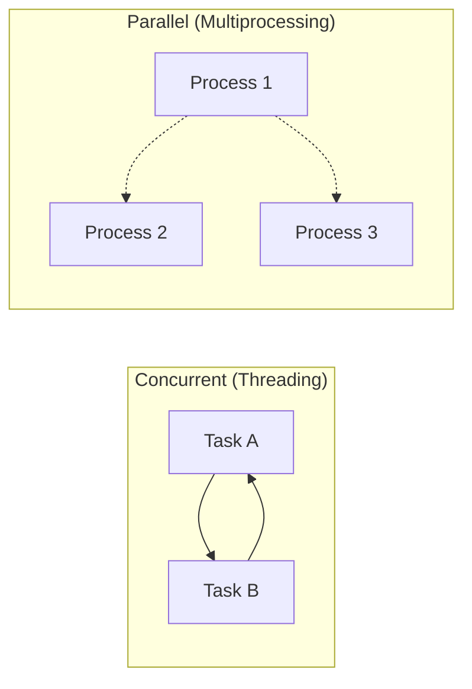

# Threading, Multiprocessing, and Concurrency

## Concurrency vs Parallelism

Concurrency is the composition of independently executing tasks; parallelism is the simultaneous execution of multiple computations. Python's `threading` module gives you concurrency (but limited parallelism due to the GIL), while `multiprocessing` gives you true parallelism via separate processes.



## The Global Interpreter Lock (GIL)

The GIL is a mutex that protects CPython internals from race conditions. It ensures only one thread executes Python bytecode at a time.

```python
import sys
print(sys._is_gil_enabled())  # Usually True for CPython
```

[!WARNING]
The GIL means pure-Python CPU-bound work in threads is **serialised**. For CPU-bound tasks, use `multiprocessing`; for I/O-bound tasks, threads are perfectly fine.

### When the GIL is released

C-extensions (like NumPy, `time.sleep()`, or I/O operations) release the GIL, allowing true parallelism during those calls:

```python
import threading
import time

def io_heavy():
    for _ in range(5):
        time.sleep(0.1)  # GIL released during sleep
        print(".", end="")

threads = [threading.Thread(target=io_heavy) for _ in range(4)]
for t in threads: t.start()
for t in threads: t.join()
```

## ThreadPoolExecutor

The `concurrent.futures.ThreadPoolExecutor` manages a pool of worker threads for I/O-bound tasks.

```python
from concurrent.futures import ThreadPoolExecutor, as_completed
import requests

URLS = [
    "https://httpbin.org/delay/1",
    "https://httpbin.org/delay/2",
    "https://httpbin.org/delay/3",
]

def fetch(url):
    resp = requests.get(url)
    return url, resp.status_code, len(resp.text)

with ThreadPoolExecutor(max_workers=5) as pool:
    fut_map = {pool.submit(fetch, u): u for u in URLS}
    for future in as_completed(fut_map):
        url, status, size = future.result()
        print(f"{url} → {status} ({size}B)")
```

[!SUCCESS]
`ThreadPoolExecutor` is ideal for web scraping, database queries, file I/O, and any I/O-bound workloads.

## ProcessPoolExecutor

For CPU-bound work, use `ProcessPoolExecutor`—it bypasses the GIL by spawning separate processes.

```python
from concurrent.futures import ProcessPoolExecutor, as_completed
import math

PRIMES = [
    112272535095293,
    112582705942171,
    112272535095293,
    115280095190773,
    115797848077099,
    1099726899285419,
]

def is_prime(n):
    if n < 2:
        return False
    if n == 2:
        return True
    if n % 2 == 0:
        return False
    sqrt_n = int(math.isqrt(n))
    for i in range(3, sqrt_n + 1, 2):
        if n % i == 0:
            return False
    return True

with ProcessPoolExecutor(max_workers=4) as pool:
    fut_map = {pool.submit(is_prime, p): p for p in PRIMES}
    for future in as_completed(fut_map):
        n = fut_map[future]
        print(f"{n} is prime: {future.result()}")
```

[!NOTE]
Each process has its own memory space—you cannot share Python objects directly. Use `multiprocessing.Queue`, `multiprocessing.Array`, or `Manager` for inter-process communication.

## Low-Level threading: Locks and Queues

### Thread Safety with `threading.Lock`

```python
import threading

counter = 0
lock = threading.Lock()

def increment():
    global counter
    for _ in range(100_000):
        with lock:
            counter += 1

threads = [threading.Thread(target=increment) for _ in range(10)]
for t in threads: t.start()
for t in threads: t.join()
print(counter)  # 1_000_000 (correct with lock)
```

### Using `queue.Queue`

```python
from queue import Queue
import threading
import time

def producer(q):
    for i in range(10):
        q.put(f"item-{i}")
        time.sleep(0.05)

def consumer(q):
    while True:
        item = q.get()
        if item is None:
            break
        print(f"Consumed {item}")
        q.task_done()

q = Queue(maxsize=5)
prod = threading.Thread(target=producer, args=(q,))
cons = threading.Thread(target=consumer, args=(q,))

prod.start(); cons.start()
prod.join()
q.put(None)  # Sentinel
cons.join()
```

## Multiprocessing Communication

```python
from multiprocessing import Process, Queue

def worker(q):
    q.put("hello from child")

q = Queue()
p = Process(target=worker, args=(q,))
p.start()
print(q.get())  # "hello from child"
p.join()
```

### Shared Memory with `Value` and `Array`

```python
from multiprocessing import Process, Value, Array

def increment(n, arr):
    n.value += 1
    for i in range(len(arr)):
        arr[i] *= 2

num = Value("i", 0)
data = Array("d", [1.0, 2.0, 3.0])
p = Process(target=increment, args=(num, data))
p.start()
p.join()
print(num.value)  # 1
print(data[:])    # [2.0, 4.0, 6.0]
```

## Synchronisation Primitives

| Primitive | Purpose | Module |
|-----------|---------|--------|
| `Lock` | Mutual exclusion | `threading`, `multiprocessing` |
| `RLock` | Re-entrant lock | `threading` |
| `Semaphore` | Limit concurrent access to N workers | `threading`, `multiprocessing` |
| `Event` | Signal between threads | `threading` |
| `Condition` | Complex thread signalling | `threading` |
| `Barrier` | Wait for N threads to rendezvous | `threading` |

## Real-World Use Case: Concurrent Web Scraper

```python
from concurrent.futures import ThreadPoolExecutor, as_completed
from urllib.parse import urljoin
import requests
from bs4 import BeautifulSoup
from collections import Counter

SEED = "https://example.com"
MAX_DEPTH = 2
MAX_WORKERS = 10

visited = set()
word_counts = Counter()

def scrape_page(url, depth):
    if url in visited or depth > MAX_DEPTH:
        return []
    visited.add(url)
    try:
        resp = requests.get(url, timeout=5)
    except Exception:
        return []
    soup = BeautifulSoup(resp.text, "html.parser")
    for tag in soup.find_all(["h1", "h2", "h3", "p"]):
        word_counts.update(tag.get_text().lower().split())
    links = []
    for a in soup.find_all("a", href=True):
        full = urljoin(url, a["href"])
        if full.startswith("http"):
            links.append((full, depth + 1))
    return links

with ThreadPoolExecutor(max_workers=MAX_WORKERS) as pool:
    futures = [pool.submit(scrape_page, SEED, 0)]
    while futures:
        for f in as_completed(futures):
            futures.remove(f)
            new_links = f.result()
            for link, d in new_links[:20]:
                futures.append(pool.submit(scrape_page, link, d))
```

## Performance Comparison


## Practice Questions

1. What is the GIL and why does it exist? When does it get released?
2. You have a list of 10,000 URLs to download. Would you use `ThreadPoolExecutor` or `ProcessPoolExecutor`? Why?
3. Write a program that computes the sum of squares of numbers 1–10⁷ using `ProcessPoolExecutor` and compares speed with single-threaded execution.
4. What happens if two threads call `counter += 1` simultaneously without a lock? Illustrate with an example.
5. How does `queue.Queue` differ from `multiprocessing.Queue`? When would you use each?
6. Implement a producer-consumer pattern where three producers generate data and two consumers process it, using `threading` and `queue`.
7. Why might `ProcessPoolExecutor` be slower than single-threaded for very small tasks? How would you tune it?
8. What is a sentinel value and how is it used to signal a worker to stop?
9. Write a program that uses `multiprocessing.Pool.map` to parallelise a CPU-heavy function.
10. Explain the difference between concurrency and parallelism in Python. Give a real-world example of each.
