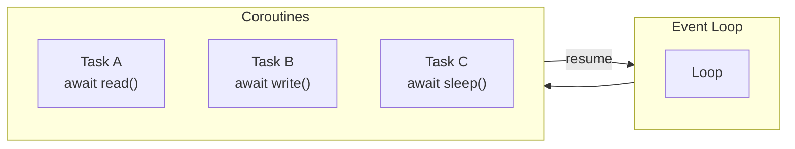
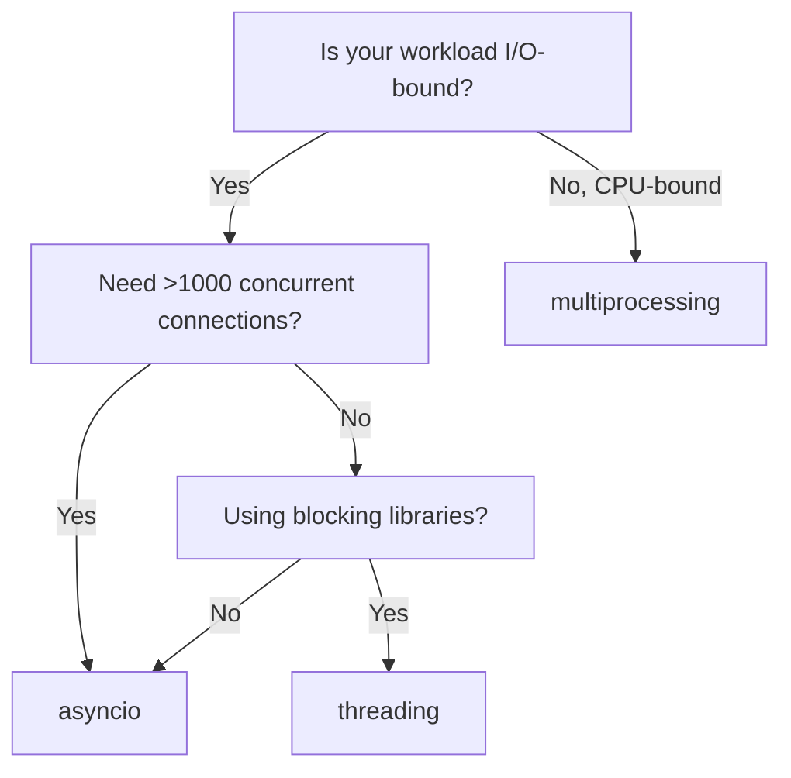

# Asynchronous Programming with asyncio

## The Event Loop

asyncio uses a single-threaded, single-process cooperative multitasking model. The event loop coroutines switch when they `await` an I/O operation, yielding control back to the loop.



## Coroutines and Await

A coroutine is a function defined with `async def`. It returns a coroutine object that must be awaited or scheduled.

```python
import asyncio

async def fetch_data():
    await asyncio.sleep(1)  # Simulate I/O
    return {"data": 42}

async def main():
    result = await fetch_data()
    print(result)

asyncio.run(main())
```

[!NOTE]
`asyncio.run()` creates the event loop, runs the coroutine, and cleans up. It's the standard entry point for async programs.

## Creating and Awaiting Tasks

`asyncio.create_task()` schedules a coroutine for concurrent execution.

```python
import asyncio

async def say_after(delay, msg):
    await asyncio.sleep(delay)
    print(msg)

async def main():
    task1 = asyncio.create_task(say_after(1, "world"))
    task2 = asyncio.create_task(say_after(2, "hello"))
    print("started")
    await task1
    await task2
    print("done")

asyncio.run(main())
```

[!SUCCESS]
Tasks run concurrently in the same event loop. Both tasks start immediately; total runtime is ~2s not 3s.

## asyncio.gather

Run multiple awaitables concurrently and collect results.

```python
import asyncio

async def fetch_url(name, delay):
    await asyncio.sleep(delay)
    return f"Result from {name}"

async def main():
    results = await asyncio.gather(
        fetch_url("A", 1),
        fetch_url("B", 2),
        fetch_url("C", 3),
    )
    print(results)

asyncio.run(main())
```

### Error Handling with gather

```python
async def might_fail(name, fail=False):
    await asyncio.sleep(0.5)
    if fail:
        raise ValueError(f"{name} failed")
    return name

async def main():
    results = await asyncio.gather(
        might_fail("A"),
        might_fail("B", fail=True),
        might_fail("C"),
        return_exceptions=True,
    )
    for r in results:
        if isinstance(r, Exception):
            print(f"Caught: {r}")
        else:
            print(f"Success: {r}")

asyncio.run(main())
```

## asyncio.wait and asyncio.as_completed

```python
async def worker(name, delay):
    await asyncio.sleep(delay)
    return name

async def main():
    tasks = [worker(f"W{i}", i) for i in range(1, 6)]

    # as_completed — results as they finish
    for coro in asyncio.as_completed(tasks):
        result = await coro
        print(f"Finished: {result}")

    # wait — with timeout and return_when
    done, pending = await asyncio.wait(
        tasks,
        timeout=3,
        return_when=asyncio.FIRST_COMPLETED,
    )
    for t in pending:
        t.cancel()

asyncio.run(main())
```

## Futures

A `Future` is a lower-level awaitable that represents a result that will be set later. Tasks wrap coroutines in futures.

```python
import asyncio

async def set_future(fut, value, delay):
    await asyncio.sleep(delay)
    fut.set_result(value)

async def main():
    loop = asyncio.get_running_loop()
    fut = loop.create_future()
    asyncio.create_task(set_future(fut, 42, 1))
    result = await fut
    print(result)  # 42

asyncio.run(main())
```

## asyncio.Queue

For producer-consumer patterns:

```python
import asyncio
import random

async def producer(q):
    for i in range(10):
        await asyncio.sleep(random.random() * 0.2)
        item = f"item-{i}"
        await q.put(item)
        print(f"Produced {item}")

async def consumer(q, name):
    while True:
        item = await q.get()
        if item is None:
            q.task_done()
            break
        await asyncio.sleep(random.random() * 0.3)
        print(f"{name} consumed {item}")
        q.task_done()

async def main():
    q = asyncio.Queue(maxsize=5)
    producers = [asyncio.create_task(producer(q))]
    consumers = [asyncio.create_task(consumer(q, f"C{i}")) for i in range(3)]
    await asyncio.gather(*producers)
    await q.join()
    for c in consumers:
        await q.put(None)
    await asyncio.gather(*consumers)

asyncio.run(main())
```

## Real-World aiohttp Example

```python
import asyncio
import aiohttp
from typing import List

BASE_URL = "https://jsonplaceholder.typicode.com"

async def fetch_json(session: aiohttp.ClientSession, url: str) -> dict:
    async with session.get(url) as resp:
        return await resp.json()

async def fetch_all_users() -> List[dict]:
    async with aiohttp.ClientSession() as session:
        tasks = [
            fetch_json(session, f"{BASE_URL}/posts/{i}")
            for i in range(1, 21)
        ]
        return await asyncio.gather(*tasks)

async def main():
    data = await fetch_all_users()
    print(f"Fetched {len(data)} posts")

results = asyncio.run(main())
```

[!WARNING]
Always use `aiohttp.ClientSession` as a context manager. Sessions manage connection pooling and reuse TCP connections, which is critical for performance.

## Semaphores and Rate Limiting

```python
import asyncio
import aiohttp

sem = asyncio.Semaphore(5)

async def rate_limited_fetch(session, url):
    async with sem:
        await asyncio.sleep(0.1)
        async with session.get(url) as resp:
            return await resp.text()

async def main():
    urls = [f"https://httpbin.org/delay/1" for _ in range(50)]
    async with aiohttp.ClientSession() as session:
        tasks = [rate_limited_fetch(session, u) for u in urls]
        results = await asyncio.gather(*tasks)
        print(f"Fetched {len(results)} pages")

asyncio.run(main())
```

## Timeouts and Cancellation

```python
import asyncio

async def slow_operation():
    await asyncio.sleep(10)
    return "done"

async def main():
    try:
        result = await asyncio.wait_for(slow_operation(), timeout=2)
    except asyncio.TimeoutError:
        print("Operation timed out")

    # Manual cancellation
    task = asyncio.create_task(slow_operation())
    await asyncio.sleep(0.1)
    task.cancel()
    try:
        await task
    except asyncio.CancelledError:
        print("Task was cancelled")

asyncio.run(main())
```

## Debugging Async Code

```python
import asyncio

async def problematic():
    loop = asyncio.get_running_loop()
    loop.slow_callback_duration = 0.1  # warn on slow callbacks
    await asyncio.sleep(10)

# Enable debug mode
asyncio.run(problematic(), debug=True)
```

## asyncio vs Threading Decision Matrix

| Aspect | asyncio | threading |
|--------|---------|-----------|
| Memory per task | ~1 KB | ~8 MB (OS thread) |
| Max concurrency | 10,000+ | Hundreds |
| GIL impact | None (single-thread) | Blocks CPU work |
| Best for | I/O-bound, many connections | I/O-bound, blocking libs |
| Complexity | Higher (async mindset) | Lower |



## Practice Questions

1. What is an event loop and how does it differ from OS threads?
2. Write a program that fetches 100 URLs concurrently using `aiohttp` and `asyncio.gather`.
3. What is the difference between a coroutine and a task? Show code examples.
4. How does `asyncio.wait` differ from `asyncio.gather`? When would you prefer one over the other?
5. Implement a rate limiter using `asyncio.Semaphore` that allows at most 10 concurrent requests.
6. What happens when you `await` a coroutine that raises an exception inside `asyncio.gather` with `return_exceptions=False`?
7. Write a producer-consumer pattern using `asyncio.Queue` where the producer generates items at a variable rate.
8. How do you cancel a running task? What exception does the cancelled task receive?
9. Why does `asyncio.run()` exist? What problems does it solve over manually managing the loop?
10. Compare and contrast `asyncio.sleep(0)` vs `time.sleep(0)`. Why does the former enable concurrency and the latter block it?
