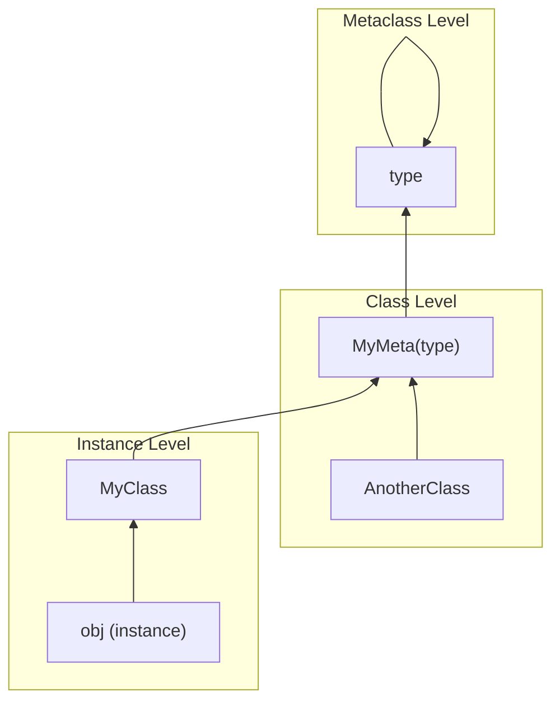

# Metaclasses and Descriptors

## Everything is an Object

In Python, classes are objects too—instances of a metaclass (default: `type`).

```python
class MyClass:
    pass

print(type(MyClass))     # <class 'type'>
print(type(type))        # <class 'type'>
print(isinstance(MyClass, type))  # True
```

## The `type()` Metaclass

`type(name, bases, namespace)` creates a new class dynamically.

```python
# These are equivalent:
class Foo:
    x = 10
    def bar(self):
        return self.x

Foo = type("Foo", (), {"x": 10, "bar": lambda self: self.x})

# With inheritance
Base = type("Base", (), {"greet": lambda self: "hello"})
Child = type("Child", (Base,), {"extra": 42})
obj = Child()
print(obj.greet())  # "hello"
print(obj.extra)    # 42
```

## Custom Metaclasses

A metaclass inherits from `type`. Its `__new__` receives the future class's name, bases, and namespace.

```python
class SingletonMeta(type):
    _instances = {}
    def __call__(cls, *args, **kwargs):
        if cls not in cls._instances:
            cls._instances[cls] = super().__call__(*args, **kwargs)
        return cls._instances[cls]

class Database(metaclass=SingletonMeta):
    def __init__(self):
        self.connected = False

db1 = Database()
db2 = Database()
print(db1 is db2)  # True
```

[!NOTE]
`__new__` is called before `__init__`. In metaclasses, `__new__` receives the class being created, while `__init__` receives the already-created class.

### Validation Metaclass

```python
class ValidateAttributes(type):
    def __new__(mcs, name, bases, namespace):
        required = namespace.get("__required_attrs__", [])
        for attr in required:
            if attr not in namespace:
                raise TypeError(f"{name} must define '{attr}'")
        return super().__new__(mcs, name, bases, namespace)

class APIEndpoint(metaclass=ValidateAttributes):
    __required_attrs__ = ["path", "method"]

# This raises TypeError:
# class InvalidEndpoint(metaclass=ValidateAttributes):
#     pass

class ValidEndpoint(metaclass=ValidateAttributes):
    __required_attrs__ = ["path", "method"]
    path = "/api/health"
    method = "GET"
```

## `__new__` vs `__init__`

| Method | When Called | Returns | Purpose |
|--------|-------------|---------|---------|
| `__new__` | Before init | New instance | Object creation (rarely overridden) |
| `__init__` | After `__new__` | None | Object initialisation |

```python
class Custom:
    def __new__(cls, *args, **kwargs):
        instance = super().__new__(cls)
        print(f"Creating instance of {cls.__name__}")
        return instance

    def __init__(self, value):
        print(f"Initialising with {value}")
        self.value = value

obj = Custom(42)
# Creating instance of Custom
# Initialising with 42
```

[!SUCCESS]
Override `__new__` for immutable types (str, int, tuple) or singleton/registry patterns. Use `__init__` for normal initialisation.

## The Descriptor Protocol

Descriptors are objects that define `__get__`, `__set__`, or `__delete__`. They control attribute access.

```python
class ValidatedField:
    def __init__(self, validator):
        self.validator = validator
        self.data = {}

    def __get__(self, obj, objtype=None):
        if obj is None:
            return self
        return self.data.get(id(obj))

    def __set__(self, obj, value):
        if not self.validator(value):
            raise ValueError(f"Invalid value: {value}")
        self.data[id(obj)] = value

class Person:
    age = ValidatedField(lambda v: 0 <= v <= 150)

    def __init__(self, name, age):
        self.name = name
        self.age = age

p = Person("Alice", 30)
print(p.age)  # 30
# p.age = 200  # ValueError
```

## The `property()` Implementation

`property()` is a built-in descriptor. Here's how you'd implement it:

```python
class Property:
    def __init__(self, fget=None, fset=None, fdel=None, doc=None):
        self.fget = fget
        self.fset = fset
        self.fdel = fdel
        if doc is None and fget is not None:
            doc = fget.__doc__
        self.__doc__ = doc

    def __get__(self, obj, objtype=None):
        if obj is None:
            return self
        if self.fget is None:
            raise AttributeError("unreadable attribute")
        return self.fget(obj)

    def __set__(self, obj, value):
        if self.fset is None:
            raise AttributeError("can't set attribute")
        self.fset(obj, value)

    def __delete__(self, obj):
        if self.fdel is None:
            raise AttributeError("can't delete attribute")
        self.fdel(obj)

    def setter(self, fset):
        return type(self)(self.fget, fset, self.fdel)

    def deleter(self, fdel):
        return type(self)(self.fget, self.fset, fdel)

class Temperature:
    def __init__(self, celsius=0):
        self._celsius = celsius

    @Property
    def fahrenheit(self):
        return self._celsius * 9 / 5 + 32

    @fahrenheit.setter
    def fahrenheit(self, value):
        self._celsius = (value - 32) * 5 / 9
```

## Real-World: Django-like ORM Field

```python
class Field:
    def __init__(self, default=None, nullable=False):
        self.default = default
        self.nullable = nullable
        self.name = None

    def __set_name__(self, owner, name):
        self.name = name

    def __get__(self, obj, objtype=None):
        if obj is None:
            return self
        return obj.__dict__.get(self.name, self.default)

    def __set__(self, obj, value):
        if value is None and not self.nullable:
            raise ValueError(f"{self.name} cannot be null")
        obj.__dict__[self.name] = value

class ModelMeta(type):
    def __new__(mcs, name, bases, namespace):
        fields = {}
        for attr_name, attr_val in namespace.items():
            if isinstance(attr_val, Field):
                fields[attr_name] = attr_val
        cls = super().__new__(mcs, name, bases, namespace)
        cls._fields = fields
        return cls

class Model(metaclass=ModelMeta):
    pass

class User(Model):
    name = Field(default="anonymous")
    email = Field(nullable=False)
    age = Field(default=0)

u = User()
print(u.name)  # "anonymous"
```

## Slots: Memory Optimisation

`__slots__` declares instance attributes explicitly, eliminating the per-instance `__dict__`.

```python
class Point:
    __slots__ = ("x", "y")
    def __init__(self, x, y):
        self.x = x
        self.y = y

p = Point(1, 2)
# p.z = 3  # AttributeError
print(p.x, p.y)
```

[!NOTE]
Slots interact with descriptors interestingly: if a descriptor defines `__set_name__` and the class uses `__slots__`, the slot entry is used instead of the instance dict.

## Mermaid: Metaclass Hierarchy



## Practice Questions

1. What is a metaclass? How does `type("Name", bases, dict)` differ from using the `class` keyword?
2. Implement a metaclass `AutoRepr` that automatically adds a `__repr__` method to every class using it.
3. What is the difference between `__new__` and `__init__`? When would you override `__new__`?
4. Explain the descriptor protocol. How do `__get__`, `__set__`, and `__delete__` interact?
5. Re-implement Python's `@property` using a custom descriptor class.
6. What is the purpose of `__set_name__`? Show an example where it's essential.
7. Build a metaclass `EnumMeta` that prevents duplicate enum member names.
8. How does `__slots__` affect memory usage and attribute access speed? What are its limitations?
9. Write a descriptor `LoggedAttribute` that logs every read and write to its value.
10. Why does `property()` work as a decorator? Explain using descriptors.
