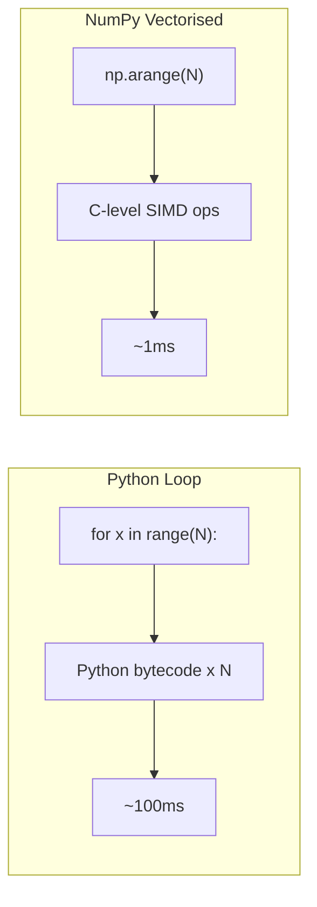

# Performance Optimization, Cython, and Numba

## Profile Before Optimising

Never guess where the bottleneck is. Use profilers.

### cProfile

```python
import cProfile
import pstats

def heavy():
    total = 0
    for i in range(10**6):
        total += i ** 2
    return total

profiler = cProfile.Profile()
profiler.runcall(heavy)
stats = pstats.Stats(profiler)
stats.sort_stats(pstats.SortKey.TIME)
stats.print_stats(10)
```

Output shows cumulative time, per-call time, and call count.

### Line Profiler

```bash
pip install line_profiler
```

```python
from line_profiler import profile

@profile
def process_data(data):
    total = 0.0
    for x in data:
        total += x ** 2
        total /= max(1, x)
    return total

process_data(range(100_000))
```

[!NOTE]
Run with `kernprof -l script.py && python -m line_profiler script.py.lprof` for line-by-line timing.

### Memory Profiler

```python
from memory_profiler import profile

@profile
def allocate():
    big = [list(range(1000)) for _ in range(1000)]
    return sum(len(x) for x in big)

allocate()
```

## Using __slots__

Slots reduce memory by replacing the per-instance `__dict__` with a fixed-size array.

```python
class WithoutSlots:
    def __init__(self, x, y, z):
        self.x = x
        self.y = y
        self.z = z

class WithSlots:
    __slots__ = ("x", "y", "z")
    def __init__(self, x, y, z):
        self.x = x
        self.y = y
        self.z = z

import sys
a = WithoutSlots(1, 2, 3)
b = WithSlots(1, 2, 3)
print(sys.getsizeof(a))  # ~56 (plus __dict__ ~120)
print(sys.getsizeof(b))  # ~56 (no __dict__)

# For 1M instances, WithSlots saves ~120+ MB
```

[!SUCCESS]
Use `__slots__` when creating millions of small objects (e.g., data records, game entities, particles).

## collections Module Optimisations

```python
from collections import defaultdict, Counter, deque, OrderedDict
from collections.abc import Mapping

# deque for O(1) appends/pops from both ends
dq = deque(maxlen=1000)
for i in range(2000):
    dq.append(i)
print(len(dq))  # 1000 (oldest dropped)

# Counter for frequency
freq = Counter("mississippi")
print(freq.most_common(2))  # [('i', 4), ('s', 4)]

# defaultdict avoids key checks
groups = defaultdict(list)
groups["a"].append(1)  # no KeyError
```

## NumPy Vectorisation

Native Python loops are slow; NumPy operates on C-level arrays.

```python
import numpy as np
import time

# Slow Python loop
N = 10_000_000
start = time.perf_counter()
py_result = sum(x ** 2 for x in range(N))
print(f"Python: {time.perf_counter() - start:.2f}s")

# Fast NumPy
start = time.perf_counter()
arr = np.arange(N, dtype=np.float64)
np_result = (arr ** 2).sum()
print(f"NumPy: {time.perf_counter() - start:.2f}s")

# Typically 50-100x faster
```



## Cython Basics

Cython compiles Python-like code to C extensions. Save as `.pyx`.

```cython
# sum_squares.pyx
def sum_squares(int n):
    cdef int i
    cdef long long total = 0
    for i in range(n):
        total += i * i
    return total
```

### Build with `setup.py`

```python
from setuptools import setup, Extension
from Cython.Build import cythonize

setup(
    ext_modules=cythonize([
        Extension("sum_squares", ["sum_squares.pyx"])
    ])
)
```

```bash
python setup.py build_ext --inplace
python -c "import sum_squares; print(sum_squares.sum_squares(10**7))"
```

[!NOTE]
Cython allows `cdef` type declarations that compile to pure C. Even without type annotations, Cython often gives 2-3x speedup.

### Pure Python Mode with Cython Annotations

```python
import cython

@cython.cfunc
@cython.returns(cython.longlong)
@cython.locals(n=cython.int, i=cython.int)
def sum_squares(n):
    total: cython.longlong = 0
    for i in range(n):
        total += i * i
    return total
```

## Numba JIT Compilation

Numba compiles Python functions to machine code using LLVM—zero C code required.

```python
from numba import njit, prange
import time
import math

@njit
def is_prime(n):
    if n < 2:
        return False
    for i in range(2, int(math.sqrt(n)) + 1):
        if n % i == 0:
            return False
    return True

@njit(parallel=True)
def count_primes(limit):
    count = 0
    for i in prange(2, limit):
        if is_prime(i):
            count += 1
    return count

start = time.perf_counter()
print(count_primes(10_000_000))  # 664,579
print(f"Numba: {time.perf_counter() - start:.2f}s")
# Often 100-200x faster than pure Python
```

[!SUCCESS]
Numba excels with numerical loops and math-heavy code. It's widely used in quantitative finance, scientific computing, and ML preprocessing.

## Cython vs Numba Decision Matrix

| Feature | Cython | Numba |
|---------|--------|-------|
| Setup | Requires compilation step | Runtime JIT |
| Dependencies | C compiler, Cython | llvmlite, numpy |
| Best for | Complex C interop | Numerical algorithms |
| Python features | Limited (no dynamic typing) | More compatible |
| Deployment | Build wheel | Easy (no build) |
| Speed | Near-C | Near-C |

## Real-World: Image Processing with Numba

```python
import numpy as np
from numba import njit, prange

@njit(parallel=True)
def grayscale(images):
    """Convert batch of RGB images to grayscale."""
    n, h, w, c = images.shape
    result = np.zeros((n, h, w), dtype=np.uint8)
    for i in prange(n):
        for y in range(h):
            for x in range(w):
                r, g, b = images[i, y, x]
                result[i, y, x] = 0.299 * r + 0.587 * g + 0.114 * b
    return result

batch = np.random.randint(0, 256, (100, 256, 256, 3), dtype=np.uint8)
gray = grayscale(batch)
```

## Practice Questions

1. What is the difference between `cProfile` and a line profiler? When would you use each?
2. Write a benchmark comparing a list comprehension vs a `for` loop vs NumPy for computing `x**2` on 10M elements.
3. How do `__slots__` reduce memory usage? What are the tradeoffs?
4. Create a Numba JIT function that computes the Mandelbrot set and compare its speed to pure Python.
5. What is `cython -a` and how does it help optimise code?
6. Compare `deque` vs `list` for a sliding window operation on 100K elements.
7. Write a Cython `.pyx` file that computes Fibonacci numbers efficiently using `cdef`.
8. Why is Python's `for` loop slower than NumPy for numerical operations? Explain the role of CPython bytecode.
9. Implement a `Counter`-based frequency analysis on a 10M-item list and compare `collections.Counter` vs manual dict.
10. What are the limitations of Numba? When would Cython be the better choice despite the extra build step?
