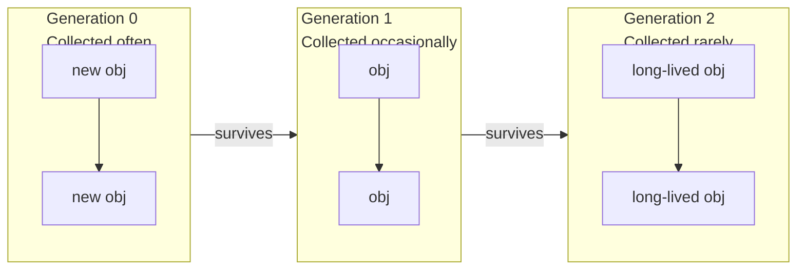

# Memory Management and Garbage Collection

## Reference Counting

Every Python object has an integer reference count. When it reaches 0, the memory is freed immediately.

```python
import sys

x = [1, 2, 3]
print(sys.getrefcount(x))  # 2 (x + argument)

y = x
print(sys.getrefcount(x))  # 3

del y
print(sys.getrefcount(x))  # 2

del x
# Object freed
```

[!NOTE]
`sys.getrefcount()` itself increments the count because the object is passed as an argument. Subtract 1 for the true count.

## The `gc` Module (Cyclic GC)

Reference counting alone cannot handle cycles:

```python
class Node:
    def __init__(self, name):
        self.name = name
        self.next = None

a = Node("A")
b = Node("B")
a.next = b
b.next = a  # Cycle!
del a
del b
# Ref counts never hit 0 — cyclic GC needed
```

### Manual GC Control

```python
import gc

gc.enable()
print(gc.get_threshold())  # (700, 10, 10)

# Force collection
collected = gc.collect()
print(f"Collected {collected} objects")

# Disable for real-time systems
gc.disable()

# Find unreachable
gc.set_debug(gc.DEBUG_LEAK)
```

### GC Generations

```python
import gc

# Track objects across generations
for gen in range(3):
    print(f"Gen {gen}: {gc.get_count()[gen]} objects")

# Objects move from Gen 0 → 1 → 2 as they survive collections
# Gen 0 is collected most frequently (~700 allocations)
# Gen 2 is the "old" generation, collected rarely
```



## Weak References

`weakref` allows referencing an object without increasing its ref count—ideal for caches and observers.

```python
import weakref

class Expensive:
    def __init__(self, data):
        self.data = data
    def __del__(self):
        print(f"Deleting {self.data}")

obj = Expensive([1, 2, 3])
ref = weakref.ref(obj)
print(ref() is obj)  # True

del obj
print(ref() is None)  # True (weak ref died)
```

### WeakValueDictionary

```python
import weakref

class Cache:
    def __init__(self):
        self._data = weakref.WeakValueDictionary()

    def set(self, key, value):
        self._data[key] = value

    def get(self, key):
        return self._data.get(key)

cache = Cache()
obj = {"payload": "large"}
cache.set("item1", obj)
print(cache.get("item1"))  # {"payload": "large"}
del obj
print(cache.get("item1"))  # None (automatically cleared)
```

[!SUCCESS]
`WeakValueDictionary` is ideal for caches where entries should auto-expire when no other references exist.

## Memory Leaks in Python

Common causes:

```python
# 1. Circular references with __del__
class Leak:
    def __init__(self, other=None):
        self.other = other
    def __del__(self):
        pass  # Prevents GC from collecting cycles!

a = Leak()
b = Leak(a)
a.other = b  # cycle + __del__ = unreachable but uncollectable

# 2. Global caches that never clear
_GLOBAL_CACHE = {}

def memoize(func):
    _GLOBAL_CACHE[func] = {}
    def wrapper(n):
        if n not in _GLOBAL_CACHE[func]:
            _GLOBAL_CACHE[func][n] = func(n)
        return _GLOBAL_CACHE[func][n]
    return wrapper

# 3. Unclosed resources
import tempfile
f = tempfile.NamedTemporaryFile()
# Never closed — file descriptor leak
```

### Detecting Leaks

```python
import gc
import objgraph  # pip install objgraph

# Show objects preventing collection
gc.collect()
objgraph.show_most_common_types(limit=10)

# Track specific type growth
objgraph.show_growth(limit=5)

# Find what's holding a reference
obj = SomeClass()
objgraph.show_backrefs([obj], max_depth=5, filename="backrefs.png")
```

## Memory Profiling

```python
import tracemalloc

tracemalloc.start()

# Take a snapshot
snap1 = tracemalloc.take_snapshot()
data = [list(range(1000)) for _ in range(1000)]
snap2 = tracemalloc.take_snapshot()

stats = snap2.compare_to(snap1, "lineno")
for stat in stats[:5]:
    print(stat)
```

### Using `memory_profiler`

```bash
pip install memory_profiler
python -m memory_profiler script.py
```

```python
@profile
def heavy():
    a = [i ** 2 for i in range(100_000)]
    b = {i: str(i) for i in range(100_000)}
    return a, b
```

[!NOTE]
Memory profiling in production can use `tracemalloc` with periodic snapshots to track growth over time.

## Object Sizes

```python
import sys

empty_list = []
print(sys.getsizeof(empty_list))  # 56 (overhead)

ten_items = [None] * 10
print(sys.getsizeof(ten_items))   # 120 (10 × 8 + overhead)

# For deeply nested structures, use `pympler`
from pympler import asizeof
nested = [[[i for i in range(100)] for _ in range(100)] for _ in range(10)]
print(asizeof.asizeof(nested) / 1024, "KB")
```

## Best Practices

| Practice | Why |
|----------|-----|
| Use `__slots__` for many small objects | Eliminates `__dict__` (~120B per instance) |
| Prefer generators over lists | Streams data instead of storing all in memory |
| Use `array.array` or `bytearray` | Compact C-level storage for homogenous types |
| Avoid cyclical references in `__del__` | Prevents GC from freeing cycles |
| Use `weakref` for caches | Auto-cleanup when objects are no longer needed |
| Close resources explicitly | Use context managers (`with` statement) |

## Real-World: Memory-Efficient Log Parser

```python
import gc
import weakref
from collections import deque

class LogEntry:
    __slots__ = ("timestamp", "level", "message")
    def __init__(self, timestamp, level, message):
        self.timestamp = timestamp
        self.level = level
        self.message = message

class LogBuffer:
    def __init__(self, maxlen=100_000):
        self.buffer = deque(maxlen=maxlen)
        self._listeners = weakref.WeakSet()

    def add(self, entry):
        self.buffer.append(entry)
        for listener in self._listeners:
            listener(entry)

    def subscribe(self, callback):
        self._listeners.add(callback)

# Process 1M log entries without memory leak
buf = LogBuffer(maxlen=10_000)
for i in range(1_000_000):
    buf.add(LogEntry(i, "INFO", f"entry {i}"))
    if i % 100_000 == 0:
        gc.collect()

print(len(buf.buffer))  # 10_000 (oldest dropped)
```

## Practice Questions

1. How does Python's reference counting work? What are its limitations?
2. What is a circular reference? How does the cyclic garbage collector detect and collect it?
3. Write a program that creates a memory leak using `__del__` and cycles, then detect it with `gc`.
4. What is a `weakref`? Implement an observer pattern using `WeakSet`.
5. How do Python's GC generations work? What thresholds trigger each generation?
6. Use `tracemalloc` to find the top 3 memory-consuming lines in a function that allocates many strings.
7. What is the `gc.garbage` list? When does it get populated?
8. Compare `pympler.asizeof` vs `sys.getsizeof`. Why might `sys.getsizeof` under-report memory usage?
9. Implement a simple object pool using `weakref.WeakValueDictionary` to reuse expensive objects.
10. How would you profile memory usage of a long-running web server? What tools and strategies would you use?
