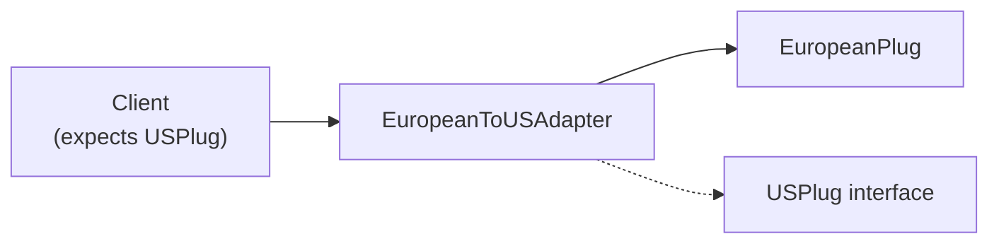

# Creational and Structural Design Patterns

## Singleton Pattern

Ensure a class has exactly one instance.

```python
class SingletonMeta(type):
    _instances = {}
    def __call__(cls, *args, **kwargs):
        if cls not in cls._instances:
            cls._instances[cls] = super().__call__(*args, **kwargs)
        return cls._instances[cls]

class Database(metaclass=SingletonMeta):
    def __init__(self):
        self.connection = None

    def connect(self, url):
        self.connection = f"Connected to {url}"

# Both variables point to the same instance
db1 = Database()
db2 = Database()
print(db1 is db2)  # True
```

### Thread-Safe Singleton

```python
import threading

class ThreadSafeSingleton:
    _instance = None
    _lock = threading.Lock()

    def __new__(cls, *args, **kwargs):
        if cls._instance is None:
            with cls._lock:
                if cls._instance is None:
                    cls._instance = super().__new__(cls)
        return cls._instance

    def __init__(self):
        pass  # init runs every time — guard with flag if needed
```

[!WARNING]
Be cautious with Singleton in multi-threaded contexts. Always use a lock for the first creation, and guard `__init__` from re-initialisation.

## Factory Pattern

Abstract object creation behind a factory interface.

```python
from abc import ABC, abstractmethod

class PaymentGateway(ABC):
    @abstractmethod
    def charge(self, amount):
        pass

class StripeGateway(PaymentGateway):
    def charge(self, amount):
        return f"Stripe charged ${amount}"

class PayPalGateway(PaymentGateway):
    def charge(self, amount):
        return f"PayPal charged ${amount}"

class PaymentFactory:
    GATEWAYS = {
        "stripe": StripeGateway,
        "paypal": PayPalGateway,
    }

    @staticmethod
    def create(gateway_type):
        cls = PaymentFactory.GATEWAYS.get(gateway_type)
        if not cls:
            raise ValueError(f"Unknown gateway: {gateway_type}")
        return cls()

gateway = PaymentFactory.create("stripe")
print(gateway.charge(100))
```

## Builder Pattern

Build complex objects step by step.

```python
class QueryBuilder:
    def __init__(self):
        self._select = []
        self._from_ = ""
        self._where = []
        self._order_by = []
        self._limit = None

    def select(self, *columns):
        self._select.extend(columns)
        return self

    def from_(self, table):
        self._from_ = table
        return self

    def where(self, condition):
        self._where.append(condition)
        return self

    def order_by(self, column, direction="ASC"):
        self._order_by.append(f"{column} {direction}")
        return self

    def limit(self, n):
        self._limit = n
        return self

    def build(self):
        parts = ["SELECT"]
        parts.append(", ".join(self._select) if self._select else "*")
        parts.append(f"FROM {self._from_}")
        if self._where:
            parts.append("WHERE " + " AND ".join(self._where))
        if self._order_by:
            parts.append("ORDER BY " + ", ".join(self._order_by))
        if self._limit is not None:
            parts.append(f"LIMIT {self._limit}")
        return " ".join(parts)

query = (QueryBuilder()
         .select("id", "name", "email")
         .from_("users")
         .where("age > 18")
         .where("status = 'active'")
         .order_by("name")
         .limit(10)
         .build())
print(query)
# SELECT id, name, email FROM users WHERE age > 18 AND status = 'active' ORDER BY name ASC LIMIT 10
```

[!SUCCESS]
Builder is ideal for constructing objects with many optional parameters, SQL queries, HTTP requests, and configuration objects.

## Adapter Pattern

Convert one interface to another that clients expect.

```python
class USPlug:
    def voltage(self):
        return 120

class EuropeanPlug:
    def voltage(self):
        return 230

class USCharger:
    def charge(self, plug):
        return f"Charging at {plug.voltage()}V (US)"

class EuropeanToUSAdapter:
    def __init__(self, euro_plug):
        self._euro = euro_plug

    def voltage(self):
        return self._euro.voltage()

charger = USCharger()
euro_plug = EuropeanPlug()
adapter = EuropeanToUSAdapter(euro_plug)
print(charger.charge(adapter))  # Works!
```



## Decorator Pattern (Structural)

Add behaviour to objects dynamically without subclassing.

```python
from functools import wraps

class Beverage:
    def cost(self):
        return 5
    def description(self):
        return "Beverage"

class MilkDecorator:
    def __init__(self, beverage):
        self._beverage = beverage

    def cost(self):
        return self._beverage.cost() + 2

    def description(self):
        return self._beverage.description() + ", Milk"

class SugarDecorator:
    def __init__(self, beverage):
        self._beverage = beverage

    def cost(self):
        return self._beverage.cost() + 1

    def description(self):
        return self._beverage.description() + ", Sugar"

coffee = Beverage()
coffee = MilkDecorator(coffee)
coffee = SugarDecorator(coffee)
print(f"{coffee.description()} = ${coffee.cost()}")
# Beverage, Milk, Sugar = $8
```

[!NOTE]
The structural Decorator pattern differs from Python's function decorators, but the idea is the same: wrap an object/function to add behaviour.

## Proxy Pattern

Control access to an object via a surrogate.

```python
import time
from datetime import datetime

class SensitiveData:
    def read(self):
        return "TOP SECRET DATA"

class AccessProxy:
    def __init__(self, target):
        self._target = target
        self._allowed_users = {"admin", "supervisor"}

    def read(self, user):
        if user not in self._allowed_users:
            raise PermissionError(f"{user} is not authorised")
        return self._target.read()

class LoggingProxy:
    def __init__(self, target):
        self._target = target

    def read(self, *args, **kwargs):
        print(f"[{datetime.now()}] Access attempt")
        return self._target.read(*args, **kwargs)

data = SensitiveData()
proxy = LoggingProxy(AccessProxy(data))
print(proxy.read("admin"))  # Logs access, checks auth, returns data
```

### Lazy Proxy

```python
class LazyImage:
    def __init__(self, path):
        self.path = path
        self._image = None

    def _load(self):
        if self._image is None:
            print(f"Loading {self.path} from disk...")
            self._image = f"<image:{self.path}>"
        return self._image

    def display(self):
        return self._load()

img = LazyImage("photo.jpg")
# Image not loaded yet
print(img.display())  # Loads now
print(img.display())  # Uses cached version
```

## Practice Questions

1. Implement a `Logger` singleton that writes to a file. Ensure thread safety.
2. Build a `ShapeFactory` that creates `Circle`, `Square`, and `Triangle` objects. Add a new shape without modifying the factory.
3. Implement a Builder for constructing HTML elements (e.g., `div`, `p`, `a` with attributes and children).
4. Create an adapter that converts a modern JSON API response to a legacy XML-based interface.
5. What is the difference between the structural Decorator and Python's function decorators?
6. Implement a caching proxy that stores results of an expensive computation and returns cached results for repeated calls.
7. When would you choose Builder over a constructor with many parameters?
8. Build a notification system using Factory: `EmailNotifier`, `SMSNotifier`, `PushNotifier`.
9. Implement a virtual proxy that lazily loads a large database query result only when accessed.
10. Combine the Decorator and Adapter patterns: wrap a legacy SMS service with an adapter, then add logging via decorator.
