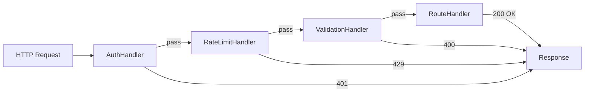

# Behavioral Design Patterns

## Observer Pattern

Define a one-to-many dependency so that when one object changes state, all dependents are notified automatically.

```python
from abc import ABC, abstractmethod
from weakref import WeakSet

class Observer(ABC):
    @abstractmethod
    def update(self, event, data):
        pass

class Observable:
    def __init__(self):
        self._observers = WeakSet()

    def subscribe(self, observer):
        self._observers.add(observer)

    def unsubscribe(self, observer):
        self._observers.discard(observer)

    def _notify(self, event, data=None):
        for obs in self._observers:
            obs.update(event, data)

class EmailService(Observer):
    def update(self, event, data):
        if event == "user_registered":
            print(f"Sending welcome email to {data['email']}")

class AnalyticsTracker(Observer):
    def update(self, event, data):
        print(f"Tracking event: {event} — {data}")

class UserManager(Observable):
    def register(self, email, name):
        user = {"email": email, "name": name}
        print(f"Registering {name}")
        self._notify("user_registered", user)

users = UserManager()
users.subscribe(EmailService())
users.subscribe(AnalyticsTracker())
users.register("alice@example.com", "Alice")
```

[!SUCCESS]
Observer is the foundation of event-driven architectures, pub/sub systems, and reactive programming frameworks.

## Strategy Pattern

Define a family of algorithms, encapsulate each one, and make them interchangeable.

```python
from abc import ABC, abstractmethod
import math

class CompressionStrategy(ABC):
    @abstractmethod
    def compress(self, data):
        pass

class ZipCompression(CompressionStrategy):
    def compress(self, data):
        return f"zip({len(data)} bytes)"

class GzipCompression(CompressionStrategy):
    def compress(self, data):
        return f"gzip({len(data)} bytes)"

class LZ4Compression(CompressionStrategy):
    def compress(self, data):
        return f"lz4({len(data)} bytes)"

class Compressor:
    def __init__(self, strategy: CompressionStrategy):
        self._strategy = strategy

    def set_strategy(self, strategy: CompressionStrategy):
        self._strategy = strategy

    def compress(self, data):
        return self._strategy.compress(data)

data = b"some binary data here"
compressor = Compressor(ZipCompression())
print(compressor.compress(data))
compressor.set_strategy(GzipCompression())
print(compressor.compress(data))
```

### Real-World: Routing with Strategy

```python
class RouteStrategy(ABC):
    @abstractmethod
    def calculate(self, origin, dest):
        pass

class RoadRoute(RouteStrategy):
    def calculate(self, origin, dest):
        return f"Road: {origin} → {dest} (120km, 1.5h)"

class PublicTransitRoute(RouteStrategy):
    def calculate(self, origin, dest):
        return f"Transit: {origin} → {dest} (90min, $3.50)"

class WalkingRoute(RouteStrategy):
    def calculate(self, origin, dest):
        return f"Walking: {origin} → {dest} (5km, 1h)"

class Navigator:
    def __init__(self, strategy=None):
        self._strategy = strategy

    def get_directions(self, origin, dest):
        return self._strategy.calculate(origin, dest)

nav = Navigator(WalkingRoute())
print(nav.get_directions("Home", "Park"))
```

[!NOTE]
Strategy enables the open/closed principle: add new algorithms without modifying existing code.

## Command Pattern

Encapsulate a request as an object, allowing parameterisation, queuing, and undo.

```python
from abc import ABC, abstractmethod
from collections import deque

class Command(ABC):
    @abstractmethod
    def execute(self):
        pass

    @abstractmethod
    def undo(self):
        pass

class TextEditor:
    def __init__(self):
        self.content = ""

    def insert(self, text, pos=None):
        if pos is None:
            pos = len(self.content)
        self.content = self.content[:pos] + text + self.content[pos:]

    def delete(self, start, end):
        self.content = self.content[:start] + self.content[end:]

class InsertCommand(Command):
    def __init__(self, editor, text, pos=None):
        self.editor = editor
        self.text = text
        self.pos = pos or len(editor.content)

    def execute(self):
        self.editor.insert(self.text, self.pos)

    def undo(self):
        end = self.pos + len(self.text)
        self.editor.delete(self.pos, end)

class DeleteCommand(Command):
    def __init__(self, editor, start, end):
        self.editor = editor
        self.start = start
        self.end = end
        self._deleted = ""

    def execute(self):
        self._deleted = self.editor.content[self.start:self.end]
        self.editor.delete(self.start, self.end)

    def undo(self):
        self.editor.insert(self._deleted, self.start)

class CommandHistory:
    def __init__(self):
        self._history = deque(maxlen=100)
        self._future = []

    def execute(self, cmd):
        cmd.execute()
        self._history.append(cmd)
        self._future.clear()

    def undo(self):
        if self._history:
            cmd = self._history.pop()
            cmd.undo()
            self._future.append(cmd)

    def redo(self):
        if self._future:
            cmd = self._future.pop()
            cmd.execute()
            self._history.append(cmd)

editor = TextEditor()
history = CommandHistory()
history.execute(InsertCommand(editor, "Hello"))
history.execute(InsertCommand(editor, " World", 5))
print(editor.content)  # "Hello World"
history.undo()
print(editor.content)  # "Hello"
history.redo()
print(editor.content)  # "Hello World"
```

## Chain of Responsibility Pattern

Pass requests along a chain of handlers until one handles it.

```python
from abc import ABC, abstractmethod

class Handler(ABC):
    def __init__(self, next_handler=None):
        self._next = next_handler

    def set_next(self, handler):
        self._next = handler
        return handler

    def handle(self, request):
        if self._next:
            return self._next.handle(request)
        return None

class AuthHandler(Handler):
    def handle(self, request):
        if request.get("token") == "valid":
            return super().handle(request)
        return "401 Unauthorized"

class RateLimitHandler(Handler):
    def handle(self, request):
        if request.get("calls", 0) > 100:
            return "429 Too Many Requests"
        return super().handle(request)

class ValidationHandler(Handler):
    def handle(self, request):
        if not request.get("body"):
            return "400 Bad Request"
        return super().handle(request)

class RouteHandler(Handler):
    def handle(self, request):
        return f"200 OK: {request.get('path')} handled"

handlers = AuthHandler()
handlers.set_next(RateLimitHandler()) \
         .set_next(ValidationHandler()) \
         .set_next(RouteHandler())

print(handlers.handle({"token": "valid", "path": "/api", "body": "ok", "calls": 5}))
print(handlers.handle({"token": "bad", "path": "/api"}))
```



## State Pattern

Allow an object to alter its behaviour when its internal state changes.

```python
from abc import ABC, abstractmethod

class VendingMachineState(ABC):
    @abstractmethod
    def insert_coin(self, machine):
        pass

    @abstractmethod
    def select_item(self, machine):
        pass

    @abstractmethod
    def dispense(self, machine):
        pass

class NoCoinState(VendingMachineState):
    def insert_coin(self, machine):
        print("Coin accepted")
        machine.state = HasCoinState()

    def select_item(self, machine):
        raise RuntimeError("Insert coin first")

    def dispense(self, machine):
        raise RuntimeError("Insert coin first")

class HasCoinState(VendingMachineState):
    def insert_coin(self, machine):
        print("Coin already inserted")

    def select_item(self, machine):
        print("Item selected")
        machine.state = DispensingState()

    def dispense(self, machine):
        raise RuntimeError("Select item first")

class DispensingState(VendingMachineState):
    def insert_coin(self, machine):
        raise RuntimeError("Wait for current transaction")

    def select_item(self, machine):
        raise RuntimeError("Already dispensing")

    def dispense(self, machine):
        print("Item dispensed!")
        machine.state = NoCoinState()

class VendingMachine:
    def __init__(self):
        self.state = NoCoinState()

    def insert_coin(self):
        self.state.insert_coin(self)

    def select_item(self):
        self.state.select_item(self)

    def dispense(self):
        self.state.dispense(self)

vm = VendingMachine()
vm.insert_coin()
vm.select_item()
vm.dispense()
```

## Practice Questions

1. Implement an Observer pattern for a stock price tracker that notifies multiple display panels when price changes.
2. Build a Strategy-based payment processing system that supports credit card, PayPal, and cryptocurrency.
3. What is the difference between Command and Strategy patterns? When would you choose one over the other?
4. Implement a Chain of Responsibility for a customer support ticketing system: FAQ bot → Junior agent → Senior agent.
5. Build a State machine for a document workflow: Draft → Review → Approved → Published (with reject transitions).
6. How does the Observer pattern differ from Chain of Responsibility in terms of message delivery?
7. Implement an undo/redo system for a drawing application using the Command pattern.
8. Create a logging system where you can switch between `FileLogger`, `ConsoleLogger`, and `RemoteLogger` using Strategy.
9. Design a traffic light system using the State pattern (Green → Yellow → Red → Green).
10. Combine Observer and Strategy: build a notification dispatcher that uses different strategies (email, SMS, push) based on subscriber preferences.
