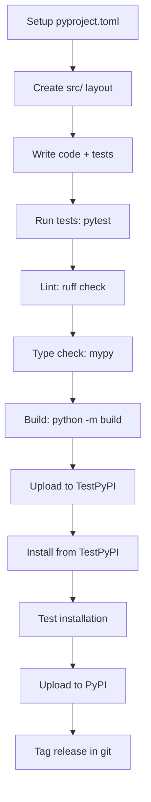

# Package Distribution and PyPI Publishing

## Why Package Your Code?

Packaging enables installation via `pip`, declares dependencies, provides entry points, and makes your code reusable across projects.

## pyproject.toml (Modern Standard)

`pyproject.toml` is the modern Python packaging standard (PEP 517/518/621). It replaces `setup.py` and `setup.cfg`.

```toml
[build-system]
requires = ["setuptools>=68.0", "wheel"]
build-backend = "setuptools.build_meta"

[project]
name = "my-awesome-lib"
version = "0.1.0"
description = "A short description of my library"
readme = "README.md"
requires-python = ">=3.10"
license = {text = "MIT"}
keywords = ["python", "example", "tutorial"]

authors = [
    {name = "Your Name", email = "you@example.com"},
]

classifiers = [
    "Development Status :: 3 - Alpha",
    "Intended Audience :: Developers",
    "License :: OSI Approved :: MIT License",
    "Programming Language :: Python :: 3",
    "Programming Language :: Python :: 3.10",
    "Programming Language :: Python :: 3.11",
    "Programming Language :: Python :: 3.12",
    "Topic :: Software Development :: Libraries :: Python Modules",
]

dependencies = [
    "requests>=2.28",
    "pydantic>=2.0",
]

[project.optional-dependencies]
dev = [
    "pytest>=7.0",
    "pytest-cov>=4.0",
    "black>=23.0",
    "ruff>=0.1",
    "mypy>=1.0",
]
test = ["pytest>=7.0", "httpx>=0.24"]
docs = ["mkdocs>=1.4", "mkdocstrings"]

[project.urls]
Homepage = "https://github.com/you/my-awesome-lib"
Documentation = "https://my-awesome-lib.readthedocs.io"
Repository = "https://github.com/you/my-awesome-lib"
Issues = "https://github.com/you/my-awesome-lib/issues"

[project.scripts]
my-cli = "my_awesome_lib.cli:main"

[project.gui-scripts]
my-gui = "my_awesome_lib.gui:launch"

[tool.setuptools.packages.find]
where = ["src"]
include = ["my_awesome_lib*"]
exclude = ["tests*", "docs*"]
```

[!NOTE]
The `[project.scripts]` section creates console entry points. When users `pip install` your package, these become executable commands on their PATH.

## Project Structure

```
my-awesome-lib/
├── pyproject.toml
├── README.md
├── LICENSE
├── CHANGELOG.md
├── src/
│   └── my_awesome_lib/
│       ├── __init__.py
│       ├── cli.py
│       ├── core.py
│       └── utils.py
├── tests/
│   ├── __init__.py
│   ├── test_core.py
│   └── test_cli.py
└── docs/
    ├── index.md
    └── api.md
```

### Using `src/` Layout

The `src/` layout prevents import confusion during development and testing.

```python
# src/my_awesome_lib/core.py
def add(a, b):
    """Add two numbers."""
    return a + b

# src/my_awesome_lib/cli.py
def main():
    import argparse
    parser = argparse.ArgumentParser()
    parser.add_argument("numbers", nargs=2, type=float)
    args = parser.parse_args()
    result = add(args.numbers[0], args.numbers[1])
    print(f"Result: {result}")

# src/my_awesome_lib/__init__.py
from .core import add
```

## Building Wheels

```bash
# Install build tools
pip install build twine

# Build source distribution and wheel
python -m build

# Check the built wheel
ls dist/
# my_awesome_lib-0.1.0.tar.gz
# my_awesome_lib-0.1.0-py3-none-any.whl
```

[!SUCCESS]
Wheels (`.whl`) are the preferred distribution format. They install faster than source distributions because they skip the build step.

## Uploading to PyPI

```bash
# Upload to TestPyPI first
twine upload --repository-url https://test.pypi.org/legacy/ dist/*

# Upload to production PyPI
twine upload dist/*

# Install from TestPyPI
pip install --index-url https://test.pypi.org/simple/ my-awesome-lib
```

### Using `~/.pypirc`

```ini
[distutils]
index-servers =
    pypi
    testpypi

[pypi]
username = __token__
password = pypi-xxxxx...

[testpypi]
repository = https://test.pypi.org/legacy/
username = __token__
password = pypi-xxxxx...
```

[!WARNING]
Never commit your PyPI token or password. Use environment variables (`TWINE_USERNAME`, `TWINE_PASSWORD`) or `keyring` in CI/CD.

## Versioning

### Semantic Versioning (SemVer)

```
MAJOR.MINOR.PATCH

MAJOR: Incompatible API changes
MINOR: Backward-compatible new features
PATCH: Backward-compatible bug fixes
```

```python
# __version__.py — single source of truth
__version__ = "0.1.0"
```

### Dynamic Versioning with setuptools-scm

```toml
[build-system]
requires = ["setuptools>=68.0", "wheel", "setuptools-scm>=8.0"]
build-backend = "setuptools.build_meta"

[project]
name = "my-awesome-lib"
dynamic = ["version"]

[tool.setuptools_scm]
version_scheme = "post-release"
```

Version is derived from git tags (`git tag v0.1.0`).

## Publishing Workflow (CI/CD)

```yaml
# .github/workflows/publish.yml
name: Publish to PyPI

on:
  release:
    types: [published]

jobs:
  build-and-publish:
    runs-on: ubuntu-latest
    steps:
      - uses: actions/checkout@v4
        with:
          fetch-depth: 0
      - uses: actions/setup-python@v5
        with:
          python-version: "3.12"
      - run: pip install build twine
      - run: python -m build
      - run: twine upload dist/*
        env:
          TWINE_USERNAME: __token__
          TWINE_PASSWORD: ${{ secrets.PYPI_TOKEN }}
```

[!NOTE]
Use Trusted Publishing (OIDC) with PyPI for the most secure CI/CD setup. It requires no stored tokens at all.

## Manifest Files

```ini
# MANIFEST.in — include extra files in source distribution
include README.md
include LICENSE
include CHANGELOG.md
recursive-include src/my_awesome_lib/data *
```

## Complete Package Checklist



## Real-World: Publishing a CLI Tool

```python
# src/mycalc/cli.py
import argparse
from .core import calculate

def main():
    parser = argparse.ArgumentParser(description="A simple calculator")
    parser.add_argument("expression", help="Math expression to evaluate")
    args = parser.parse_args()
    result = calculate(args.expression)
    print(f"= {result}")

if __name__ == "__main__":
    main()
```

```toml
[project.scripts]
mycalc = "mycalc.cli:main"
```

After `pip install mycalc`:
```bash
mycalc "2 + 2"
# = 4
```

## Practice Questions

1. What is the `pyproject.toml` file and why is it preferred over `setup.py`?
2. Create a `pyproject.toml` for a package called `textutils` with dependencies on `click` and `pyyaml`.
3. What is the difference between a source distribution (`.tar.gz`) and a wheel (`.whl`)? When would you use each?
4. Write a GitHub Actions workflow that publishes a package to PyPI when a release is created.
5. How does `setuptools-scm` derive the package version from git? What are the benefits?
6. What is the `src/` layout and why is it recommended for Python packages?
7. Build a simple CLI tool with `pyproject.toml` entry points and publish it to TestPyPI.
8. How do you handle optional dependencies in `pyproject.toml`? Give an example with `dev` and `test` extras.
9. What is Trusted Publishing (OIDC) on PyPI and how does it improve security?
10. Create a complete project structure for a package named `csvproc` that processes CSV files with proper testing, documentation, and packaging.
