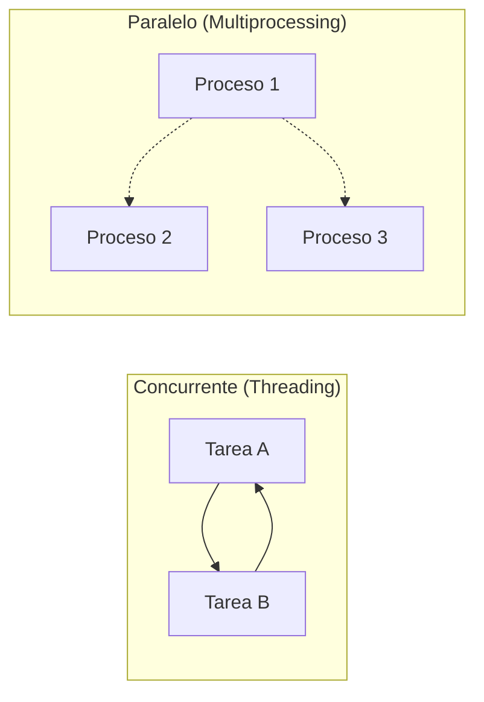

# Threading, Multiprocesamiento y Concurrencia

## Concurrencia vs Paralelismo

La concurrencia es la composición de tareas que se ejecutan independientemente; el paralelismo es la ejecución simultánea de múltiples cómputos. El módulo `threading` de Python proporciona concurrencia (pero paralelismo limitado debido al GIL), mientras que `multiprocessing` proporciona verdadero paralelismo mediante procesos separados.



## El Global Interpreter Lock (GIL)

El GIL es un mutex que protege los internos de CPython de condiciones de carrera. Garantiza que solo un hilo ejecute bytecode de Python a la vez.

```python
import sys
print(sys._is_gil_enabled())  # Generalmente True para CPython
```

[!WARNING]
El GIL significa que el trabajo CPU-bound en Python puro en hilos está **serializado**. Para tareas CPU-bound, usa `multiprocessing`; para tareas I/O-bound, los hilos son perfectamente adecuados.

### Cuándo se libera el GIL

Las extensiones C (como NumPy, `time.sleep()` u operaciones de E/S) liberan el GIL, permitiendo verdadero paralelismo durante esas llamadas:

```python
import threading
import time

def io_heavy():
    for _ in range(5):
        time.sleep(0.1)  # GIL liberado durante el sleep
        print(".", end="")

threads = [threading.Thread(target=io_heavy) for _ in range(4)]
for t in threads: t.start()
for t in threads: t.join()
```

## ThreadPoolExecutor

`concurrent.futures.ThreadPoolExecutor` gestiona un pool de hilos trabajadores para tareas I/O-bound.

```python
from concurrent.futures import ThreadPoolExecutor, as_completed
import requests

URLS = [
    "https://httpbin.org/delay/1",
    "https://httpbin.org/delay/2",
    "https://httpbin.org/delay/3",
]

def fetch(url):
    resp = requests.get(url)
    return url, resp.status_code, len(resp.text)

with ThreadPoolExecutor(max_workers=5) as pool:
    fut_map = {pool.submit(fetch, u): u for u in URLS}
    for future in as_completed(fut_map):
        url, status, size = future.result()
        print(f"{url} → {status} ({size}B)")
```

[!SUCCESS]
`ThreadPoolExecutor` es ideal para web scraping, consultas a bases de datos, E/S de archivos y cualquier carga de trabajo I/O-bound.

## ProcessPoolExecutor

Para trabajo CPU-bound, usa `ProcessPoolExecutor` — sortea el GIL creando procesos separados.

```python
from concurrent.futures import ProcessPoolExecutor, as_completed
import math

PRIMES = [
    112272535095293,
    112582705942171,
    112272535095293,
    115280095190773,
    115797848077099,
    1099726899285419,
]

def is_prime(n):
    if n < 2:
        return False
    if n == 2:
        return True
    if n % 2 == 0:
        return False
    sqrt_n = int(math.isqrt(n))
    for i in range(3, sqrt_n + 1, 2):
        if n % i == 0:
            return False
    return True

with ProcessPoolExecutor(max_workers=4) as pool:
    fut_map = {pool.submit(is_prime, p): p for p in PRIMES}
    for future in as_completed(fut_map):
        n = fut_map[future]
        print(f"{n} is prime: {future.result()}")
```

[!NOTE]
Cada proceso tiene su propio espacio de memoria — no puedes compartir objetos Python directamente. Usa `multiprocessing.Queue`, `multiprocessing.Array` o `Manager` para comunicación entre procesos.

## Threading de Bajo Nivel: Locks y Colas

### Seguridad de Hilo con `threading.Lock`

```python
import threading

counter = 0
lock = threading.Lock()

def increment():
    global counter
    for _ in range(100_000):
        with lock:
            counter += 1

threads = [threading.Thread(target=increment) for _ in range(10)]
for t in threads: t.start()
for t in threads: t.join()
print(counter)  # 1_000_000 (correcto con lock)
```

### Usando `queue.Queue`

```python
from queue import Queue
import threading
import time

def producer(q):
    for i in range(10):
        q.put(f"item-{i}")
        time.sleep(0.05)

def consumer(q):
    while True:
        item = q.get()
        if item is None:
            break
        print(f"Consumed {item}")
        q.task_done()

q = Queue(maxsize=5)
prod = threading.Thread(target=producer, args=(q,))
cons = threading.Thread(target=consumer, args=(q,))

prod.start(); cons.start()
prod.join()
q.put(None)  # Centinela
cons.join()
```

## Comunicación entre Procesos

```python
from multiprocessing import Process, Queue

def worker(q):
    q.put("hello from child")

q = Queue()
p = Process(target=worker, args=(q,))
p.start()
print(q.get())  # "hello from child"
p.join()
```

### Memoria Compartida con `Value` y `Array`

```python
from multiprocessing import Process, Value, Array

def increment(n, arr):
    n.value += 1
    for i in range(len(arr)):
        arr[i] *= 2

num = Value("i", 0)
data = Array("d", [1.0, 2.0, 3.0])
p = Process(target=increment, args=(num, data))
p.start()
p.join()
print(num.value)  # 1
print(data[:])    # [2.0, 4.0, 6.0]
```

## Primitivas de Sincronización

| Primitiva | Propósito | Módulo |
|-----------|-----------|--------|
| `Lock` | Exclusión mutua | `threading`, `multiprocessing` |
| `RLock` | Lock reentrante | `threading` |
| `Semaphore` | Limitar acceso concurrente a N workers | `threading`, `multiprocessing` |
| `Event` | Señal entre hilos | `threading` |
| `Condition` | Señalización compleja entre hilos | `threading` |
| `Barrier` | Esperar que N hilos se encuentren | `threading` |

## Caso de Uso Real: Web Scraper Concurrente

```python
from concurrent.futures import ThreadPoolExecutor, as_completed
from urllib.parse import urljoin
import requests
from bs4 import BeautifulSoup
from collections import Counter

SEED = "https://example.com"
MAX_DEPTH = 2
MAX_WORKERS = 10

visited = set()
word_counts = Counter()

def scrape_page(url, depth):
    if url in visited or depth > MAX_DEPTH:
        return []
    visited.add(url)
    try:
        resp = requests.get(url, timeout=5)
    except Exception:
        return []
    soup = BeautifulSoup(resp.text, "html.parser")
    for tag in soup.find_all(["h1", "h2", "h3", "p"]):
        word_counts.update(tag.get_text().lower().split())
    links = []
    for a in soup.find_all("a", href=True):
        full = urljoin(url, a["href"])
        if full.startswith("http"):
            links.append((full, depth + 1))
    return links

with ThreadPoolExecutor(max_workers=MAX_WORKERS) as pool:
    futures = [pool.submit(scrape_page, SEED, 0)]
    while futures:
        for f in as_completed(futures):
            futures.remove(f)
            new_links = f.result()
            for link, d in new_links[:20]:
                futures.append(pool.submit(scrape_page, link, d))
```

## Comparación de Rendimiento


## Preguntas de Práctica

1. ¿Qué es el GIL y por qué existe? ¿Cuándo se libera?
2. Tienes una lista de 10,000 URLs para descargar. ¿Usarías `ThreadPoolExecutor` o `ProcessPoolExecutor`? ¿Por qué?
3. Escribe un programa que calcule la suma de los cuadrados de los números 1–10⁷ usando `ProcessPoolExecutor` y compare la velocidad con la ejecución single-threaded.
4. ¿Qué sucede si dos hilos llaman a `counter += 1` simultáneamente sin un lock? Ilústralo con un ejemplo.
5. ¿Cómo difiere `queue.Queue` de `multiprocessing.Queue`? ¿Cuándo usarías cada uno?
6. Implementa un patrón productor-consumidor donde tres productores generan datos y dos consumidores los procesan, usando `threading` y `queue`.
7. ¿Por qué `ProcessPoolExecutor` podría ser más lento que single-threaded para tareas muy pequeñas? ¿Cómo lo ajustarías?
8. ¿Qué es un valor centinela y cómo se usa para indicar a un trabajador que se detenga?
9. Escribe un programa que use `multiprocessing.Pool.map` para paralelizar una función pesada de CPU.
10. Explica la diferencia entre concurrencia y paralelismo en Python. Da un ejemplo real de cada uno.
