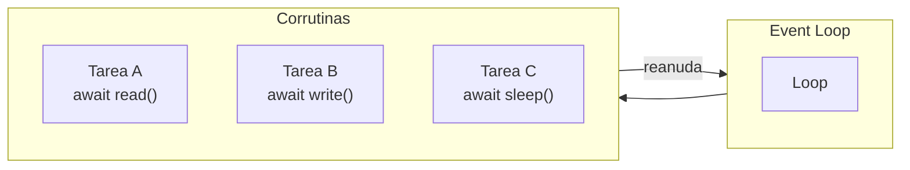
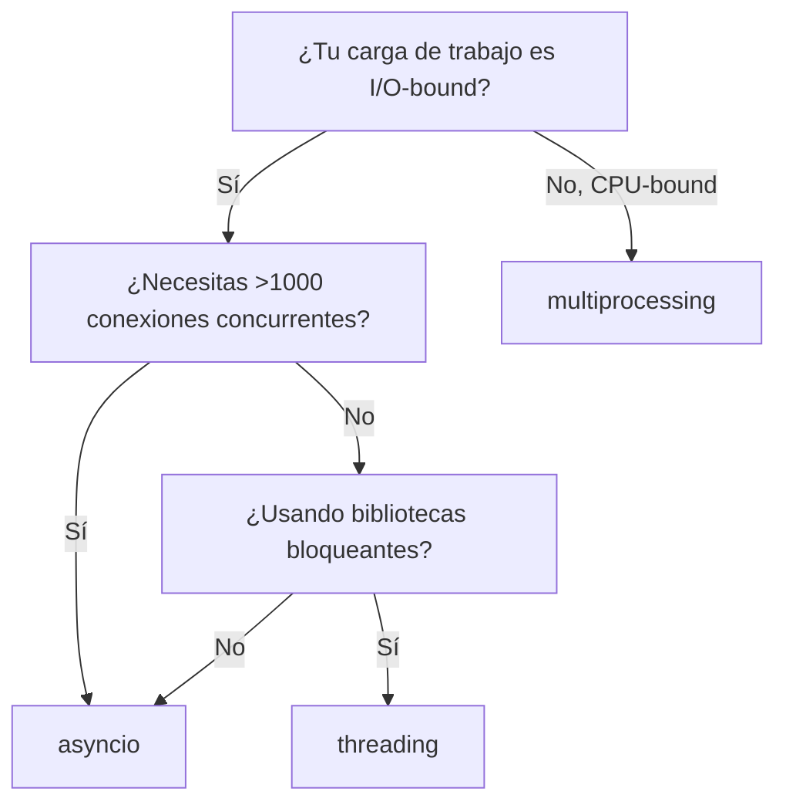

# Programación Asíncrona con asyncio

## El Event Loop

asyncio usa un modelo de multitarea cooperativa single-thread y single-process. Las corrutinas del event loop cambian cuando hacen `await` de una operación de E/S, devolviendo el control al loop.



## Corrutinas y Await

Una corrutina es una función definida con `async def`. Devuelve un objeto corrutina que debe ser esperado o programado.

```python
import asyncio

async def fetch_data():
    await asyncio.sleep(1)  # Simular E/S
    return {"data": 42}

async def main():
    result = await fetch_data()
    print(result)

asyncio.run(main())
```

[!NOTE]
`asyncio.run()` crea el event loop, ejecuta la corrutina y limpia. Es el punto de entrada estándar para programas asíncronos.

## Creando y Esperando Tasks

`asyncio.create_task()` programa una corrutina para ejecución concurrente.

```python
import asyncio

async def say_after(delay, msg):
    await asyncio.sleep(delay)
    print(msg)

async def main():
    task1 = asyncio.create_task(say_after(1, "world"))
    task2 = asyncio.create_task(say_after(2, "hello"))
    print("started")
    await task1
    await task2
    print("done")

asyncio.run(main())
```

[!SUCCESS]
Las tareas se ejecutan concurrentemente en el mismo event loop. Ambas tareas comienzan inmediatamente; el tiempo total de ejecución es ~2s no 3s.

## asyncio.gather

Ejecutar múltiples awaitables concurrentemente y recoger resultados.

```python
import asyncio

async def fetch_url(name, delay):
    await asyncio.sleep(delay)
    return f"Result from {name}"

async def main():
    results = await asyncio.gather(
        fetch_url("A", 1),
        fetch_url("B", 2),
        fetch_url("C", 3),
    )
    print(results)

asyncio.run(main())
```

### Manejo de Errores con gather

```python
async def might_fail(name, fail=False):
    await asyncio.sleep(0.5)
    if fail:
        raise ValueError(f"{name} failed")
    return name

async def main():
    results = await asyncio.gather(
        might_fail("A"),
        might_fail("B", fail=True),
        might_fail("C"),
        return_exceptions=True,
    )
    for r in results:
        if isinstance(r, Exception):
            print(f"Caught: {r}")
        else:
            print(f"Success: {r}")

asyncio.run(main())
```

## asyncio.wait y asyncio.as_completed

```python
async def worker(name, delay):
    await asyncio.sleep(delay)
    return name

async def main():
    tasks = [worker(f"W{i}", i) for i in range(1, 6)]

    # as_completed — resultados a medida que terminan
    for coro in asyncio.as_completed(tasks):
        result = await coro
        print(f"Finished: {result}")

    # wait — con timeout y return_when
    done, pending = await asyncio.wait(
        tasks,
        timeout=3,
        return_when=asyncio.FIRST_COMPLETED,
    )
    for t in pending:
        t.cancel()

asyncio.run(main())
```

## Futures

Un `Future` es un awaitable de bajo nivel que representa un resultado que se establecerá después. Las tareas envuelven corrutinas en futures.

```python
import asyncio

async def set_future(fut, value, delay):
    await asyncio.sleep(delay)
    fut.set_result(value)

async def main():
    loop = asyncio.get_running_loop()
    fut = loop.create_future()
    asyncio.create_task(set_future(fut, 42, 1))
    result = await fut
    print(result)  # 42

asyncio.run(main())
```

## asyncio.Queue

Para patrones productor-consumidor:

```python
import asyncio
import random

async def producer(q):
    for i in range(10):
        await asyncio.sleep(random.random() * 0.2)
        item = f"item-{i}"
        await q.put(item)
        print(f"Produced {item}")

async def consumer(q, name):
    while True:
        item = await q.get()
        if item is None:
            q.task_done()
            break
        await asyncio.sleep(random.random() * 0.3)
        print(f"{name} consumed {item}")
        q.task_done()

async def main():
    q = asyncio.Queue(maxsize=5)
    producers = [asyncio.create_task(producer(q))]
    consumers = [asyncio.create_task(consumer(q, f"C{i}")) for i in range(3)]
    await asyncio.gather(*producers)
    await q.join()
    for c in consumers:
        await q.put(None)
    await asyncio.gather(*consumers)

asyncio.run(main())
```

## Ejemplo Real con aiohttp

```python
import asyncio
import aiohttp
from typing import List

BASE_URL = "https://jsonplaceholder.typicode.com"

async def fetch_json(session: aiohttp.ClientSession, url: str) -> dict:
    async with session.get(url) as resp:
        return await resp.json()

async def fetch_all_users() -> List[dict]:
    async with aiohttp.ClientSession() as session:
        tasks = [
            fetch_json(session, f"{BASE_URL}/posts/{i}")
            for i in range(1, 21)
        ]
        return await asyncio.gather(*tasks)

async def main():
    data = await fetch_all_users()
    print(f"Fetched {len(data)} posts")

results = asyncio.run(main())
```

[!WARNING]
Usa siempre `aiohttp.ClientSession` como administrador de contexto. Las sesiones gestionan el pooling de conexiones y reutilizan conexiones TCP, lo cual es crítico para el rendimiento.

## Semáforos y Límite de Tasa

```python
import asyncio
import aiohttp

sem = asyncio.Semaphore(5)

async def rate_limited_fetch(session, url):
    async with sem:
        await asyncio.sleep(0.1)
        async with session.get(url) as resp:
            return await resp.text()

async def main():
    urls = [f"https://httpbin.org/delay/1" for _ in range(50)]
    async with aiohttp.ClientSession() as session:
        tasks = [rate_limited_fetch(session, u) for u in urls]
        results = await asyncio.gather(*tasks)
        print(f"Fetched {len(results)} pages")

asyncio.run(main())
```

## Timeouts y Cancelación

```python
import asyncio

async def slow_operation():
    await asyncio.sleep(10)
    return "done"

async def main():
    try:
        result = await asyncio.wait_for(slow_operation(), timeout=2)
    except asyncio.TimeoutError:
        print("Operation timed out")

    # Cancelación manual
    task = asyncio.create_task(slow_operation())
    await asyncio.sleep(0.1)
    task.cancel()
    try:
        await task
    except asyncio.CancelledError:
        print("Task was cancelled")

asyncio.run(main())
```

## Depurando Código Asíncrono

```python
import asyncio

async def problematic():
    loop = asyncio.get_running_loop()
    loop.slow_callback_duration = 0.1  # advertir sobre callbacks lentos
    await asyncio.sleep(10)

# Activar modo de depuración
asyncio.run(problematic(), debug=True)
```

## Matriz de Decisión: asyncio vs Threading

| Aspecto | asyncio | threading |
|---------|---------|-----------|
| Memoria por tarea | ~1 KB | ~8 MB (hilo del SO) |
| Concurrencia máxima | 10,000+ | Cientos |
| Impacto del GIL | Ninguno (single-thread) | Bloquea trabajo CPU |
| Mejor para | I/O-bound, muchas conexiones | I/O-bound, libs bloqueantes |
| Complejidad | Mayor (mentalidad async) | Menor |



## Preguntas de Práctica

1. ¿Qué es un event loop y en qué se diferencia de los hilos del SO?
2. Escribe un programa que busque 100 URLs concurrentemente usando `aiohttp` y `asyncio.gather`.
3. ¿Cuál es la diferencia entre una corrutina y una tarea? Muestra ejemplos de código.
4. ¿Cómo difiere `asyncio.wait` de `asyncio.gather`? ¿Cuándo preferirías uno sobre el otro?
5. Implementa un limitador de tasa usando `asyncio.Semaphore` que permita máximo 10 solicitudes concurrentes.
6. ¿Qué sucede cuando haces `await` de una corrutina que lanza una excepción dentro de `asyncio.gather` con `return_exceptions=False`?
7. Escribe un patrón productor-consumidor usando `asyncio.Queue` donde el productor genere elementos a una tasa variable.
8. ¿Cómo cancelas una tarea en ejecución? ¿Qué excepción recibe la tarea cancelada?
9. ¿Por qué existe `asyncio.run()`? ¿Qué problemas resuelve en comparación con gestionar el bucle manualmente?
10. Compara y contrasta `asyncio.sleep(0)` vs `time.sleep(0)`. ¿Por qué el primero permite concurrencia y el segundo la bloquea?
