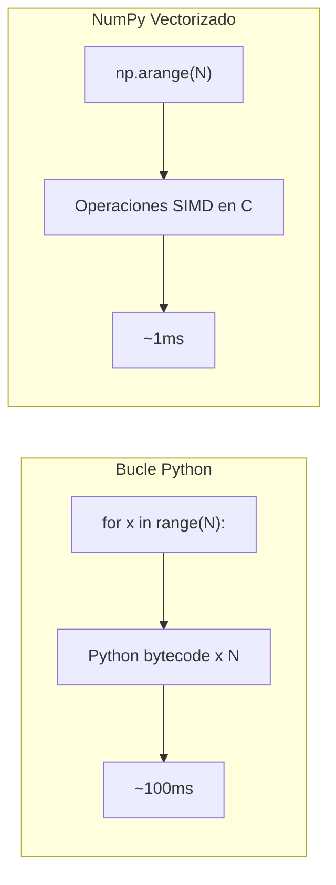

# Optimización de Rendimiento, Cython y Numba

## Perfila Antes de Optimizar

Nunca adivines dónde está el cuello de botella. Usa profilers.

### cProfile

```python
import cProfile
import pstats

def heavy():
    total = 0
    for i in range(10**6):
        total += i ** 2
    return total

profiler = cProfile.Profile()
profiler.runcall(heavy)
stats = pstats.Stats(profiler)
stats.sort_stats(pstats.SortKey.TIME)
stats.print_stats(10)
```

La salida muestra tiempo acumulativo, tiempo por llamada y conteo de llamadas.

### Line Profiler

```bash
pip install line_profiler
```

```python
from line_profiler import profile

@profile
def process_data(data):
    total = 0.0
    for x in data:
        total += x ** 2
        total /= max(1, x)
    return total

process_data(range(100_000))
```

[!NOTE]
Ejecuta con `kernprof -l script.py && python -m line_profiler script.py.lprof` para temporización línea por línea.

### Memory Profiler

```python
from memory_profiler import profile

@profile
def allocate():
    big = [list(range(1000)) for _ in range(1000)]
    return sum(len(x) for x in big)

allocate()
```

## Usando `__slots__`

Los slots reducen memoria reemplazando el `__dict__` por instancia con un array de tamaño fijo.

```python
class WithoutSlots:
    def __init__(self, x, y, z):
        self.x = x
        self.y = y
        self.z = z

class WithSlots:
    __slots__ = ("x", "y", "z")
    def __init__(self, x, y, z):
        self.x = x
        self.y = y
        self.z = z

import sys
a = WithoutSlots(1, 2, 3)
b = WithSlots(1, 2, 3)
print(sys.getsizeof(a))  # ~56 (más __dict__ ~120)
print(sys.getsizeof(b))  # ~56 (sin __dict__)

# Para 1M instancias, WithSlots ahorra ~120+ MB
```

[!SUCCESS]
Usa `__slots__` al crear millones de objetos pequeños (ej.: registros de datos, entidades de juego, partículas).

## Optimizaciones del Módulo collections

```python
from collections import defaultdict, Counter, deque, OrderedDict
from collections.abc import Mapping

# deque para appends/pops O(1) en ambos extremos
dq = deque(maxlen=1000)
for i in range(2000):
    dq.append(i)
print(len(dq))  # 1000 (el más antiguo descartado)

# Counter para frecuencia
freq = Counter("mississippi")
print(freq.most_common(2))  # [('i', 4), ('s', 4)]

# defaultdict evita verificaciones de clave
groups = defaultdict(list)
groups["a"].append(1)  # sin KeyError
```

## Vectorización con NumPy

Los bucles nativos de Python son lentos; NumPy opera en arrays a nivel C.

```python
import numpy as np
import time

# Bucle Python lento
N = 10_000_000
start = time.perf_counter()
py_result = sum(x ** 2 for x in range(N))
print(f"Python: {time.perf_counter() - start:.2f}s")

# NumPy rápido
start = time.perf_counter()
arr = np.arange(N, dtype=np.float64)
np_result = (arr ** 2).sum()
print(f"NumPy: {time.perf_counter() - start:.2f}s")

# Típicamente 50-100x más rápido
```



## Conceptos Básicos de Cython

Cython compila código similar a Python para extensiones C. Guarda como `.pyx`.

```cython
# sum_squares.pyx
def sum_squares(int n):
    cdef int i
    cdef long long total = 0
    for i in range(n):
        total += i * i
    return total
```

### Compilar con `setup.py`

```python
from setuptools import setup, Extension
from Cython.Build import cythonize

setup(
    ext_modules=cythonize([
        Extension("sum_squares", ["sum_squares.pyx"])
    ])
)
```

```bash
python setup.py build_ext --inplace
python -c "import sum_squares; print(sum_squares.sum_squares(10**7))"
```

[!NOTE]
Cython permite declaraciones de tipo `cdef` que compilan a C puro. Incluso sin anotaciones de tipo, Cython a menudo da una aceleración de 2-3x.

### Modo Python Puro con Anotaciones Cython

```python
import cython

@cython.cfunc
@cython.returns(cython.longlong)
@cython.locals(n=cython.int, i=cython.int)
def sum_squares(n):
    total: cython.longlong = 0
    for i in range(n):
        total += i * i
    return total
```

## Compilación JIT con Numba

Numba compila funciones Python a código máquina usando LLVM — cero código C requerido.

```python
from numba import njit, prange
import time
import math

@njit
def is_prime(n):
    if n < 2:
        return False
    for i in range(2, int(math.sqrt(n)) + 1):
        if n % i == 0:
            return False
    return True

@njit(parallel=True)
def count_primes(limit):
    count = 0
    for i in prange(2, limit):
        if is_prime(i):
            count += 1
    return count

start = time.perf_counter()
print(count_primes(10_000_000))  # 664,579
print(f"Numba: {time.perf_counter() - start:.2f}s")
# A menudo 100-200x más rápido que Python puro
```

[!SUCCESS]
Numba sobresale con bucles numéricos y código con muchas matemáticas. Es ampliamente usado en finanzas cuantitativas, computación científica y preprocesamiento de ML.

## Matriz de Decisión: Cython vs Numba

| Característica | Cython | Numba |
|---------------|--------|-------|
| Configuración | Requiere paso de compilación | JIT en tiempo de ejecución |
| Dependencias | Compilador C, Cython | llvmlite, numpy |
| Mejor para | Interoperabilidad C compleja | Algoritmos numéricos |
| Características Python | Limitadas (sin tipado dinámico) | Más compatible |
| Despliegue | Build wheel | Fácil (sin build) |
| Velocidad | Cercano a C | Cercano a C |

## Mundo Real: Procesamiento de Imagen con Numba

```python
import numpy as np
from numba import njit, prange

@njit(parallel=True)
def grayscale(images):
    """Convertir lote de imágenes RGB a escala de grises."""
    n, h, w, c = images.shape
    result = np.zeros((n, h, w), dtype=np.uint8)
    for i in prange(n):
        for y in range(h):
            for x in range(w):
                r, g, b = images[i, y, x]
                result[i, y, x] = 0.299 * r + 0.587 * g + 0.114 * b
    return result

batch = np.random.randint(0, 256, (100, 256, 256, 3), dtype=np.uint8)
gray = grayscale(batch)
```

## Preguntas de Práctica

1. ¿Cuál es la diferencia entre `cProfile` y un line profiler? ¿Cuándo usarías cada uno?
2. Escribe un benchmark comparando una comprensión de lista vs un bucle `for` vs NumPy para computar `x**2` en 10M elementos.
3. ¿Cómo reduce `__slots__` el uso de memoria? ¿Cuáles son las desventajas?
4. Crea una función JIT Numba que compute el conjunto de Mandelbrot y compare su velocidad con Python puro.
5. ¿Qué es `cython -a` y cómo ayuda a optimizar código?
6. Compara `deque` vs `list` para una operación de ventana deslizante en 100K elementos.
7. Escribe un archivo `.pyx` de Cython que compute números de Fibonacci eficientemente usando `cdef`.
8. ¿Por qué el bucle `for` de Python es más lento que NumPy para operaciones numéricas? Explica el papel del bytecode CPython.
9. Implementa un análisis de frecuencia basado en `Counter` en una lista de 10M elementos y compara `collections.Counter` vs dict manual.
10. ¿Cuáles son las limitaciones de Numba? ¿Cuándo sería Cython la mejor opción a pesar del paso extra de compilación?
