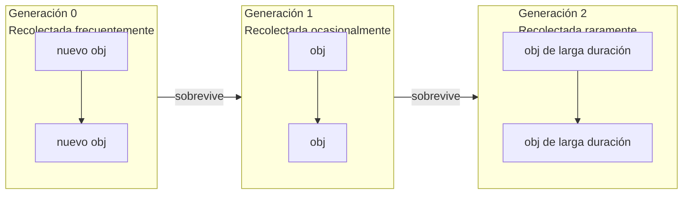

# Gestión de Memoria y Recolección de Basura

## Conteo de Referencias

Cada objeto Python tiene un contador de referencias entero. Cuando llega a 0, la memoria se libera inmediatamente.

```python
import sys

x = [1, 2, 3]
print(sys.getrefcount(x))  # 2 (x + argumento)

y = x
print(sys.getrefcount(x))  # 3

del y
print(sys.getrefcount(x))  # 2

del x
# Objeto liberado
```

[!NOTE]
`sys.getrefcount()` en sí mismo incrementa el contador porque el objeto se pasa como argumento. Resta 1 para el conteo real.

## El Módulo `gc` (GC Cíclico)

El conteo de referencias por sí solo no puede manejar ciclos:

```python
class Node:
    def __init__(self, name):
        self.name = name
        self.next = None

a = Node("A")
b = Node("B")
a.next = b
b.next = a  # Ciclo!
del a
del b
# El conteo de refs nunca llega a 0 — se necesita GC cíclico
```

### Control Manual del GC

```python
import gc

gc.enable()
print(gc.get_threshold())  # (700, 10, 10)

# Forzar recolección
collected = gc.collect()
print(f"Collected {collected} objects")

# Deshabilitar para sistemas de tiempo real
gc.disable()

# Encontrar inalcanzables
gc.set_debug(gc.DEBUG_LEAK)
```

### Generaciones del GC

```python
import gc

# Rastrear objetos entre generaciones
for gen in range(3):
    print(f"Gen {gen}: {gc.get_count()[gen]} objects")

# Los objetos se mueven de Gen 0 → 1 → 2 a medida que sobreviven a las recolecciones
# Gen 0 se recolecta más frecuentemente (~700 asignaciones)
# Gen 2 es la generación "vieja", recolectada raramente
```



## Referencias Débiles

`weakref` permite referenciar un objeto sin aumentar su conteo de referencias — ideal para cachés y observadores.

```python
import weakref

class Expensive:
    def __init__(self, data):
        self.data = data
    def __del__(self):
        print(f"Deleting {self.data}")

obj = Expensive([1, 2, 3])
ref = weakref.ref(obj)
print(ref() is obj)  # True

del obj
print(ref() is None)  # True (ref débil murió)
```

### WeakValueDictionary

```python
import weakref

class Cache:
    def __init__(self):
        self._data = weakref.WeakValueDictionary()

    def set(self, key, value):
        self._data[key] = value

    def get(self, key):
        return self._data.get(key)

cache = Cache()
obj = {"payload": "large"}
cache.set("item1", obj)
print(cache.get("item1"))  # {"payload": "large"}
del obj
print(cache.get("item1"))  # None (limpiado automáticamente)
```

[!SUCCESS]
`WeakValueDictionary` es ideal para cachés donde las entradas deben expirar automáticamente cuando no hay otras referencias.

## Fugas de Memoria en Python

Causas comunes:

```python
# 1. Referencias circulares con __del__
class Leak:
    def __init__(self, other=None):
        self.other = other
    def __del__(self):
        pass  # ¡Impide que el GC recolecte ciclos!

a = Leak()
b = Leak(a)
a.other = b  # ciclo + __del__ = inalcanzable pero no recolectable

# 2. Cachés globales que nunca se limpian
_GLOBAL_CACHE = {}

def memoize(func):
    _GLOBAL_CACHE[func] = {}
    def wrapper(n):
        if n not in _GLOBAL_CACHE[func]:
            _GLOBAL_CACHE[func][n] = func(n)
        return _GLOBAL_CACHE[func][n]
    return wrapper

# 3. Recursos no cerrados
import tempfile
f = tempfile.NamedTemporaryFile()
# Nunca cerrado — fuga de descriptor de archivo
```

### Detectando Fugas

```python
import gc
import objgraph  # pip install objgraph

# Mostrar objetos que impiden la recolección
gc.collect()
objgraph.show_most_common_types(limit=10)

# Rastrear crecimiento de tipo específico
objgraph.show_growth(limit=5)

# Encontrar qué está reteniendo una referencia
obj = SomeClass()
objgraph.show_backrefs([obj], max_depth=5, filename="backrefs.png")
```

## Perfilado de Memoria

```python
import tracemalloc

tracemalloc.start()

# Tomar una instantánea
snap1 = tracemalloc.take_snapshot()
data = [list(range(1000)) for _ in range(1000)]
snap2 = tracemalloc.take_snapshot()

stats = snap2.compare_to(snap1, "lineno")
for stat in stats[:5]:
    print(stat)
```

### Usando `memory_profiler`

```bash
pip install memory_profiler
python -m memory_profiler script.py
```

```python
@profile
def heavy():
    a = [i ** 2 for i in range(100_000)]
    b = {i: str(i) for i in range(100_000)}
    return a, b
```

[!NOTE]
El perfilado de memoria en producción puede usar `tracemalloc` con instantáneas periódicas para rastrear el crecimiento a lo largo del tiempo.

## Tamaños de Objeto

```python
import sys

empty_list = []
print(sys.getsizeof(empty_list))  # 56 (overhead)

ten_items = [None] * 10
print(sys.getsizeof(ten_items))   # 120 (10 × 8 + overhead)

# Para estructuras profundamente anidadas, usa `pympler`
from pympler import asizeof
nested = [[[i for i in range(100)] for _ in range(100)] for _ in range(10)]
print(asizeof.asizeof(nested) / 1024, "KB")
```

## Mejores Prácticas

| Práctica | Por qué |
|----------|---------|
| Usa `__slots__` para muchos objetos pequeños | Elimina `__dict__` (~120B por instancia) |
| Prefiere generadores sobre listas | Transmite datos en lugar de almacenar todo en memoria |
| Usa `array.array` o `bytearray` | Almacenamiento C compacto para tipos homogéneos |
| Evita referencias cíclicas en `__del__` | Impide que el GC libere ciclos |
| Usa `weakref` para cachés | Limpieza automática cuando los objetos ya no son necesarios |
| Cierra recursos explícitamente | Usa administradores de contexto (declaración `with`) |

## Mundo Real: Analizador de Registros Eficiente en Memoria

```python
import gc
import weakref
from collections import deque

class LogEntry:
    __slots__ = ("timestamp", "level", "message")
    def __init__(self, timestamp, level, message):
        self.timestamp = timestamp
        self.level = level
        self.message = message

class LogBuffer:
    def __init__(self, maxlen=100_000):
        self.buffer = deque(maxlen=maxlen)
        self._listeners = weakref.WeakSet()

    def add(self, entry):
        self.buffer.append(entry)
        for listener in self._listeners:
            listener(entry)

    def subscribe(self, callback):
        self._listeners.add(callback)

# Procesar 1M entradas de registro sin fuga de memoria
buf = LogBuffer(maxlen=10_000)
for i in range(1_000_000):
    buf.add(LogEntry(i, "INFO", f"entry {i}"))
    if i % 100_000 == 0:
        gc.collect()

print(len(buf.buffer))  # 10_000 (el más antiguo descartado)
```

## Preguntas de Práctica

1. ¿Cómo funciona el conteo de referencias de Python? ¿Cuáles son sus limitaciones?
2. ¿Qué es una referencia circular? ¿Cómo la detecta y recolecta el recolector de basura cíclico?
3. Escribe un programa que cree una fuga de memoria usando `__del__` y ciclos, luego la detecte con `gc`.
4. ¿Qué es un `weakref`? Implementa un patrón observador usando `WeakSet`.
5. ¿Cómo funcionan las generaciones del GC de Python? ¿Qué umbrales activan cada generación?
6. Usa `tracemalloc` para encontrar las 3 líneas que más consumen memoria en una función que asigna muchas cadenas.
7. ¿Qué es la lista `gc.garbage`? ¿Cuándo se puebla?
8. Compara `pympler.asizeof` vs `sys.getsizeof`. ¿Por qué `sys.getsizeof` podría subestimar el uso de memoria?
9. Implementa un pool de objetos simple usando `weakref.WeakValueDictionary` para reutilizar objetos costosos.
10. ¿Cómo perfilarías el uso de memoria de un servidor web de larga ejecución? ¿Qué herramientas y estrategias usarías?
