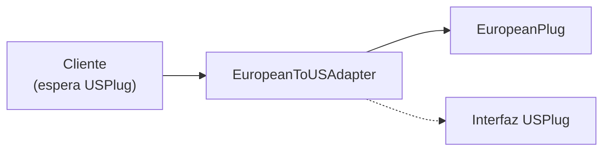

# Patrones de Diseño Creacionales y Estructurales

## Patrón Singleton

Garantiza que una clase tenga exactamente una instancia.

```python
class SingletonMeta(type):
    _instances = {}
    def __call__(cls, *args, **kwargs):
        if cls not in cls._instances:
            cls._instances[cls] = super().__call__(*args, **kwargs)
        return cls._instances[cls]

class Database(metaclass=SingletonMeta):
    def __init__(self):
        self.connection = None

    def connect(self, url):
        self.connection = f"Connected to {url}"

# Ambas variables apuntan a la misma instancia
db1 = Database()
db2 = Database()
print(db1 is db2)  # True
```

### Singleton Thread-Safe

```python
import threading

class ThreadSafeSingleton:
    _instance = None
    _lock = threading.Lock()

    def __new__(cls, *args, **kwargs):
        if cls._instance is None:
            with cls._lock:
                if cls._instance is None:
                    cls._instance = super().__new__(cls)
        return cls._instance

    def __init__(self):
        pass  # init se ejecuta cada vez — usa una bandera si es necesario
```

[!WARNING]
Ten cuidado con Singleton en contextos multi-hilo. Usa siempre un lock para la primera creación y protege `__init__` de reinicializaciones.

## Patrón Factory

Abstrae la creación de objetos detrás de una interfaz de fábrica.

```python
from abc import ABC, abstractmethod

class PaymentGateway(ABC):
    @abstractmethod
    def charge(self, amount):
        pass

class StripeGateway(PaymentGateway):
    def charge(self, amount):
        return f"Stripe cobró ${amount}"

class PayPalGateway(PaymentGateway):
    def charge(self, amount):
        return f"PayPal cobró ${amount}"

class PaymentFactory:
    GATEWAYS = {
        "stripe": StripeGateway,
        "paypal": PayPalGateway,
    }

    @staticmethod
    def create(gateway_type):
        cls = PaymentFactory.GATEWAYS.get(gateway_type)
        if not cls:
            raise ValueError(f"Gateway desconocido: {gateway_type}")
        return cls()

gateway = PaymentFactory.create("stripe")
print(gateway.charge(100))
```

## Patrón Builder

Construye objetos complejos paso a paso.

```python
class QueryBuilder:
    def __init__(self):
        self._select = []
        self._from_ = ""
        self._where = []
        self._order_by = []
        self._limit = None

    def select(self, *columns):
        self._select.extend(columns)
        return self

    def from_(self, table):
        self._from_ = table
        return self

    def where(self, condition):
        self._where.append(condition)
        return self

    def order_by(self, column, direction="ASC"):
        self._order_by.append(f"{column} {direction}")
        return self

    def limit(self, n):
        self._limit = n
        return self

    def build(self):
        parts = ["SELECT"]
        parts.append(", ".join(self._select) if self._select else "*")
        parts.append(f"FROM {self._from_}")
        if self._where:
            parts.append("WHERE " + " AND ".join(self._where))
        if self._order_by:
            parts.append("ORDER BY " + ", ".join(self._order_by))
        if self._limit is not None:
            parts.append(f"LIMIT {self._limit}")
        return " ".join(parts)

query = (QueryBuilder()
         .select("id", "name", "email")
         .from_("users")
         .where("age > 18")
         .where("status = 'active'")
         .order_by("name")
         .limit(10)
         .build())
print(query)
# SELECT id, name, email FROM users WHERE age > 18 AND status = 'active' ORDER BY name ASC LIMIT 10
```

[!SUCCESS]
Builder es ideal para construir objetos con muchos parámetros opcionales, consultas SQL, peticiones HTTP y objetos de configuración.

## Patrón Adapter

Convierte una interfaz en otra que los clientes esperan.

```python
class USPlug:
    def voltage(self):
        return 120

class EuropeanPlug:
    def voltage(self):
        return 230

class USCharger:
    def charge(self, plug):
        return f"Cargando a {plug.voltage()}V (EE. UU.)"

class EuropeanToUSAdapter:
    def __init__(self, euro_plug):
        self._euro = euro_plug

    def voltage(self):
        return self._euro.voltage()

charger = USCharger()
euro_plug = EuropeanPlug()
adapter = EuropeanToUSAdapter(euro_plug)
print(charger.charge(adapter))  # ¡Funciona!
```



## Patrón Decorator (Estructural)

Añade comportamiento a objetos dinámicamente sin herencia.

```python
from functools import wraps

class Beverage:
    def cost(self):
        return 5
    def description(self):
        return "Bebida"

class MilkDecorator:
    def __init__(self, beverage):
        self._beverage = beverage

    def cost(self):
        return self._beverage.cost() + 2

    def description(self):
        return self._beverage.description() + ", Leche"

class SugarDecorator:
    def __init__(self, beverage):
        self._beverage = beverage

    def cost(self):
        return self._beverage.cost() + 1

    def description(self):
        return self._beverage.description() + ", Azúcar"

coffee = Beverage()
coffee = MilkDecorator(coffee)
coffee = SugarDecorator(coffee)
print(f"{coffee.description()} = ${coffee.cost()}")
# Bebida, Leche, Azúcar = $8
```

[!NOTE]
El patrón Decorator estructural difiere de los decoradores de función de Python, pero la idea es la misma: envolver un objeto/función para añadir comportamiento.

## Patrón Proxy

Controla el acceso a un objeto mediante un sustituto.

```python
import time
from datetime import datetime

class SensitiveData:
    def read(self):
        return "DATOS CONFIDENCIALES"

class AccessProxy:
    def __init__(self, target):
        self._target = target
        self._allowed_users = {"admin", "supervisor"}

    def read(self, user):
        if user not in self._allowed_users:
            raise PermissionError(f"{user} no está autorizado")
        return self._target.read()

class LoggingProxy:
    def __init__(self, target):
        self._target = target

    def read(self, *args, **kwargs):
        print(f"[{datetime.now()}] Intento de acceso")
        return self._target.read(*args, **kwargs)

data = SensitiveData()
proxy = LoggingProxy(AccessProxy(data))
print(proxy.read("admin"))  # Registra acceso, verifica permisos, retorna datos
```

### Proxy Perezoso (Lazy)

```python
class LazyImage:
    def __init__(self, path):
        self.path = path
        self._image = None

    def _load(self):
        if self._image is None:
            print(f"Cargando {self.path} del disco...")
            self._image = f"<imagen:{self.path}>"
        return self._image

    def display(self):
        return self._load()

img = LazyImage("photo.jpg")
# Imagen aún no cargada
print(img.display())  # Carga ahora
print(img.display())  # Usa versión en caché
```

## Preguntas de Práctica

1. Implementa un `Logger` singleton que escriba en un archivo. Garantiza seguridad en hilos.
2. Construye una `ShapeFactory` que cree objetos `Circle`, `Square` y `Triangle`. Añade una nueva forma sin modificar la fábrica.
3. Implementa un Builder para construir elementos HTML (ej.: `div`, `p`, `a` con atributos e hijos).
4. Crea un adaptador que convierta una respuesta JSON moderna de API a una interfaz heredada basada en XML.
5. ¿Cuál es la diferencia entre el Decorator estructural y los decoradores de función de Python?
6. Implementa un proxy de caché que almacene resultados de un cómputo costoso y retorne resultados en caché para llamadas repetidas.
7. ¿Cuándo elegirías Builder en lugar de un constructor con muchos parámetros?
8. Construye un sistema de notificaciones usando Factory: `EmailNotifier`, `SMSNotifier`, `PushNotifier`.
9. Implementa un proxy virtual que cargue perezosamente el resultado de una consulta grande a la base de datos solo cuando se acceda.
10. Combina los patrones Decorator y Adapter: envuelve un servicio SMS heredado con un adaptador, luego añade registro mediante decorator.
