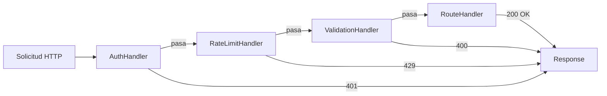

# Patrones de Diseño Comportamentales

## Patrón Observer

Define una dependencia uno-a-muchos de modo que cuando un objeto cambia de estado, todos los dependientes son notificados automáticamente.

```python
from abc import ABC, abstractmethod
from weakref import WeakSet

class Observer(ABC):
    @abstractmethod
    def update(self, event, data):
        pass

class Observable:
    def __init__(self):
        self._observers = WeakSet()

    def subscribe(self, observer):
        self._observers.add(observer)

    def unsubscribe(self, observer):
        self._observers.discard(observer)

    def _notify(self, event, data=None):
        for obs in self._observers:
            obs.update(event, data)

class EmailService(Observer):
    def update(self, event, data):
        if event == "user_registered":
            print(f"Enviando correo de bienvenida a {data['email']}")

class AnalyticsTracker(Observer):
    def update(self, event, data):
        print(f"Rastreando evento: {event} — {data}")

class UserManager(Observable):
    def register(self, email, name):
        user = {"email": email, "name": name}
        print(f"Registrando a {name}")
        self._notify("user_registered", user)

users = UserManager()
users.subscribe(EmailService())
users.subscribe(AnalyticsTracker())
users.register("alice@example.com", "Alice")
```

[!SUCCESS]
Observer es la base de arquitecturas orientadas a eventos, sistemas pub/sub y frameworks de programación reactiva.

## Patrón Strategy

Define una familia de algoritmos, encapsula cada uno y los hace intercambiables.

```python
from abc import ABC, abstractmethod
import math

class CompressionStrategy(ABC):
    @abstractmethod
    def compress(self, data):
        pass

class ZipCompression(CompressionStrategy):
    def compress(self, data):
        return f"zip({len(data)} bytes)"

class GzipCompression(CompressionStrategy):
    def compress(self, data):
        return f"gzip({len(data)} bytes)"

class LZ4Compression(CompressionStrategy):
    def compress(self, data):
        return f"lz4({len(data)} bytes)"

class Compressor:
    def __init__(self, strategy: CompressionStrategy):
        self._strategy = strategy

    def set_strategy(self, strategy: CompressionStrategy):
        self._strategy = strategy

    def compress(self, data):
        return self._strategy.compress(data)

data = b"some binary data here"
compressor = Compressor(ZipCompression())
print(compressor.compress(data))
compressor.set_strategy(GzipCompression())
print(compressor.compress(data))
```

### Ejemplo Real: Enrutamiento con Strategy

```python
class RouteStrategy(ABC):
    @abstractmethod
    def calculate(self, origin, dest):
        pass

class RoadRoute(RouteStrategy):
    def calculate(self, origin, dest):
        return f"Carretera: {origin} → {dest} (120km, 1.5h)"

class PublicTransitRoute(RouteStrategy):
    def calculate(self, origin, dest):
        return f"Transporte público: {origin} → {dest} (90min, $3.50)"

class WalkingRoute(RouteStrategy):
    def calculate(self, origin, dest):
        return f"Caminando: {origin} → {dest} (5km, 1h)"

class Navigator:
    def __init__(self, strategy=None):
        self._strategy = strategy

    def get_directions(self, origin, dest):
        return self._strategy.calculate(origin, dest)

nav = Navigator(WalkingRoute())
print(nav.get_directions("Casa", "Parque"))
```

[!NOTE]
Strategy permite el principio abierto/cerrado: añade nuevos algoritmos sin modificar el código existente.

## Patrón Command

Encapsula una solicitud como un objeto, permitiendo parametrización, colas y deshacer/rehacer.

```python
from abc import ABC, abstractmethod
from collections import deque

class Command(ABC):
    @abstractmethod
    def execute(self):
        pass

    @abstractmethod
    def undo(self):
        pass

class TextEditor:
    def __init__(self):
        self.content = ""

    def insert(self, text, pos=None):
        if pos is None:
            pos = len(self.content)
        self.content = self.content[:pos] + text + self.content[pos:]

    def delete(self, start, end):
        self.content = self.content[:start] + self.content[end:]

class InsertCommand(Command):
    def __init__(self, editor, text, pos=None):
        self.editor = editor
        self.text = text
        self.pos = pos or len(editor.content)

    def execute(self):
        self.editor.insert(self.text, self.pos)

    def undo(self):
        end = self.pos + len(self.text)
        self.editor.delete(self.pos, end)

class DeleteCommand(Command):
    def __init__(self, editor, start, end):
        self.editor = editor
        self.start = start
        self.end = end
        self._deleted = ""

    def execute(self):
        self._deleted = self.editor.content[self.start:self.end]
        self.editor.delete(self.start, self.end)

    def undo(self):
        self.editor.insert(self._deleted, self.start)

class CommandHistory:
    def __init__(self):
        self._history = deque(maxlen=100)
        self._future = []

    def execute(self, cmd):
        cmd.execute()
        self._history.append(cmd)
        self._future.clear()

    def undo(self):
        if self._history:
            cmd = self._history.pop()
            cmd.undo()
            self._future.append(cmd)

    def redo(self):
        if self._future:
            cmd = self._future.pop()
            cmd.execute()
            self._history.append(cmd)

editor = TextEditor()
history = CommandHistory()
history.execute(InsertCommand(editor, "Hola"))
history.execute(InsertCommand(editor, " Mundo", 5))
print(editor.content)  # "Hola Mundo"
history.undo()
print(editor.content)  # "Hola"
history.redo()
print(editor.content)  # "Hola Mundo"
```

## Patrón Chain of Responsibility

Pasa solicitudes a lo largo de una cadena de manejadores hasta que uno la procesa.

```python
from abc import ABC, abstractmethod

class Handler(ABC):
    def __init__(self, next_handler=None):
        self._next = next_handler

    def set_next(self, handler):
        self._next = handler
        return handler

    def handle(self, request):
        if self._next:
            return self._next.handle(request)
        return None

class AuthHandler(Handler):
    def handle(self, request):
        if request.get("token") == "valid":
            return super().handle(request)
        return "401 No Autorizado"

class RateLimitHandler(Handler):
    def handle(self, request):
        if request.get("calls", 0) > 100:
            return "429 Demasiadas Solicitudes"
        return super().handle(request)

class ValidationHandler(Handler):
    def handle(self, request):
        if not request.get("body"):
            return "400 Solicitud Inválida"
        return super().handle(request)

class RouteHandler(Handler):
    def handle(self, request):
        return f"200 OK: {request.get('path')} procesado"

handlers = AuthHandler()
handlers.set_next(RateLimitHandler()) \
         .set_next(ValidationHandler()) \
         .set_next(RouteHandler())

print(handlers.handle({"token": "valid", "path": "/api", "body": "ok", "calls": 5}))
print(handlers.handle({"token": "bad", "path": "/api"}))
```



## Patrón State

Permite que un objeto altere su comportamiento cuando su estado interno cambia.

```python
from abc import ABC, abstractmethod

class VendingMachineState(ABC):
    @abstractmethod
    def insert_coin(self, machine):
        pass

    @abstractmethod
    def select_item(self, machine):
        pass

    @abstractmethod
    def dispense(self, machine):
        pass

class NoCoinState(VendingMachineState):
    def insert_coin(self, machine):
        print("Moneda aceptada")
        machine.state = HasCoinState()

    def select_item(self, machine):
        raise RuntimeError("Inserta una moneda primero")

    def dispense(self, machine):
        raise RuntimeError("Inserta una moneda primero")

class HasCoinState(VendingMachineState):
    def insert_coin(self, machine):
        print("Moneda ya insertada")

    def select_item(self, machine):
        print("Artículo seleccionado")
        machine.state = DispensingState()

    def dispense(self, machine):
        raise RuntimeError("Selecciona un artículo primero")

class DispensingState(VendingMachineState):
    def insert_coin(self, machine):
        raise RuntimeError("Espera a la transacción actual")

    def select_item(self, machine):
        raise RuntimeError("Ya está dispensando")

    def dispense(self, machine):
        print("¡Artículo dispensado!")
        machine.state = NoCoinState()

class VendingMachine:
    def __init__(self):
        self.state = NoCoinState()

    def insert_coin(self):
        self.state.insert_coin(self)

    def select_item(self):
        self.state.select_item(self)

    def dispense(self):
        self.state.dispense(self)

vm = VendingMachine()
vm.insert_coin()
vm.select_item()
vm.dispense()
```

## Preguntas de Práctica

1. Implementa un patrón Observer para un rastreador de precios de acciones que notifique a múltiples paneles cuando el precio cambie.
2. Construye un sistema de procesamiento de pagos basado en Strategy que soporte tarjeta de crédito, PayPal y criptomoneda.
3. ¿Cuál es la diferencia entre los patrones Command y Strategy? ¿Cuándo elegirías uno sobre el otro?
4. Implementa una Chain of Responsibility para un sistema de tickets de soporte al cliente: FAQ bot → Agente junior → Agente senior.
5. Construye una máquina de estados para un flujo de documentos: Borrador → Revisión → Aprobado → Publicado (con transiciones de rechazo).
6. ¿Cómo difiere el patrón Observer de Chain of Responsibility en términos de entrega de mensajes?
7. Implementa un sistema de deshacer/rehacer para una aplicación de dibujo usando el patrón Command.
8. Crea un sistema de logging donde puedas alternar entre `FileLogger`, `ConsoleLogger` y `RemoteLogger` usando Strategy.
9. Diseña un sistema de semáforo usando el patrón State (Verde → Amarillo → Rojo → Verde).
10. Combina Observer y Strategy: construye un despachador de notificaciones que use diferentes estrategias (correo, SMS, push) basadas en las preferencias del suscriptor.
