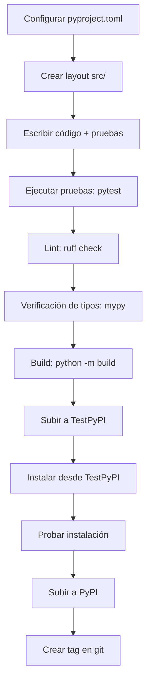

# Distribución de Paquetes y Publicación en PyPI

## ¿Por qué Empaquetar tu Código?

El empaquetado permite la instalación via `pip`, declara dependencias, proporciona puntos de entrada y hace que tu código sea reutilizable entre proyectos.

## pyproject.toml (Estándar Moderno)

`pyproject.toml` es el estándar moderno de empaquetado Python (PEP 517/518/621). Reemplaza a `setup.py` y `setup.cfg`.

```toml
[build-system]
requires = ["setuptools>=68.0", "wheel"]
build-backend = "setuptools.build_meta"

[project]
name = "my-awesome-lib"
version = "0.1.0"
description = "Una descripción corta de mi librería"
readme = "README.md"
requires-python = ">=3.10"
license = {text = "MIT"}
keywords = ["python", "ejemplo", "tutorial"]

authors = [
    {name = "Tu Nombre", email="tu@ejemplo.com"},
]

classifiers = [
    "Development Status :: 3 - Alpha",
    "Intended Audience :: Developers",
    "License :: OSI Approved :: MIT License",
    "Programming Language :: Python :: 3",
    "Programming Language :: Python :: 3.10",
    "Programming Language :: Python :: 3.11",
    "Programming Language :: Python :: 3.12",
    "Topic :: Software Development :: Libraries :: Python Modules",
]

dependencies = [
    "requests>=2.28",
    "pydantic>=2.0",
]

[project.optional-dependencies]
dev = [
    "pytest>=7.0",
    "pytest-cov>=4.0",
    "black>=23.0",
    "ruff>=0.1",
    "mypy>=1.0",
]
test = ["pytest>=7.0", "httpx>=0.24"]
docs = ["mkdocs>=1.4", "mkdocstrings"]

[project.urls]
Homepage = "https://github.com/tu/my-awesome-lib"
Documentation = "https://my-awesome-lib.readthedocs.io"
Repository = "https://github.com/tu/my-awesome-lib"
Issues = "https://github.com/tu/my-awesome-lib/issues"

[project.scripts]
my-cli = "my_awesome_lib.cli:main"

[project.gui-scripts]
my-gui = "my_awesome_lib.gui:launch"

[tool.setuptools.packages.find]
where = ["src"]
include = ["my_awesome_lib*"]
exclude = ["tests*", "docs*"]
```

[!NOTE]
La sección `[project.scripts]` crea puntos de entrada de consola. Cuando los usuarios instalan tu paquete con `pip install`, estos se convierten en comandos ejecutables en el PATH.

## Estructura del Proyecto

```
my-awesome-lib/
├── pyproject.toml
├── README.md
├── LICENSE
├── CHANGELOG.md
├── src/
│   └── my_awesome_lib/
│       ├── __init__.py
│       ├── cli.py
│       ├── core.py
│       └── utils.py
├── tests/
│   ├── __init__.py
│   ├── test_core.py
│   └── test_cli.py
└── docs/
    ├── index.md
    └── api.md
```

### Usando el Layout `src/`

El layout `src/` previene confusión de importaciones durante el desarrollo y las pruebas.

```python
# src/my_awesome_lib/core.py
def add(a, b):
    """Suma dos números."""
    return a + b

# src/my_awesome_lib/cli.py
def main():
    import argparse
    parser = argparse.ArgumentParser()
    parser.add_argument("numbers", nargs=2, type=float)
    args = parser.parse_args()
    result = add(args.numbers[0], args.numbers[1])
    print(f"Resultado: {result}")

# src/my_awesome_lib/__init__.py
from .core import add
```

## Construyendo Wheels

```bash
# Instalar herramientas de build
pip install build twine

# Construir distribución fuente y wheel
python -m build

# Verificar el wheel construido
ls dist/
# my_awesome_lib-0.1.0.tar.gz
# my_awesome_lib-0.1.0-py3-none-any.whl
```

[!SUCCESS]
Los wheels (`.whl`) son el formato de distribución preferido. Instalan más rápido que las distribuciones fuente porque saltan el paso de build.

## Subiendo a PyPI

```bash
# Subir a TestPyPI primero
twine upload --repository-url https://test.pypi.org/legacy/ dist/*

# Subir a PyPI de producción
twine upload dist/*

# Instalar desde TestPyPI
pip install --index-url https://test.pypi.org/simple/ my-awesome-lib
```

### Usando `~/.pypirc`

```ini
[distutils]
index-servers =
    pypi
    testpypi

[pypi]
username = __token__
password = pypi-xxxxx...

[testpypi]
repository = https://test.pypi.org/legacy/
username = __token__
password = pypi-xxxxx...
```

[!WARNING]
Nunca hagas commit de tu token o contraseña de PyPI. Usa variables de entorno (`TWINE_USERNAME`, `TWINE_PASSWORD`) o `keyring` en CI/CD.

## Versionado

### Versionado Semántico (SemVer)

```
MAJOR.MINOR.PATCH

MAJOR: Cambios de API incompatibles
MINOR: Nuevas funcionalidades compatibles hacia atrás
PATCH: Correcciones de errores compatibles hacia atrás
```

```python
# __version__.py — fuente única de verdad
__version__ = "0.1.0"
```

### Versionado Dinámico con setuptools-scm

```toml
[build-system]
requires = ["setuptools>=68.0", "wheel", "setuptools-scm>=8.0"]
build-backend = "setuptools.build_meta"

[project]
name = "my-awesome-lib"
dynamic = ["version"]

[tool.setuptools_scm]
version_scheme = "post-release"
```

La versión se deriva de etiquetas git (`git tag v0.1.0`).

## Flujo de Publicación (CI/CD)

```yaml
# .github/workflows/publish.yml
name: Publicar en PyPI

on:
  release:
    types: [published]

jobs:
  build-and-publish:
    runs-on: ubuntu-latest
    steps:
      - uses: actions/checkout@v4
        with:
          fetch-depth: 0
      - uses: actions/setup-python@v5
        with:
          python-version: "3.12"
      - run: pip install build twine
      - run: python -m build
      - run: twine upload dist/*
        env:
          TWINE_USERNAME: __token__
          TWINE_PASSWORD: ${{ secrets.PYPI_TOKEN }}
```

[!NOTE]
Usa Publicación Confiable (OIDC) con PyPI para la configuración de CI/CD más segura. No requiere tokens almacenados.

## Archivos Manifest

```ini
# MANIFEST.in — incluir archivos extra en la distribución fuente
include README.md
include LICENSE
include CHANGELOG.md
recursive-include src/my_awesome_lib/data *
```

## Checklist Completo del Paquete



## Ejemplo Real: Publicando una Herramienta CLI

```python
# src/mycalc/cli.py
import argparse
from .core import calculate

def main():
    parser = argparse.ArgumentParser(description="Una calculadora simple")
    parser.add_argument("expression", help="Expresión matemática a evaluar")
    args = parser.parse_args()
    result = calculate(args.expression)
    print(f"= {result}")

if __name__ == "__main__":
    main()
```

```toml
[project.scripts]
mycalc = "mycalc.cli:main"
```

Después de `pip install mycalc`:
```bash
mycalc "2 + 2"
# = 4
```

## Preguntas de Práctica

1. ¿Qué es el archivo `pyproject.toml` y por qué se prefiere sobre `setup.py`?
2. Crea un `pyproject.toml` para un paquete llamado `textutils` con dependencias en `click` y `pyyaml`.
3. ¿Cuál es la diferencia entre una distribución fuente (`.tar.gz`) y un wheel (`.whl`)? ¿Cuándo usarías cada uno?
4. Escribe un flujo de trabajo de GitHub Actions que publique un paquete en PyPI cuando se cree un release.
5. ¿Cómo deriva `setuptools-scm` la versión del paquete desde git? ¿Cuáles son los beneficios?
6. ¿Qué es el layout `src/` y por qué se recomienda para paquetes Python?
7. Construye una herramienta CLI simple con puntos de entrada en `pyproject.toml` y publícala en TestPyPI.
8. ¿Cómo manejar dependencias opcionales en `pyproject.toml`? Da un ejemplo con extras `dev` y `test`.
9. ¿Qué es Publicación Confiable (OIDC) en PyPI y cómo mejora la seguridad?
10. Crea una estructura de proyecto completa para un paquete llamado `csvproc` que procese archivos CSV con pruebas, documentación y empaquetado adecuados.
