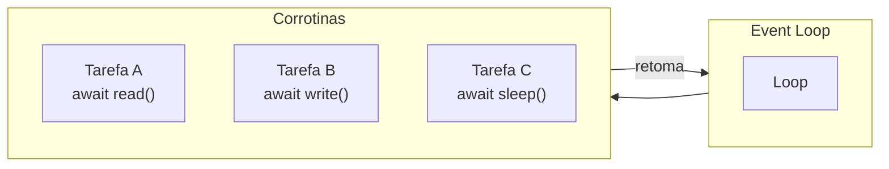
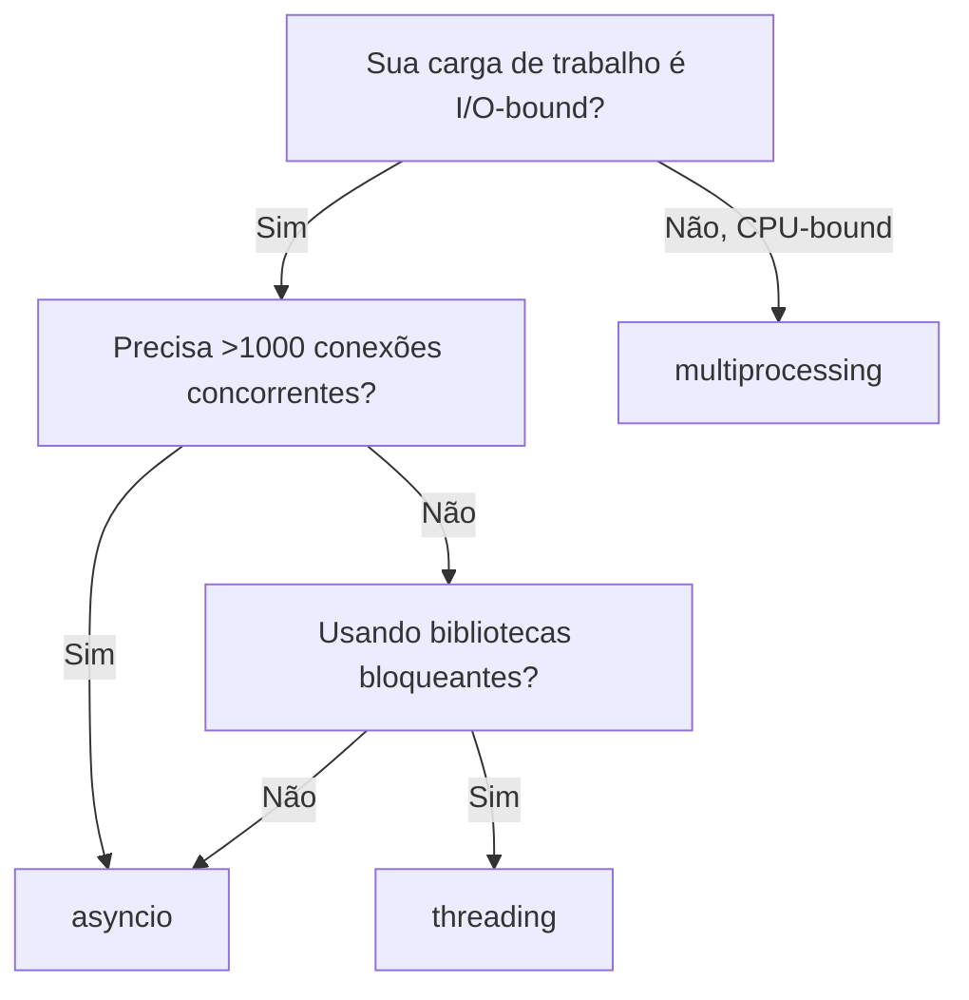

# Programação Assíncrona com asyncio

## O Event Loop

asyncio usa um modelo de multitarefa cooperativa single-thread e single-process. As corrotinas do event loop alternam quando fazem `await` de uma operação de E/S, devolvendo o controle ao loop.



## Corrotinas e Await

Uma corrotina é uma função definida com `async def`. Ela retorna um objeto corrotina que deve ser aguardado ou agendado.

```python
import asyncio

async def fetch_data():
    await asyncio.sleep(1)  # Simular E/S
    return {"data": 42}

async def main():
    result = await fetch_data()
    print(result)

asyncio.run(main())
```

[!NOTE]
`asyncio.run()` cria o event loop, executa a corrotina e limpa. É o ponto de entrada padrão para programas assíncronos.

## Criando e Aguardando Tasks

`asyncio.create_task()` agenda uma corrotina para execução concorrente.

```python
import asyncio

async def say_after(delay, msg):
    await asyncio.sleep(delay)
    print(msg)

async def main():
    task1 = asyncio.create_task(say_after(1, "world"))
    task2 = asyncio.create_task(say_after(2, "hello"))
    print("started")
    await task1
    await task2
    print("done")

asyncio.run(main())
```

[!SUCCESS]
Tasks executam concorrentemente no mesmo event loop. Ambas as tasks iniciam imediatamente; tempo total de execução é ~2s não 3s.

## asyncio.gather

Executar múltiplos awaitables concorrentemente e coletar resultados.

```python
import asyncio

async def fetch_url(name, delay):
    await asyncio.sleep(delay)
    return f"Result from {name}"

async def main():
    results = await asyncio.gather(
        fetch_url("A", 1),
        fetch_url("B", 2),
        fetch_url("C", 3),
    )
    print(results)

asyncio.run(main())
```

### Tratamento de Erros com gather

```python
async def might_fail(name, fail=False):
    await asyncio.sleep(0.5)
    if fail:
        raise ValueError(f"{name} failed")
    return name

async def main():
    results = await asyncio.gather(
        might_fail("A"),
        might_fail("B", fail=True),
        might_fail("C"),
        return_exceptions=True,
    )
    for r in results:
        if isinstance(r, Exception):
            print(f"Caught: {r}")
        else:
            print(f"Success: {r}")

asyncio.run(main())
```

## asyncio.wait e asyncio.as_completed

```python
async def worker(name, delay):
    await asyncio.sleep(delay)
    return name

async def main():
    tasks = [worker(f"W{i}", i) for i in range(1, 6)]

    # as_completed — resultados à medida que terminam
    for coro in asyncio.as_completed(tasks):
        result = await coro
        print(f"Finished: {result}")

    # wait — com timeout e return_when
    done, pending = await asyncio.wait(
        tasks,
        timeout=3,
        return_when=asyncio.FIRST_COMPLETED,
    )
    for t in pending:
        t.cancel()

asyncio.run(main())
```

## Futures

Um `Future` é um awaitable de baixo nível que representa um resultado que será definido depois. Tasks envolvem corrotinas em futures.

```python
import asyncio

async def set_future(fut, value, delay):
    await asyncio.sleep(delay)
    fut.set_result(value)

async def main():
    loop = asyncio.get_running_loop()
    fut = loop.create_future()
    asyncio.create_task(set_future(fut, 42, 1))
    result = await fut
    print(result)  # 42

asyncio.run(main())
```

## asyncio.Queue

Para padrões produtor-consumidor:

```python
import asyncio
import random

async def producer(q):
    for i in range(10):
        await asyncio.sleep(random.random() * 0.2)
        item = f"item-{i}"
        await q.put(item)
        print(f"Produced {item}")

async def consumer(q, name):
    while True:
        item = await q.get()
        if item is None:
            q.task_done()
            break
        await asyncio.sleep(random.random() * 0.3)
        print(f"{name} consumed {item}")
        q.task_done()

async def main():
    q = asyncio.Queue(maxsize=5)
    producers = [asyncio.create_task(producer(q))]
    consumers = [asyncio.create_task(consumer(q, f"C{i}")) for i in range(3)]
    await asyncio.gather(*producers)
    await q.join()
    for c in consumers:
        await q.put(None)
    await asyncio.gather(*consumers)

asyncio.run(main())
```

## Exemplo Real com aiohttp

```python
import asyncio
import aiohttp
from typing import List

BASE_URL = "https://jsonplaceholder.typicode.com"

async def fetch_json(session: aiohttp.ClientSession, url: str) -> dict:
    async with session.get(url) as resp:
        return await resp.json()

async def fetch_all_users() -> List[dict]:
    async with aiohttp.ClientSession() as session:
        tasks = [
            fetch_json(session, f"{BASE_URL}/posts/{i}")
            for i in range(1, 21)
        ]
        return await asyncio.gather(*tasks)

async def main():
    data = await fetch_all_users()
    print(f"Fetched {len(data)} posts")

results = asyncio.run(main())
```

[!WARNING]
Sempre use `aiohttp.ClientSession` como um gerenciador de contexto. Sessions gerenciam pooling de conexões e reutilizam conexões TCP, o que é crítico para desempenho.

## Semáforos e Limitação de Taxa

```python
import asyncio
import aiohttp

sem = asyncio.Semaphore(5)

async def rate_limited_fetch(session, url):
    async with sem:
        await asyncio.sleep(0.1)
        async with session.get(url) as resp:
            return await resp.text()

async def main():
    urls = [f"https://httpbin.org/delay/1" for _ in range(50)]
    async with aiohttp.ClientSession() as session:
        tasks = [rate_limited_fetch(session, u) for u in urls]
        results = await asyncio.gather(*tasks)
        print(f"Fetched {len(results)} pages")

asyncio.run(main())
```

## Timeouts e Cancelamento

```python
import asyncio

async def slow_operation():
    await asyncio.sleep(10)
    return "done"

async def main():
    try:
        result = await asyncio.wait_for(slow_operation(), timeout=2)
    except asyncio.TimeoutError:
        print("Operation timed out")

    # Cancelamento manual
    task = asyncio.create_task(slow_operation())
    await asyncio.sleep(0.1)
    task.cancel()
    try:
        await task
    except asyncio.CancelledError:
        print("Task was cancelled")

asyncio.run(main())
```

## Depurando Código Assíncrono

```python
import asyncio

async def problematic():
    loop = asyncio.get_running_loop()
    loop.slow_callback_duration = 0.1  # avisar sobre callbacks lentos
    await asyncio.sleep(10)

# Ativar modo de depuração
asyncio.run(problematic(), debug=True)
```

## Matriz de Decisão: asyncio vs Threading

| Aspecto | asyncio | threading |
|---------|---------|-----------|
| Memória por tarefa | ~1 KB | ~8 MB (thread do SO) |
| Concorrência máxima | 10.000+ | Centenas |
| Impacto do GIL | Nenhum (single-thread) | Bloqueia trabalho CPU |
| Melhor para | I/O-bound, muitas conexões | I/O-bound, libs bloqueantes |
| Complexidade | Maior (mentalidade async) | Menor |



## Perguntas de Prática

1. O que é um event loop e como difere de threads do SO?
2. Escreva um programa que busca 100 URLs concorrentemente usando `aiohttp` e `asyncio.gather`.
3. Qual é a diferença entre uma corrotina e uma task? Mostre exemplos de código.
4. Como `asyncio.wait` difere de `asyncio.gather`? Quando preferiria um ao outro?
5. Implemente um limitador de taxa usando `asyncio.Semaphore` que permite no máximo 10 requisições concorrentes.
6. O que acontece quando você faz `await` de uma corrotina que levanta uma exceção dentro de `asyncio.gather` com `return_exceptions=False`?
7. Escreva um padrão produtor-consumidor usando `asyncio.Queue` onde o produtor gera itens a uma taxa variável.
8. Como você cancela uma task em execução? Que exceção a task cancelada recebe?
9. Por que `asyncio.run()` existe? Que problemas ele resolve em relação a gerenciar o loop manualmente?
10. Compare e contraste `asyncio.sleep(0)` vs `time.sleep(0)`. Por que o primeiro permite concorrência e o segundo a bloqueia?
