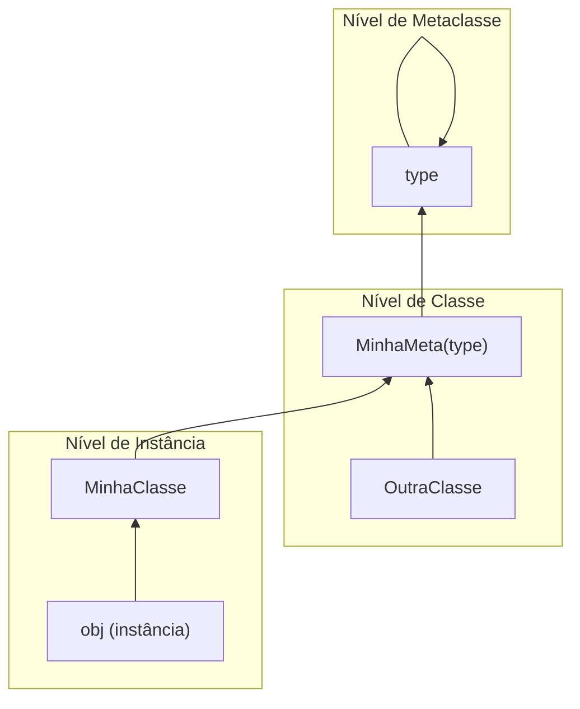

# Metaclasses e Descritores

## Tudo é um Objeto

Em Python, classes também são objetos — instâncias de uma metaclasse (padrão: `type`).

```python
class MyClass:
    pass

print(type(MyClass))     # <class 'type'>
print(type(type))        # <class 'type'>
print(isinstance(MyClass, type))  # True
```

## A Metaclasse `type()`

`type(name, bases, namespace)` cria uma nova classe dinamicamente.

```python
# Estas são equivalentes:
class Foo:
    x = 10
    def bar(self):
        return self.x

Foo = type("Foo", (), {"x": 10, "bar": lambda self: self.x})

# Com herança
Base = type("Base", (), {"greet": lambda self: "hello"})
Child = type("Child", (Base,), {"extra": 42})
obj = Child()
print(obj.greet())  # "hello"
print(obj.extra)    # 42
```

## Metaclasses Personalizadas

Uma metaclasse herda de `type`. Seu `__new__` recebe o nome, bases e namespace da futura classe.

```python
class SingletonMeta(type):
    _instances = {}
    def __call__(cls, *args, **kwargs):
        if cls not in cls._instances:
            cls._instances[cls] = super().__call__(*args, **kwargs)
        return cls._instances[cls]

class Database(metaclass=SingletonMeta):
    def __init__(self):
        self.connected = False

db1 = Database()
db2 = Database()
print(db1 is db2)  # True
```

[!NOTE]
`__new__` é chamado antes de `__init__`. Em metaclasses, `__new__` recebe a classe sendo criada, enquanto `__init__` recebe a classe já criada.

### Metaclasse de Validação

```python
class ValidateAttributes(type):
    def __new__(mcs, name, bases, namespace):
        required = namespace.get("__required_attrs__", [])
        for attr in required:
            if attr not in namespace:
                raise TypeError(f"{name} must define '{attr}'")
        return super().__new__(mcs, name, bases, namespace)

class APIEndpoint(metaclass=ValidateAttributes):
    __required_attrs__ = ["path", "method"]

# Isto levanta TypeError:
# class InvalidEndpoint(metaclass=ValidateAttributes):
#     pass

class ValidEndpoint(metaclass=ValidateAttributes):
    __required_attrs__ = ["path", "method"]
    path = "/api/health"
    method = "GET"
```

## `__new__` vs `__init__`

| Método | Quando Chamado | Retorna | Propósito |
|--------|----------------|---------|-----------|
| `__new__` | Antes do init | Nova instância | Criação de objeto (raramente sobrescrito) |
| `__init__` | Após `__new__` | None | Inicialização de objeto |

```python
class Custom:
    def __new__(cls, *args, **kwargs):
        instance = super().__new__(cls)
        print(f"Creating instance of {cls.__name__}")
        return instance

    def __init__(self, value):
        print(f"Initialising with {value}")
        self.value = value

obj = Custom(42)
# Creating instance of Custom
# Initialising with 42
```

[!SUCCESS]
Sobrescreva `__new__` para tipos imutáveis (str, int, tuple) ou padrões singleton/registry. Use `__init__` para inicialização normal.

## O Protocolo Descritor

Descritores são objetos que definem `__get__`, `__set__` ou `__delete__`. Eles controlam o acesso a atributos.

```python
class ValidatedField:
    def __init__(self, validator):
        self.validator = validator
        self.data = {}

    def __get__(self, obj, objtype=None):
        if obj is None:
            return self
        return self.data.get(id(obj))

    def __set__(self, obj, value):
        if not self.validator(value):
            raise ValueError(f"Invalid value: {value}")
        self.data[id(obj)] = value

class Person:
    age = ValidatedField(lambda v: 0 <= v <= 150)

    def __init__(self, name, age):
        self.name = name
        self.age = age

p = Person("Alice", 30)
print(p.age)  # 30
# p.age = 200  # ValueError
```

## A Implementação de `property()`

`property()` é um descritor embutido. Veja como você o implementaria:

```python
class Property:
    def __init__(self, fget=None, fset=None, fdel=None, doc=None):
        self.fget = fget
        self.fset = fset
        self.fdel = fdel
        if doc is None and fget is not None:
            doc = fget.__doc__
        self.__doc__ = doc

    def __get__(self, obj, objtype=None):
        if obj is None:
            return self
        if self.fget is None:
            raise AttributeError("unreadable attribute")
        return self.fget(obj)

    def __set__(self, obj, value):
        if self.fset is None:
            raise AttributeError("can't set attribute")
        self.fset(obj, value)

    def __delete__(self, obj):
        if self.fdel is None:
            raise AttributeError("can't delete attribute")
        self.fdel(obj)

    def setter(self, fset):
        return type(self)(self.fget, fset, self.fdel)

    def deleter(self, fdel):
        return type(self)(self.fget, self.fset, fdel)

class Temperature:
    def __init__(self, celsius=0):
        self._celsius = celsius

    @Property
    def fahrenheit(self):
        return self._celsius * 9 / 5 + 32

    @fahrenheit.setter
    def fahrenheit(self, value):
        self._celsius = (value - 32) * 5 / 9
```

## Mundo Real: Campo ORM estilo Django

```python
class Field:
    def __init__(self, default=None, nullable=False):
        self.default = default
        self.nullable = nullable
        self.name = None

    def __set_name__(self, owner, name):
        self.name = name

    def __get__(self, obj, objtype=None):
        if obj is None:
            return self
        return obj.__dict__.get(self.name, self.default)

    def __set__(self, obj, value):
        if value is None and not self.nullable:
            raise ValueError(f"{self.name} cannot be null")
        obj.__dict__[self.name] = value

class ModelMeta(type):
    def __new__(mcs, name, bases, namespace):
        fields = {}
        for attr_name, attr_val in namespace.items():
            if isinstance(attr_val, Field):
                fields[attr_name] = attr_val
        cls = super().__new__(mcs, name, bases, namespace)
        cls._fields = fields
        return cls

class Model(metaclass=ModelMeta):
    pass

class User(Model):
    name = Field(default="anonymous")
    email = Field(nullable=False)
    age = Field(default=0)

u = User()
print(u.name)  # "anonymous"
```

## Slots: Otimização de Memória

`__slots__` declara atributos de instância explicitamente, eliminando o `__dict__` por instância.

```python
class Point:
    __slots__ = ("x", "y")
    def __init__(self, x, y):
        self.x = x
        self.y = y

p = Point(1, 2)
# p.z = 3  # AttributeError
print(p.x, p.y)
```

[!NOTE]
Slots interagem com descritores de forma interessante: se um descritor define `__set_name__` e a classe usa `__slots__`, a entrada do slot é usada em vez do dict da instância.

## Mermaid: Hierarquia de Metaclasses



## Perguntas de Prática

1. O que é uma metaclasse? Como `type("Name", bases, dict)` difere de usar a palavra-chave `class`?
2. Implemente uma metaclasse `AutoRepr` que adiciona automaticamente um método `__repr__` a toda classe que a usa.
3. Qual é a diferença entre `__new__` e `__init__`? Quando você sobrescreveria `__new__`?
4. Explique o protocolo descritor. Como `__get__`, `__set__` e `__delete__` interagem?
5. Reimplemente `@property` do Python usando uma classe descritora personalizada.
6. Qual é o propósito de `__set_name__`? Mostre um exemplo onde é essencial.
7. Construa uma metaclasse `EnumMeta` que impede nomes de membros de enumeração duplicados.
8. Como `__slots__` afeta o uso de memória e a velocidade de acesso a atributos? Quais são suas limitações?
9. Escreva um descritor `LoggedAttribute` que registra toda leitura e escrita em seu valor.
10. Por que `property()` funciona como decorador? Explique usando descritores.
