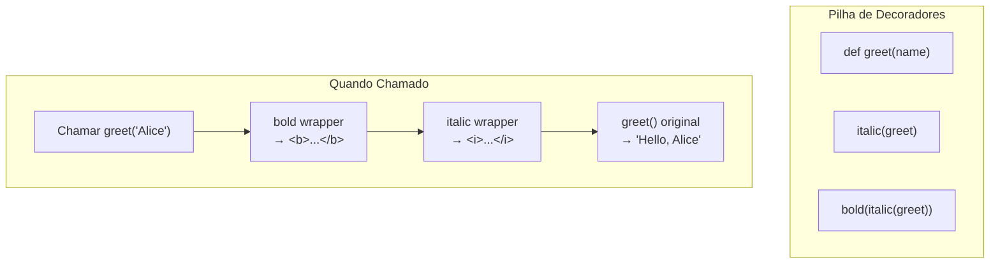

# Decoradores Avançados

## Revisão de Decoradores

Um decorador é um callable que recebe uma função e retorna uma substituição.

```python
def simple_decorator(func):
    def wrapper(*args, **kwargs):
        print(f"Calling {func.__name__}")
        return func(*args, **kwargs)
    return wrapper

@simple_decorator
def greet(name):
    return f"Hello, {name}"

print(greet("Alice"))
# Calling greet
# Hello, Alice
```

## functools.wraps

Sempre use `@functools.wraps` para preservar metadados.

```python
import functools
import time

def timer(func):
    @functools.wraps(func)
    def wrapper(*args, **kwargs):
        start = time.perf_counter()
        result = func(*args, **kwargs)
        elapsed = time.perf_counter() - start
        print(f"{func.__name__} took {elapsed:.4f}s")
        return result
    return wrapper

@timer
def slow_add(a, b):
    """Add two numbers slowly."""
    time.sleep(0.1)
    return a + b

print(slow_add(1, 2))
print(slow_add.__name__)   # "slow_add" (preservado)
print(slow_add.__doc__)    # "Add two numbers slowly." (preservado)
```

[!NOTE]
Sem `@functools.wraps`, ferramentas de introspecção (help(), inspect, depuradores) mostram o wrapper em vez da função original.

## Decoradores com Argumentos

Três níveis de aninhamento quando seu decorador recebe argumentos:

```python
import functools

def repeat(n=1):
    def decorator(func):
        @functools.wraps(func)
        def wrapper(*args, **kwargs):
            for _ in range(n):
                result = func(*args, **kwargs)
            return result
        return wrapper
    return decorator

@repeat(n=3)
def say(msg):
    print(msg)

say("Hello!")  # imprime "Hello!" três vezes
```

### Decorador Parametrizado (argumentos opcionais)

```python
import functools

def retry(max_attempts=3, delay=0.1):
    def decorator(func):
        @functools.wraps(func)
        def wrapper(*args, **kwargs):
            import time
            last_exc = None
            for attempt in range(1, max_attempts + 1):
                try:
                    return func(*args, **kwargs)
                except Exception as e:
                    last_exc = e
                    print(f"Attempt {attempt} failed: {e}")
                    if attempt < max_attempts:
                        time.sleep(delay)
            raise last_exc
        return wrapper
    return decorator

@retry(max_attempts=3, delay=0.5)
def unstable_api():
    import random
    if random.random() < 0.7:
        raise ConnectionError("Network error")
    return "success"
```

[!SUCCESS]
O truque `functools.partial` permite que `@decorator` e `@decorator(args)` funcionem: verifique se o primeiro argumento é callable.

## Decoradores Baseados em Classe

Classes que implementam `__call__` podem manter estado:

```python
import functools
import time

class RateLimit:
    def __init__(self, calls=5, period=1):
        self.calls = calls
        self.period = period
        self.timestamps = []

    def __call__(self, func):
        @functools.wraps(func)
        def wrapper(*args, **kwargs):
            now = time.monotonic()
            self.timestamps = [t for t in self.timestamps
                               if now - t < self.period]
            if len(self.timestamps) >= self.calls:
                raise RuntimeError("Rate limit exceeded")
            self.timestamps.append(now)
            return func(*args, **kwargs)
        return wrapper

@RateLimit(calls=3, period=2)
def api_call():
    return "OK"
```

### Como Decorador de Classe com Estado de Instância

```python
import functools

class CountCalls:
    def __init__(self, func):
        functools.update_wrapper(self, func)
        self.func = func
        self.count = 0

    def __call__(self, *args, **kwargs):
        self.count += 1
        print(f"Call {self.count} of {self.func.__name__}")
        return self.func(*args, **kwargs)

@CountCalls
def hello():
    print("Hi!")

hello()  # Call 1 of hello
hello()  # Call 2 of hello
```

## Empilhando Decoradores

A ordem importa: decoradores aplicam-se de baixo para cima (mais próximo da função primeiro).

```python
import functools

def bold(func):
    @functools.wraps(func)
    def wrapper(*args, **kwargs):
        return f"<b>{func(*args, **kwargs)}</b>"
    return wrapper

def italic(func):
    @functools.wraps(func)
    def wrapper(*args, **kwargs):
        return f"<i>{func(*args, **kwargs)}</i>"
    return wrapper

@bold
@italic
def greet(name):
    return f"Hello, {name}"

print(greet("Alice"))  # <b><i>Hello, Alice</i></b>
```

[!NOTE]
`@bold @italic greet` é equivalente a `bold(italic(greet))`. O decorador mais próximo da função executa primeiro.

## Decorando Métodos (self-aware)

```python
import functools

def method_logger(func):
    @functools.wraps(func)
    def wrapper(self, *args, **kwargs):
        print(f"{type(self).__name__}.{func.__name__} called")
        return func(self, *args, **kwargs)
    return wrapper

class Service:
    @method_logger
    def process(self, data):
        return data * 2

s = Service()
s.process(10)  # Service.process called
```

## Mundo Real: Cache / Memoização

```python
import functools
import time

def lru_cache(maxsize=128):
    def decorator(func):
        cache = {}
        order = []

        @functools.wraps(func)
        def wrapper(*args, **kwargs):
            key = (args, tuple(sorted(kwargs.items())))
            if key in cache:
                # Mover para o fim (mais recentemente usado)
                order.remove(key)
                order.append(key)
                return cache[key]

            result = func(*args, **kwargs)
            cache[key] = result
            order.append(key)

            if len(cache) > maxsize:
                oldest = order.pop(0)
                del cache[oldest]

            return result
        return wrapper
    return decorator

@lru_cache(maxsize=3)
def expensive(n):
    time.sleep(0.5)
    return n * n
```

## Mermaid: Pipeline de Decoradores



## Perguntas de Prática

1. O que `@functools.wraps` faz e por que é importante?
2. Escreva um decorador `timeit` que imprime o tempo de execução de qualquer função.
3. Implemente um decorador `require_auth` que verifica se um argumento nomeado `user` não é None.
4. Qual é a diferença entre um decorador baseado em função e um baseado em classe? Quando você usaria cada um?
5. Crie um decorador parametrizado `with_retry(max_attempts)` que tenta novamente uma função em caso de falha.
6. Explique a ordem de empilhamento de decoradores. Se `@A @B def f()` é equivalente a `A(B(f))`, o que isso significa para a ordem de execução?
7. Construa um decorador baseado em classe `Singleton` que garante que apenas uma instância de uma classe exista.
8. Escreva um decorador que armazena em cache o valor de retorno de uma função e invalida após um TTL (time-to-live).
9. Como você decoraria um método de classe para registrar tanto o nome da classe quanto os argumentos?
10. Implemente um decorador `type_check` que valida se os tipos dos argumentos correspondem às dicas de tipo e levanta `TypeError` em caso de incompatibilidade.
