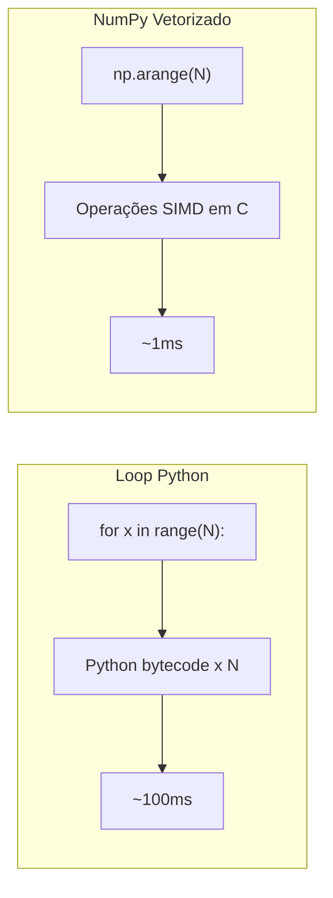

# Otimização de Desempenho, Cython e Numba

## Perfile Antes de Otimizar

Nunca adivinhe onde está o gargalo. Use profilers.

### cProfile

```python
import cProfile
import pstats

def heavy():
    total = 0
    for i in range(10**6):
        total += i ** 2
    return total

profiler = cProfile.Profile()
profiler.runcall(heavy)
stats = pstats.Stats(profiler)
stats.sort_stats(pstats.SortKey.TIME)
stats.print_stats(10)
```

A saída mostra tempo cumulativo, tempo por chamada e contagem de chamadas.

### Line Profiler

```bash
pip install line_profiler
```

```python
from line_profiler import profile

@profile
def process_data(data):
    total = 0.0
    for x in data:
        total += x ** 2
        total /= max(1, x)
    return total

process_data(range(100_000))
```

[!NOTE]
Execute com `kernprof -l script.py && python -m line_profiler script.py.lprof` para temporização linha por linha.

### Memory Profiler

```python
from memory_profiler import profile

@profile
def allocate():
    big = [list(range(1000)) for _ in range(1000)]
    return sum(len(x) for x in big)

allocate()
```

## Usando `__slots__`

Slots reduzem memória substituindo o `__dict__` por instância por um array de tamanho fixo.

```python
class WithoutSlots:
    def __init__(self, x, y, z):
        self.x = x
        self.y = y
        self.z = z

class WithSlots:
    __slots__ = ("x", "y", "z")
    def __init__(self, x, y, z):
        self.x = x
        self.y = y
        self.z = z

import sys
a = WithoutSlots(1, 2, 3)
b = WithSlots(1, 2, 3)
print(sys.getsizeof(a))  # ~56 (mais __dict__ ~120)
print(sys.getsizeof(b))  # ~56 (sem __dict__)

# Para 1M instâncias, WithSlots economiza ~120+ MB
```

[!SUCCESS]
Use `__slots__` ao criar milhões de objetos pequenos (ex.: registros de dados, entidades de jogo, partículas).

## Otimizações do Módulo collections

```python
from collections import defaultdict, Counter, deque, OrderedDict
from collections.abc import Mapping

# deque para appends/pops O(1) em ambas as extremidades
dq = deque(maxlen=1000)
for i in range(2000):
    dq.append(i)
print(len(dq))  # 1000 (mais antigo descartado)

# Counter para frequência
freq = Counter("mississippi")
print(freq.most_common(2))  # [('i', 4), ('s', 4)]

# defaultdict evita verificações de chave
groups = defaultdict(list)
groups["a"].append(1)  # sem KeyError
```

## Vetorização com NumPy

Loops Python nativos são lentos; NumPy opera em arrays em nível C.

```python
import numpy as np
import time

# Loop Python lento
N = 10_000_000
start = time.perf_counter()
py_result = sum(x ** 2 for x in range(N))
print(f"Python: {time.perf_counter() - start:.2f}s")

# NumPy rápido
start = time.perf_counter()
arr = np.arange(N, dtype=np.float64)
np_result = (arr ** 2).sum()
print(f"NumPy: {time.perf_counter() - start:.2f}s")

# Tipicamente 50-100x mais rápido
```



## Conceitos Básicos de Cython

Cython compila código semelhante ao Python para extensões C. Salve como `.pyx`.

```cython
# sum_squares.pyx
def sum_squares(int n):
    cdef int i
    cdef long long total = 0
    for i in range(n):
        total += i * i
    return total
```

### Compilar com `setup.py`

```python
from setuptools import setup, Extension
from Cython.Build import cythonize

setup(
    ext_modules=cythonize([
        Extension("sum_squares", ["sum_squares.pyx"])
    ])
)
```

```bash
python setup.py build_ext --inplace
python -c "import sum_squares; print(sum_squares.sum_squares(10**7))"
```

[!NOTE]
Cython permite declarações de tipo `cdef` que compilam para C puro. Mesmo sem anotações de tipo, Cython frequentemente dá aceleração de 2-3x.

### Modo Python Puro com Anotações Cython

```python
import cython

@cython.cfunc
@cython.returns(cython.longlong)
@cython.locals(n=cython.int, i=cython.int)
def sum_squares(n):
    total: cython.longlong = 0
    for i in range(n):
        total += i * i
    return total
```

## Compilação JIT com Numba

Numba compila funções Python para código de máquina usando LLVM — zero código C necessário.

```python
from numba import njit, prange
import time
import math

@njit
def is_prime(n):
    if n < 2:
        return False
    for i in range(2, int(math.sqrt(n)) + 1):
        if n % i == 0:
            return False
    return True

@njit(parallel=True)
def count_primes(limit):
    count = 0
    for i in prange(2, limit):
        if is_prime(i):
            count += 1
    return count

start = time.perf_counter()
print(count_primes(10_000_000))  # 664,579
print(f"Numba: {time.perf_counter() - start:.2f}s")
# Frequentemente 100-200x mais rápido que Python puro
```

[!SUCCESS]
Numba é excelente com loops numéricos e código com muita matemática. É amplamente usado em finanças quantitativas, computação científica e pré-processamento de ML.

## Matriz de Decisão: Cython vs Numba

| Característica | Cython | Numba |
|---------------|--------|-------|
| Configuração | Requer etapa de compilação | JIT em tempo de execução |
| Dependências | Compilador C, Cython | llvmlite, numpy |
| Melhor para | Interoperabilidade C complexa | Algoritmos numéricos |
| Recursos Python | Limitados (sem tipagem dinâmica) | Mais compatível |
| Deployment | Build wheel | Fácil (sem build) |
| Velocidade | Próximo de C | Próximo de C |

## Mundo Real: Processamento de Imagem com Numba

```python
import numpy as np
from numba import njit, prange

@njit(parallel=True)
def grayscale(images):
    """Converter lote de imagens RGB para escala de cinza."""
    n, h, w, c = images.shape
    result = np.zeros((n, h, w), dtype=np.uint8)
    for i in prange(n):
        for y in range(h):
            for x in range(w):
                r, g, b = images[i, y, x]
                result[i, y, x] = 0.299 * r + 0.587 * g + 0.114 * b
    return result

batch = np.random.randint(0, 256, (100, 256, 256, 3), dtype=np.uint8)
gray = grayscale(batch)
```

## Perguntas de Prática

1. Qual é a diferença entre `cProfile` e um line profiler? Quando você usaria cada um?
2. Escreva um benchmark comparando uma compreensão de lista vs um loop `for` vs NumPy para computar `x**2` em 10M elementos.
3. Como `__slots__` reduz o uso de memória? Quais são as desvantagens?
4. Crie uma função JIT Numba que computa o conjunto de Mandelbrot e compare sua velocidade com Python puro.
5. O que é `cython -a` e como ajuda a otimizar código?
6. Compare `deque` vs `list` para uma operação de janela deslizante em 100K elementos.
7. Escreva um arquivo `.pyx` Cython que computa números de Fibonacci eficientemente usando `cdef`.
8. Por que o loop `for` do Python é mais lento que NumPy para operações numéricas? Explique o papel do bytecode CPython.
9. Implemente uma análise de frequência baseada em `Counter` em uma lista de 10M itens e compare `collections.Counter` vs dict manual.
10. Quais são as limitações do Numba? Quando Cython seria a melhor escolha apesar da etapa extra de build?
