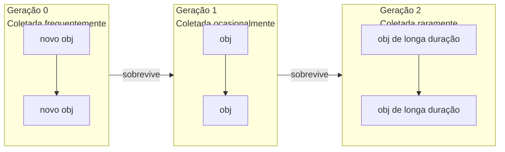

# Gerenciamento de Memória e Coleta de Lixo

## Contagem de Referências

Todo objeto Python tem um contador de referências inteiro. Quando chega a 0, a memória é liberada imediatamente.

```python
import sys

x = [1, 2, 3]
print(sys.getrefcount(x))  # 2 (x + argumento)

y = x
print(sys.getrefcount(x))  # 3

del y
print(sys.getrefcount(x))  # 2

del x
# Objeto liberado
```

[!NOTE]
`sys.getrefcount()` em si incrementa o contador porque o objeto é passado como argumento. Subtraia 1 para a contagem real.

## O Módulo `gc` (GC Cíclico)

A contagem de referências sozinha não pode lidar com ciclos:

```python
class Node:
    def __init__(self, name):
        self.name = name
        self.next = None

a = Node("A")
b = Node("B")
a.next = b
b.next = a  # Ciclo!
del a
del b
# Contagem de refs nunca chega a 0 — GC cíclico necessário
```

### Controle Manual do GC

```python
import gc

gc.enable()
print(gc.get_threshold())  # (700, 10, 10)

# Forçar coleta
collected = gc.collect()
print(f"Collected {collected} objects")

# Desabilitar para sistemas de tempo real
gc.disable()

# Encontrar inatingíveis
gc.set_debug(gc.DEBUG_LEAK)
```

### Gerações do GC

```python
import gc

# Rastrear objetos entre gerações
for gen in range(3):
    print(f"Gen {gen}: {gc.get_count()[gen]} objects")

# Objetos movem-se de Gen 0 → 1 → 2 à medida que sobrevivem às coletas
# Gen 0 é coletada mais frequentemente (~700 alocações)
# Gen 2 é a geração "velha", coletada raramente
```



## Referências Fracas

`weakref` permite referenciar um objeto sem aumentar sua contagem de referências — ideal para caches e observadores.

```python
import weakref

class Expensive:
    def __init__(self, data):
        self.data = data
    def __del__(self):
        print(f"Deleting {self.data}")

obj = Expensive([1, 2, 3])
ref = weakref.ref(obj)
print(ref() is obj)  # True

del obj
print(ref() is None)  # True (ref fraca morreu)
```

### WeakValueDictionary

```python
import weakref

class Cache:
    def __init__(self):
        self._data = weakref.WeakValueDictionary()

    def set(self, key, value):
        self._data[key] = value

    def get(self, key):
        return self._data.get(key)

cache = Cache()
obj = {"payload": "large"}
cache.set("item1", obj)
print(cache.get("item1"))  # {"payload": "large"}
del obj
print(cache.get("item1"))  # None (limpo automaticamente)
```

[!SUCCESS]
`WeakValueDictionary` é ideal para caches onde entradas devem expirar automaticamente quando não há outras referências.

## Vazamentos de Memória em Python

Causas comuns:

```python
# 1. Referências circulares com __del__
class Leak:
    def __init__(self, other=None):
        self.other = other
    def __del__(self):
        pass  # Impede o GC de coletar ciclos!

a = Leak()
b = Leak(a)
a.other = b  # ciclo + __del__ = inatingível mas não coletável

# 2. Caches globais que nunca limpam
_GLOBAL_CACHE = {}

def memoize(func):
    _GLOBAL_CACHE[func] = {}
    def wrapper(n):
        if n not in _GLOBAL_CACHE[func]:
            _GLOBAL_CACHE[func][n] = func(n)
        return _GLOBAL_CACHE[func][n]
    return wrapper

# 3. Recursos não fechados
import tempfile
f = tempfile.NamedTemporaryFile()
# Nunca fechado — vazamento de descritor de arquivo
```

### Detectando Vazamentos

```python
import gc
import objgraph  # pip install objgraph

# Mostrar objetos impedindo coleta
gc.collect()
objgraph.show_most_common_types(limit=10)

# Rastrear crescimento de tipo específico
objgraph.show_growth(limit=5)

# Encontrar o que está segurando uma referência
obj = SomeClass()
objgraph.show_backrefs([obj], max_depth=5, filename="backrefs.png")
```

## Perfilamento de Memória

```python
import tracemalloc

tracemalloc.start()

# Tirar um snapshot
snap1 = tracemalloc.take_snapshot()
data = [list(range(1000)) for _ in range(1000)]
snap2 = tracemalloc.take_snapshot()

stats = snap2.compare_to(snap1, "lineno")
for stat in stats[:5]:
    print(stat)
```

### Usando `memory_profiler`

```bash
pip install memory_profiler
python -m memory_profiler script.py
```

```python
@profile
def heavy():
    a = [i ** 2 for i in range(100_000)]
    b = {i: str(i) for i in range(100_000)}
    return a, b
```

[!NOTE]
O perfilamento de memória em produção pode usar `tracemalloc` com snapshots periódicos para rastrear crescimento ao longo do tempo.

## Tamanhos de Objeto

```python
import sys

empty_list = []
print(sys.getsizeof(empty_list))  # 56 (overhead)

ten_items = [None] * 10
print(sys.getsizeof(ten_items))   # 120 (10 × 8 + overhead)

# Para estruturas profundamente aninhadas, use `pympler`
from pympler import asizeof
nested = [[[i for i in range(100)] for _ in range(100)] for _ in range(10)]
print(asizeof.asizeof(nested) / 1024, "KB")
```

## Melhores Práticas

| Prática | Porquê |
|---------|--------|
| Use `__slots__` para muitos objetos pequenos | Elimina `__dict__` (~120B por instância) |
| Prefira geradores em vez de listas | Transmite dados em vez de armazenar tudo na memória |
| Use `array.array` ou `bytearray` | Armazenamento C compacto para tipos homogêneos |
| Evite referências cíclicas em `__del__` | Impede o GC de liberar ciclos |
| Use `weakref` para caches | Limpeza automática quando objetos não são mais necessários |
| Feche recursos explicitamente | Use gerenciadores de contexto (instrução `with`) |

## Mundo Real: Analisador de Log Eficiente em Memória

```python
import gc
import weakref
from collections import deque

class LogEntry:
    __slots__ = ("timestamp", "level", "message")
    def __init__(self, timestamp, level, message):
        self.timestamp = timestamp
        self.level = level
        self.message = message

class LogBuffer:
    def __init__(self, maxlen=100_000):
        self.buffer = deque(maxlen=maxlen)
        self._listeners = weakref.WeakSet()

    def add(self, entry):
        self.buffer.append(entry)
        for listener in self._listeners:
            listener(entry)

    def subscribe(self, callback):
        self._listeners.add(callback)

# Processar 1M entradas de log sem vazamento de memória
buf = LogBuffer(maxlen=10_000)
for i in range(1_000_000):
    buf.add(LogEntry(i, "INFO", f"entry {i}"))
    if i % 100_000 == 0:
        gc.collect()

print(len(buf.buffer))  # 10_000 (mais antigo descartado)
```

## Perguntas de Prática

1. Como funciona a contagem de referências do Python? Quais são suas limitações?
2. O que é uma referência circular? Como o coletor de lixo cíclico a detecta e coleta?
3. Escreva um programa que cria um vazamento de memória usando `__del__` e ciclos, então o detecte com `gc`.
4. O que é um `weakref`? Implemente um padrão observador usando `WeakSet`.
5. Como funcionam as gerações do GC do Python? Quais limites acionam cada geração?
6. Use `tracemalloc` para encontrar as 3 principais linhas que mais consomem memória em uma função que aloca muitas strings.
7. O que é a lista `gc.garbage`? Quando ela é populada?
8. Compare `pympler.asizeof` vs `sys.getsizeof`. Por que `sys.getsizeof` pode subnotificar o uso de memória?
9. Implemente um pool de objetos simples usando `weakref.WeakValueDictionary` para reutilizar objetos caros.
10. Como você perfilaria o uso de memória de um servidor web de longa execução? Quais ferramentas e estratégias usaria?
