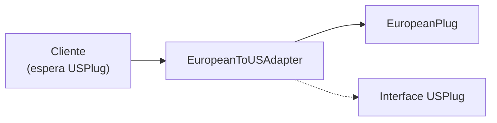

# Padrões de Projeto Criacionais e Estruturais

## Padrão Singleton

Garante que uma classe tenha exatamente uma instância.

```python
class SingletonMeta(type):
    _instances = {}
    def __call__(cls, *args, **kwargs):
        if cls not in cls._instances:
            cls._instances[cls] = super().__call__(*args, **kwargs)
        return cls._instances[cls]

class Database(metaclass=SingletonMeta):
    def __init__(self):
        self.connection = None

    def connect(self, url):
        self.connection = f"Connected to {url}"

# Ambas as variáveis apontam para a mesma instância
db1 = Database()
db2 = Database()
print(db1 is db2)  # True
```

### Singleton Thread-Safe

```python
import threading

class ThreadSafeSingleton:
    _instance = None
    _lock = threading.Lock()

    def __new__(cls, *args, **kwargs):
        if cls._instance is None:
            with cls._lock:
                if cls._instance is None:
                    cls._instance = super().__new__(cls)
        return cls._instance

    def __init__(self):
        pass  # init executa toda vez — use uma flag se necessário
```

[!WARNING]
Tenha cuidado com Singleton em contextos multi-thread. Sempre use um lock para a primeira criação e proteja `__init__` de reinicializações.

## Padrão Factory

Abstrai a criação de objetos por trás de uma interface de fábrica.

```python
from abc import ABC, abstractmethod

class PaymentGateway(ABC):
    @abstractmethod
    def charge(self, amount):
        pass

class StripeGateway(PaymentGateway):
    def charge(self, amount):
        return f"Stripe cobrou ${amount}"

class PayPalGateway(PaymentGateway):
    def charge(self, amount):
        return f"PayPal cobrou ${amount}"

class PaymentFactory:
    GATEWAYS = {
        "stripe": StripeGateway,
        "paypal": PayPalGateway,
    }

    @staticmethod
    def create(gateway_type):
        cls = PaymentFactory.GATEWAYS.get(gateway_type)
        if not cls:
            raise ValueError(f"Gateway desconhecido: {gateway_type}")
        return cls()

gateway = PaymentFactory.create("stripe")
print(gateway.charge(100))
```

## Padrão Builder

Constrói objetos complexos passo a passo.

```python
class QueryBuilder:
    def __init__(self):
        self._select = []
        self._from_ = ""
        self._where = []
        self._order_by = []
        self._limit = None

    def select(self, *columns):
        self._select.extend(columns)
        return self

    def from_(self, table):
        self._from_ = table
        return self

    def where(self, condition):
        self._where.append(condition)
        return self

    def order_by(self, column, direction="ASC"):
        self._order_by.append(f"{column} {direction}")
        return self

    def limit(self, n):
        self._limit = n
        return self

    def build(self):
        parts = ["SELECT"]
        parts.append(", ".join(self._select) if self._select else "*")
        parts.append(f"FROM {self._from_}")
        if self._where:
            parts.append("WHERE " + " AND ".join(self._where))
        if self._order_by:
            parts.append("ORDER BY " + ", ".join(self._order_by))
        if self._limit is not None:
            parts.append(f"LIMIT {self._limit}")
        return " ".join(parts)

query = (QueryBuilder()
         .select("id", "name", "email")
         .from_("users")
         .where("age > 18")
         .where("status = 'active'")
         .order_by("name")
         .limit(10)
         .build())
print(query)
# SELECT id, name, email FROM users WHERE age > 18 AND status = 'active' ORDER BY name ASC LIMIT 10
```

[!SUCCESS]
Builder é ideal para construir objetos com muitos parâmetros opcionais, consultas SQL, requisições HTTP e objetos de configuração.

## Padrão Adapter

Converte uma interface em outra que os clientes esperam.

```python
class USPlug:
    def voltage(self):
        return 120

class EuropeanPlug:
    def voltage(self):
        return 230

class USCharger:
    def charge(self, plug):
        return f"Carregando a {plug.voltage()}V (EUA)"

class EuropeanToUSAdapter:
    def __init__(self, euro_plug):
        self._euro = euro_plug

    def voltage(self):
        return self._euro.voltage()

charger = USCharger()
euro_plug = EuropeanPlug()
adapter = EuropeanToUSAdapter(euro_plug)
print(charger.charge(adapter))  # Funciona!
```



## Padrão Decorator (Estrutural)

Adiciona comportamento a objetos dinamicamente sem herança.

```python
from functools import wraps

class Beverage:
    def cost(self):
        return 5
    def description(self):
        return "Bebida"

class MilkDecorator:
    def __init__(self, beverage):
        self._beverage = beverage

    def cost(self):
        return self._beverage.cost() + 2

    def description(self):
        return self._beverage.description() + ", Leite"

class SugarDecorator:
    def __init__(self, beverage):
        self._beverage = beverage

    def cost(self):
        return self._beverage.cost() + 1

    def description(self):
        return self._beverage.description() + ", Açúcar"

coffee = Beverage()
coffee = MilkDecorator(coffee)
coffee = SugarDecorator(coffee)
print(f"{coffee.description()} = ${coffee.cost()}")
# Bebida, Leite, Açúcar = $8
```

[!NOTE]
O padrão Decorator estrutural difere dos decoradores de função do Python, mas a ideia é a mesma: envolver um objeto/função para adicionar comportamento.

## Padrão Proxy

Controla o acesso a um objeto através de um substituto.

```python
import time
from datetime import datetime

class SensitiveData:
    def read(self):
        return "DADOS CONFIDENCIAIS"

class AccessProxy:
    def __init__(self, target):
        self._target = target
        self._allowed_users = {"admin", "supervisor"}

    def read(self, user):
        if user not in self._allowed_users:
            raise PermissionError(f"{user} não está autorizado")
        return self._target.read()

class LoggingProxy:
    def __init__(self, target):
        self._target = target

    def read(self, *args, **kwargs):
        print(f"[{datetime.now()}] Tentativa de acesso")
        return self._target.read(*args, **kwargs)

data = SensitiveData()
proxy = LoggingProxy(AccessProxy(data))
print(proxy.read("admin"))  # Registra acesso, verifica permissão, retorna dados
```

### Proxy Preguiçoso (Lazy)

```python
class LazyImage:
    def __init__(self, path):
        self.path = path
        self._image = None

    def _load(self):
        if self._image is None:
            print(f"Carregando {self.path} do disco...")
            self._image = f"<imagem:{self.path}>"
        return self._image

    def display(self):
        return self._load()

img = LazyImage("photo.jpg")
# Imagem ainda não carregada
print(img.display())  # Carrega agora
print(img.display())  # Usa versão em cache
```

## Questões de Prática

1. Implemente um `Logger` singleton que escreve em um arquivo. Garanta segurança em threads.
2. Construa uma `ShapeFactory` que cria objetos `Circle`, `Square` e `Triangle`. Adicione uma nova forma sem modificar a fábrica.
3. Implemente um Builder para construir elementos HTML (ex.: `div`, `p`, `a` com atributos e filhos).
4. Crie um adaptador que converte uma resposta JSON moderna de API para uma interface legada baseada em XML.
5. Qual é a diferença entre o Decorator estrutural e os decoradores de função do Python?
6. Implemente um proxy de cache que armazena resultados de uma computação cara e retorna resultados em cache para chamadas repetidas.
7. Quando você escolheria Builder em vez de um construtor com muitos parâmetros?
8. Construa um sistema de notificações usando Factory: `EmailNotifier`, `SMSNotifier`, `PushNotifier`.
9. Implemente um proxy virtual que carrega preguiçosamente o resultado de uma consulta grande ao banco de dados apenas quando acessado.
10. Combine os padrões Decorator e Adapter: envolva um serviço SMS legado com um adaptador e adicione registro via decorator.
