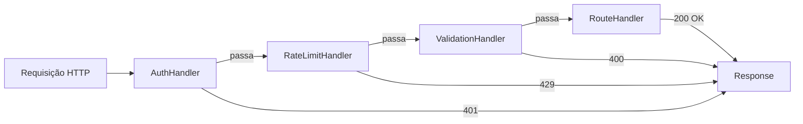

# Padrões de Projeto Comportamentais

## Padrão Observer

Define uma dependência um-para-muitos de modo que quando um objeto muda de estado, todos os dependentes são notificados automaticamente.

```python
from abc import ABC, abstractmethod
from weakref import WeakSet

class Observer(ABC):
    @abstractmethod
    def update(self, event, data):
        pass

class Observable:
    def __init__(self):
        self._observers = WeakSet()

    def subscribe(self, observer):
        self._observers.add(observer)

    def unsubscribe(self, observer):
        self._observers.discard(observer)

    def _notify(self, event, data=None):
        for obs in self._observers:
            obs.update(event, data)

class EmailService(Observer):
    def update(self, event, data):
        if event == "user_registered":
            print(f"Enviando e-mail de boas-vindas para {data['email']}")

class AnalyticsTracker(Observer):
    def update(self, event, data):
        print(f"Rastreando evento: {event} — {data}")

class UserManager(Observable):
    def register(self, email, name):
        user = {"email": email, "name": name}
        print(f"Registrando {name}")
        self._notify("user_registered", user)

users = UserManager()
users.subscribe(EmailService())
users.subscribe(AnalyticsTracker())
users.register("alice@example.com", "Alice")
```

[!SUCCESS]
Observer é a base de arquiteturas orientadas a eventos, sistemas pub/sub e frameworks de programação reativa.

## Padrão Strategy

Define uma família de algoritmos, encapsula cada um e os torna intercambiáveis.

```python
from abc import ABC, abstractmethod
import math

class CompressionStrategy(ABC):
    @abstractmethod
    def compress(self, data):
        pass

class ZipCompression(CompressionStrategy):
    def compress(self, data):
        return f"zip({len(data)} bytes)"

class GzipCompression(CompressionStrategy):
    def compress(self, data):
        return f"gzip({len(data)} bytes)"

class LZ4Compression(CompressionStrategy):
    def compress(self, data):
        return f"lz4({len(data)} bytes)"

class Compressor:
    def __init__(self, strategy: CompressionStrategy):
        self._strategy = strategy

    def set_strategy(self, strategy: CompressionStrategy):
        self._strategy = strategy

    def compress(self, data):
        return self._strategy.compress(data)

data = b"some binary data here"
compressor = Compressor(ZipCompression())
print(compressor.compress(data))
compressor.set_strategy(GzipCompression())
print(compressor.compress(data))
```

### Exemplo Real: Roteamento com Strategy

```python
class RouteStrategy(ABC):
    @abstractmethod
    def calculate(self, origin, dest):
        pass

class RoadRoute(RouteStrategy):
    def calculate(self, origin, dest):
        return f"Rodo viário: {origin} → {dest} (120km, 1,5h)"

class PublicTransitRoute(RouteStrategy):
    def calculate(self, origin, dest):
        return f"Transporte público: {origin} → {dest} (90min, $3,50)"

class WalkingRoute(RouteStrategy):
    def calculate(self, origin, dest):
        return f"Caminhada: {origin} → {dest} (5km, 1h)"

class Navigator:
    def __init__(self, strategy=None):
        self._strategy = strategy

    def get_directions(self, origin, dest):
        return self._strategy.calculate(origin, dest)

nav = Navigator(WalkingRoute())
print(nav.get_directions("Casa", "Parque"))
```

[!NOTE]
Strategy permite o princípio aberto/fechado: adicione novos algoritmos sem modificar o código existente.

## Padrão Command

Encapsula uma requisição como um objeto, permitindo parametrização, filas e desfazer/refazer.

```python
from abc import ABC, abstractmethod
from collections import deque

class Command(ABC):
    @abstractmethod
    def execute(self):
        pass

    @abstractmethod
    def undo(self):
        pass

class TextEditor:
    def __init__(self):
        self.content = ""

    def insert(self, text, pos=None):
        if pos is None:
            pos = len(self.content)
        self.content = self.content[:pos] + text + self.content[pos:]

    def delete(self, start, end):
        self.content = self.content[:start] + self.content[end:]

class InsertCommand(Command):
    def __init__(self, editor, text, pos=None):
        self.editor = editor
        self.text = text
        self.pos = pos or len(editor.content)

    def execute(self):
        self.editor.insert(self.text, self.pos)

    def undo(self):
        end = self.pos + len(self.text)
        self.editor.delete(self.pos, end)

class DeleteCommand(Command):
    def __init__(self, editor, start, end):
        self.editor = editor
        self.start = start
        self.end = end
        self._deleted = ""

    def execute(self):
        self._deleted = self.editor.content[self.start:self.end]
        self.editor.delete(self.start, self.end)

    def undo(self):
        self.editor.insert(self._deleted, self.start)

class CommandHistory:
    def __init__(self):
        self._history = deque(maxlen=100)
        self._future = []

    def execute(self, cmd):
        cmd.execute()
        self._history.append(cmd)
        self._future.clear()

    def undo(self):
        if self._history:
            cmd = self._history.pop()
            cmd.undo()
            self._future.append(cmd)

    def redo(self):
        if self._future:
            cmd = self._future.pop()
            cmd.execute()
            self._history.append(cmd)

editor = TextEditor()
history = CommandHistory()
history.execute(InsertCommand(editor, "Olá"))
history.execute(InsertCommand(editor, " Mundo", 5))
print(editor.content)  # "Olá Mundo"
history.undo()
print(editor.content)  # "Olá"
history.redo()
print(editor.content)  # "Olá Mundo"
```

## Padrão Chain of Responsibility

Passa requisições ao longo de uma cadeia de manipuladores até que um deles a trate.

```python
from abc import ABC, abstractmethod

class Handler(ABC):
    def __init__(self, next_handler=None):
        self._next = next_handler

    def set_next(self, handler):
        self._next = handler
        return handler

    def handle(self, request):
        if self._next:
            return self._next.handle(request)
        return None

class AuthHandler(Handler):
    def handle(self, request):
        if request.get("token") == "valid":
            return super().handle(request)
        return "401 Não Autorizado"

class RateLimitHandler(Handler):
    def handle(self, request):
        if request.get("calls", 0) > 100:
            return "429 Muitas Requisições"
        return super().handle(request)

class ValidationHandler(Handler):
    def handle(self, request):
        if not request.get("body"):
            return "400 Requisição Inválida"
        return super().handle(request)

class RouteHandler(Handler):
    def handle(self, request):
        return f"200 OK: {request.get('path')} processado"

handlers = AuthHandler()
handlers.set_next(RateLimitHandler()) \
         .set_next(ValidationHandler()) \
         .set_next(RouteHandler())

print(handlers.handle({"token": "valid", "path": "/api", "body": "ok", "calls": 5}))
print(handlers.handle({"token": "bad", "path": "/api"}))
```



## Padrão State

Permite que um objeto altere seu comportamento quando seu estado interno muda.

```python
from abc import ABC, abstractmethod

class VendingMachineState(ABC):
    @abstractmethod
    def insert_coin(self, machine):
        pass

    @abstractmethod
    def select_item(self, machine):
        pass

    @abstractmethod
    def dispense(self, machine):
        pass

class NoCoinState(VendingMachineState):
    def insert_coin(self, machine):
        print("Moeda aceita")
        machine.state = HasCoinState()

    def select_item(self, machine):
        raise RuntimeError("Insira uma moeda primeiro")

    def dispense(self, machine):
        raise RuntimeError("Insira uma moeda primeiro")

class HasCoinState(VendingMachineState):
    def insert_coin(self, machine):
        print("Moeda já inserida")

    def select_item(self, machine):
        print("Item selecionado")
        machine.state = DispensingState()

    def dispense(self, machine):
        raise RuntimeError("Selecione um item primeiro")

class DispensingState(VendingMachineState):
    def insert_coin(self, machine):
        raise RuntimeError("Aguarde a transação atual")

    def select_item(self, machine):
        raise RuntimeError("Já está dispensando")

    def dispense(self, machine):
        print("Item dispensado!")
        machine.state = NoCoinState()

class VendingMachine:
    def __init__(self):
        self.state = NoCoinState()

    def insert_coin(self):
        self.state.insert_coin(self)

    def select_item(self):
        self.state.select_item(self)

    def dispense(self):
        self.state.dispense(self)

vm = VendingMachine()
vm.insert_coin()
vm.select_item()
vm.dispense()
```

## Questões de Prática

1. Implemente um padrão Observer para um rastreador de preços de ações que notifica múltiplos painéis quando o preço muda.
2. Construa um sistema de processamento de pagamentos baseado em Strategy que suporte cartão de crédito, PayPal e criptomoeda.
3. Qual é a diferença entre os padrões Command e Strategy? Quando você escolheria um sobre o outro?
4. Implemente uma Chain of Responsibility para um sistema de tickets de suporte ao cliente: FAQ bot → Agente júnior → Agente sênior.
5. Construa uma máquina de estados para um fluxo de documentos: Rascunho → Revisão → Aprovado → Publicado (com transições de rejeição).
6. Como o padrão Observer difere da Chain of Responsibility em termos de entrega de mensagens?
7. Implemente um sistema de desfazer/refazer para uma aplicação de desenho usando o padrão Command.
8. Crie um sistema de logging onde você pode alternar entre `FileLogger`, `ConsoleLogger` e `RemoteLogger` usando Strategy.
9. Projete um sistema de semáforo usando o padrão State (Verde → Amarelo → Vermelho → Verde).
10. Combine Observer e Strategy: construa um dispatcher de notificações que usa diferentes estratégias (e-mail, SMS, push) baseadas nas preferências do assinante.
