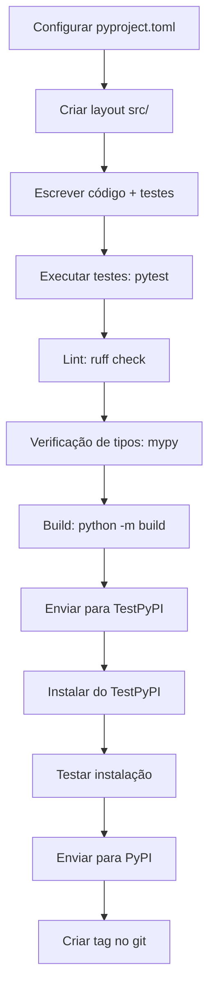

# Distribuição de Pacotes e Publicação no PyPI

## Por que Empacotar Seu Código?

O empacotamento permite instalação via `pip`, declara dependências, fornece pontos de entrada e torna seu código reutilizável entre projetos.

## pyproject.toml (Padrão Moderno)

`pyproject.toml` é o padrão moderno de empacotamento Python (PEP 517/518/621). Ele substitui `setup.py` e `setup.cfg`.

```toml
[build-system]
requires = ["setuptools>=68.0", "wheel"]
build-backend = "setuptools.build_meta"

[project]
name = "my-awesome-lib"
version = "0.1.0"
description = "Uma descrição curta da minha biblioteca"
readme = "README.md"
requires-python = ">=3.10"
license = {text = "MIT"}
keywords = ["python", "exemplo", "tutorial"]

authors = [
    {name = "Seu Nome", email="voce@exemplo.com"},
]

classifiers = [
    "Development Status :: 3 - Alpha",
    "Intended Audience :: Developers",
    "License :: OSI Approved :: MIT License",
    "Programming Language :: Python :: 3",
    "Programming Language :: Python :: 3.10",
    "Programming Language :: Python :: 3.11",
    "Programming Language :: Python :: 3.12",
    "Topic :: Software Development :: Libraries :: Python Modules",
]

dependencies = [
    "requests>=2.28",
    "pydantic>=2.0",
]

[project.optional-dependencies]
dev = [
    "pytest>=7.0",
    "pytest-cov>=4.0",
    "black>=23.0",
    "ruff>=0.1",
    "mypy>=1.0",
]
test = ["pytest>=7.0", "httpx>=0.24"]
docs = ["mkdocs>=1.4", "mkdocstrings"]

[project.urls]
Homepage = "https://github.com/voce/my-awesome-lib"
Documentation = "https://my-awesome-lib.readthedocs.io"
Repository = "https://github.com/voce/my-awesome-lib"
Issues = "https://github.com/voce/my-awesome-lib/issues"

[project.scripts]
my-cli = "my_awesome_lib.cli:main"

[project.gui-scripts]
my-gui = "my_awesome_lib.gui:launch"

[tool.setuptools.packages.find]
where = ["src"]
include = ["my_awesome_lib*"]
exclude = ["tests*", "docs*"]
```

[!NOTE]
A seção `[project.scripts]` cria pontos de entrada de console. Quando os usuários instalarem seu pacote com `pip install`, esses se tornarão comandos executáveis no PATH.

## Estrutura do Projeto

```
my-awesome-lib/
├── pyproject.toml
├── README.md
├── LICENSE
├── CHANGELOG.md
├── src/
│   └── my_awesome_lib/
│       ├── __init__.py
│       ├── cli.py
│       ├── core.py
│       └── utils.py
├── tests/
│   ├── __init__.py
│   ├── test_core.py
│   └── test_cli.py
└── docs/
    ├── index.md
    └── api.md
```

### Usando o Layout `src/`

O layout `src/` previne confusão de importações durante o desenvolvimento e teste.

```python
# src/my_awesome_lib/core.py
def add(a, b):
    """Soma dois números."""
    return a + b

# src/my_awesome_lib/cli.py
def main():
    import argparse
    parser = argparse.ArgumentParser()
    parser.add_argument("numbers", nargs=2, type=float)
    args = parser.parse_args()
    result = add(args.numbers[0], args.numbers[1])
    print(f"Resultado: {result}")

# src/my_awesome_lib/__init__.py
from .core import add
```

## Construindo Wheels

```bash
# Instalar ferramentas de build
pip install build twine

# Construir distribuição fonte e wheel
python -m build

# Verificar o wheel construído
ls dist/
# my_awesome_lib-0.1.0.tar.gz
# my_awesome_lib-0.1.0-py3-none-any.whl
```

[!SUCCESS]
Wheels (`.whl`) são o formato de distribuição preferido. Eles instalam mais rápido que distribuições fonte porque pulam a etapa de build.

## Enviando para o PyPI

```bash
# Enviar para o TestPyPI primeiro
twine upload --repository-url https://test.pypi.org/legacy/ dist/*

# Enviar para o PyPI de produção
twine upload dist/*

# Instalar a partir do TestPyPI
pip install --index-url https://test.pypi.org/simple/ my-awesome-lib
```

### Usando `~/.pypirc`

```ini
[distutils]
index-servers =
    pypi
    testpypi

[pypi]
username = __token__
password = pypi-xxxxx...

[testpypi]
repository = https://test.pypi.org/legacy/
username = __token__
password = pypi-xxxxx...
```

[!WARNING]
Nunca commite seu token ou senha do PyPI. Use variáveis de ambiente (`TWINE_USERNAME`, `TWINE_PASSWORD`) ou `keyring` em CI/CD.

## Versionamento

### Versionamento Semântico (SemVer)

```
MAJOR.MINOR.PATCH

MAJOR: Mudanças de API incompatíveis
MINOR: Novas funcionalidades compatíveis com versões anteriores
PATCH: Correções de bugs compatíveis com versões anteriores
```

```python
# __version__.py — fonte única de verdade
__version__ = "0.1.0"
```

### Versionamento Dinâmico com setuptools-scm

```toml
[build-system]
requires = ["setuptools>=68.0", "wheel", "setuptools-scm>=8.0"]
build-backend = "setuptools.build_meta"

[project]
name = "my-awesome-lib"
dynamic = ["version"]

[tool.setuptools_scm]
version_scheme = "post-release"
```

A versão é derivada de tags git (`git tag v0.1.0`).

## Fluxo de Publicação (CI/CD)

```yaml
# .github/workflows/publish.yml
name: Publicar no PyPI

on:
  release:
    types: [published]

jobs:
  build-and-publish:
    runs-on: ubuntu-latest
    steps:
      - uses: actions/checkout@v4
        with:
          fetch-depth: 0
      - uses: actions/setup-python@v5
        with:
          python-version: "3.12"
      - run: pip install build twine
      - run: python -m build
      - run: twine upload dist/*
        env:
          TWINE_USERNAME: __token__
          TWINE_PASSWORD: ${{ secrets.PYPI_TOKEN }}
```

[!NOTE]
Use Publicação Confiável (OIDC) com PyPI para a configuração de CI/CD mais segura. Não requer tokens armazenados.

## Arquivos Manifest

```ini
# MANIFEST.in — incluir arquivos extras na distribuição fonte
include README.md
include LICENSE
include CHANGELOG.md
recursive-include src/my_awesome_lib/data *
```

## Checklist Completo do Pacote



## Exemplo Real: Publicando uma Ferramenta CLI

```python
# src/mycalc/cli.py
import argparse
from .core import calculate

def main():
    parser = argparse.ArgumentParser(description="Uma calculadora simples")
    parser.add_argument("expression", help="Expressão matemática para avaliar")
    args = parser.parse_args()
    result = calculate(args.expression)
    print(f"= {result}")

if __name__ == "__main__":
    main()
```

```toml
[project.scripts]
mycalc = "mycalc.cli:main"
```

Após `pip install mycalc`:
```bash
mycalc "2 + 2"
# = 4
```

## Questões de Prática

1. O que é o arquivo `pyproject.toml` e por que ele é preferido em relação ao `setup.py`?
2. Crie um `pyproject.toml` para um pacote chamado `textutils` com dependências em `click` e `pyyaml`.
3. Qual é a diferença entre uma distribuição fonte (`.tar.gz`) e um wheel (`.whl`)? Quando usar cada um?
4. Escreva um fluxo de trabalho do GitHub Actions que publica um pacote no PyPI quando um release é criado.
5. Como o `setuptools-scm` deriva a versão do pacote a partir do git? Quais são os benefícios?
6. O que é o layout `src/` e por que ele é recomendado para pacotes Python?
7. Construa uma ferramenta CLI simples com pontos de entrada em `pyproject.toml` e publique-a no TestPyPI.
8. Como lidar com dependências opcionais em `pyproject.toml`? Dê um exemplo com extras `dev` e `test`.
9. O que é Publicação Confiável (OIDC) no PyPI e como ela melhora a segurança?
10. Crie uma estrutura de projeto completa para um pacote chamado `csvproc` que processa arquivos CSV com testes, documentação e empacotamento adequados.
