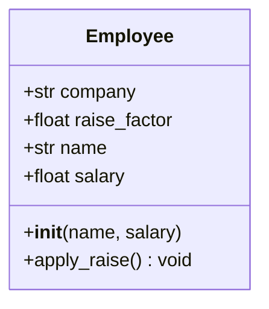

# Classes and Objects

Object-oriented programming (OOP) is a paradigm that organizes code around objects — bundles of data and behavior. Python supports OOP with a clean, intuitive syntax.

## Defining a Class

A class is a blueprint for creating objects:

```python
class Dog:
    def __init__(self, name: str, age: int):
        self.name = name
        self.age = age

    def bark(self) -> str:
        return f"{self.name} says woof!"

    def get_human_years(self) -> int:
        return self.age * 7
```

```python
my_dog = Dog("Rex", 3)
print(my_dog.bark())           # Rex says woof!
print(my_dog.get_human_years())  # 21
```

> [!NOTE]
> Unlike Java or C++, Python does not require explicit `new` to instantiate — you simply call the class as if it were a function.

## The `self` Parameter

`self` refers to the current instance. It must be the first parameter of every instance method — but you don't pass it; Python does automatically.

```python
class Counter:
    def __init__(self):
        self.count = 0

    def increment(self, amount: int = 1):
        self.count += amount

    def reset(self):
        self.count = 0

c = Counter()
c.increment(5)
print(c.count)  # 5
```

> [!WARNING]
> `self` is just a convention — you could name it `this` or anything else — but **always use `self`** to follow Python community standards.

## Instance vs Class Attributes

| Attribute Type | Defined | Access | Shared Across Instances |
|---------------|---------|--------|------------------------|
| Instance | Inside `__init__` via `self` | `obj.attr` | No |
| Class | Directly in class body | `ClassName.attr` or `obj.attr` | Yes |

```python
class Employee:
    company = "Acme Corp"       # Class attribute
    raise_factor = 1.05         # Class attribute

    def __init__(self, name: str, salary: float):
        self.name = name        # Instance attribute
        self.salary = salary    # Instance attribute

e1 = Employee("Alice", 70000)
e2 = Employee("Bob", 80000)

print(e1.company)  # Acme Corp (from class)
e1.raise_factor = 1.10  # Shadows class attr for this instance only
print(e1.raise_factor)  # 1.10
print(e2.raise_factor)  # 1.05 (unchanged)
```



## `__str__` vs `__repr__`

These dunder (double-underscore) methods control how objects are displayed:

| Method | Goal | Used By | Should Return |
|--------|------|---------|---------------|
| `__str__` | Readable for humans | `print()`, `str()` | Informal, friendly string |
| `__repr__` | Unambiguous for devs | REPL, `repr()`, debugging | String that could recreate object |

```python
class Point:
    def __init__(self, x: float, y: float):
        self.x = x
        self.y = y

    def __repr__(self) -> str:
        return f"Point({self.x!r}, {self.y!r})"

    def __str__(self) -> str:
        return f"({self.x}, {self.y})"

p = Point(3.5, 7.2)
print(repr(p))   # Point(3.5, 7.2)
print(str(p))    # (3.5, 7.2)
print(p)         # (3.5, 7.2)  — calls __str__
```

> [!SUCCESS]
> Always implement `__repr__` on your classes — it makes debugging dramatically easier. Implement `__str__` when you want a pretty display.

## Property Decorators

Use `@property` to define computed attributes with getter/setter control:

```python
class Circle:
    def __init__(self, radius: float):
        self._radius = radius

    @property
    def radius(self) -> float:
        return self._radius

    @radius.setter
    def radius(self, value: float):
        if value <= 0:
            raise ValueError("Radius must be positive")
        self._radius = value

    @property
    def area(self) -> float:
        import math
        return math.pi * self._radius ** 2

    @property
    def circumference(self) -> float:
        import math
        return 2 * math.pi * self._radius

c = Circle(5)
print(c.area)           # 78.5398...
c.radius = 10
print(c.circumference)  # 62.8318...
# c.radius = -5  # Raises ValueError
```

## Common Dunder Methods

```python
class BankAccount:
    def __init__(self, owner: str, balance: float = 0.0):
        self.owner = owner
        self.balance = balance

    def __repr__(self) -> str:
        return f"BankAccount({self.owner!r}, {self.balance!r})"

    def __str__(self) -> str:
        return f"{self.owner}'s account: ${self.balance:.2f}"

    def __add__(self, other: "BankAccount") -> float:
        """Combine balances (e.g., joint account)."""
        return self.balance + other.balance

    def __len__(self) -> int:
        """Number of whole dollars."""
        return int(self.balance)

    def __bool__(self) -> bool:
        """An account is truthy if it has money."""
        return self.balance > 0

    def __eq__(self, other: object) -> bool:
        if not isinstance(other, BankAccount):
            return NotImplemented
        return self.owner == other.owner and self.balance == other.balance

a1 = BankAccount("Alice", 1500.50)
a2 = BankAccount("Bob", 300)
print(a1)            # Alice's account: $1500.50
print(a1 + a2)       # 1800.5
print(len(a1))       # 1500
print(bool(a1))      # True
print(a1 == BankAccount("Alice", 1500.50))  # True
```

## Private Attributes and Name Mangling

Python has no true private attributes. Convention uses underscores:

| Convention | Meaning |
|-----------|---------|
| `name` | Public attribute |
| `_name` | "Protected" — internal use (convention only) |
| `__name` | "Private" — triggers name mangling to `_ClassName__name` |
| `__name__` | Dunder — Python special methods, don't invent your own |

```python
class Person:
    def __init__(self, name: str):
        self.name = name          # Public
        self._age = 0             # "Protected"
        self.__ssn = "123-45-6789"  # Name-mangled

    def get_ssn(self) -> str:
        return self.__ssn[-4:]    # Internal access works

p = Person("Alice")
print(p.name)        # Alice
print(p._age)        # 0 (works, but frowned upon)
# print(p.__ssn)     # AttributeError!
print(p._Person__ssn)  # "123-45-6789" (mangled name)
```

> [!WARNING]
> Name mangling is for preventing accidental access in subclasses, not security. Python trusts its users.

## Real-World Example: Data Record

```python
from datetime import datetime
from typing import Optional

class Transaction:
    def __init__(self, amount: float, description: str,
                 timestamp: Optional[datetime] = None):
        self.amount = amount
        self.description = description
        self.timestamp = timestamp or datetime.now()
        self.id = id(self)

    def __repr__(self) -> str:
        return (f"Transaction({self.amount!r}, {self.description!r}, "
                f"timestamp={self.timestamp!r})")

    def __str__(self) -> str:
        return f"[{self.timestamp:%Y-%m-%d %H:%M}] {self.description}: ${self.amount:+.2f}"

class Account:
    def __init__(self, account_holder: str):
        self.holder = account_holder
        self.transactions: list[Transaction] = []

    def deposit(self, amount: float, description: str = "Deposit"):
        if amount <= 0:
            raise ValueError("Deposit amount must be positive")
        self.transactions.append(Transaction(amount, description))

    def withdraw(self, amount: float, description: str = "Withdrawal"):
        if amount <= 0:
            raise ValueError("Withdrawal amount must be positive")
        if self.balance < amount:
            raise ValueError("Insufficient funds")
        self.transactions.append(Transaction(-amount, description))

    @property
    def balance(self) -> float:
        return sum(t.amount for t in self.transactions)

    def __repr__(self) -> str:
        return f"Account({self.holder!r})"

    def __str__(self) -> str:
        return f"{self.holder}'s Account — Balance: ${self.balance:.2f}"

    def __len__(self) -> int:
        return len(self.transactions)

acc = Account("Alice")
acc.deposit(1000, "Salary")
acc.withdraw(200, "Rent")
acc.deposit(500, "Freelance")
print(acc)
for t in acc.transactions:
    print(f"  {t}")
print(f"Total transactions: {len(acc)}")
```

## When to Use Classes vs Plain Functions

| Use Classes When | Use Functions When |
|-----------------|-------------------|
| You need to maintain state | Processing stateless data |
| You have multiple methods sharing data | Single operation needed |
| You want to enforce invariants (via properties) | Simple transformations only |
| You need multiple instances with same behavior | One-off operations |

> [!SUCCESS]
> OOP is a tool, not a rule. Python supports multiple paradigms — choose the right one for each problem.

## Practice Questions

1. What is `self` in a class method and why is it required?
2. What is the difference between `__str__` and `__repr__`? Which one does `print()` call?
3. Create a `Book` class with `title`, `author`, and `year` attributes. Add `__str__` and `__repr__` methods.
4. What is the purpose of `@property` in Python classes? Provide an example.
5. How do class attributes differ from instance attributes? What happens when you modify a class attribute through an instance?
6. What does Python do when you prefix an attribute with double underscores (`__secret`)?
7. Write a `Temperature` class that stores Celsius internally and exposes Fahrenheit and Kelvin as properties.
8. What does `__bool__` control, and what default truthiness does a custom object have?
9. Create a `ShoppingCart` class that supports `__len__`, `__add__` (merging carts), and a `total` property.
10. Why might you choose a class with properties over a simple dictionary?
