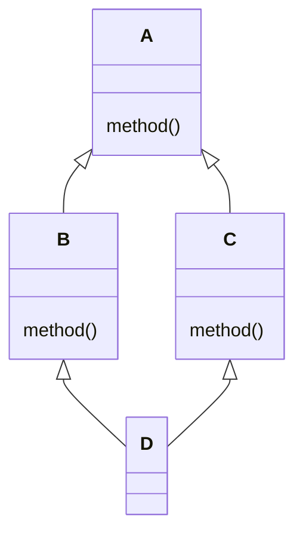
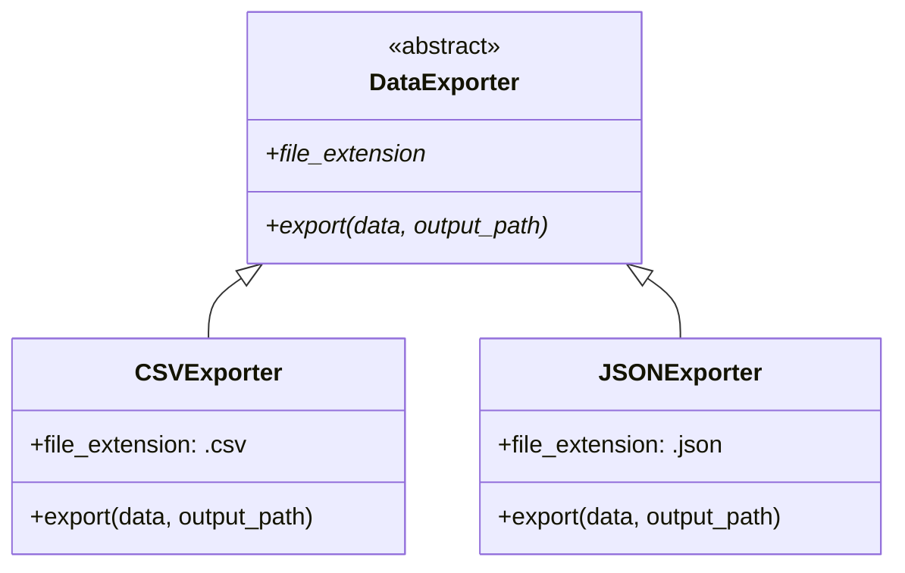

# Inheritance and Polymorphism

Inheritance lets you create class hierarchies where child classes reuse and extend parent behavior. Polymorphism allows objects of different types to be treated uniformly through a common interface.

## Basic Inheritance

```python
class Animal:
    def __init__(self, name: str):
        self.name = name

    def speak(self) -> str:
        return f"{self.name} makes a sound."

    def move(self) -> str:
        return f"{self.name} moves."

class Dog(Animal):
    def speak(self) -> str:
        return f"{self.name} barks!"

class Cat(Animal):
    def speak(self) -> str:
        return f"{self.name} meows!"

dog = Dog("Rex")
cat = Cat("Luna")
print(dog.speak())  # Rex barks!
print(cat.speak())  # Luna meows!
print(dog.move())   # Rex moves. (inherited)
```

> [!NOTE]
> Python supports single and multiple inheritance. All classes implicitly inherit from `object`.

## Method Overriding

Child classes can override any method from the parent:

```python
class Vehicle:
    def __init__(self, brand: str, model: str):
        self.brand = brand
        self.model = model

    def description(self) -> str:
        return f"{self.brand} {self.model}"

    def fuel_type(self) -> str:
        return "Unknown fuel type"

class Car(Vehicle):
    def fuel_type(self) -> str:
        return "Gasoline or Diesel"

class ElectricCar(Vehicle):
    def __init__(self, brand: str, model: str, battery_capacity: float):
        super().__init__(brand, model)
        self.battery_capacity = battery_capacity

    def fuel_type(self) -> str:
        return "Electricity"

    def description(self) -> str:
        return f"{super().description()} ({self.battery_capacity} kWh)"

tesla = ElectricCar("Tesla", "Model 3", 75)
print(tesla.description())  # Tesla Model 3 (75 kWh)
print(tesla.fuel_type())    # Electricity
```

## Using `super()`

`super()` delegates to the parent class. It is essential when extending parent behavior:

```python
class Logger:
    def __init__(self, name: str):
        self.name = name
        self.logs = []

    def log(self, message: str):
        self.logs.append(f"[{self.name}] {message}")

class TimestampLogger(Logger):
    def __init__(self, name: str, timezone: str = "UTC"):
        super().__init__(name)   # Initialize parent
        self.timezone = timezone

    def log(self, message: str):
        from datetime import datetime
        timestamp = datetime.now().isoformat()
        super().log(f"{timestamp} | {message}")  # Call parent method

    def __repr__(self) -> str:
        return f"TimestampLogger({self.name!r}, timezone={self.timezone!r})"

logger = TimestampLogger("App")
logger.log("User logged in")
logger.log("File saved")
print(logger.logs)
# ['[App] 2025-01-15T10:30:00 | User logged in', ...]
```

> [!WARNING]
> Never forget to call `super().__init__()` in child classes — otherwise parent attributes won't be initialized.

## MRO (Method Resolution Order)

Python determines which method to call using the C3 linearization algorithm:

```python
class A:
    def method(self):
        return "A"

class B(A):
    def method(self):
        return "B"

class C(A):
    def method(self):
        return "C"

class D(B, C):
    pass

d = D()
print(d.method())  # B (follows MRO)
print(D.__mro__)
# (<class 'D'>, <class 'B'>, <class 'C'>, <class 'A'>, <class 'object'>)
```



> [!NOTE]
> `D.__mro__` shows the resolution order: `D → B → C → A → object`. Python searches left-to-right, depth-first.

## Abstract Base Classes (ABC)

ABCs define interfaces that child classes must implement:

```python
from abc import ABC, abstractmethod

class Shape(ABC):
    @abstractmethod
    def area(self) -> float:
        pass

    @abstractmethod
    def perimeter(self) -> float:
        pass

    def describe(self) -> str:
        return f"Area: {self.area():.2f}, Perimeter: {self.perimeter():.2f}"

class Rectangle(Shape):
    def __init__(self, width: float, height: float):
        self.width = width
        self.height = height

    def area(self) -> float:
        return self.width * self.height

    def perimeter(self) -> float:
        return 2 * (self.width + self.height)

class Circle(Shape):
    def __init__(self, radius: float):
        self.radius = radius

    def area(self) -> float:
        import math
        return math.pi * self.radius ** 2

    def perimeter(self) -> float:
        import math
        return 2 * math.pi * self.radius

# shape = Shape()  # TypeError! Can't instantiate ABC
rect = Rectangle(5, 3)
print(rect.describe())  # Area: 15.00, Perimeter: 16.00
```

> [!WARNING]
> Abstract classes cannot be instantiated directly. All abstract methods must be implemented in concrete subclasses.

### Abstract Properties and Static Methods

```python
from abc import ABC, abstractmethod

class ConfigParser(ABC):
    @property
    @abstractmethod
    def format_name(self) -> str:
        pass

    @abstractmethod
    def parse(self, content: str) -> dict:
        pass

    @staticmethod
    @abstractmethod
    def supports_extension(ext: str) -> bool:
        pass

class JSONParser(ConfigParser):
    @property
    def format_name(self) -> str:
        return "JSON"

    def parse(self, content: str) -> dict:
        import json
        return json.loads(content)

    @staticmethod
    def supports_extension(ext: str) -> bool:
        return ext in (".json", ".jsonc")
```

## Duck Typing

"If it walks like a duck and quacks like a duck, it's a duck." Python focuses on behavior, not type:

```python
class Duck:
    def quack(self):
        return "Quack!"

    def walk(self):
        return "Waddles"

class Person:
    def quack(self):
        return "Imitates a duck"

    def walk(self):
        return "Walks on two legs"

def make_it_quack(thing):
    print(thing.quack())
    print(thing.walk())

make_it_quack(Duck())
make_it_quack(Person())  # Same function, different types — polymorphism!
```

### Using `isinstance()` and `hasattr()` with Protocols

```python
from typing import Protocol

class Quackable(Protocol):
    def quack(self) -> str:
        ...

def process_quackable(obj: Quackable):
    if hasattr(obj, "quack"):
        print(obj.quack())
    else:
        print("Not quackable")

class Robot:
    def quack(self) -> str:
        return "Beep boop quack"

process_quackable(Robot())  # Beep boop quack
```

## Real-World: Plugin System with ABC

```python
from abc import ABC, abstractmethod
import os
import importlib.util

class DataExporter(ABC):
    @abstractmethod
    def export(self, data: list[dict], output_path: str) -> None:
        pass

    @property
    @abstractmethod
    def file_extension(self) -> str:
        pass

class CSVExporter(DataExporter):
    @property
    def file_extension(self) -> str:
        return ".csv"

    def export(self, data: list[dict], output_path: str) -> None:
        import csv
        if not data:
            raise ValueError("No data to export")
        with open(output_path, "w", newline="") as f:
            writer = csv.DictWriter(f, fieldnames=data[0].keys())
            writer.writeheader()
            writer.writerows(data)

class JSONExporter(DataExporter):
    @property
    def file_extension(self) -> str:
        return ".json"

    def export(self, data: list[dict], output_path: str) -> None:
        import json
        with open(output_path, "w") as f:
            json.dump(data, f, indent=2)

def export_data(data: list[dict], output_path: str, fmt: str):
    exporters = {".csv": CSVExporter, ".json": JSONExporter}
    ext = fmt if fmt.startswith(".") else f".{fmt}"
    cls = exporters.get(ext)
    if cls is None:
        raise ValueError(f"Unsupported format: {fmt}")
    exporter = cls()
    exporter.export(data, output_path)

records = [
    {"name": "Alice", "score": 95},
    {"name": "Bob", "score": 87},
]
export_data(records, "output.csv", "csv")
export_data(records, "output.json", "json")
```



## Multiple Inheritance

```python
class Flyer:
    def fly(self):
        return "Flying through the air"

    def speed(self) -> str:
        return "Fast"

class Swimmer:
    def swim(self):
        return "Swimming through water"

    def speed(self) -> str:
        return "Moderate"

class Duck(Flyer, Swimmer):
    def speed(self) -> str:
        return f"{Flyer.speed(self)} in air, {Swimmer.speed(self)} in water"

duck = Duck()
print(duck.fly())   # Flying through the air
print(duck.swim())  # Swimming through water
print(duck.speed()) # Fast in air, Moderate in water
```

> [!WARNING]
| Pitfall | Solution |
|---------|----------|
| Diamond problem (same method on multiple paths) | MRO handles this; use `super()` carefully |
| Unclear initialization order | Each `__init__` should call `super().__init__()` |
| Tight coupling | Prefer composition over inheritance |

## Composition Over Inheritance

```python
class Engine:
    def start(self):
        return "Engine started"

    def stop(self):
        return "Engine stopped"

class Wheels:
    def rotate(self):
        return "Wheels rotating"

class Car:
    def __init__(self):
        self.engine = Engine()
        self.wheels = Wheels()

    def drive(self):
        return f"{self.engine.start()} — {self.wheels.rotate()}"

    def park(self):
        return self.engine.stop()

car = Car()
print(car.drive())  # Engine started — Wheels rotating
```

> [!SUCCESS]
> Favor composition over inheritance: "has-a" relationships are more flexible than "is-a" ones.

## Practice Questions

1. What does `super()` return, and why is it important in `__init__`?
2. Create an abstract `PaymentGateway` class with `process_payment` and `refund` methods. Implement `PayPalGateway` and `StripeGateway`.
3. What is the MRO and how can you inspect it for a given class?
4. Explain duck typing in Python with an example that does not involve inheritance.
5. What happens if you try to instantiate an abstract class that has unimplemented abstract methods?
6. Create a class hierarchy: `Employee` → `Manager` → `Executive`. Each should override `get_bonus()`.
7. What is the difference between `isinstance(obj, cls)` and `issubclass(sub, cls)`? When would you use each?
8. How does Python resolve method calls in multiple inheritance? What does the C3 linearization guarantee?
9. Create a `LoggableMixin` class that adds logging to any class, then use it with multiple inheritance.
10. Why is composition often preferred over inheritance? Give a concrete example where composition is better.
