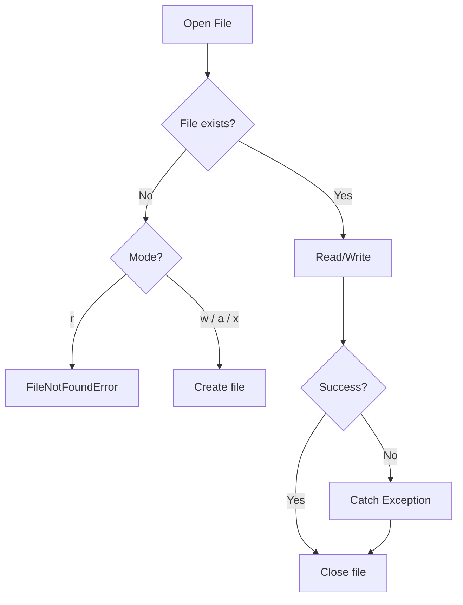

# File Handling and I/O

File I/O is fundamental to nearly every Python application — from reading configuration files to processing large datasets. Python's file handling is clean, powerful, and supports multiple formats.

## The `open()` Function

```python
file = open("example.txt", "r")    # Read (default)
file = open("example.txt", "w")    # Write (overwrites!)
file = open("example.txt", "a")    # Append
file = open("example.txt", "r+")   # Read and write
file = open("example.txt", "x")    # Exclusive creation (fails if exists)
```

| Mode | Read | Write | Create | Truncate | Position |
|------|------|-------|--------|----------|----------|
| `"r"` | Yes | No | No | No | Start |
| `"w"` | No | Yes | Yes | Yes | Start |
| `"a"` | No | Yes | Yes | No | End |
| `"r+"` | Yes | Yes | No | No | Start |
| `"w+"` | Yes | Yes | Yes | Yes | Start |
| `"a+"` | Yes | Yes | Yes | No | End |
| `"x"` | No | Yes | Yes (exclusive) | No | Start |
| `"b"` | (modifier) | Binary mode | — | — | — |

> [!WARNING]
> Always close files! The `with` statement handles this automatically (see below).

## The `with` Statement (Context Manager)

The `with` statement ensures the file is properly closed, even if an exception occurs:

```python
# BAD — manual close (error-prone)
f = open("data.txt", "r")
try:
    content = f.read()
finally:
    f.close()

# GOOD — with statement (automatic close)
with open("data.txt", "r") as f:
    content = f.read()
# File is closed here, even if an error occurred
```

## Reading Text Files

```python
# Read entire file as string
with open("data.txt", "r") as f:
    content = f.read()

# Read line by line (memory efficient for large files)
with open("data.txt", "r") as f:
    for line in f:
        print(line.rstrip())  # rstrip removes trailing newline

# Read all lines into a list
with open("data.txt", "r") as f:
    lines = f.readlines()

# Read one line at a time
with open("data.txt", "r") as f:
    first_line = f.readline()
    second_line = f.readline()
```

> [!NOTE]
> For large files, iterate over the file object directly (`for line in f:`) instead of calling `read()` or `readlines()`. This reads lazily and won't load the entire file into memory.

## Writing Text Files

```python
with open("output.txt", "w") as f:
    f.write("Hello, World!\n")
    f.write("This is line 2.\n")

# Write multiple lines from a list
lines = ["Line 1", "Line 2", "Line 3"]
with open("output.txt", "w") as f:
    f.writelines(line + "\n" for line in lines)
```

### Appending

```python
with open("log.txt", "a") as f:
    f.write("New log entry\n")
```

## File Encoding

Always specify encoding for text files:

```python
with open("data.txt", "r", encoding="utf-8") as f:
    content = f.read()

with open("output.txt", "w", encoding="utf-8") as f:
    f.write("Unicode: ñ, é, 你好, こんにちは\n")
```

> [!WARNING]
> On Windows, the default encoding is `cp1252`, not `utf-8`. Always pass `encoding="utf-8"` explicitly for cross-platform portability.

## CSV Files

Python's `csv` module handles comma-separated values:

```python
import csv

# Reading CSV
with open("employees.csv", "r", newline="", encoding="utf-8") as f:
    reader = csv.reader(f)
    header = next(reader)  # Skip header
    for row in reader:
        name, department, salary = row
        print(f"{name} works in {department}")

# Reading as dictionaries
with open("employees.csv", "r", newline="", encoding="utf-8") as f:
    reader = csv.DictReader(f)
    for row in reader:
        print(f"{row['name']} earns ${row['salary']}")
```

```python
import csv

# Writing CSV
with open("output.csv", "w", newline="", encoding="utf-8") as f:
    writer = csv.writer(f)
    writer.writerow(["Name", "Department", "Salary"])
    writer.writerow(["Alice", "Engineering", 95000])
    writer.writerow(["Bob", "Marketing", 72000])
    writer.writerows([
        ["Charlie", "Sales", 85000],
        ["Diana", "Engineering", 98000],
    ])

# Writing as dictionaries
with open("output.csv", "w", newline="", encoding="utf-8") as f:
    fieldnames = ["Name", "Department", "Salary"]
    writer = csv.DictWriter(f, fieldnames=fieldnames)
    writer.writeheader()
    writer.writerow({"Name": "Alice", "Department": "Engineering", "Salary": 95000})
```

> [!NOTE]
| Construct | When to Use |
|-----------|-------------|
| `csv.reader` / `csv.writer` | Simple lists, no headers |
| `csv.DictReader` / `csv.DictWriter` | Named columns, headers present |

### CSV Dialects and Custom Delimiters

```python
import csv

# Tab-separated values (TSV)
with open("data.tsv", "r", newline="") as f:
    reader = csv.reader(f, delimiter="\t")
    for row in reader:
        print(row)

# Custom delimiter with quoting
with open("data.csv", "w", newline="") as f:
    writer = csv.writer(f, delimiter=";", quotechar='"',
                        quoting=csv.QUOTE_ALL)
    writer.writerow(["Hello, World", 100, "A;B;C"])
```

## Binary File Handling

```python
# Read binary file
with open("image.png", "rb") as f:
    data = f.read()
    print(f"Read {len(data)} bytes")

# Write binary file
with open("copy.png", "wb") as f:
    f.write(data)

# Copy in chunks (memory efficient)
BUFFER_SIZE = 8192
with open("large_file.bin", "rb") as src, open("copy.bin", "wb") as dst:
    while chunk := src.read(BUFFER_SIZE):
        dst.write(chunk)
```

> [!SUCCESS]
> The walrus operator (`:=`) combined with `while` creates an elegant chunk-by-chunk copy pattern. Each chunk is at most `BUFFER_SIZE` bytes.

## Real-World: Data Processing Pipeline

```python
import csv
import json
from pathlib import Path

def process_sales_data(input_path: str, output_path: str) -> dict:
    summary = {"total_revenue": 0, "total_orders": 0, "products_sold": 0}

    with open(input_path, "r", newline="", encoding="utf-8") as infile:
        reader = csv.DictReader(infile)
        for row in reader:
            try:
                quantity = int(row["quantity"])
                price = float(row["price"])
                summary["total_revenue"] += quantity * price
                summary["total_orders"] += 1
                summary["products_sold"] += quantity
            except (ValueError, KeyError) as e:
                print(f"Skipping bad row: {e}")

    with open(output_path, "w", encoding="utf-8") as outfile:
        json.dump(summary, outfile, indent=2)

    return summary

result = process_sales_data("sales.csv", "summary.json")
print(result)
```

## File and Path Utilities with `pathlib`

```python
from pathlib import Path

p = Path("data/reports/summary.csv")

# Path components
print(p.name)         # summary.csv
print(p.stem)         # summary
print(p.suffix)       # .csv
print(p.parent)       # data/reports
print(p.parents[0])   # data/reports
print(p.parents[1])   # data

# Check and create
if p.exists():
    print(f"Size: {p.stat().st_size} bytes")
    print(f"Modified: {p.stat().st_mtime}")

p.parent.mkdir(parents=True, exist_ok=True)

# Globbing
data_dir = Path("data")
for csv_file in data_dir.glob("*.csv"):
    print(f"Found: {csv_file}")

# Read/write convenience
content = p.read_text(encoding="utf-8")
Path("output.txt").write_text("Hello", encoding="utf-8")
```

## Working with Temporary Files

```python
from tempfile import NamedTemporaryFile, TemporaryDirectory
import os

# Temporary file (auto-deleted on close)
with NamedTemporaryFile(mode="w", suffix=".txt", delete=False) as f:
    f.write("Temporary content")
    temp_path = f.name

print(f"Temp file at: {temp_path}")
os.unlink(temp_path)  # Manual cleanup if delete=False

# Temporary directory (auto-deleted)
with TemporaryDirectory() as tmpdir:
    work_file = Path(tmpdir) / "data.txt"
    work_file.write_text("Processing in isolation")
    # Process file...
# tmpdir and all contents are deleted here
```

> [!WARNING]
> Binary mode (`"rb"` / `"wb"`) is required for non-text files (images, audio, archives). Text mode may corrupt binary data by interpreting UTF characters and translating line endings.

## Error Handling in File Operations

```python
import os

def safe_read_file(path: str, default: str = "") -> str:
    try:
        with open(path, "r", encoding="utf-8") as f:
            return f.read()
    except FileNotFoundError:
        print(f"File {path} not found. Using default.")
        return default
    except PermissionError:
        print(f"Permission denied: {path}")
        return default
    except OSError as e:
        print(f"OS error reading {path}: {e}")
        return default

def safe_write_file(path: str, content: str) -> bool:
    try:
        os.makedirs(os.path.dirname(path) or ".", exist_ok=True)
        with open(path, "w", encoding="utf-8") as f:
            f.write(content)
        return True
    except OSError as e:
        print(f"Failed to write {path}: {e}")
        return False
```



> [!SUCCESS]
> The `with` statement is the safest, cleanest way to handle files in Python. It guarantees proper cleanup, works with custom context managers, and significantly reduces boilerplate.

## Practice Questions

1. What does the `with` statement guarantee when used with `open()`?
2. What is the difference between `"w"` and `"a"` file modes?
3. Write code that reads a CSV file and prints rows where the value in the "age" column is > 30.
4. Why should you specify `encoding="utf-8"` when opening text files?
5. How do you read a very large text file without running out of memory?
6. What does `newline=""` do in `open("file.csv", newline="")` and why is it important for CSV files?
7. Write a function that copies a binary file in chunks of 4096 bytes.
8. What is the difference between `csv.reader` and `csv.DictReader`?
9. Using `pathlib.Path`, write code to find all `.log` files in a directory tree and print their sizes.
10. What happens if you open a file in `"x"` mode and the file already exists?
