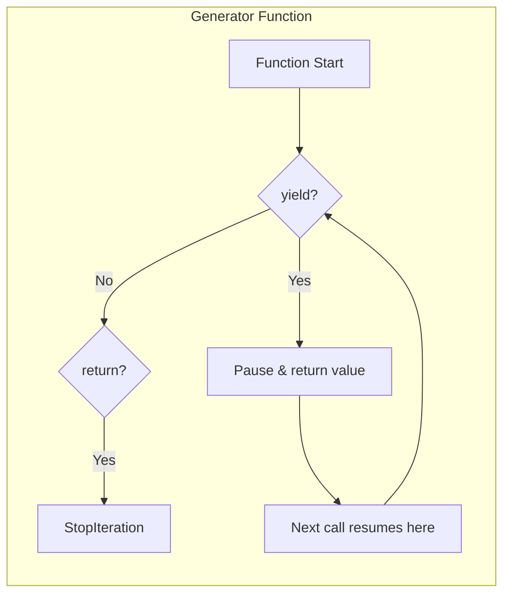

# Comprehensions and Generators

Comprehensions provide a concise syntax for creating collections. Generators enable lazy evaluation, processing data one item at a time instead of loading everything into memory.

## List Comprehensions

Basic syntax: `[expression for item in iterable if condition]`

```python
# Traditional approach
squares = []
for x in range(10):
    squares.append(x ** 2)

# List comprehension
squares = [x ** 2 for x in range(10)]

# With condition
evens = [x for x in range(20) if x % 2 == 0]

# Nested loops
pairs = [(x, y) for x in range(3) for y in range(3)]

# Transformation
words = ["hello", "world", "python"]
upper_words = [w.upper() for w in words]
```

> [!NOTE]
| Equivalent `for` Loop | List Comprehension |
|----------------------|-------------------|
| 5 lines | 1 line |
| Mutable accumulator | Functional expression |
| Slower (`.append` overhead) | Faster (optimized C backend) |

```python
# Complex transformations
values = [1, -2, 3, -4, 5, -6]
processed = [x * 2 if x > 0 else abs(x) * 10 for x in values]
print(processed)  # [2, 20, 6, 40, 10, 60]

# Flatten a matrix
matrix = [[1, 2, 3], [4, 5, 6], [7, 8, 9]]
flat = [num for row in matrix for num in row]
print(flat)  # [1, 2, 3, 4, 5, 6, 7, 8, 9]

# Cartesian product
colors = ["red", "blue"]
sizes = ["S", "M", "L"]
inventory = [(c, s) for c in colors for s in sizes]
print(inventory)
```

## Dict Comprehensions

```python
# Squares dict: {0: 0, 1: 1, 2: 4, 3: 9, ...}
squares = {x: x ** 2 for x in range(10)}

# Filtering and transforming
words = ["apple", "banana", "cherry", "date"]
word_lengths = {w: len(w) for w in words if len(w) > 4}
print(word_lengths)  # {"apple": 5, "banana": 6, "cherry": 6}

# Swapping keys and values
original = {"a": 1, "b": 2, "c": 3}
swapped = {v: k for k, v in original.items()}
print(swapped)  # {1: "a", 2: "b", 3: "c"}

# Enumerate pattern
indexed = {i: char for i, char in enumerate("hello")}
print(indexed)  # {0: "h", 1: "e", 2: "l", 3: "l", 4: "o"}
```

## Set Comprehensions

```python
# Unique even squares
even_squares = {x ** 2 for x in range(20) if x % 2 == 0}
print(even_squares)  # {0, 4, 16, 36, 64, 100, 144, 196, 256, 324}

# Find unique characters
text = "hello world"
unique_chars = {c for c in text if c != " "}
print(unique_chars)  # {"h", "e", "l", "o", "w", "r", "d"}
```

> [!SUCCESS]
| Comprehension Type | Syntax | Output Type |
|-------------------|--------|-------------|
| List | `[expr for x in iter]` | `list` |
| Dict | `{k: v for x in iter}` | `dict` |
| Set | `{expr for x in iter}` | `set` |
| Generator | `(expr for x in iter)` | `generator` |

## Generator Functions with `yield`

Generator functions produce values lazily using `yield`:

```python
def count_up_to(n: int):
    i = 0
    while i < n:
        yield i
        i += 1

# Generators are lazy — nothing is computed yet
counter = count_up_to(5)

# Values produced on demand
print(next(counter))  # 0
print(next(counter))  # 1
print(list(counter))  # [2, 3, 4] (remaining)

# Or iterate directly
for num in count_up_to(3):
    print(num)  # 0, 1, 2
```



### Infinite Generators

```python
def fibonacci():
    a, b = 0, 1
    while True:
        yield a
        a, b = b, a + b

fib = fibonacci()
print([next(fib) for _ in range(10)])  # [0, 1, 1, 2, 3, 5, 8, 13, 21, 34]

def counter(start: int = 0, step: int = 1):
    while True:
        yield start
        start += step

c = counter(10, 5)
print([next(c) for _ in range(4)])  # [10, 15, 20, 25]
```

## Generator Expressions

Similar to list comprehensions but with parentheses — lazy and memory-efficient:

```python
# List comprehension — creates entire list in memory
squares_list = [x ** 2 for x in range(1000000)]

# Generator expression — lazy, one item at a time
squares_gen = (x ** 2 for x in range(1000000))

# Sum of first million squares (no large list needed)
total = sum(x ** 2 for x in range(1000000))
```

> [!WARNING]
> Generator expressions are single-use. Once exhausted, they cannot be re-iterated. Wrap in `list()` if you need multiple passes.

```python
gen = (x * 2 for x in range(5))
print(list(gen))  # [0, 2, 4, 6, 8]
print(list(gen))  # [] — exhausted!
```

## Chaining and Pipelining Generators

```python
def numbers():
    for i in range(10):
        yield i

def even(iterable):
    for x in iterable:
        if x % 2 == 0:
            yield x

def squared(iterable):
    for x in iterable:
        yield x ** 2

# Pipeline — each function processes one item at a time
pipeline = squared(even(numbers()))
print(list(pipeline))  # [0, 4, 16, 36, 64]

# Same with generator expressions
result = (x ** 2 for x in range(10) if x % 2 == 0)
print(list(result))  # [0, 4, 16, 36, 64]
```

## `yield from` — Delegating to Sub-generators

```python
def chain(*iterables):
    for iterable in iterables:
        yield from iterable

combined = chain([1, 2, 3], "abc", range(4, 6))
print(list(combined))  # [1, 2, 3, "a", "b", "c", 4, 5]

# Flatten nested lists (recursive)
def flatten(nested):
    for item in nested:
        if isinstance(item, (list, tuple)):
            yield from flatten(item)
        else:
            yield item

deep = [1, [2, [3, 4], 5], 6]
print(list(flatten(deep)))  # [1, 2, 3, 4, 5, 6]
```

## Memory Comparison

```python
import sys

# List comprehension — all values in memory
list_comp = [x ** 2 for x in range(100000)]
print(f"List size: {sys.getsizeof(list_comp)} bytes")

# Generator expression — minimal memory
gen_exp = (x ** 2 for x in range(100000))
print(f"Generator size: {sys.getsizeof(gen_exp)} bytes")

# Generator function — also minimal
def gen_func():
    for x in range(100000):
        yield x ** 2

print(f"Gen function size: {sys.getsizeof(gen_func())} bytes")
```

> [!NOTE]
> A generator expression is typically ~120 bytes regardless of how many items it yields. A list comprehension grows proportionally to the number of elements.

## Real-World: Lazy File Processing

```python
from pathlib import Path

def read_lines(paths: list[Path]):
    """Lazily yield lines from multiple files."""
    for path in paths:
        with open(path, "r", encoding="utf-8") as f:
            yield from f

def filter_lines(lines, keyword: str):
    """Lazily filter lines containing keyword."""
    for line in lines:
        if keyword in line:
            yield line

def count_words(lines):
    """Count words across lines (lazy)."""
    for line in lines:
        yield len(line.split())

# Process multiple log files without loading everything
log_dir = Path("/var/log")
log_files = list(log_dir.glob("*.log"))

lines = read_lines(log_files[:5])  # No reading yet!
error_lines = filter_lines(lines, "ERROR")  # Still lazy!
word_counts = count_words(error_lines)  # Still lazy!

# Only now does execution happen
total = sum(word_counts)
print(f"Total words in ERROR lines: {total}")
```

## Real-World: Streaming API Pagination

```python
from typing import Generator
import requests

def paginate(url: str, page_size: int = 100) -> Generator[dict, None, None]:
    """Lazily yield items from a paginated API."""
    page = 1
    while True:
        response = requests.get(url, params={"page": page, "size": page_size})
        data = response.json()
        if not data["items"]:
            break
        yield from data["items"]
        page += 1

# Process all users without loading all pages into memory
for user in paginate("https://api.example.com/users"):
    if user["status"] == "active":
        print(f"Processing {user['email']}")
```

> [!SUCCESS]
| Feature | Comprehension | Generator |
|---------|--------------|-----------|
| Creates all items immediately? | Yes | No (lazy) |
| Memory usage | O(n) | O(1) |
| Reusable? | Yes | No (single-use) |
| Best for | Small-medium datasets, need random access | Large/streaming data, single pass |

## Practice Questions

1. Write a list comprehension that produces squares of numbers 1-10, but only for odd numbers.
2. What is the difference between a generator function (using `yield`) and a normal function?
3. Rewrite this loop as a dict comprehension: `result = {}; for k, v in items: if len(v) > 3: result[k] = v.upper()`
4. Why is a generator expression `(x for x in range(1_000_000))` more memory efficient than a list comprehension?
5. What happens when you call `next()` on a generator that has no more items to yield?
6. Write a generator function that yields the first `n` prime numbers.
7. How does `yield from` differ from manually iterating and yielding each item?
8. Create a pipeline that reads a CSV file, filters rows where value > 50, and squares the result — all lazily.
9. What does the `send()` method do on a generator? How is it different from `next()`?
10. When should you use a generator instead of a list? When should you not?
