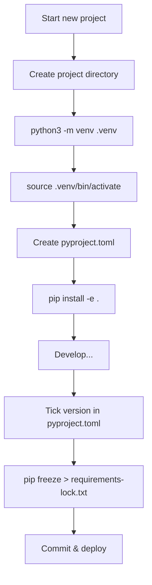

# pip and Virtual Environments

Professional Python development requires managing dependencies and isolating project environments. This lesson covers pip, virtual environments, and modern packaging standards.

## What Are Virtual Environments?

A virtual environment is an isolated Python installation that keeps project dependencies separate:

```
System Python
└── packages: requests@2.28, flask@2.3

Project A (venv)
└── packages: django@4.2, requests@2.31

Project B (venv)
└── packages: flask@3.0, requests@2.28
```

> [!NOTE]
> Without virtual environments, conflicting package versions across projects would be impossible to manage. Each project gets its own dependency universe.

## Creating and Using `venv`

```bash
# Create a virtual environment
python3 -m venv .venv

# Activate it (Linux/macOS)
source .venv/bin/activate

# Activate it (Windows)
.venv\Scripts\activate

# Deactivate
deactivate
```

```python
import sys
print(sys.executable)  # Shows which Python is being used
# With venv active: /path/to/project/.venv/bin/python
# Without: /usr/bin/python3
```

> [!WARNING]
| Pitfall | Solution |
|---------|----------|
| Forgetting to activate venv | Check `which python` or `sys.executable` |
| Committing `.venv` to git | Add `.venv/` to `.gitignore` |
| Using `sudo pip install` | Never do this — breaks system packages! |

## `pip` — Installing Packages

```bash
# Install a package
pip install requests

# Install a specific version
pip install requests==2.31.0
pip install "requests>=2.28,<3.0"

# Install from requirements file
pip install -r requirements.txt

# Upgrade a package
pip install --upgrade requests

# Uninstall
pip uninstall requests -y

# List installed packages
pip list

# Show package info
pip show requests
```

## `requirements.txt`

```txt
# requirements.txt
requests==2.31.0
flask>=2.3,<3.0
pandas~=2.0.0    # Compatible release: >=2.0.0, <2.1.0
numpy             # Any version
-e .              # Editable install (current project)
```

```bash
# Generate from current environment
pip freeze > requirements.txt

# Install from file
pip install -r requirements.txt
```

> [!NOTE]
> `pip freeze` outputs ALL installed packages including dependencies. For a leaner file, list only direct dependencies and use `pip install -r` to resolve transitive ones.

## `pip freeze` vs `pip list`

```bash
pip list          # Formatted table, concise
pip freeze        # pip install -r compatible format, includes versions
pip list --format=freeze  # Same output as pip freeze
```

## Version Specifiers

| Specifier | Meaning |
|-----------|---------|
| `==2.31.0` | Exactly version 2.31.0 |
| `>=2.28` | Version 2.28 or higher |
| `<=3.0` | Version 3.0 or lower |
| `>2.0,<3.0` | Any version in range (exclusive) |
| `~=2.0.0` | Compatible release: `>=2.0.0, <2.1.0` |
| `!=2.0.0` | Any version except 2.0.0 |
| `*` | Any version (e.g., `==2.*` means 2.x) |

## `pyproject.toml` — Modern Python Packaging

```toml
[build-system]
requires = ["setuptools>=68.0", "wheel"]
build-backend = "setuptools.backends._legacy:_Backend"

[project]
name = "my-data-tool"
version = "0.1.0"
description = "A tool for processing data files"
authors = [
    {name = "Alice Developer", email = "alice@example.com"}
]
requires-python = ">=3.10"
dependencies = [
    "requests>=2.28",
    "pandas>=2.0",
    "click>=8.0",
]

[project.optional-dependencies]
dev = [
    "pytest>=7.0",
    "black>=23.0",
    "ruff>=0.1",
]
test = [
    "pytest>=7.0",
    "pytest-cov>=4.0",
]
```

```bash
# Install with dev dependencies
pip install -e ".[dev]"

# Install with test dependencies
pip install -e ".[test]"

# Install all optional dependencies
pip install -e ".[dev,test]"
```

> [!SUCCESS]
| File | Purpose | Status |
|------|---------|--------|
| `requirements.txt` | Pin exact versions for deployment | Still common |
| `setup.py` | Package metadata & install | Legacy |
| `setup.cfg` | Declarative config | Transitional |
| `pyproject.toml` | Modern standard (PEP 518/621) | **Current best practice** |

## Lock Files and Reproducible Builds

```bash
# Generate locked requirements
pip freeze > requirements-lock.txt

# Install from lock file
pip install -r requirements-lock.txt

# Check for outdated packages
pip list --outdated
```

For production-grade lock files, consider:

```bash
# pip-tools
pip install pip-tools
pip-compile pyproject.toml  # generates requirements.txt
pip-sync requirements.txt   # matches env to file

# Poetry
poetry lock
poetry install

# pipenv
pipenv lock
pipenv install
```

## Advanced pip Commands

```bash
# Download packages without installing (e.g., for air-gapped systems)
pip download -r requirements.txt -d ./packages/

# Install from local directory
pip install ./packages/requests-2.31.0.tar.gz

# Install from GitHub
pip install git+https://github.com/psf/requests.git
pip install git+https://github.com/psf/requests.git@v2.31.0

# Install with constraints
pip install -c constraints.txt

# Check for dependency issues
pip check

# Cache management
pip cache list
pip cache remove requests
pip cache purge
```

## Real-World: Project Bootstrap Script

```python
#!/usr/bin/env python3
"""Bootstrap a new Python project with venv and dependencies."""

import subprocess
import sys
from pathlib import Path

PYPROJECT_CONTENT = """\
[build-system]
requires = ["setuptools>=68.0", "wheel"]
build-backend = "setuptools.backends._legacy:_Backend"

[project]
name = "{project_name}"
version = "0.1.0"
description = ""
requires-python = ">=3.10"
dependencies = []

[project.optional-dependencies]
dev = ["pytest>=7.0", "black>=23.0", "ruff>=0.1"]
"""

GITIGNORE_CONTENT = """\
# Python
__pycache__/
*.py[cod]
*.egg-info/
.venv/
.eggs/
dist/
build/
"""

def bootstrap(project_name: str) -> None:
    project_dir = Path.cwd() / project_name
    project_dir.mkdir(exist_ok=True)

    # Create pyproject.toml
    (project_dir / "pyproject.toml").write_text(
        PYPROJECT_CONTENT.format(project_name=project_name)
    )

    # Create .gitignore
    (project_dir / ".gitignore").write_text(GITIGNORE_CONTENT)

    # Create virtual environment
    venv_dir = project_dir / ".venv"
    subprocess.run([sys.executable, "-m", "venv", str(venv_dir)], check=True)

    # Determine pip path
    pip_path = venv_dir / "bin" / "pip"
    if not pip_path.exists():
        pip_path = venv_dir / "Scripts" / "pip.exe"

    # Install dev dependencies
    subprocess.run([str(pip_path), "install", "-e", ".[dev]"], cwd=project_dir, check=True)

    print(f"Project {project_name} bootstrapped at {project_dir}")
    print(f"Activate: source {venv_dir}/bin/activate")

if __name__ == "__main__":
    if len(sys.argv) != 2:
        print("Usage: python bootstrap.py <project-name>")
        sys.exit(1)
    bootstrap(sys.argv[1])
```

## Troubleshooting Common pip Issues

```bash
# "externally-managed-environment" error (PEP 668)
# Use a virtual environment! This is a feature, not a bug.
python3 -m venv .venv
source .venv/bin/activate

# SSL certificate errors
pip install --trusted-host pypi.org --trusted-host files.pythonhosted.org <package>

# Permission denied (not using venv)
pip install --user <package>  # Or better: use a venv

# Hash mismatch
pip install --no-cache-dir <package>

# Dependency conflicts
pip check
pip install pipdeptree
pipdeptree  # Visualize dependency tree
```



> [!SUCCESS]
> Always use a virtual environment for every project. It's the single most important Python best practice — preventing version conflicts, enabling reproducible builds, and keeping your system Python clean.

## Practice Questions

1. What is the purpose of a virtual environment? Why should you use one for every project?
2. How do you create and activate a virtual environment named `.venv`?
3. What is the difference between `pip freeze` and `pip list`? Which would you use for a requirements file?
4. Write a `requirements.txt` that pins `requests` to version 2.31.x and allows any patch version of `pandas` above 2.0.
5. What does `pip install -e .` do? When would you use it?
6. What is `pyproject.toml` and how does it differ from `setup.py`?
7. How do you install optional dependency groups like `[dev]` from `pyproject.toml`?
8. What does `pip check` verify and when would you run it?
9. What is PEP 668's "externally-managed-environment" error and how do you fix it?
10. Create a shell command sequence that: creates a project directory, sets up a venv, activates it, and installs packages from requirements.txt.
