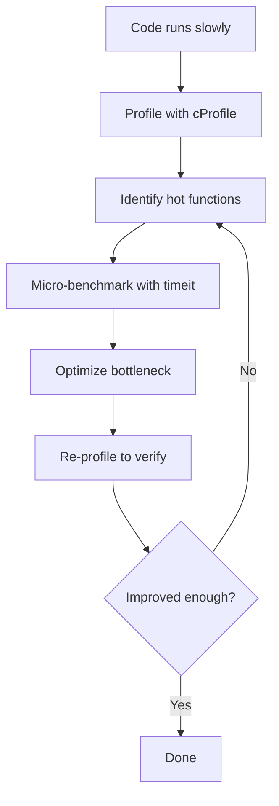

# Debugging and Profiling

Even experienced developers spend significant time debugging and optimizing. Python provides powerful built-in tools to inspect, trace, and measure your code's behavior and performance.

## The `logging` Module

The `logging` module is the professional alternative to `print()` debugging — it's configurable, hierarchical, and production-safe.

```python
import logging

# Basic configuration
logging.basicConfig(
    level=logging.DEBUG,
    format="%(asctime)s [%(levelname)s] %(name)s: %(message)s",
    filename="app.log",  # Omit for console output
)

# Create a logger for your module
logger = logging.getLogger(__name__)

logger.debug("Detailed debug information")
logger.info("General operational messages")
logger.warning("Something concerning but not an error")
logger.error("A real problem occurred")
logger.critical("System is unusable!")
```

| Level | Numeric Value | When to Use |
|-------|---------------|-------------|
| `DEBUG` | 10 | Detailed diagnostic information |
| `INFO` | 20 | Confirmation that things work as expected |
| `WARNING` | 30 | Something unexpected but not an error |
| `ERROR` | 40 | A problem that prevented an operation |
| `CRITICAL` | 50 | A serious failure requiring immediate attention |

### Logging Configuration

```python
import logging

# Advanced configuration
logger = logging.getLogger("my_app")
logger.setLevel(logging.DEBUG)

# File handler
file_handler = logging.FileHandler("app.log")
file_handler.setLevel(logging.WARNING)
file_formatter = logging.Formatter(
    "%(asctime)s [%(levelname)s] %(name)s: %(message)s"
)
file_handler.setFormatter(file_formatter)

# Console handler
console_handler = logging.StreamHandler()
console_handler.setLevel(logging.DEBUG)
console_formatter = logging.Formatter(
    "%(levelname)s: %(message)s"
)
console_handler.setFormatter(console_formatter)

# Add handlers
logger.addHandler(file_handler)
logger.addHandler(console_handler)

logger.info("Shows in console only")      # DEBUG level → console
logger.warning("Shows in both")           # WARNING level → both
```

> [!NOTE]
| Pattern | Best Practice |
|---------|---------------|
| `logger = logging.getLogger(__name__)` | Per-module loggers with hierarchical names |
| `logging.exception("...")` | Logs at ERROR level AND includes traceback |
| `logger.debug(f"x = {x}")` | Avoid f-strings in debug — use `%s` formatting for lazy evaluation |

### Structured Logging

```python
import logging

logger = logging.getLogger(__name__)

try:
    result = risky_operation()
except Exception as e:
    logger.exception(
        "Operation failed for user %s",
        {"user_id": 42, "operation": "payment"},
    )

# Extra context
logger.info("User action", extra={
    "user_id": user.id,
    "action": "login",
    "ip": request.ip,
})
```

## Debugging with `pdb`

The Python Debugger lets you pause execution, inspect variables, and step through code:

```python
# Insert breakpoint (Python 3.7+)
def divide(a: int, b: int) -> float:
    result = a / b
    breakpoint()  # Opens pdb
    return result

divide(10, 2)
```

```python
# Equivalent to:
import pdb; pdb.set_trace()
```

### pdb Commands

| Command | Shortcut | Description |
|---------|----------|-------------|
| `next` | `n` | Execute next line (step over) |
| `step` | `s` | Step into function call |
| `continue` | `c` | Continue until next breakpoint |
| `list` | `l` | Show source code around current line |
| `print expr` | `p` | Evaluate and print expression |
| `pp expr` | `pp` | Pretty-print expression |
| `args` | `a` | Print function arguments |
| `locals()` | — | Print all local variables |
| `break lineno` | `b` | Set breakpoint at line number |
| `disable nb` | — | Disable breakpoint by number |
| `where` | `w` | Print stack trace |
| `up` | `u` | Move up one frame in stack |
| `down` | `d` | Move down one frame in stack |
| `quit` | `q` | Exit debugger |

```python
# pdb demo
def process_data(items: list[int]) -> int:
    total = 0
    for i, item in enumerate(items):
        total += item
        if total > 100:
            breakpoint()  # Inspect state here
    return total

process_data([10, 20, 30, 50, 100])
```

> [!WARNING]
> Remove `breakpoint()` calls before committing code. Consider using an environment variable guard: `if os.getenv("DEBUG"): breakpoint()`

### Post-Mortem Debugging

```python
import pdb

def buggy_function():
    x = 1
    y = 0
    return x / y

try:
    buggy_function()
except ZeroDivisionError:
    pdb.post_mortem()  # Opens debugger at crash site
```

### Running pdb from the Command Line

```bash
python -m pdb my_script.py       # Start debugger from first line
python -m pdb -c "b 42" script.py  # Set breakpoint at line 42
```

## Profiling with `cProfile`

`cProfile` measures how long each function takes to execute:

```python
import cProfile
import pstats

def slow_function():
    total = 0
    for i in range(10_000_000):
        total += i
    return total

def fast_function():
    return sum(range(10_000_000))

# Profile a specific call
cProfile.run("fast_function()", sort="time")
```

```python
# Detailed profiling
profiler = cProfile.Profile()
profiler.enable()

slow_function()
fast_function()

profiler.disable()
stats = pstats.Stats(profiler)
stats.sort_stats("cumtime")  # Sort by cumulative time
stats.print_stats(10)        # Show top 10
```

> [!NOTE]
> `cProfile` has very low overhead — typically < 1% slowdown. It's safe to use on production-like workloads.

### Profiling from the Command Line

```bash
python -m cProfile -o output.prof my_script.py
python -m pstats output.prof  # Interactive stats browser
```

```text
# Example output:
ncalls  tottime  percall  cumtime  percall  filename:lineno(function)
     1   0.000    0.000    0.500    0.500  script.py:10(slow_function)
     1   0.000    0.000    0.002    0.002  script.py:15(fast_function)
```

| Column | Meaning |
|--------|---------|
| `ncalls` | Number of calls |
| `tottime` | Total time in this function (excluding sub-calls) |
| `percall` | `tottime` / `ncalls` |
| `cumtime` | Cumulative time (including sub-calls) |
| `filename:lineno(function)` | Location |

### Visualizing Profiles

```bash
# Install snakeviz for visual profiling
pip install snakeviz
python -m cProfile -o output.prof my_script.py
snakeviz output.prof  # Opens interactive flame chart in browser
```

## Timing Code with `timeit`

`timeit` provides accurate timing measurements by running code multiple times:

```python
import timeit

# Measure a statement
execution_time = timeit.timeit("sum(range(1000))", number=10_000)
print(f"Average: {execution_time / 10_000 * 1_000_000:.2f} μs")

# Measure from the command line
# python -m timeit "sum(range(1000))"
# 100000 loops, best of 5: 6.2 usec per loop
```

```python
# Comparing approaches
setup = "import random; data = [random.random() for _ in range(1000)]"

method1 = timeit.timeit("sorted(data)", setup=setup, number=1000)
method2 = timeit.timeit("data.sort()", setup=setup, number=1000)

print(f"sorted(): {method1:.4f}s")
print(f".sort():  {method2:.4f}s")
print(f"Ratio: {method1 / method2:.2f}x")
```

### Using `timeit` in Jupyter / Scripts

```python
import timeit

# For functions, use Timer
t = timeit.Timer(lambda: sum(range(1000)))
print(f"Min of 5 runs: {t.timeit(number=1000):.4f}s")

# Repeat for statistics
results = timeit.repeat(
    "sum(range(1000))",
    number=10_000,
    repeat=5,
)
print(f"Best: {min(results):.4f}s, Worst: {max(results):.4f}s")
```

> [!WARNING]
| Pitfall | Why | Fix |
|---------|-----|-----|
| Including setup in timing | Skews results | Use `setup` parameter |
| Single run measurement | High variance | Run many times, take min |
| Optimizing early | Wastes effort | Profile first, optimize bottlenecks |
| Micro-benchmarking != real perf | CPU cache, I/O, GC matter | Test with realistic data sizes |

## Common Debugging Patterns

```python
# Pattern 1: Conditional breakpoint
DEBUG = os.getenv("DEBUG")
if DEBUG:
    breakpoint()

# Pattern 2: Pretty-print complex objects
from pprint import pprint
data = {"deeply": {"nested": {"structure": [1, 2, [3, 4]]}}}
pprint(data, depth=3)

# Pattern 3: Trace function calls
import sys

def trace_calls(frame, event, arg):
    if event == "call":
        print(f"→ {frame.f_code.co_name}")
    return trace_calls

sys.settrace(trace_calls)

# Pattern 4: Logging decorator
import functools
import logging

logger = logging.getLogger(__name__)

def logged(func):
    @functools.wraps(func)
    def wrapper(*args, **kwargs):
        logger.debug("Calling %s with args=%s kwargs=%s",
                     func.__name__, args, kwargs)
        try:
            result = func(*args, **kwargs)
            logger.debug("%s returned %s", func.__name__, result)
            return result
        except Exception as e:
            logger.exception("%s raised %s", func.__name__, e)
            raise
    return wrapper
```

## Real-World: Profiling a Slow Function

```python
import cProfile
import pstats
import io

def generate_report(users: list[dict]) -> str:
    lines = []
    for user in users:
        # Inefficient string building
        line = ""
        for key, value in user.items():
            line += f"{key}: {value}, "
        lines.append(line)

    # Slow sort
    for i in range(len(lines)):
        for j in range(i + 1, len(lines)):
            if lines[i] > lines[j]:
                lines[i], lines[j] = lines[j], lines[i]

    return "\n".join(lines)

# Profile the function
profiler = cProfile.Profile()
profiler.enable()

users = [{"name": f"User{i}", "email": f"user{i}@test.com", "score": i}
         for i in range(500)]
result = generate_report(users)

profiler.disable()

# Analyze results
s = io.StringIO()
stats = pstats.Stats(profiler, stream=s)
stats.sort_stats("cumtime")
stats.print_stats(20)
print(s.getvalue())
```



> [!SUCCESS]
> "Premature optimization is the root of all evil" — Donald Knuth. Profile first, optimize second. Use `logging` for production diagnostics, `pdb` for interactive debugging, and `cProfile` for performance analysis.

## Practice Questions

1. What are the five logging levels in Python, from least to most severe?
2. How do you configure logging to write to a file at WARNING level and above, while showing INFO level in the console?
3. What is the difference between `pdb`'s `next` and `step` commands?
4. How do you start pdb when an exception occurs without modifying the source code?
5. Run `python -m cProfile -s time` on a simple script and interpret the top 5 results.
6. What does `timeit.repeat` return and why is it more reliable than a single measurement?
7. Write a logging decorator that logs function entry, exit, exceptions, and execution time.
8. How do you set a conditional breakpoint (e.g., break when `x > 100`) in pdb?
9. What is the difference between `tottime` and `cumtime` in cProfile output?
10. Use `timeit` to compare `list.append()` vs list comprehension for creating a list of 10,000 squares.
