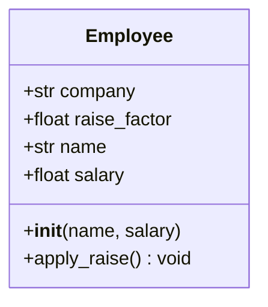

# Clases y Objetos

La programación orientada a objetos (POO) es un paradigma que organiza el código en torno a objetos — paquetes de datos y comportamiento. Python soporta POO con una sintaxis limpia e intuitiva.

## Definiendo una Clase

Una clase es un modelo para crear objetos:

```python
class Dog:
    def __init__(self, name: str, age: int):
        self.name = name
        self.age = age

    def bark(self) -> str:
        return f"{self.name} says woof!"

    def get_human_years(self) -> int:
        return self.age * 7
```

```python
my_dog = Dog("Rex", 3)
print(my_dog.bark())           # Rex says woof!
print(my_dog.get_human_years())  # 21
```

> [!NOTE]
> A diferencia de Java o C++, Python no requiere `new` explícito para instanciar — simplemente llamas a la clase como si fuera una función.

## El Parámetro `self`

`self` se refiere a la instancia actual. Debe ser el primer parámetro de todo método de instancia — pero no lo pasas; Python lo hace automáticamente.

```python
class Counter:
    def __init__(self):
        self.count = 0

    def increment(self, amount: int = 1):
        self.count += amount

    def reset(self):
        self.count = 0

c = Counter()
c.increment(5)
print(c.count)  # 5
```

> [!WARNING]
> `self` es solo una convención — podrías llamarlo `this` o cualquier otra cosa — pero **siempre usa `self`** para seguir los estándares de la comunidad Python.

## Atributos de Instancia vs Clase

| Tipo de Atributo | Definido | Acceso | Compartido Entre Instancias |
|-----------------|----------|--------|-----------------------------|
| Instancia | Dentro de `__init__` vía `self` | `obj.attr` | No |
| Clase | Directamente en el cuerpo de la clase | `ClassName.attr` o `obj.attr` | Sí |

```python
class Employee:
    company = "Acme Corp"       # Atributo de clase
    raise_factor = 1.05         # Atributo de clase

    def __init__(self, name: str, salary: float):
        self.name = name        # Atributo de instancia
        self.salary = salary    # Atributo de instancia

e1 = Employee("Alice", 70000)
e2 = Employee("Bob", 80000)

print(e1.company)  # Acme Corp (de la clase)
e1.raise_factor = 1.10  # Sombrea el atributo de clase solo para esta instancia
print(e1.raise_factor)  # 1.10
print(e2.raise_factor)  # 1.05 (sin cambios)
```



## `__str__` vs `__repr__`

Estos métodos dunder (doble guion bajo) controlan cómo se muestran los objetos:

| Método | Objetivo | Usado Por | Debe Retornar |
|--------|---------|-----------|---------------|
| `__str__` | Legible para humanos | `print()`, `str()` | String informal y amigable |
| `__repr__` | Inequívoco para desarrolladores | REPL, `repr()`, depuración | String que podría recrear el objeto |

```python
class Point:
    def __init__(self, x: float, y: float):
        self.x = x
        self.y = y

    def __repr__(self) -> str:
        return f"Point({self.x!r}, {self.y!r})"

    def __str__(self) -> str:
        return f"({self.x}, {self.y})"

p = Point(3.5, 7.2)
print(repr(p))   # Point(3.5, 7.2)
print(str(p))    # (3.5, 7.2)
print(p)         # (3.5, 7.2)  — llama a __str__
```

> [!SUCCESS]
> Siempre implementa `__repr__` en tus clases — hace que la depuración sea drásticamente más fácil. Implementa `__str__` cuando quieras una visualización bonita.

## Decoradores de Propiedad

Usa `@property` para definir atributos computados con control getter/setter:

```python
class Circle:
    def __init__(self, radius: float):
        self._radius = radius

    @property
    def radius(self) -> float:
        return self._radius

    @radius.setter
    def radius(self, value: float):
        if value <= 0:
            raise ValueError("Radius must be positive")
        self._radius = value

    @property
    def area(self) -> float:
        import math
        return math.pi * self._radius ** 2

    @property
    def circumference(self) -> float:
        import math
        return 2 * math.pi * self._radius

c = Circle(5)
print(c.area)           # 78.5398...
c.radius = 10
print(c.circumference)  # 62.8318...
# c.radius = -5  # Lanza ValueError
```

## Métodos Dunder Comunes

```python
class BankAccount:
    def __init__(self, owner: str, balance: float = 0.0):
        self.owner = owner
        self.balance = balance

    def __repr__(self) -> str:
        return f"BankAccount({self.owner!r}, {self.balance!r})"

    def __str__(self) -> str:
        return f"{self.owner}'s account: ${self.balance:.2f}"

    def __add__(self, other: "BankAccount") -> float:
        """Combina saldos (ej.: cuenta conjunta)."""
        return self.balance + other.balance

    def __len__(self) -> int:
        """Número de dólares enteros."""
        return int(self.balance)

    def __bool__(self) -> bool:
        """Una cuenta es verdadera si tiene dinero."""
        return self.balance > 0

    def __eq__(self, other: object) -> bool:
        if not isinstance(other, BankAccount):
            return NotImplemented
        return self.owner == other.owner and self.balance == other.balance

a1 = BankAccount("Alice", 1500.50)
a2 = BankAccount("Bob", 300)
print(a1)            # Alice's account: $1500.50
print(a1 + a2)       # 1800.5
print(len(a1))       # 1500
print(bool(a1))      # True
print(a1 == BankAccount("Alice", 1500.50))  # True
```

## Atributos Privados y Name Mangling

Python no tiene atributos verdaderamente privados. La convención usa guiones bajos:

| Convención | Significado |
|-----------|-------------|
| `name` | Atributo público |
| `_name` | "Protegido" — uso interno (solo convención) |
| `__name` | "Privado" — activa name mangling a `_ClassName__name` |
| `__name__` | Dunder — métodos especiales de Python, no inventes los tuyos |

```python
class Person:
    def __init__(self, name: str):
        self.name = name          # Público
        self._age = 0             # "Protegido"
        self.__ssn = "123-45-6789"  # Name-mangled

    def get_ssn(self) -> str:
        return self.__ssn[-4:]    # Acceso interno funciona

p = Person("Alice")
print(p.name)        # Alice
print(p._age)        # 0 (funciona, pero mal visto)
# print(p.__ssn)     # AttributeError!
print(p._Person__ssn)  # "123-45-6789" (nombre modificado)
```

> [!WARNING]
> Name mangling es para evitar acceso accidental en subclases, no seguridad. Python confía en sus usuarios.

## Ejemplo del Mundo Real: Registro de Datos

```python
from datetime import datetime
from typing import Optional

class Transaction:
    def __init__(self, amount: float, description: str,
                 timestamp: Optional[datetime] = None):
        self.amount = amount
        self.description = description
        self.timestamp = timestamp or datetime.now()
        self.id = id(self)

    def __repr__(self) -> str:
        return (f"Transaction({self.amount!r}, {self.description!r}, "
                f"timestamp={self.timestamp!r})")

    def __str__(self) -> str:
        return f"[{self.timestamp:%Y-%m-%d %H:%M}] {self.description}: ${self.amount:+.2f}"

class Account:
    def __init__(self, account_holder: str):
        self.holder = account_holder
        self.transactions: list[Transaction] = []

    def deposit(self, amount: float, description: str = "Deposit"):
        if amount <= 0:
            raise ValueError("Deposit amount must be positive")
        self.transactions.append(Transaction(amount, description))

    def withdraw(self, amount: float, description: str = "Withdrawal"):
        if amount <= 0:
            raise ValueError("Withdrawal amount must be positive")
        if self.balance < amount:
            raise ValueError("Insufficient funds")
        self.transactions.append(Transaction(-amount, description))

    @property
    def balance(self) -> float:
        return sum(t.amount for t in self.transactions)

    def __repr__(self) -> str:
        return f"Account({self.holder!r})"

    def __str__(self) -> str:
        return f"{self.holder}'s Account — Balance: ${self.balance:.2f}"

    def __len__(self) -> int:
        return len(self.transactions)

acc = Account("Alice")
acc.deposit(1000, "Salary")
acc.withdraw(200, "Rent")
acc.deposit(500, "Freelance")
print(acc)
for t in acc.transactions:
    print(f"  {t}")
print(f"Total transactions: {len(acc)}")
```

## Cuándo Usar Clases vs Funciones Simples

| Usa Clases Cuando | Usa Funciones Cuando |
|------------------|---------------------|
| Necesitas mantener estado | Procesando datos sin estado |
| Tienes múltiples métodos compartiendo datos | Se necesita una sola operación |
| Quieres imponer invariantes (vía propiedades) | Solo transformaciones simples |
| Necesitas múltiples instancias con el mismo comportamiento | Operaciones puntuales |

> [!SUCCESS]
> La POO es una herramienta, no una regla. Python soporta múltiples paradigmas — elige el adecuado para cada problema.

## Preguntas de Práctica

1. ¿Qué es `self` en un método de clase y por qué es necesario?
2. ¿Cuál es la diferencia entre `__str__` y `__repr__`? ¿Cuál de ellos llama `print()`?
3. Crea una clase `Book` con atributos `title`, `author` y `year`. Agrega métodos `__str__` y `__repr__`.
4. ¿Cuál es el propósito de `@property` en clases Python? Proporciona un ejemplo.
5. ¿Cómo difieren los atributos de clase de los atributos de instancia? ¿Qué sucede cuando modificas un atributo de clase a través de una instancia?
6. ¿Qué hace Python cuando prefijas un atributo con doble guion bajo (`__secret`)?
7. Escribe una clase `Temperature` que almacena Celsius internamente y expone Fahrenheit y Kelvin como propiedades.
8. ¿Qué controla `__bool__`, y cuál es la veracidad predeterminada de un objeto personalizado?
9. Crea una clase `ShoppingCart` que soporte `__len__`, `__add__` (fusionando carritos) y una propiedad `total`.
10. ¿Por qué podrías elegir una clase con propiedades en lugar de un diccionario simple?
