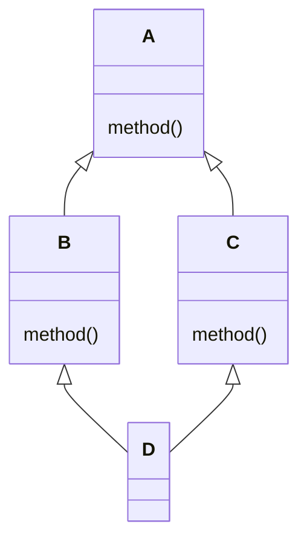
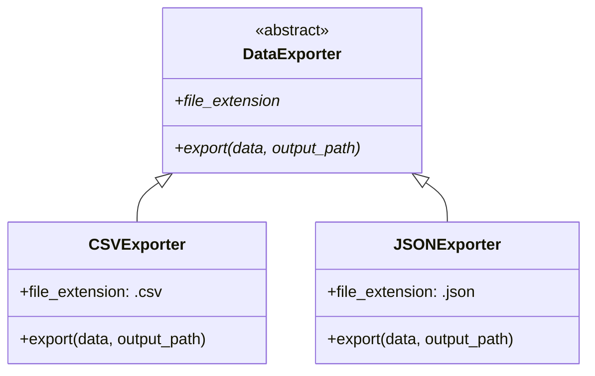

# Herencia y Polimorfismo

La herencia permite crear jerarquías de clases donde las clases hijas reutilizan y extienden el comportamiento de la clase padre. El polimorfismo permite que objetos de diferentes tipos sean tratados uniformemente a través de una interfaz común.

## Herencia Básica

```python
class Animal:
    def __init__(self, name: str):
        self.name = name

    def speak(self) -> str:
        return f"{self.name} makes a sound."

    def move(self) -> str:
        return f"{self.name} moves."

class Dog(Animal):
    def speak(self) -> str:
        return f"{self.name} barks!"

class Cat(Animal):
    def speak(self) -> str:
        return f"{self.name} meows!"

dog = Dog("Rex")
cat = Cat("Luna")
print(dog.speak())  # Rex barks!
print(cat.speak())  # Luna meows!
print(dog.move())   # Rex moves. (heredado)
```

> [!NOTE]
> Python soporta herencia simple y múltiple. Todas las clases heredan implícitamente de `object`.

## Sobrescritura de Métodos

Las clases hijas pueden sobrescribir cualquier método de la clase padre:

```python
class Vehicle:
    def __init__(self, brand: str, model: str):
        self.brand = brand
        self.model = model

    def description(self) -> str:
        return f"{self.brand} {self.model}"

    def fuel_type(self) -> str:
        return "Unknown fuel type"

class Car(Vehicle):
    def fuel_type(self) -> str:
        return "Gasoline or Diesel"

class ElectricCar(Vehicle):
    def __init__(self, brand: str, model: str, battery_capacity: float):
        super().__init__(brand, model)
        self.battery_capacity = battery_capacity

    def fuel_type(self) -> str:
        return "Electricity"

    def description(self) -> str:
        return f"{super().description()} ({self.battery_capacity} kWh)"

tesla = ElectricCar("Tesla", "Model 3", 75)
print(tesla.description())  # Tesla Model 3 (75 kWh)
print(tesla.fuel_type())    # Electricity
```

## Usando `super()`

`super()` delega a la clase padre. Es esencial al extender el comportamiento de la clase padre:

```python
class Logger:
    def __init__(self, name: str):
        self.name = name
        self.logs = []

    def log(self, message: str):
        self.logs.append(f"[{self.name}] {message}")

class TimestampLogger(Logger):
    def __init__(self, name: str, timezone: str = "UTC"):
        super().__init__(name)   # Inicializa el padre
        self.timezone = timezone

    def log(self, message: str):
        from datetime import datetime
        timestamp = datetime.now().isoformat()
        super().log(f"{timestamp} | {message}")  # Llama método del padre

    def __repr__(self) -> str:
        return f"TimestampLogger({self.name!r}, timezone={self.timezone!r})"

logger = TimestampLogger("App")
logger.log("User logged in")
logger.log("File saved")
print(logger.logs)
# ['[App] 2025-01-15T10:30:00 | User logged in', ...]
```

> [!WARNING]
> Nunca olvides llamar a `super().__init__()` en las clases hijas — de lo contrario, los atributos de la clase padre no se inicializarán.

## MRO (Method Resolution Order)

Python determina qué método llamar usando el algoritmo de linearización C3:

```python
class A:
    def method(self):
        return "A"

class B(A):
    def method(self):
        return "B"

class C(A):
    def method(self):
        return "C"

class D(B, C):
    pass

d = D()
print(d.method())  # B (sigue el MRO)
print(D.__mro__)
# (<class 'D'>, <class 'B'>, <class 'C'>, <class 'A'>, <class 'object'>)
```



> [!NOTE]
> `D.__mro__` muestra el orden de resolución: `D → B → C → A → object`. Python busca de izquierda a derecha, primero en profundidad.

## Clases Base Abstractas (ABC)

Las ABC definen interfaces que las clases hijas deben implementar:

```python
from abc import ABC, abstractmethod

class Shape(ABC):
    @abstractmethod
    def area(self) -> float:
        pass

    @abstractmethod
    def perimeter(self) -> float:
        pass

    def describe(self) -> str:
        return f"Area: {self.area():.2f}, Perimeter: {self.perimeter():.2f}"

class Rectangle(Shape):
    def __init__(self, width: float, height: float):
        self.width = width
        self.height = height

    def area(self) -> float:
        return self.width * self.height

    def perimeter(self) -> float:
        return 2 * (self.width + self.height)

class Circle(Shape):
    def __init__(self, radius: float):
        self.radius = radius

    def area(self) -> float:
        import math
        return math.pi * self.radius ** 2

    def perimeter(self) -> float:
        import math
        return 2 * math.pi * self.radius

# shape = Shape()  # TypeError! No se puede instanciar ABC
rect = Rectangle(5, 3)
print(rect.describe())  # Area: 15.00, Perimeter: 16.00
```

> [!WARNING]
> Las clases abstractas no pueden instanciarse directamente. Todos los métodos abstractos deben implementarse en subclases concretas.

### Propiedades y Métodos Estáticos Abstractos

```python
from abc import ABC, abstractmethod

class ConfigParser(ABC):
    @property
    @abstractmethod
    def format_name(self) -> str:
        pass

    @abstractmethod
    def parse(self, content: str) -> dict:
        pass

    @staticmethod
    @abstractmethod
    def supports_extension(ext: str) -> bool:
        pass

class JSONParser(ConfigParser):
    @property
    def format_name(self) -> str:
        return "JSON"

    def parse(self, content: str) -> dict:
        import json
        return json.loads(content)

    @staticmethod
    def supports_extension(ext: str) -> bool:
        return ext in (".json", ".jsonc")
```

## Duck Typing

"Si camina como pato y suena como pato, es un pato." Python se centra en el comportamiento, no en el tipo:

```python
class Duck:
    def quack(self):
        return "Quack!"

    def walk(self):
        return "Waddles"

class Person:
    def quack(self):
        return "Imitates a duck"

    def walk(self):
        return "Walks on two legs"

def make_it_quack(thing):
    print(thing.quack())
    print(thing.walk())

make_it_quack(Duck())
make_it_quack(Person())  # Misma función, tipos diferentes — polimorfismo!
```

### Usando `isinstance()` y `hasattr()` con Protocols

```python
from typing import Protocol

class Quackable(Protocol):
    def quack(self) -> str:
        ...

def process_quackable(obj: Quackable):
    if hasattr(obj, "quack"):
        print(obj.quack())
    else:
        print("Not quackable")

class Robot:
    def quack(self) -> str:
        return "Beep boop quack"

process_quackable(Robot())  # Beep boop quack
```

## Mundo Real: Sistema de Plugins con ABC

```python
from abc import ABC, abstractmethod
import os
import importlib.util

class DataExporter(ABC):
    @abstractmethod
    def export(self, data: list[dict], output_path: str) -> None:
        pass

    @property
    @abstractmethod
    def file_extension(self) -> str:
        pass

class CSVExporter(DataExporter):
    @property
    def file_extension(self) -> str:
        return ".csv"

    def export(self, data: list[dict], output_path: str) -> None:
        import csv
        if not data:
            raise ValueError("No data to export")
        with open(output_path, "w", newline="") as f:
            writer = csv.DictWriter(f, fieldnames=data[0].keys())
            writer.writeheader()
            writer.writerows(data)

class JSONExporter(DataExporter):
    @property
    def file_extension(self) -> str:
        return ".json"

    def export(self, data: list[dict], output_path: str) -> None:
        import json
        with open(output_path, "w") as f:
            json.dump(data, f, indent=2)

def export_data(data: list[dict], output_path: str, fmt: str):
    exporters = {".csv": CSVExporter, ".json": JSONExporter}
    ext = fmt if fmt.startswith(".") else f".{fmt}"
    cls = exporters.get(ext)
    if cls is None:
        raise ValueError(f"Unsupported format: {fmt}")
    exporter = cls()
    exporter.export(data, output_path)

records = [
    {"name": "Alice", "score": 95},
    {"name": "Bob", "score": 87},
]
export_data(records, "output.csv", "csv")
export_data(records, "output.json", "json")
```



## Herencia Múltiple

```python
class Flyer:
    def fly(self):
        return "Flying through the air"

    def speed(self) -> str:
        return "Fast"

class Swimmer:
    def swim(self):
        return "Swimming through water"

    def speed(self) -> str:
        return "Moderate"

class Duck(Flyer, Swimmer):
    def speed(self) -> str:
        return f"{Flyer.speed(self)} in air, {Swimmer.speed(self)} in water"

duck = Duck()
print(duck.fly())   # Flying through the air
print(duck.swim())  # Swimming through water
print(duck.speed()) # Fast in air, Moderate in water
```

> [!WARNING]
| Peligro | Solución |
|---------|----------|
| Problema del diamante (mismo método en múltiples caminos) | MRO lo maneja; usa `super()` con cuidado |
| Orden de inicialización incierto | Cada `__init__` debe llamar a `super().__init__()` |
| Acoplamiento fuerte | Prefiere composición sobre herencia |

## Composición en Lugar de Herencia

```python
class Engine:
    def start(self):
        return "Engine started"

    def stop(self):
        return "Engine stopped"

class Wheels:
    def rotate(self):
        return "Wheels rotating"

class Car:
    def __init__(self):
        self.engine = Engine()
        self.wheels = Wheels()

    def drive(self):
        return f"{self.engine.start()} — {self.wheels.rotate()}"

    def park(self):
        return self.engine.stop()

car = Car()
print(car.drive())  # Engine started — Wheels rotating
```

> [!SUCCESS]
> Prefiere composición sobre herencia: las relaciones "tiene-un" son más flexibles que "es-un".

## Preguntas de Práctica

1. ¿Qué devuelve `super()` y por qué es importante en `__init__`?
2. Crea una clase abstracta `PaymentGateway` con métodos `process_payment` y `refund`. Implementa `PayPalGateway` y `StripeGateway`.
3. ¿Qué es el MRO y cómo puedes inspeccionarlo para una clase determinada?
4. Explica duck typing en Python con un ejemplo que no involucre herencia.
5. ¿Qué sucede si intentas instanciar una clase abstracta que tiene métodos abstractos no implementados?
6. Crea una jerarquía de clases: `Employee` → `Manager` → `Executive`. Cada una debe sobrescribir `get_bonus()`.
7. ¿Cuál es la diferencia entre `isinstance(obj, cls)` y `issubclass(sub, cls)`? ¿Cuándo usarías cada uno?
8. ¿Cómo resuelve Python las llamadas a métodos en herencia múltiple? ¿Qué garantiza la linearización C3?
9. Crea una clase `LoggableMixin` que añade registro de logs a cualquier clase, luego úsala con herencia múltiple.
10. ¿Por qué se prefiere a menudo la composición sobre la herencia? Da un ejemplo concreto donde la composición es mejor.
